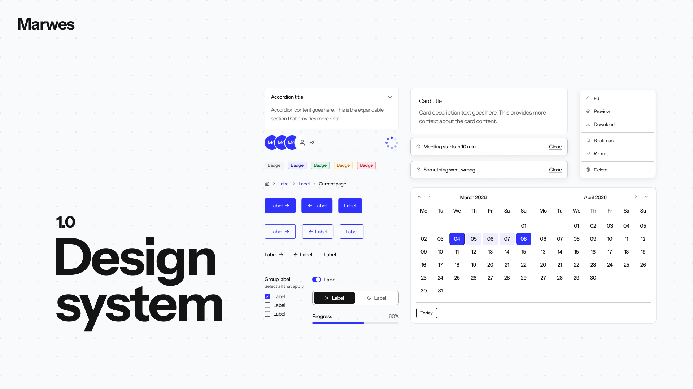

<div align="center">



<br>
<br>

# Marwes Design System

**An AI-adapted component system for React, Vue, and Svelte with beautiful defaults, zero runtime CSS, and accessibility baked in.**

React • Vue • Svelte • Framework-agnostic core • Static CSS • Type-safe • A11y-first • Agent-readable

[**marwes.io**](https://marwes.io) — official site, theme builder, and install guides
[Start Here](docs/start-here.md) • [Documentation](docs/README.md) • [React Storybook](https://storybook-react.marwes.io/latest/) • [Vue Storybook](https://storybook-vue.marwes.io/latest/) • [Svelte Storybook](https://storybook-svelte.marwes.io/latest/)

[](LICENSE)

</div>

---

## ✨ Why Marwes?

<table>
<tr>
<td width="50%">

### 🎯 **Framework-Agnostic Core**

Pure TypeScript logic with thin React, Vue, and Svelte adapters built from the same contracts.

### 🤖 **AI-Adapted by Design**

Stable component contracts, semantic actions, generated registries, and explicit a11y metadata make Marwes easier for agents to inspect, modify, and extend without guessing.

### ♿ **Accessibility First**

A11y isn't bolted on. Core owns semantic contracts, adapters apply them to real DOM, and Storybook a11y smoke checks catch regressions in the promoted families.

### 🚀 **Zero Runtime CSS**

No CSS-in-JS overhead. Static CSS with CSS variables. Ship less JavaScript, load faster.

</td>
<td width="50%">

### 🎨 **Beautiful Defaults**

Ships with the firstEdition theme and CSS preset—modern typography, semantic colors, and contrast-aware defaults aligned to WCAG AA goals.

### 🔧 **Simple Theme API**

Override what matters. No bloated config objects.

### 📐 **Figma Integration**

Design tokens map to theme keys. Component specs reference Figma nodes. Design-to-code workflow included.

</td>
</tr>
</table>

---

## 🤖 Built for AI-Assisted Engineering

Marwes is shaped for teams building with human designers, frontend engineers, and AI agents in the same workflow.

- **Semantic component APIs** make intent explicit: submit, cancel, create, delete, navigate, edit, and reset are first-class actions instead of loose styling choices.
- **RenderKit output is structured** so adapters receive predictable `tag`, `className`, `vars`, and `a11y` fields instead of opaque component internals.
- **Generated component registries** document package exports, stories, tests, accessibility notes, and implementation files in a format agents can search and verify.
- **Design tokens stay named and typed** so Figma-to-code changes can land in theme keys and CSS variables instead of scattered one-off values.
- **Framework boundaries are strict** which lets agents update core behavior once and have React, Vue, and Svelte adapters inherit the same contract.

The goal is not "AI magic". The goal is a component system with enough structure that AI can make useful changes with less context, fewer assumptions, and better verification paths.

---

## ♿ Why It Is Accessible

Marwes is accessible because accessibility is part of the component contract, not a checklist added after rendering.

- **Core owns a11y logic** through typed recipes and helpers that produce roles, ARIA state, label wiring, description wiring, invalid state, and semantic metadata.
- **React, Vue, and Svelte adapters stay thin** so every framework applies the same core contract to native DOM elements instead of inventing separate accessibility behavior per framework.
- **Native controls come first** for buttons, inputs, selects, checkboxes, radios, textareas, and form fields, with ARIA added only where a pattern needs explicit wiring.
- **Field components wire labels, helper text, and errors** into `for`, `id`, `aria-describedby`, `aria-invalid`, and polite error announcements.
- **Storybook a11y smoke checks** run through the Storybook a11y addon for the current promoted families in React, Vue, and Svelte.

Example: an invalid field is not just styled red. The component contract also wires the accessible name, description, and invalid state:

```tsx
<InputField
  label="Email"
  helperText="Used for receipts."
  error="Enter a valid email."
  input={{ type: "email", placeholder: "you@example.com" }}
/>
```

That resolves to DOM wiring like:

```html
<label for="email">Email</label>
<input
  id="email"
  type="email"
  aria-describedby="email-helper email-error"
  aria-invalid="true"
>
<p id="email-helper">Used for receipts.</p>
<p id="email-error" aria-live="polite">Enter a valid email.</p>
```

The honest boundary: automation gives strong coverage for contracts and smoke-tested stories, but real screen-reader behavior for high-risk widgets still needs targeted manual review. The current support model is documented in [Accessibility support model](docs/reference/accessibility.md).

---

## 🚀 Installation

Marwes ships framework adapters separately. Install the adapter for your app; the default first edition preset CSS is included by the adapter.

### React

Install the React adapter:

```bash
pnpm add @marwes-ui/react
```

If React is not already installed in your app, install the peer dependencies too:

```bash
pnpm add react react-dom
```

Wrap your app with `MarwesProvider`:

```tsx
import { MarwesProvider, Button } from "@marwes-ui/react"

function App() {
  return (
    <MarwesProvider>
      <Button variant="primary">
        Click me
      </Button>
    </MarwesProvider>
  )
}
```

Use the same provider theme in app-owned React styling:

```tsx
import { mwThemeVars } from "@marwes-ui/react"
import styled from "styled-components"

const AppShell = styled.main`
  min-height: 100dvh;
  padding: ${mwThemeVars.spacing.sp24};
  color: ${mwThemeVars.color.text};
  background: ${mwThemeVars.color.background};
`

const FeaturePanel = styled.section`
  background: ${mwThemeVars.color.surface};
  border: 1px solid ${mwThemeVars.color.border};
  border-radius: ${mwThemeVars.ui.radius};
`

const PrimaryCallout = styled.aside`
  background: ${mwThemeVars.color.primary.base};
  color: ${mwThemeVars.color.primary.label};
`
```

### Vue

Install the Vue adapter:

```bash
pnpm add @marwes-ui/vue
```

If Vue is not already installed in your app, install the peer dependency too:

```bash
pnpm add vue
```

Wrap your Vue template with `MarwesProvider`:

```vue
<script setup lang="ts">
import { ref } from "vue"
import { Button, Input, MarwesProvider } from "@marwes-ui/vue"

const email = ref("")
</script>

<template>
  <MarwesProvider>
    <Button variant="primary">Save</Button>
    <Input v-model="email" placeholder="Email" ariaLabel="Email" />
  </MarwesProvider>
</template>
```

Use the same provider theme in app-owned Vue styling:

```vue
<script setup lang="ts">
import { Button, MarwesProvider, mwThemeVars } from "@marwes-ui/vue"

const panelStyle = {
  background: mwThemeVars.color.surface,
  color: mwThemeVars.color.text,
  borderColor: mwThemeVars.color.border,
}
</script>

<template>
  <MarwesProvider>
    <main class="app-shell">
      <section class="primary-callout">Launch workspace</section>
      <section class="feature-panel" :style="panelStyle">
        <Button variant="primary">Save</Button>
      </section>
    </main>
  </MarwesProvider>
</template>

<style scoped>
.app-shell {
  min-height: 100dvh;
  padding: var(--mw-spacing-sp-24);
  color: var(--mw-color-text);
  background: var(--mw-color-background);
}

.feature-panel {
  border: 1px solid var(--mw-color-border);
  border-radius: var(--mw-ui-radius);
}

.primary-callout {
  background: var(--mw-color-primary-base);
  color: var(--mw-color-primary-label);
}
</style>
```

**That's it.** React, Vue, and Svelte consume the same core recipes, preset CSS, theme tokens, and accessibility contracts.

---

## 🏗️ The Three-Layer Architecture

What makes Marwes different? **Complete separation of concerns:**

```
┌─────────────────────────────────────┐
│   @marwes-ui/react / vue / svelte  │  ← Thin adapters
│   Apply RenderKit to framework DOM │
├─────────────────────────────────────┤
│   @marwes-ui/presets (Static CSS)  │  ← Zero runtime, CDN-friendly
│   Design tokens + .mw-* classes     │
├─────────────────────────────────────┤
│   @marwes-ui/core (Pure Logic)     │  ← Framework-agnostic TypeScript
│   Theme, recipes, a11y, types       │
└─────────────────────────────────────┘
```

**Why this matters:**

- Core has **zero runtime dependencies** (not even React types)
- Adapters are **community-contributable** (~100 lines each)
- CSS ships **optimized and static** (no JS bundle bloat)
- Logic is **testable without frameworks**

---

## 🧩 Components

**Available now:**

- Actions and feedback: `Button`, purpose buttons, `Badge`, `Banner`, `Toast`
- Navigation and disclosure: `Breadcrumb`, `Pagination`, `Tabs`, `Accordion`, `Drawer`, `Dialog`, `ContextMenu`, `Tooltip`
- Form and choice controls: `Input`, `Select`, `Textarea`, `RichText`, `Checkbox`, `Radio`, `Switch`, `Slider`, `SegmentedControl`
- Status and loading: `Avatar`, `ProgressBar`, `Spinner`, `Skeleton`, `StatTile`
- Layout and typography: `Card`, `Spacing`, `Divider`, `Icon`, `H1`, `H2`, `H3`, `Paragraph`, `Text`
- Date and specialized inputs: `DatePicker`, `InputOtp`, purpose field wrappers

[👉 **Browse all components in Storybook**](https://d3hobet9plpuvm.cloudfront.net/storybook-react/latest/)

---

## 🎨 Theming

First edition is the default provider theme. Pass a simple, typed `ThemeInput` object only when you want to override that baseline. Design data should be mapped into this object before it reaches `MarwesProvider`; the provider does not parse Figma files or design exports at runtime.

```tsx
import { mwAvailableFonts } from "@marwes-ui/react"

<MarwesProvider
  theme={{
    color: {
      primary: "#5B8CFF",
      danger: "#D90429",
      surfaceElevated: "#FFFFFF",
    },
    font: {
      primary: mwAvailableFonts.Poppins,
      secondary: mwAvailableFonts.Lora,
    },
    ui: {
      radius: 12,
      density: "comfortable",
    },
  }}
>
  <App />
</MarwesProvider>
```

The theme object is consequential across the component system:

- `color.primary`, semantic colors, surface, text, border, and focus values become `--mw-color-*` CSS variables.
- `font`, `ui.radius`, `ui.density`, and typography values become shared type, radius, and sizing variables.
- React, Vue, and Svelte use the same `ThemeInput` shape.
- Preset CSS consumes those variables, so component visuals follow the provider theme without adapter-specific styling.

Use the same provider-scoped variables in custom styling:

```tsx
import { mwThemeVars } from "@marwes-ui/react"
import styled from "styled-components"

const Panel = styled.section`
  padding: ${mwThemeVars.spacing.sp24};
  color: ${mwThemeVars.color.text};
  background: ${mwThemeVars.color.surface};
  border: 1px solid ${mwThemeVars.color.border};
  border-radius: ${mwThemeVars.ui.radius};
`
```

Plain CSS and CSS Modules can use the raw variables directly:

```css
.panel {
  padding: var(--mw-spacing-sp-24);
  color: var(--mw-color-text);
  background: var(--mw-color-surface);
  border-radius: var(--mw-ui-radius);
}
```

Use `Spacings.sp24` for Marwes spacing props, `mwThemeVars.spacing.sp24` for custom CSS, and `useTheme()` when code needs resolved runtime values. `themeToCSSVars()` remains the low-level conversion helper for providers and tooling.

For AI-generated themes, produce this shape:

```ts
import { mwAvailableFonts } from "@marwes-ui/react"

const theme = {
  mode: "light",
  color: {
    primary: "#5B8CFF",
    background: "#FFFFFF",
    surface: "#F9FAFB",
    text: "#141414",
    border: "rgba(0,0,0,0.4)",
    focus: "#2684FF",
  },
  font: {
    primary: mwAvailableFonts.Poppins,
    secondary: mwAvailableFonts.Lora,
  },
  ui: {
    radius: 8,
    density: "comfortable",
  },
}
```

### Graphical Profile Mapping

Map a brand or graphical profile into `ThemeInput`, then pass it to `MarwesProvider`.
The provider turns that object into CSS variables consumed by the preset styles.

| Graphical profile field | Marwes theme field |
| --- | --- |
| Primary brand color | `color.primary` |
| Error, success, warning colors | `color.danger`, `color.success`, `color.warning` |
| App/page background | `color.background` |
| Card or panel surface | `color.surface`, `color.surfaceElevated` |
| Body text and muted text | `color.text`, `color.textMuted` |
| Border and focus ring | `color.border`, `color.focus` |
| Brand font | `font.primary` via `mwAvailableFonts` or `createFontStack()` |
| Radius and density | `ui.radius`, `ui.density` |

**No CSS wizard required.** Just a typed JavaScript object.

---

## 📚 Documentation

| Guide | Description |
| --- | --- |
| [Docs index](docs/README.md) | Best starting point for understanding the repo |
| [Architecture](docs/reference/architecture.md) | Package boundaries, RenderKit flow, and repo structure |
| [Specification](docs/reference/spec.md) | Formal requirements and decisions |
| [Testing](docs/reference/testing.md) | Test layers and current commands |
| [Accessibility support model](docs/reference/accessibility.md) | What Marwes automates, what still needs manual review, and current family risk tiers |
| [Adding components](docs/guides/adding-components.md) | Step-by-step implementation workflow |
| [Figma to Marwes](docs/guides/figma-to-marwes.md) | Design-to-code mapping and token workflow |
| [Component registry](docs/registry/README.md) | Family-level source map and implementation status |

---

## 🛠️ Development

```bash
# Install dependencies
pnpm install

# Watch package builds
pnpm dev:packages

# Run the React playground
pnpm dev:playground

# Run Storybook
pnpm dev:storybook:react
pnpm dev:storybook:vue

# Validate the repo
pnpm typecheck
pnpm test
pnpm build

# Check internal markdown links
pnpm check:compass
```

## Release Notes For Package Changes

Pull requests that change publishable packages under `packages/**` must include a Changesets entry.

Run:

```bash
pnpm changeset
```

Choose the release type:

- `patch` for bug fixes, internal behavior fixes, or package API docs
- `minor` for new public APIs, new components, or backwards-compatible features
- `major` for breaking public APIs or behavior

Commit the generated `.changeset/*.md` file with the PR. If a package change should not produce a release, add an empty changeset:

```bash
pnpm changeset add --empty
```

CI enforces this only for `packages/**`. Changes to Storybook, playgrounds, docs, workflows, or root tooling do not require a changeset unless they also touch publishable packages.

The published Marwes packages are versioned as a fixed group. If a changeset includes any of `@marwes-ui/core`, `@marwes-ui/react`, `@marwes-ui/presets`, `@marwes-ui/vue`, or `@marwes-ui/svelte`, include all five in that same changeset.

**Repo structure:**

- `packages/core` — Framework-agnostic TypeScript logic
- `packages/presets` — Design tokens and static CSS
- `packages/react` — React adapter
- `packages/vue` — Vue adapter
- `packages/svelte` — Svelte adapter
- `apps/storybook-react` — React component documentation
- `apps/storybook-vue` — Vue component documentation
- `apps/storybook-svelte` — Svelte component documentation
- `apps/playground-react` — Integration testing and manual verification

---

## 📦 Packages

| Package | Description |
| --- | --- |
| `@marwes-ui/core` | Framework-agnostic logic |
| `@marwes-ui/presets` | Static CSS presets |
| `@marwes-ui/react` | React adapter |
| `@marwes-ui/vue` | Vue adapter |
| `@marwes-ui/svelte` | Svelte adapter |
| `@marwes-ui/cli` | Official installer for existing apps (`pnpm dlx @marwes-ui/cli init`) |
| `create-marwes` | Vite-style starter for new apps (`pnpm create marwes@latest my-app`) |

---

## 🤝 Philosophy

- **Quality over quantity** — Small, focused component set done well
- **Accessibility is architecture** — Not an afterthought
- **Framework flexibility** — Don't lock teams into one framework
- **Performance by default** — Static CSS means faster apps
- **Spec-driven development** — Every feature documented first

---

## 📄 License

MIT © Marwes Contributors

See [LICENSE](LICENSE) for details.

---

<div align="center">

**Built with care for teams who value quality, accessibility, and performance.**

[⭐ Star on GitHub](https://github.com/niklas-westman/marwes) • [📖 Docs](docs/README.md) • [🎨 Storybook](https://d3hobet9plpuvm.cloudfront.net/storybook-react/latest/)

</div>
