# Marwes Documentation

This folder is the canonical documentation hub for the repository.

If you are new to Marwes, start here.

## Read order

### Building an app

1. [Vite setup](./guides/vite.md)
2. [Next.js setup](./guides/next.md)
3. [Your First Marwes Screen](./guides/your-first-screen.md)
4. [Blocks](./blocks/README.md)

### Changing Marwes itself

1. [Architecture](./reference/architecture.md)
2. [Specification](./reference/spec.md)
3. [Adding Components](./guides/adding-components.md)
4. [Figma to Marwes](./guides/figma-to-marwes.md)
5. [Tailwind and shadcn Integration](./guides/tailwind-shadcn-integration.md)
6. [AI Metadata Protocol](./reference/ai-metadata.md)
7. [Accessibility support model](./reference/accessibility.md)
8. [Component Registry](./registry/README.md)
9. [Governance](./reference/governance.md)
10. [Testing](./reference/testing.md)
11. [Family Validation](./reference/family-validation.md)

## Documentation map

```mermaid
graph TD
  Docs[docs/]
  Docs --> Reference[reference/]
  Docs --> Guides[guides/]
  Docs --> Planning[planning/]
  Docs --> Tooling[tooling/]
  Docs --> Audits[audits/]
  Docs --> Registry[registry/]
  Docs --> Blocks[blocks/]

  Reference --> Architecture[architecture.md]
  Reference --> Spec[spec.md]
  Reference --> AIMetadata[ai-metadata.md]
  Reference --> Accessibility[accessibility.md]
  Reference --> Governance[governance.md]
  Reference --> Testing[testing.md]
  Reference --> FamilyValidation[family-validation.md]

  Guides --> Vite[vite.md]
  Guides --> Next[next.md]
  Guides --> FirstScreen[your-first-screen.md]
  Guides --> Adding[adding-components.md]
  Guides --> Figma[figma-to-marwes.md]
  Guides --> Tailwind[tailwind-shadcn-integration.md]

  Blocks --> BlocksIndex[README.md]
  Blocks --> ReactBlocks[react/]

  Registry --> RegistryIndex[README.md]
  Registry --> ButtonRegistry[families/button/README.md]

  Planning --> ReleasePlan[release-1-0-0-hardening-plan.md]

  Audits --> AuditIndex[README.md]
```



## What lives where

### Reference
Long-lived, canonical project docs.

- [Architecture](./reference/architecture.md) — package boundaries, data flow, and repo structure
- [Specification](./reference/spec.md) — formal requirements and decisions
- [AI Metadata Protocol](./reference/ai-metadata.md) — canonical semantic vocabulary and ownership model
- [Accessibility support model](./reference/accessibility.md) — what Marwes automates, what still needs manual review, and how family risk tiers affect release confidence
- [Governance](./reference/governance.md) — local and CI trust gates, artifacts, and release discipline
- [Testing](./reference/testing.md) — test layers, commands, and expectations
- [Family Validation](./reference/family-validation.md) — focused per-family workflow and master validation commands

### Guides
Practical how-to documents.

- [Vite setup](./guides/vite.md) — install Marwes in a Vite React app and build a first shell
- [Next.js setup](./guides/next.md) — install Marwes in an App Router project, including SSR no-flash theme setup
- [Your First Marwes Screen](./guides/your-first-screen.md) — product-shaped first screen using Marwes components and theme variables
- [Adding Components](./guides/adding-components.md) — step-by-step workflow for introducing a new component
- [Figma to Marwes](./guides/figma-to-marwes.md) — design-to-code mapping and token workflow
- [Tailwind and shadcn Integration](./guides/tailwind-shadcn-integration.md) — root dark variants and app-owned Tailwind tokens using Marwes variables

### Blocks
Copyable product patterns.

- [Blocks index](./blocks/README.md) — block rules and available product patterns
- [Dashboard Shell](./blocks/react/dashboard-shell.md) — dashboard page starter
- [Login Panel](./blocks/react/login-panel.md) — centered auth form starter
- [Settings Form](./blocks/react/settings-form.md) — product settings form starter
- [Empty State](./blocks/react/empty-state.md) — first-run or no-results panel
- [Stats Grid](./blocks/react/stats-grid.md) — responsive KPI card grid

### Planning
Active planning documents. Completed migration notes should be removed once their decisions are reflected in reference docs, registry docs, tests, or release notes.

- [Release 1.0.0 hardening plan](./planning/release-1-0-0-hardening-plan.md) — release readiness checks, security posture, and validation log

### Registry
Family-level component knowledge base.

- [Component Registry](./registry/README.md) — registry system linking philosophy, Figma refs, files, semantics, and AXE posture
- [Adding registry families](./registry/adding-families.md) — workflow and checklist for new registry entries
- [Registry family rollout checklist](./registry/family-rollout-checklist.md) — cross-session checklist and recommended family queue
- [Button registry](./registry/families/button/README.md) — semantic-first action family registry
- [Input registry](./registry/families/input/README.md) — Marwes-default select plus high-risk input-domain family registry
- [Dialog registry](./registry/families/dialog/README.md) — shell-vs-modal family registry with canonical dialog semantics

### Audits
Step-by-step component-family audit plans.

- [Accessibility audits index](./audits/README.md) — execution queue and family audit status
- [Accessibility audit methodology](./audits/METHODOLOGY.md) — execution model for this initiative
- [Input family accessibility audit](./audits/input-family-accessibility.md) — first detailed family audit

## Generated artifacts

Track D machine-readable outputs live at the repo root:
- `../artifacts/component-manifest.json`
- `../artifacts/purpose-registry.json`
- `../artifacts/framework-parity.json`
- `../artifacts/design-provenance.json`
- `../artifacts/component-registry.json`

## How the repo fits together

```mermaid
graph LR
  Figma[Figma + .figma cache]
  Core[@marwes-ui/core]
  Presets[@marwes-ui/presets]
  React[@marwes-ui/react]
  Vue[@marwes-ui/vue]
  Storybook[Storybook apps]
  Playground[Playground app]

  Figma --> Core
  Core --> Presets
  Core --> React
  Core --> Vue
  Presets --> React
  Presets --> Vue
  React --> Storybook
  Vue --> Storybook
  React --> Playground
```

## Related entry points outside `docs/`

- [Repository README](../README.md)
- Local Figma source index: `.figma/INDEX.md`
- Local curated Figma node reference: `.figma/NODE_REFERENCE.md`
- [Changelog](../CHANGELOG.md)

## Documentation rules

When updating the repo:

- Prefer one canonical doc per topic
- Fix links when files move
- Update docs when behavior or public API changes
- Keep `docs/planning/` for active release or implementation plans only
- Prefer short diagrams when they explain structure faster than prose
