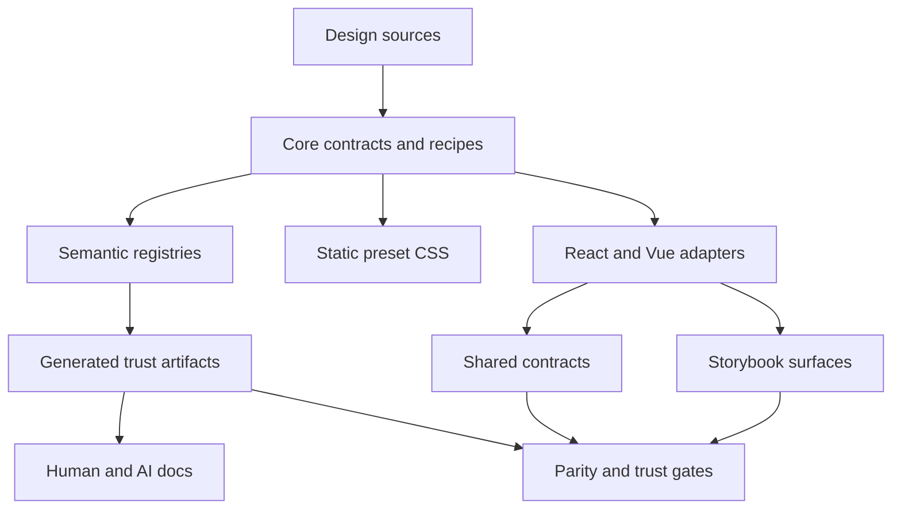
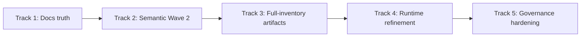
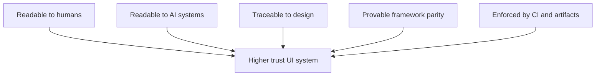

# Next Level Plan — How Marwes Becomes the Best AI-Native Component Library

This plan is intentionally practical.
It starts from what Marwes already does well and focuses on the highest-leverage improvements.

## North-star

> Build Marwes into a framework-agnostic semantic UI protocol with static presets, source-owned semantics, generated manifests, and provable parity across adapters.

## Strategic model

## The five-track plan

## Track 1 — Complete public truth discipline

### Goal
Make every public-facing doc surface teach the same API and terminology.

### Why this matters
AI agents, developers, and downstream teams all learn from examples first. If examples drift, trust drops fast.

### Current issues observed
- `apps/storybook-react/README.md` still uses stale preset naming
- `apps/playground-react/README.md` still teaches `preset={firstEdition}`
- `packages/vue/README.md` is missing
- `scripts/check-doc-api-drift.mjs` only guards a limited set of docs

### Deliverables
1. update stale README examples
2. add `packages/vue/README.md`
3. expand docs/API drift checks to include app docs and Vue package docs
4. define one canonical wording model for presets and provider usage

### Done when
- every visible README uses the current API
- stale `preset={...}` examples are eliminated or intentionally supported
- docs/API drift checks cover all high-visibility docs

## Track 2 — Semantic protocol Wave 2

### Goal
Expand semantics from a promising first wave into a broad, intentional protocol.

### Current state
Wave 1 is real, but concentrated in 5 families.

### Recommended Wave 2 families
- `input`
- `checkbox`
- `radio`
- `switch`
- `slider`
- `tab`
- `accordion`
- `tooltip`
- `spinner`
- `card`

### Protocol rules to standardize
Each family should define:
- family identity
- canonical attributes
- allowed purpose values
- state vocabulary
- optional context vocabulary
- framework parity expectations
- contract coverage expectations

### Deliverables
- expand `packages/core/src/semantics/*`
- add or update family-level contract tests
- update `docs/reference/ai-metadata.md`
- ensure adapters consume shared semantic builders instead of inventing ad hoc values

### Done when
- semantic families extend beyond the current 5-family wave
- React/Vue wrappers use source-owned protocol values for those families
- docs and tests reflect the expanded contract

## Track 3 — Full-inventory trust artifacts

### Goal
Expose the whole library as machine-readable truth, not just a Wave 1 subset.

### Current state
The artifact pipeline exists, but the generator is still partly hardcoded.

### Required evolution
Move from:
- manually listed families in `scripts/generate-trust-artifacts.ts`

to:
- inventory-aware generation based on source registries and package surfaces

### Deliverables
1. derive family inventory from source rather than handwritten maps where possible
2. include all shipped families in the manifest model
3. distinguish semantic maturity levels per family
4. expose adapter parity and provenance more comprehensively

### Suggested artifact shape additions
- semantic maturity per family
- story coverage counts
- contract coverage counts
- source export anchors
- purpose wrapper lists for all applicable families

### Done when
- artifacts describe the library broadly, not narrowly
- artifact freshness remains CI-enforced
- docs can reference artifacts as primary machine-readable truth

## Track 4 — Runtime edge refinement

### Goal
Keep the architecture clean while reducing repeated adapter-side runtime logic.

### Current state
The runtime split is correct, but some React/Vue provider logic is almost duplicated.

### Recommended approach
Do **not** over-abstract rendering.
Do look for careful consolidation of:
- runtime theme application helpers
- font loading side-effect orchestration
- shared provider-side non-rendering behavior

### Guardrail
Keep these boundaries:
- no DOM side effects in core
- no framework rendering abstraction layer in core
- no CSS logic moving into adapters

### Deliverables
- identify adapter runtime duplication hotspots
- extract only stable non-rendering shared logic if it reduces maintenance cost
- keep provider APIs framework-idiomatic

### Done when
- runtime duplication is reduced without muddying boundaries
- architecture remains easy to teach

## Track 5 — Governance hardening

### Goal
Make protocol truth durable under growth.

### Current strengths
CI is already strong.

### Remaining opportunities
- make the changeset expectation blocking when appropriate
- gate semantic expansion more explicitly
- add stronger artifact completeness rules over time
- treat parity regressions as release-level issues, not just local warnings

### Deliverables
1. decide whether publishable package changes require blocking changeset enforcement
2. add semantic completeness rules for newly formalized families
3. extend trust-gate documentation with a maturity model
4. define release criteria for protocol-grade families

### Done when
- new semantic families cannot land half-documented and half-tested
- release quality aligns with Marwes' AI-native ambitions

## Recommended order of execution

## Why this order

### Track 1 first
Because public examples shape adoption immediately.

### Track 2 next
Because semantics are the real differentiator.

### Track 3 after that
Because artifact generation becomes much more valuable once the semantic model broadens.

### Track 4 after protocol work
Because you should avoid abstraction before you know the stable shared shape.

### Track 5 continuously, but finalized last
Because governance should lock in proven patterns, not speculative ones.

## Success metrics

### Product metrics
- all major shipped families have machine-readable inventory entries
- AI-facing semantic coverage extends beyond the current 5-family wave
- React/Vue family parity remains green under CI

### Documentation metrics
- zero stale public examples in high-visibility docs
- every publishable package has a maintained README
- docs/API drift checks cover all major onboarding surfaces

### Protocol metrics
- every formalized family has a canonical semantic definition
- every formalized family has contract coverage
- every formalized family appears in artifacts

### Governance metrics
- `pnpm check` remains a meaningful local trust command
- CI and local truth stay aligned
- releases cannot drift from the stated protocol without detection

## The Marwes advantage, if executed well

If Marwes follows this path, its advantage is not just visual quality or framework support.
Its advantage becomes this:

That is what could make Marwes unusually strong in the next generation of UI systems.

## Immediate recommended mission

If execution starts right away, the best first implementation mission is:

### Mission A
**Close remaining docs truth gaps and extend docs/API drift checks**

Files likely involved:
- `apps/playground-react/README.md`
- `apps/storybook-react/README.md`
- `packages/vue/README.md`
- `scripts/check-doc-api-drift.mjs`

### Mission B
**Design Semantic Wave 2 family rollout and artifact schema expansion**

Files likely involved:
- `packages/core/src/semantics/*`
- `tests/contracts/*`
- `scripts/generate-trust-artifacts.ts`
- `docs/reference/ai-metadata.md`

## Final recommendation

Do not pivot away from the current architecture.
Double down on it.

What Marwes needs next is not reinvention.
It needs:
- broader semantic ownership
- broader artifact truth
- broader docs truth
- stricter governance around what it already claims

That is the path from a good component library to a great AI-native UI protocol.
