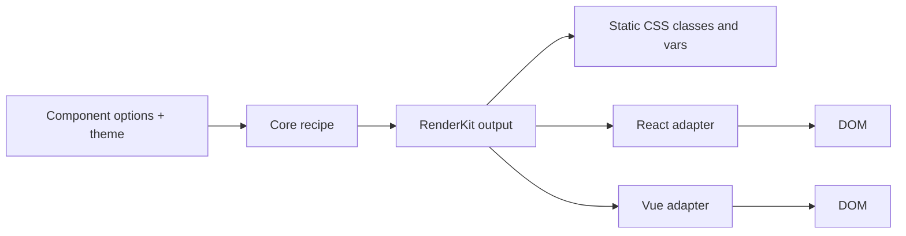
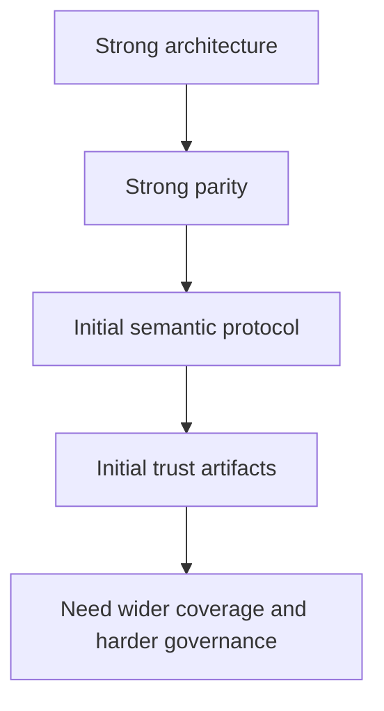
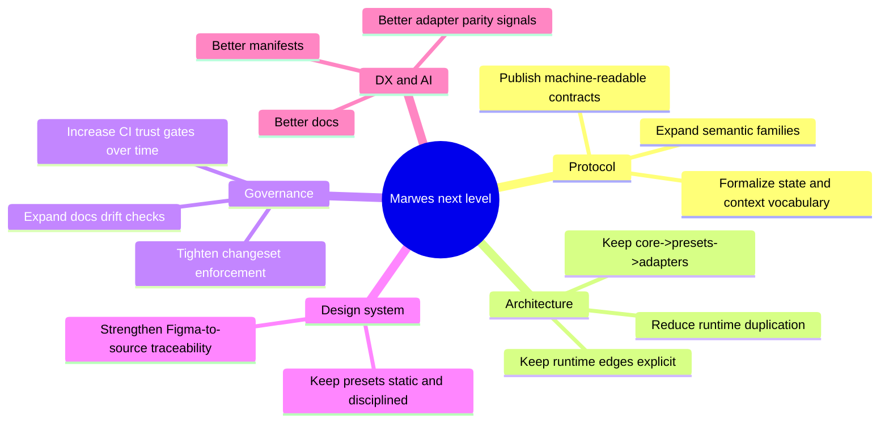
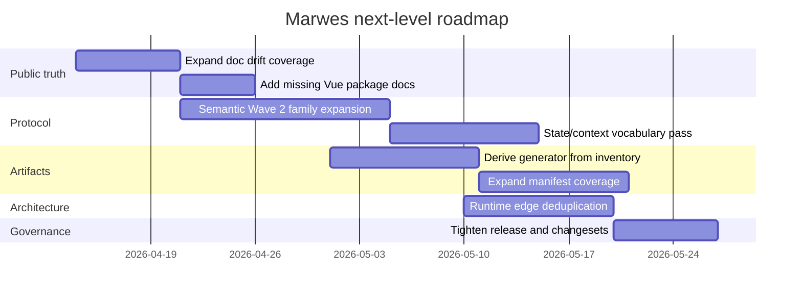
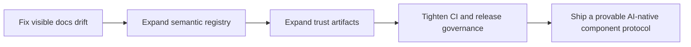

# MAI6 Debrief V2 — Marwes Current Truth

This debrief replaces stale assumptions with a directly verified view of the repository as it exists now.

Prepared from repository inspection and command execution in this session.

## Executive summary

Marwes is already a strong foundation for a next-generation component library.

Its core shape is correct:

```text
@marwes-ui/core -> @marwes-ui/presets -> @marwes-ui/react / @marwes-ui/vue
```

The repo is not suffering from missing architecture. It is suffering from a smaller and more important gap:

> the gap between a strong internal system and a fully explicit, fully machine-readable, fully governed public contract.

That matters because Marwes does **not** just want to be a nice component library. It wants to become a library that AI systems, humans, design tooling, and framework adapters can all understand consistently.

## Verified status now

The following commands were run successfully in this session:

- `pnpm typecheck`
- `pnpm docs:links`
- `pnpm storybook:consistency`
- `pnpm test:packages`
- `pnpm check`
- `pnpm test:typecheck:contracts`

### What that means

- TypeScript is green across the workspace
- package tests are green across core, presets, react, and vue
- Storybook parity audit is green
- docs link validation is green
- semantic registry checks are green
- trust artifacts are up to date

## The real system map

```mermaid
flowchart TD
  Figma[Figma sources + .figma cache]
  Docs[docs/reference + guides]
  Core[@marwes-ui/core]
  Presets[@marwes-ui/presets]
  React[@marwes-ui/react]
  Vue[@marwes-ui/vue]
  StorybookReact[apps/storybook-react]
  StorybookVue[apps/storybook-vue]
  Playground[apps/playground-react]
  Contracts[tests/contracts]
  Artifacts[artifacts/*.json]
  CI[GitHub Actions CI]

  Figma --> Docs
  Figma --> Core
  Docs --> Core
  Core --> Presets
  Core --> React
  Core --> Vue
  Presets --> React
  Presets --> Vue
  React --> StorybookReact
  Vue --> StorybookVue
  React --> Playground
  React --> Contracts
  Vue --> Contracts
  Core --> Artifacts
  Artifacts --> CI
  Contracts --> CI
  Docs --> CI
```

## Current repository shape

### Packages

- `packages/core` — framework-agnostic recipes, theme logic, semantic registries, shared helpers
- `packages/presets` — static CSS and preset theme exports
- `packages/react` — thin React adapter + provider runtime edge
- `packages/vue` — thin Vue adapter + provider runtime edge

### Apps

- `apps/storybook-react`
- `apps/storybook-vue`
- `apps/playground-react`

### Verified inventory signals

- component family directories in `packages/core/src/components/atoms`: **20**
- component family directories in `packages/react/src/components`: **20**
- component family directories in `packages/vue/src/components`: **20**
- contract files in `tests/contracts`: **26**
- trust artifacts in `artifacts/`: **4**
- families scanned by Storybook consistency audit: **21**
- canonical semantic artifact families today: **5**

## What is genuinely strong

### 1. The architecture is real

Marwes is not faking separation of concerns.



The repo really does treat:
- core as source of logic
- presets as source of appearance
- adapters as source of rendering and runtime edge behavior

That is a very good foundation for scale.

### 2. React and Vue parity is a real differentiator

The repo currently has matching family directories across React and Vue, and the Storybook consistency audit passes with zero findings.

That is rare. Most design systems claim multi-framework support. Marwes is actually investing in it.

### 3. The repo already has an AI-facing semantic direction

There is a real semantic layer in:
- `packages/core/src/semantics/semantic-types.ts`
- `packages/core/src/semantics/semantic-attributes.ts`
- `packages/core/src/semantics/family-semantics.ts`
- `packages/core/src/semantics/purpose-semantics.ts`
- `docs/reference/ai-metadata.md`

This is not just decorative metadata. It is the beginning of a protocol.

### 4. Governance is stronger than the old debrief implied

`pnpm check` currently includes:
- docs link checks
- docs/API drift checks
- semantic registry checks
- trust artifact freshness checks
- biome checks
- storybook consistency checks

And the reusable GitHub CI workflow mirrors that trust model.

## What is still incomplete

Marwes is strong, but not finished.

### Gap 1 — docs truth is only partially guarded

The guarded docs are in good shape, but stale examples still exist outside the currently enforced drift check.

Examples observed in this session:
- `apps/storybook-react/README.md` still shows `firstEdition`
- `apps/playground-react/README.md` still shows `preset={firstEdition}`
- `packages/vue/README.md` does not exist

So the public API truth story improved significantly, but it is not complete.

### Gap 2 — artifact coverage is still narrow

The repo has a real artifact pipeline:
- `artifacts/component-manifest.json`
- `artifacts/purpose-registry.json`
- `artifacts/framework-parity.json`
- `artifacts/design-provenance.json`

But today those artifacts only cover the first semantic wave:
- `button`
- `badge`
- `avatar`
- `toast`
- `dialog`

The library itself ships far more families than that.

### Gap 3 — the artifact generator is partly hardcoded

`scripts/generate-trust-artifacts.ts` contains explicit family source maps rather than deriving the full inventory from the codebase.

That is fine for Wave 1, but not enough for a best-in-class AI-native system.

### Gap 4 — adapter runtime duplication is still visible

These files are near-mirrors:
- `packages/react/src/provider/runtime-theme.ts`
- `packages/vue/src/provider/runtime-theme.ts`

This is not a crisis, but it is a signal.

The architecture is good, but parts of the runtime edge can still be consolidated or source-owned more cleanly.

### Gap 5 — semantic protocol is meaningful, but still Wave 1

The current semantic system is strong enough to matter, but still intentionally scoped.

Right now the canonical wave is centered on 5 families, while many other shipped families still behave more like well-structured UI components than protocol-grade semantic surfaces.

## Validation of the old debrief work

## SIGMA was mostly right about the architecture

Correct calls from the earlier work:
- keep the three-layer model
- treat parity as a core differentiator
- make semantics and generated artifacts central to the next leap
- avoid rewriting the architecture

Where SIGMA is now stale:
- repo health is better now than some earlier summaries suggested
- docs/API drift is improved but not fully eradicated
- the repo is farther along on governance than early notes implied

## PRISM was right about the next-level direction

Correct calls:
- semantic metadata should become a formal contract
- generated artifacts should exist
- adapter parity should be measurable, not rhetorical

Where PRISM is now stale:
- major repo-health failures it described are no longer current
- some planned work is already implemented

## PROBE had the best core framing

PROBE's strongest conclusion still holds:

> Marwes is not blocked by missing architecture. It is blocked by the gap between what the architecture claims, what the docs teach, and what the semantic system could become.

That remains the cleanest summary of the situation.

## The main truth of V2



Marwes is no longer in the "invent the architecture" stage.
It is in the "turn conventions into protocol" stage.

## What Marwes should become next

### North-star statement

> Marwes should evolve from a framework-agnostic component library into a framework-agnostic semantic UI protocol with static presets, generated contracts, and provable cross-framework parity.

That means five things.

### 1. Source-owned semantics
Meaning should live in core, not be improvised in wrappers.

### 2. Full-family machine-readable manifests
AI systems and tooling should be able to query the library as data.

### 3. Hard parity gates
React and Vue should remain measurably aligned.

### 4. Explicit design provenance
Figma references, stories, contracts, source files, and exports should form one traceable chain.

### 5. Public truth discipline
Docs should explain the truth, not compete with it.

## Public contract map

From a PRISM perspective, Marwes should be read as four overlapping contract surfaces.

| Surface | Primary audience | What is public here | Core paths |
|---|---|---|---|
| Consumer package API | app developers | components, provider API, theme usage, CSS import paths | `packages/react/src/index.ts`, `packages/vue/src/index.ts`, `packages/presets/src/index.ts`, `README.md` |
| Adapter contract | React/Vue maintainers | RenderKit application rules, runtime theme sync, framework event mapping | `packages/react/src/components/*`, `packages/vue/src/components/*`, `packages/*/src/provider/*` |
| Semantic protocol | AI agents, tooling, docs, contract tests | canonical `data-*` vocabulary, family registry, purpose registry, semantic builders | `packages/core/src/semantics/*`, `docs/reference/ai-metadata.md` |
| Governance contract | maintainers and CI | parity checks, docs/API drift checks, artifact freshness, release trust gates | `scripts/*`, `artifacts/*`, `.github/workflows/*` |

### Interface invariants

These are the rules the next phase should preserve.

- `theme` remains the provider prop for framework consumers
- `firstEditionTheme` remains the preset theme export unless intentionally versioned later
- preset styling remains static CSS, not runtime CSS-in-JS
- `@marwes-ui/core` stays free of DOM side effects and framework rendering concerns
- adapters stay thin and framework-idiomatic
- semantic vocabulary stays source-owned in core
- parity should be measured through artifacts, tests, and Storybook checks rather than assumed

## Family maturity matrix

The biggest PRISM-level clarity gap is not whether Marwes ships components. It does. The real question is how mature each family is as a **protocol-grade surface**.

| Family | Shipped in React/Vue | Story parity status | Canonical semantic family contract | Artifact coverage | Shared contract coverage |
|---|---:|---:|---:|---:|---:|
| accordion | yes | yes | no | no | no |
| avatar | yes | yes | yes | yes | yes |
| badge | yes | yes | yes | yes | yes |
| button | yes | yes | yes | yes | yes |
| card | yes | yes | no | no | no |
| checkbox | yes | yes | no | no | yes |
| dialog | yes | yes | yes | yes | yes |
| divider | yes | yes | no | no | yes |
| heading | yes | yes | no | no | yes |
| icon | yes | yes | no | no | yes |
| input | yes | yes | no | no | yes |
| paragraph | yes | yes | no | no | yes |
| radio | yes | yes | no | no | yes |
| slider | yes | yes | no | no | no |
| spacing | yes | yes | no | no | no |
| spinner | yes | yes | no | no | yes |
| switch | yes | yes | no | no | no |
| tab | yes | yes | no | no | no |
| toast | yes | yes | yes | yes | yes |
| tooltip | yes | yes | no | no | no |

### How to read this matrix

- **Shipped in React/Vue** means the family exists as a surfaced adapter family in both frameworks
- **Story parity status** reflects the current healthy result from `pnpm storybook:consistency`
- **Canonical semantic family contract** means the family is represented in the current core-owned semantic registry wave
- **Artifact coverage** means the family appears in the current generated trust artifacts
- **Shared contract coverage** means the family has at least one shared contract file under `tests/contracts/`

This is why the next phase should be understood as a maturity expansion problem, not a component-existence problem.

## Improvement map



## Recommended priorities

| Priority | Area | Why it matters | Main paths |
|---|---|---|---|
| P0 | Expand docs truth guardrails | stale examples still exist in visible surfaces | `apps/playground-react/README.md`, `apps/storybook-react/README.md`, `packages/vue/README.md`, `scripts/check-doc-api-drift.mjs` |
| P1 | Expand artifacts beyond Wave 1 | current artifact truth is useful but incomplete | `scripts/generate-trust-artifacts.ts`, `artifacts/*`, `packages/core/src/semantics/*` |
| P1 | Semantic protocol Wave 2 | needed for true AI-native differentiation | `packages/core/src/semantics/*`, family adapters and tests |
| P1 | Reduce duplicated runtime edge code | preserves maintainability as adapters grow | `packages/react/src/provider/*`, `packages/vue/src/provider/*` |
| P2 | Tighten release governance | ensure claims stay true under scale | `.github/workflows/*`, `.changeset/*`, `package.json` scripts |

## Recommended roadmap



## Concrete next-step plan

1. **Fix visible stale documentation surfaces**
   - update `apps/playground-react/README.md`
   - update `apps/storybook-react/README.md`
   - add `packages/vue/README.md`
   - extend `scripts/check-doc-api-drift.mjs` to guard those surfaces too

2. **Turn artifact generation into full-inventory generation**
   - stop hardcoding only five semantic families
   - derive more from source inventory and registry ownership
   - align artifacts with all shipped families, not only Wave 1

3. **Define Semantic Wave 2**
   Suggested next families:
   - `input`
   - `checkbox`
   - `radio`
   - `switch`
   - `slider`
   - `tab`
   - `accordion`
   - `tooltip`
   - `spinner`
   - `card`

4. **Standardize protocol expansion rules**
   Each new family should define:
   - base family identity
   - canonical attributes
   - allowed purpose values
   - framework support expectations
   - contract coverage requirements
   - artifact presence requirements

5. **Reduce adapter duplication carefully**
   Keep rendering framework-specific, but move repeated runtime-edge logic into a more deliberate shared shape if duplication continues to grow.

## Execution guidance



## Non-goals and anti-patterns

To protect the next phase from over-engineering, these should stay explicit non-goals unless the architecture genuinely forces a change.

- Do not introduce a fourth permanent architectural layer unless duplication proves it is necessary
- Do not move DOM or browser side effects back into `@marwes-ui/core`
- Do not invent semantic metadata everywhere just to look AI-native; each field should earn its place in the protocol
- Do not abstract React and Vue rendering into a pseudo-universal renderer
- Do not expand trust artifacts faster than source-owned truth can support them
- Do not let docs become an alternate source of semantic truth; docs should explain registries and artifacts, not compete with them

## Final judgment

Marwes is already better structured than many UI libraries.

Its next leap should not be a rewrite.
Its next leap should be a **hardening pass**:
- broader semantic coverage
- broader artifact coverage
- stronger doc truth discipline
- stricter parity and release governance

If that work is done well, Marwes can become a very unusual thing:

> a component library that is simultaneously pleasant for humans, reliable for product teams, traceable to design, and legible to AI systems.

## Supporting documents in this folder

- `mai6-debrief-v2/VERIFIED_STATE.md`
- `mai6-debrief-v2/NEXT_LEVEL_PLAN.md`
