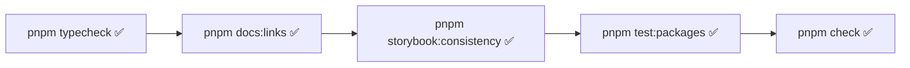
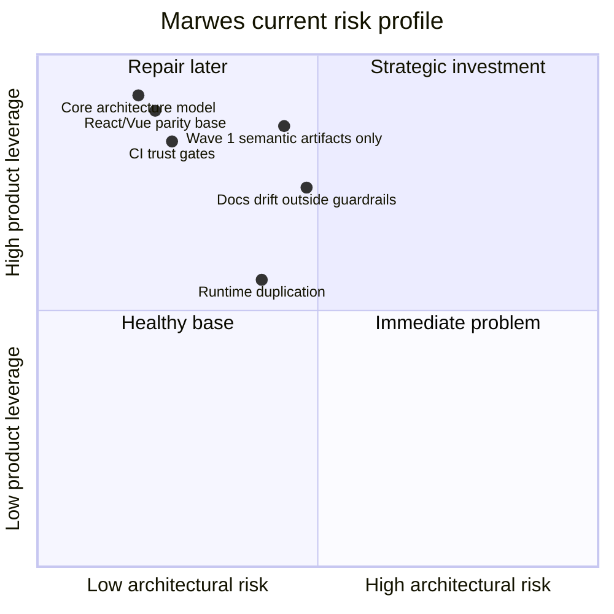

# Verified State — Marwes

This file records the repository state that was directly verified during the current session.

## Commands run

### 1. Workspace and file discovery
- `pwd`
- repo file scans with `rg --files` and `find`

### 2. Documentation and architecture inspection
Read directly:
- `README.md`
- `docs/README.md`
- `docs/reference/architecture.md`
- `docs/reference/spec.md`
- `docs/reference/ai-metadata.md`
- `docs/reference/testing.md`
- `docs/reference/governance.md`
- `package.json`
- `pnpm-workspace.yaml`
- package READMEs and package manifests
- inherited MAI6 debrief files under `mai6-debreif/`

### 3. Repository validation commands
Executed successfully:
- `pnpm typecheck`
- `pnpm docs:links`
- `pnpm storybook:consistency`
- `pnpm test:packages`
- `pnpm check`
- `pnpm test:typecheck:contracts`

## Current truth snapshot

## Health

All major local trust gates that matter for architecture confidence were green in this session.

## Verified package model

- package manager: `pnpm@9.0.0`
- node engine: `>=20`
- monorepo workspaces:
  - `packages/*`
  - `apps/*`

### Publishable packages found
- `@marwes-ui/core@0.0.4`
- `@marwes-ui/presets@0.0.4`
- `@marwes-ui/react@0.0.4`
- `@marwes-ui/vue@0.0.4`

## Verified family coverage signals

### Component family directories
- core atoms families: **20**
- react component families: **20**
- vue component families: **20**
- react-only family directories: **none**
- vue-only family directories: **none**

### Storybook inventory signals
- `apps/storybook-react/src/stories`: **106** story files, **21** Introduction docs
- `apps/storybook-vue/src/stories`: **99** story files, **21** Introduction docs
- Storybook consistency audit: **21 families scanned, 0 findings**

### Contract and artifact signals
- `tests/contracts`: **26** contract files
- `artifacts/`: **4** generated trust artifacts
- canonical semantic artifact families currently represented: **5**

## Important corrections to inherited debrief assumptions

### Correction 1 — repo health summaries in older debrief files are stale

Older debrief material referred to failed checks in some phases.
That is not the current repo state.

Verified now:
- `pnpm typecheck` ✅
- `pnpm docs:links` ✅
- `pnpm storybook:consistency` ✅
- `pnpm test:packages` ✅

### Correction 2 — docs/API truth is improved, but not complete

The root README and guarded package docs are aligned well enough to satisfy `pnpm docs:api`.

But visible stale examples still exist outside the current drift-check scope:
- `apps/storybook-react/README.md`
- `apps/playground-react/README.md`

### Correction 3 — governance is stronger than early summaries implied

The reusable CI workflow already enforces:
- docs link checks
- docs/API drift checks
- semantic registry checks
- trust artifact freshness
- storybook consistency
- typecheck
- contract typecheck
- package tests with Allure output
- build

That is a substantial governance foundation.

### Correction 4 — semantic and artifact work is real, but still partial

The repo has:
- canonical semantic registries in core
- semantic docs
- purpose registries
- generated artifact files

But Wave 1 semantic artifact coverage still only names:
- `button`
- `badge`
- `avatar`
- `toast`
- `dialog`

## Key source anchors verified directly

### Architecture and docs
- `README.md`
- `docs/reference/architecture.md`
- `docs/reference/spec.md`
- `docs/reference/ai-metadata.md`
- `docs/reference/governance.md`
- `docs/reference/testing.md`

### Semantic protocol
- `packages/core/src/semantics/semantic-types.ts`
- `packages/core/src/semantics/semantic-attributes.ts`
- `packages/core/src/semantics/family-semantics.ts`
- `packages/core/src/semantics/purpose-semantics.ts`
- `packages/core/src/semantics/semantic-builders.ts`

### Runtime edge split
- `packages/core/src/theme/font-loader.ts`
- `packages/react/src/provider/runtime-theme.ts`
- `packages/vue/src/provider/runtime-theme.ts`
- `packages/react/src/provider/marwes-provider.tsx`
- `packages/vue/src/provider/marwes-provider.ts`

### Artifact and parity governance
- `scripts/generate-trust-artifacts.ts`
- `scripts/storybook-consistency.mjs`
- `scripts/check-doc-api-drift.mjs`
- `.github/workflows/_ci.yml`
- `.github/workflows/ci.yml`
- `.github/workflows/release.yml`

## Current risk assessment

## Bottom line

The repository is healthy.
The architecture is good.
The parity story is strong.
The semantic and artifact direction is real.

The remaining work is about breadth, formalization, and governance completeness — not rescuing a broken system.
