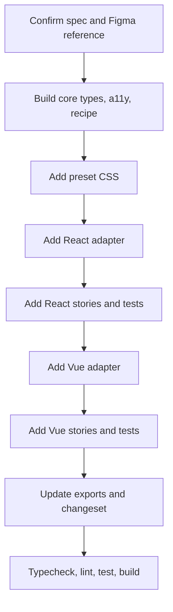

# Adding Components

This guide is the practical implementation workflow for new Marwes components.

The non-negotiable rule is:

```text
core recipe → preset CSS → React adapter → Vue adapter
```

Do not skip layers, and do not move framework logic into `@marwes-ui/core`.

## Workflow overview



## Before you start

Read:
- [Architecture](../reference/architecture.md)
- [Specification](../reference/spec.md)
- [Figma to Marwes](./figma-to-marwes.md)
- the relevant files under `.figma/`

For non-trivial work:
1. confirm or add the requirement in the spec
2. confirm the Figma node and states
3. identify affected packages and stories

## Layer order

### 1. Core
Create or update files under:

```text
packages/core/src/components/
```

Typical component file set:

```text
packages/core/src/components/atoms/<name>/
├── <name>-types.ts
├── <name>-a11y.ts
├── <name>-styles.ts      # when needed
├── <name>-recipe.ts
├── index.ts
└── __tests__/
```

Core owns:
- public types
- accessibility rules
- state and variant mapping
- `RenderKit` generation

Core does not own:
- React hooks
- Vue APIs
- DOM manipulation
- visual styling rules

### 2. Presets
Add CSS under:

```text
packages/presets/src/firstEdition/
```

Typical files:

```text
packages/presets/src/firstEdition/<name>.css
packages/presets/src/firstEdition/molecules/<name>-field.css
```

Then import the new CSS from:

```text
packages/presets/src/firstEdition/styles.css
```

Preset rules:
- style stable `.mw-*` classes and `data-*` hooks
- use `--mw-*` variables
- keep framework-specific styling out of adapters

### 3. React adapter
Add files under:

```text
packages/react/src/components/<name>/
```

Typical files:

```text
packages/react/src/components/<name>/
├── <name>.tsx
├── index.ts
├── variants.tsx          # optional
├── <molecule-name>.tsx   # optional
└── __tests__/
```

React adapter rules:
- call the real core recipe
- apply `RenderKit` fields explicitly
- keep logic thin
- avoid design-token hardcoding

### 4. React stories and docs
Add files under:

```text
apps/storybook-react/src/stories/<name>/
```

Typical files:

```text
apps/storybook-react/src/stories/<name>/
├── Introduction.mdx
├── <name>.stories.tsx
├── <molecule-name>.stories.tsx
├── <purpose-variant>.stories.tsx
└── __tests__/
```

Storybook taxonomy should usually follow:
- `Component/Introduction`
- `Component/Atom`
- `Component/Molecule`
- `Component/Purpose/<VariantName>`

### 5. Vue adapter and stories
Mirror the React structure in:

```text
packages/vue/src/components/<name>/
apps/storybook-vue/src/stories/<name>/
```

Vue should preserve the same behavioral contract while using Vue-idiomatic event ergonomics.

## Required exports

Update exports in the affected packages:

- `packages/core/src/index.ts`
- `packages/react/src/index.ts`
- `packages/vue/src/index.ts`
- package-local `index.ts` files

## New component checklist

- [ ] spec requirement confirmed or added
- [ ] Figma node and state coverage confirmed
- [ ] core types added
- [ ] core a11y added
- [ ] core recipe added
- [ ] preset CSS added and imported
- [ ] React adapter added
- [ ] React stories and tests added
- [ ] Vue adapter added
- [ ] Vue stories and tests added
- [ ] exports updated
- [ ] changeset added when shipping user-facing API
- [ ] docs updated if public behavior changed

## Definition of done

A component is done when:
- core, presets, React, and Vue layers are complete
- stories exist for the relevant states and variants
- tests cover the key behavior
- exports are wired
- docs are updated to match the shipped behavior before the task is considered complete
- `pnpm typecheck`, `pnpm lint`, `pnpm test`, and `pnpm build` pass

For accessibility-family follow-up work, also update the tracking docs when the pass is complete:
- the family audit doc in `docs/audits/`
- `docs/audits/README.md`
- `AXE_ROADMAP.md` when roadmap status changed

## Validation commands

```bash
pnpm typecheck
pnpm lint
pnpm test
pnpm build
```

For focused work, run package-specific commands first.

## Related docs

- [Architecture](../reference/architecture.md)
- [Specification](../reference/spec.md)
- [Testing](../reference/testing.md)
- [Figma to Marwes](./figma-to-marwes.md)
- [Component backlog](../planning/component-backlog.md)
