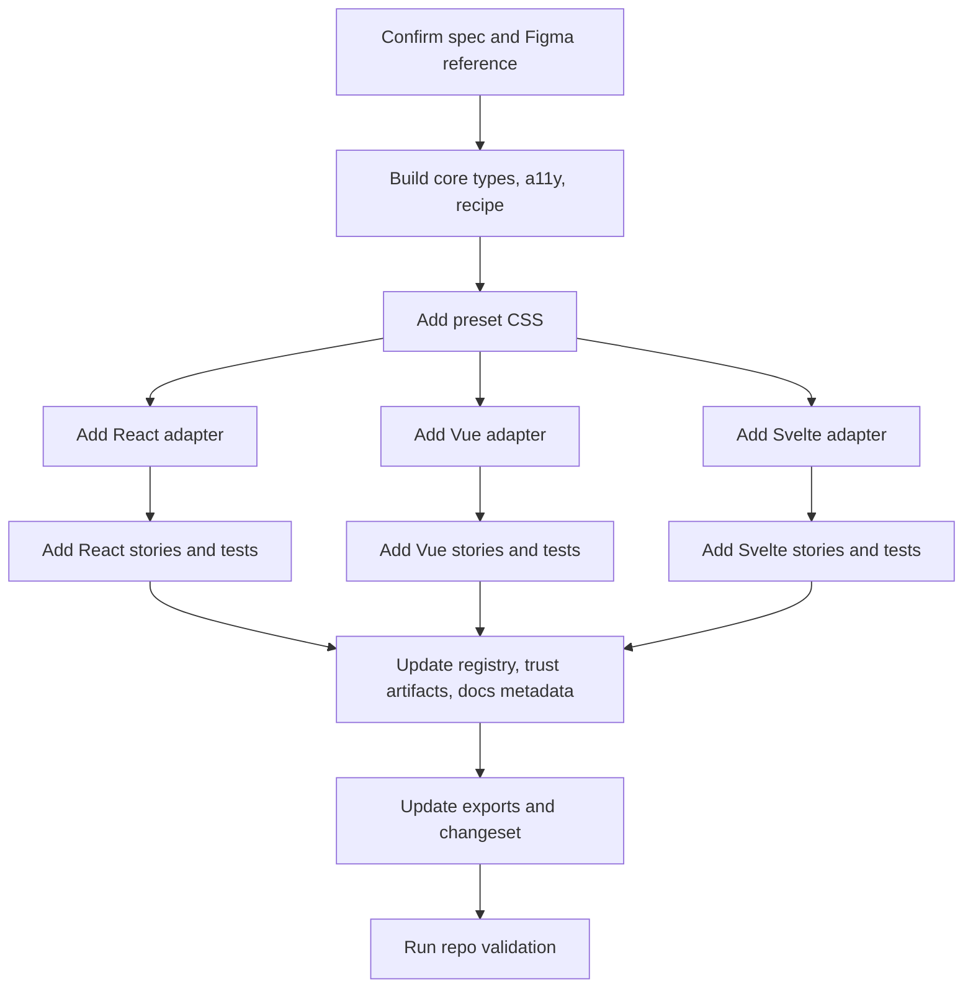

# Adding Components

This guide is the practical implementation workflow for new Marwes components.

The non-negotiable rule is:

```text
core recipe -> preset CSS -> all framework adapters -> Storybook/docs/contracts
```

Do not skip layers, do not treat any adapter as a later catch-up task, and do not move framework logic into `@marwes-ui/core`.

## Workflow overview



## Before you start

Read:
- [Architecture](../reference/architecture.md)
- [Specification](../reference/spec.md)
- [Figma to Marwes](./figma-to-marwes.md)
- the relevant files under `.figma/`

For non-trivial work:
1. confirm or add the requirement in the spec
2. confirm the Figma node and states
3. identify affected packages and stories

## Layer order

### 1. Core
Create or update files under:

```text
packages/core/src/components/
```

Typical component file set:

```text
packages/core/src/components/atoms/<name>/
├── <name>-types.ts
├── <name>-a11y.ts
├── <name>-styles.ts      # when needed
├── <name>-recipe.ts
├── index.ts
└── __tests__/
```

Core owns:
- public types
- accessibility rules
- state and variant mapping
- `RenderKit` generation

Core does not own:
- React hooks
- Vue APIs
- DOM manipulation
- visual styling rules

### 2. Presets
Add CSS under:

```text
packages/presets/src/firstEdition/
```

Typical files:

```text
packages/presets/src/firstEdition/<name>.css
packages/presets/src/firstEdition/molecules/<name>-field.css
```

Then import the new CSS from:

```text
packages/presets/src/firstEdition/styles.css
```

Preset rules:
- style stable `.mw-*` classes and `data-*` hooks
- use `--mw-*` variables
- keep framework-specific styling out of adapters

### 3. Framework adapters
Add adapter files under:

```text
packages/react/src/components/<name>/
packages/vue/src/components/<name>/
packages/svelte/src/lib/components/<name>/
```

The required architecture map lives in [Adapter Architecture](../reference/adapter-architecture.md). Typical file shapes:

```text
packages/react/src/components/<name>/
├── <name>.tsx
├── index.ts
├── variants.tsx          # optional
├── <molecule-name>.tsx   # optional
└── __tests__/
```

packages/vue/src/components/<name>/
├── <name>.ts
├── index.ts
├── variants.ts           # optional
├── <molecule-name>.ts    # optional
└── __tests__/

packages/svelte/src/lib/components/<name>/
├── <Name>.svelte
├── types.ts
├── index.ts
├── <MoleculeName>.svelte # optional
└── __tests__/            # optional when package-local tests are needed
```

Adapter rules:
- call the real core recipe
- apply `RenderKit` fields explicitly
- keep logic thin
- avoid design-token hardcoding
- expose role-identical public symbols across React, Vue, and Svelte
- use framework-native syntax only where the adapter architecture map allows it

### 4. Stories and docs
Add Storybook files under:

```text
apps/storybook-react/src/stories/<name>/
apps/storybook-vue/src/stories/<name>/
apps/storybook-svelte/src/stories/<name>/
```

Typical files:

```text
apps/storybook-<framework>/src/stories/<name>/
├── Introduction.mdx
├── <name>.stories.tsx
├── <molecule-name>.stories.tsx
├── <purpose-variant>.stories.tsx
└── __tests__/
```

Storybook taxonomy should usually follow:
- `Component/Introduction`
- `Component/Atom`
- `Component/Molecule`
- `Component/Purpose/<VariantName>`

React, Vue, and Svelte should preserve the same behavioral contract while using framework-idiomatic event, slot/snippet, and binding ergonomics.

## Required exports

Update exports in the affected packages:

- `packages/core/src/index.ts`
- `packages/react/src/index.ts`
- `packages/vue/src/index.ts`
- `packages/svelte/src/lib/index.ts`
- package-local `index.ts` files

## Generated metadata and docs gates

New components must be wired into the repo metadata that pre-push checks enforce. Do this while adding the component, not after the hook fails.

Update the relevant sources before running generators:

- trust artifacts: `scripts/generate-trust-artifacts.ts`
- component registry sources: `scripts/component-registry-sources.ts`
- Storybook companion configuration when the family needs canonical story title overrides: `.pi/storybook-companion.config.ts`
- framework parity inputs when a new adapter or story coverage changes framework support

The generated outputs are not all driven by the same source:

- `artifacts/component-manifest.json`, `artifacts/design-provenance.json`, `artifacts/framework-parity.json`, and `artifacts/purpose-registry.json` come from the trust artifact generator.
- `docs/reference/framework-parity-summary.md` is derived from `artifacts/framework-parity.json`; regenerate it any time framework support changes.
- `artifacts/component-registry.json` and `docs/registry/families/<family>/registry.generated.json` are driven by
  `docs/registry/families/<family>/registry.meta.json` plus `scripts/component-registry-sources.ts`.
- Adding only `scripts/component-registry-sources.ts` is useful future wiring, but `registry:generate` will not
  create a new family registry entry until `docs/registry/families/<family>/registry.meta.json` exists.

Then regenerate and check:

```bash
pnpm artifacts:generate
pnpm registry:generate
pnpm parity:summary
pnpm artifacts:check
pnpm registry:check
pnpm parity:summary:check
pnpm storybook:consistency
pnpm check:adapter-architecture
```

If generated JSON or Markdown changes, format it with Biome before committing:

```bash
pnpm exec biome check --write docs/registry/families/<family>/registry.generated.json artifacts/component-registry.json docs/reference/framework-parity-summary.md
```

Adjust the paths to match the files that changed.

Avoid committing broad generated-file churn. If a generator reformats unrelated families or global registry files
without semantic changes, revert that noise and rerun the matching `*:check` command. The required output is the
smallest generated diff that makes the checks pass.

## Storybook coverage requirements

Every new component family needs consistent Storybook coverage across React, Vue, and Svelte unless the component is intentionally framework-specific.

For each framework storybook, include:

- `Introduction.mdx`
- the canonical atom story, usually titled `Component/Atom`
- molecule or purpose stories when the component has those layers
- taxonomy tests that assert the story titles and hierarchy
- introduction docs tests that assert the expected docs content exists
- matching named story exports across frameworks for shared states

Avoid stories that create accessibility false positives:

- give repeated navigation landmarks unique `aria-label` values inside comparison stories
- avoid duplicate `header`, `footer`, `main`, and `nav` landmarks in multi-example stories
- make dialog panels use a valid dialog host element, such as `div role="dialog"`
- keep disabled, selected, active, expanded, and loading states visible in stories and covered by tests

## New component checklist

- [ ] spec requirement confirmed or added
- [ ] Figma node and state coverage confirmed
- [ ] core types added
- [ ] core a11y added
- [ ] core recipe added
- [ ] preset CSS added and imported
- [ ] React adapter added
- [ ] React stories and tests added
- [ ] Vue adapter added
- [ ] Vue stories and tests added
- [ ] Svelte adapter added
- [ ] Svelte stories and tests added
- [ ] shared contracts enrolled across React, Vue, and Svelte where applicable
- [ ] `pnpm check:adapter-architecture` passes
- [ ] exports updated
- [ ] trust artifact sources updated when the component is public
- [ ] component registry sources updated
- [ ] framework parity summary regenerated when support changes
- [ ] Storybook taxonomy and introduction docs tests added for each framework
- [ ] comparison stories use unique landmark names
- [ ] generated registry and artifact files regenerated
- [ ] changeset added when shipping user-facing API
- [ ] docs updated if public behavior changed

## Definition of done

A component is done when:
- core, presets, React, Vue, and Svelte layers are complete
- adapter family structure follows [Adapter Architecture](../reference/adapter-architecture.md)
- stories exist for the relevant states and variants
- tests cover the key behavior
- exports are wired
- generated trust artifacts, component registry files, and parity summary are current
- Storybook consistency and a11y smoke tests pass
- docs are updated to match the shipped behavior before the task is considered complete
- `pnpm check` passes

For accessibility-family follow-up work, also update the tracking docs when the pass is complete:
- the family audit doc in `docs/audits/`
- `docs/audits/README.md`
- `AXE_ROADMAP.md` when roadmap status changed

## Validation commands

Run focused package tests first while building, then run the same aggregate check that pre-push uses.

```bash
pnpm check:repo-map
pnpm exec biome check .
pnpm test:storybook:a11y
pnpm check
```

For focused work, run package-specific commands first, for example:

```bash
pnpm --filter @marwes-ui/core test -- test/recipes/<name>.test.ts
pnpm --filter @marwes-ui/react test -- src/components/<name>/__tests__
pnpm --filter @marwes-ui/vue test -- src/components/<name>/__tests__
pnpm --filter @marwes-ui/svelte test -- src/tests/<name>.test.ts
```

## Related docs

- [Architecture](../reference/architecture.md)
- [Specification](../reference/spec.md)
- [Testing](../reference/testing.md)
- [Figma to Marwes](./figma-to-marwes.md)
- [Component registry](../registry/README.md)
