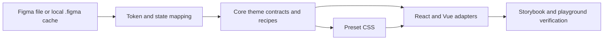

# Figma to Marwes Mapping Guide

This guide defines how design data from Figma should map into Marwes so implementation stays consistent.

## Scope
- Source design: Figma file tokens and component variants/states.
- Target implementation: `@marwes-ui/core`, `@marwes-ui/presets`, `@marwes-ui/react`, and `@marwes-ui/vue`.
- Current preset focus: `firstEdition`.

## Node Reference (Local Offline Resources)

When the Figma MCP server is unavailable, the following local files provide everything needed to work with the V3 component library:

- [`.figma/NODE_REFERENCE.md`](../../.figma/NODE_REFERENCE.md) — human-readable reference: all 13 V3 components, frame IDs, states/variants, CSS tokens, variable definitions (light + dark), MCP usage guide
- [`.figma/nodes.json`](../../.figma/nodes.json) — machine-readable structured data: meta, verified variable defs (2026-03-18), all component node IDs

Both files are MCP-verified as of 2026-03-18.

---

## Connection Setup (MCP)
Use this once per environment:
1. Configure a `figma` MCP server in Codex settings.
2. Point it to `https://mcp.figma.com/mcp`.
3. Complete auth (OAuth flow or bearer token/header config).
4. Confirm the server is enabled for your Codex session.

If you only log in but do not enable/select the server, Codex will not be able to read file data.

## Flow



## Source of Truth
- Theme contract: `packages/core/src/theme/theme-types.ts`.
- Theme defaults: `packages/core/src/theme/theme-defaults.ts`.
- Color derivation: `packages/core/src/theme/color-resolve.ts`.
- CSS variable mapping: `packages/core/src/theme/theme-css.ts`.
- Preset defaults: `packages/presets/src/firstEdition/index.ts`.
- Preset styling: `packages/presets/src/firstEdition/*.css`.

Always map Figma values into these contracts before touching component adapters.

## Theme Engine (v3)

Colors flow through a derivation pipeline:

```
ThemeInput (consumer API)
  → resolveThemeInput()
    → ResolvedTheme (ColorRole objects, not raw hex)
      → themeToCSSVars() / applyTheme()
        → CSS custom properties on provider element
```

Derivable color roles (`primary`, `danger`, `success`, `warning`) accept a `ColorInput` — either a plain hex string or an override object. String input auto-derives interaction states (hover, pressed, disabled, label); object input can override derived fields such as `label` and `labelDisabled` for brand-specific filled surfaces. `secondary` and `info` are always derived from `primary` — never configured directly.

## Token Mapping

### Color Roles (derived)

Each role produces 6 CSS variables. Labels are auto-derived via WCAG contrast by default, but can be explicitly overridden through object-form `ColorInput`.

| Figma token | ThemeInput key | CSS variables |
|---|---|---|
| `color.primary` | `color.primary` | `--mw-color-primary-{base,hover,pressed,disabled,label,label-disabled}` |
| `color.danger` | `color.danger` | `--mw-color-danger-{base,hover,pressed,disabled,label,label-disabled}` |
| `color.success` | `color.success` | `--mw-color-success-{base,hover,pressed,disabled,label,label-disabled}` |
| `color.warning` | `color.warning` | `--mw-color-warning-{base,hover,pressed,disabled,label,label-disabled}` |

**Derived-only roles (not configurable):**

| Role | Derived from | CSS variables |
|---|---|---|
| `secondary` | `primary.base` | `--mw-color-secondary-{base,hover,pressed,disabled,label,label-disabled,border,border-disabled}` |
| `info` | `primary` | `--mw-color-info-{base,hover,pressed,disabled,label,label-disabled}` |

**Label derivation replaces manual `on-*` tokens:**
- Old: `onPrimary`, `onDanger`, etc. were manually configured
- New: `label` and `labelDisabled` are auto-derived using WCAG relative luminance contrast

### Surface & Semantic Colors (direct)
| Figma token | ThemeInput key | CSS var |
|---|---|---|
| `color.background` | `color.background` | `--mw-color-background` |
| `color.surface` | `color.surface` | `--mw-color-surface` |
| `color.surfaceInverted` | `color.surfaceInverted` | `--mw-color-surface-inverted` |
| `color.text` | `color.text` | `--mw-color-text` |
| `color.textMuted` | `color.textMuted` | `--mw-color-text-muted` |
| `color.textInverted` | `color.textInverted` | `--mw-color-text-inverted` |
| `color.border` | `color.border` | `--mw-color-border` |
| `color.borderSubtle` | `color.borderSubtle` | `--mw-color-border-subtle` |
| `color.focus` | `color.focus` | `--mw-color-focus` |

### Dark Mode
Dark mode is built in via `ThemeInput.mode`:
- `mode: "light"` (default) — dark text on light backgrounds
- `mode: "dark"` — light text on dark backgrounds

Surface/text colors swap automatically based on mode defaults. Color roles re-derive with mode-appropriate lightness shifts.

### Typography Tokens
| Figma token | ThemeInput key | CSS var |
|---|---|---|
| `font.family.primary` | `font.primary` | `--mw-font-primary` |
| `font.family.secondary` | `font.secondary` | `--mw-font-secondary` |
| `font.family.mono` | `font.mono` | `--mw-font-mono` |
| `typography.h1.*` | `typography.h1.*` | `--mw-typography-h1-{font-size,line-height,font-weight,letter-spacing}` |
| `typography.h2.*` | `typography.h2.*` | `--mw-typography-h2-{...}` |
| `typography.h3.*` | `typography.h3.*` | `--mw-typography-h3-{...}` |
| `typography.paragraph.sm.*` | `typography.paragraph.sm.*` | `--mw-typography-paragraph-sm-{font-size,line-height}` |
| `typography.paragraph.md.*` | `typography.paragraph.md.*` | `--mw-typography-paragraph-md-{...}` |
| `typography.paragraph.lg.*` | `typography.paragraph.lg.*` | `--mw-typography-paragraph-lg-{...}` |

### UI Tokens
| Figma token | ThemeInput key | CSS var |
|---|---|---|
| `radius.base` | `ui.radius` | `--mw-ui-radius` |
| `density` | `ui.density` | layout/component modifier behavior |
| `variant.default` | `ui.variant` | component modifier behavior |

Icon size and stroke width are handled by the icon recipe directly, not via theme tokens.

## Component Mapping

### Button
- Contract: `packages/core/src/components/atoms/button/button-types.ts`.
- Recipe: `packages/core/src/components/atoms/button/button-recipe.ts`.
- CSS: `packages/presets/src/firstEdition/button.css`.

Required Figma variants/states to support:
- `tone`: `primary`, `secondary`, `text`.
- `size`: `xs`, `sm`, `md`, `lg`.
- states: `default`, `hover`, `focus-visible`, `disabled`, `loading`.
- icon patterns: `iconLeft`, `iconRight`, `iconOnly`.

### Input
- Contract: `packages/core/src/components/atoms/input/input-types.ts`.
- Recipe: `packages/core/src/components/atoms/input/input-recipe.ts`.
- CSS: `packages/presets/src/firstEdition/input.css`.

Required Figma variants/states to support:
- `tone`: `default`, `danger`, `success`.
- states: `default`, `focus-visible`, `invalid`, `disabled`.
- text roles: value text and placeholder text.

### Checkbox
- Contract: `packages/core/src/components/atoms/checkbox/checkbox-types.ts`.
- Recipe: `packages/core/src/components/atoms/checkbox/checkbox-recipe.ts`.
- CSS: `packages/presets/src/firstEdition/checkbox.css`.

Required Figma variants/states to support:
- `size`: `sm`, `md`, `lg`.
- states: `unchecked`, `checked`, `mixed`, `focus-visible`, `disabled`, `invalid`.

### Typography
- Contracts: `packages/core/src/components/atoms/heading/heading-types.ts`, `packages/core/src/components/atoms/paragraph/paragraph-types.ts`.
- CSS: `packages/presets/src/firstEdition/typography.css`.

Required Figma tokens:
- Heading scale: h1, h2, h3 (font size, line height, weight).
- Paragraph scale: sm, md, lg (font size, line height).

## Implementation Rules
- Do not hardcode Figma hex values in adapters (`@marwes-ui/react`, `@marwes-ui/vue`).
- Put logic and mapping in core recipes and theme contracts.
- Put visual styling in preset CSS only.
- Keep CSS variable names on `--mw-*`.
- Keep classnames stable (`.mw-*`) for preset compatibility.
- Components consume CSS variables only — never theme objects directly.

## Update Workflow
1. Confirm Figma tokens and component variants/states are final.
2. Update theme contract/defaults if new semantic token is needed.
3. Update `firstEdition` preset defaults for preset-specific baselines.
4. Update component recipe vars/class modifiers in `@marwes-ui/core`.
5. Update matching CSS in `packages/presets/src/firstEdition`.
6. Verify in Storybook and playground.
7. Document any new token/variant in this file and package docs.

## PR Checklist
- Mapping follows `theme-types.ts` semantics.
- No adapter-level hardcoded design values.
- Core emits typed vars/a11y only.
- Preset CSS matches recipe classnames and vars.
- New variants/states are represented in Storybook.
- Docs updated (`docs/guides/figma-to-marwes.md` and package README if needed).
