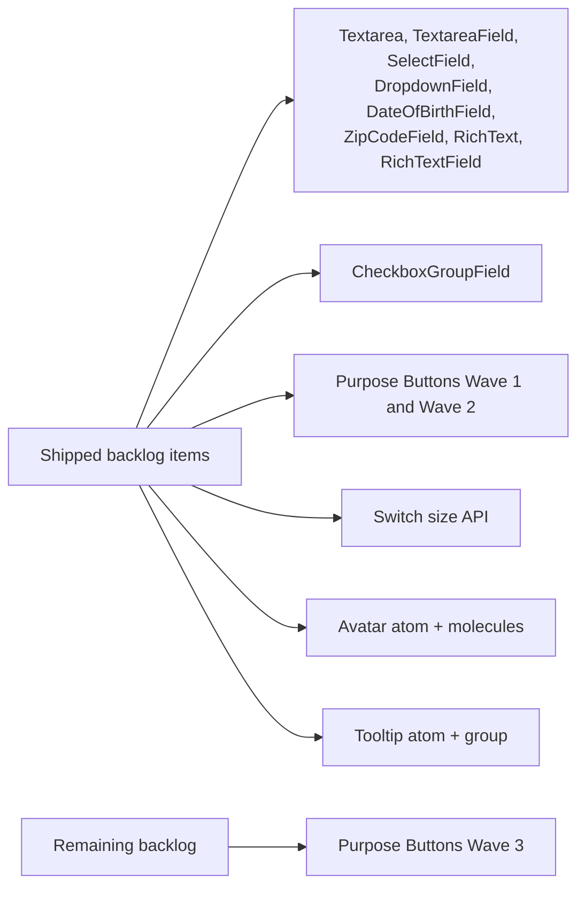
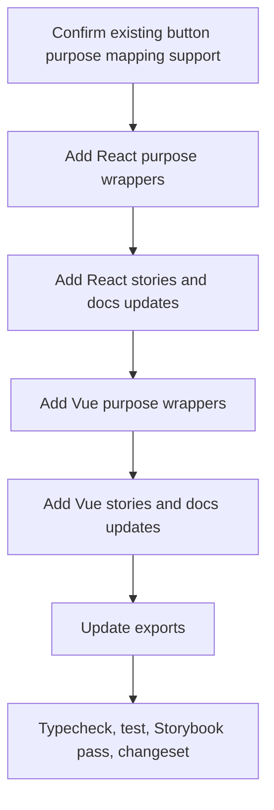

# Component Backlog

This document tracks the **remaining component-level gaps** between the repo and the synced Marwes Figma sources.

For historical migration context, see [upgrade-migration.md](./upgrade-migration.md).

## Current status

## What is already covered

All top-level V3 families from the curated Figma references already exist in the repo:

- Button
- Badge
- Tab
- Card
- Switch
- Accordion
- Avatar
- Checkbox
- Radio
- Toast
- Tooltip
- Input
- Divider
- Typography

Already shipped from this backlog:
- `Avatar`
- `AvatarBadge`
- `AvatarGroup`
- `CheckboxGroupField`
- `Textarea`
- `TextareaField`
- `SelectField`
- `DropdownField`
- `DateOfBirthField`
- `ZipCodeField`
- `RichText`
- `RichTextField`
- `Tooltip`
- `TooltipGroup`
- Purpose Buttons Wave 1
- Purpose Buttons Wave 2
- Switch size API: `compact`, `wide`, `rich`

## Remaining inventory

| Area | Figma reference | Remaining gap | Notes |
| --- | --- | --- | --- |
| Purpose Buttons | `1371:8933` | `BackButton`, `NextButton`, `MessageButton`, `ShareButton`, `LoginButton`, `LogoutButton`, `HelpButton`, `SettingsButton` | Final purpose-button wave |

## Purpose-button coverage already shipped

Existing purpose-button coverage maps these intents:

- `Submit` → `SubmitButton`
- `Save` → `SaveButton`
- `Cancel` → `CancelButton`
- `Confirm` → `ConfirmButton`
- `Verify` → `VerifyButton`
- `Create` → `CreateButton`
- `Edit` → `EditButton`
- `Upload` → `UploadButton`
- `Download` → `DownloadButton`
- `Copy` → `CopyButton`
- `Search` → `SearchButton`
- `Filter` → `FilterButton`
- `Sort` → `SortButton`
- `Dropdown` → `DropdownButton`
- `Delete` → `DangerButton`
- `Link` → `LinkButton`
- `Close` → `CloseButton`
- `Refresh` → `RefreshButton`

## Recommended next implementation

### Purpose Buttons — Wave 3

**Status:** Remaining

**Figma reference:** `1371:8933`

**Components:**
- `BackButton`
- `NextButton`
- `MessageButton`
- `ShareButton`
- `LoginButton`
- `LogoutButton`
- `HelpButton`
- `SettingsButton`

### Build order

### Notes

- Keep wrappers thin and semantic
- Reuse the existing button atom and purpose-button conventions
- Do not introduce new button behavior unless semantics or design require it
- Keep Storybook taxonomy aligned with the existing Button docs surface

## Related docs

- [Documentation index](../README.md)
- [Architecture](../reference/architecture.md)
- [Specification](../reference/spec.md)
- [Adding Components](../guides/adding-components.md)
- [Figma to Marwes](../guides/figma-to-marwes.md)
- [Curated Figma node reference](../../.figma/NODE_REFERENCE.md)
