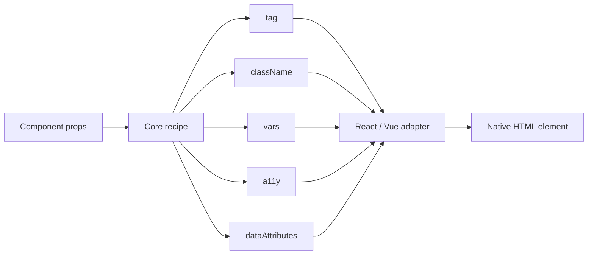
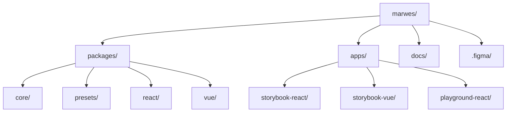
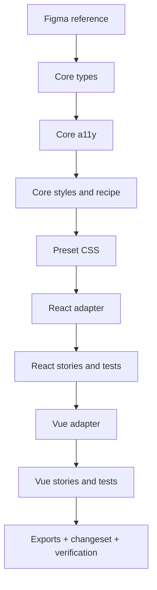
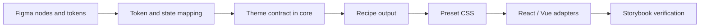

# Marwes Architecture

Marwes is a framework-agnostic component library built around a strict three-layer contract:

```text
core recipe → preset CSS → framework adapter
```

If you only read one document before changing code, read this one.

## System overview

```mermaid
graph TD
  Design[Figma design + local .figma cache]
  Core[@marwes-ui/core]
  Presets[@marwes-ui/presets]
  React[@marwes-ui/react]
  Vue[@marwes-ui/vue]
  Storybook[Storybook apps]
  Playground[apps/playground-react]

  Design --> Core
  Core --> Presets
  Core --> React
  Core --> Vue
  Presets --> React
  Presets --> Vue
  React --> Storybook
  Vue --> Storybook
  React --> Playground
```

## The layer contract

### 1. `@marwes-ui/core`
Owns the behavior contract.

It contains:
- public component types
- accessibility mapping
- state and variant logic
- theme contracts and CSS variable generation
- pure font and theme derivation helpers
- semantic registry definitions and semantic helper builders
- recipes that return `RenderKit` data

It must never contain:
- React code
- Vue code
- direct DOM access
- browser runtime side effects
- preset-specific CSS

### 2. `@marwes-ui/presets`
Owns the visual language.

It contains:
- preset defaults such as `firstEdition`
- static CSS files
- styling for stable `.mw-*` classes and `data-*` hooks

It must never contain:
- component behavior
- framework rendering logic

### 3. Framework adapters
`@marwes-ui/react` and `@marwes-ui/vue` are thin wrappers around core recipes.

They:
- call the core recipe
- spread typed a11y output onto native elements
- merge user props with `RenderKit` output
- apply provider-side runtime effects such as theme variable DOM sync and browser font loading
- expose framework-idiomatic component APIs

They must not:
- re-implement a11y rules already solved in core
- hardcode design tokens
- move business logic out of core

## RenderKit flow

A component recipe returns a `RenderKit` that adapters apply to the DOM.



Typical `RenderKit` shape:

```ts
{
  tag: "button" | "a" | "div" | "input"
  className: string
  vars: Record<string, string>
  a11y: Record<string, unknown>
  dataAttributes: Record<string, string>
}
```

The exact shape varies slightly by component, but the responsibilities stay the same.

## Repository map



## Key paths

| Area | Path |
|---|---|
| Core components | `packages/core/src/components/` |
| Theme engine | `packages/core/src/theme/` |
| Preset CSS | `packages/presets/src/firstEdition/` |
| React components | `packages/react/src/components/` |
| Vue components | `packages/vue/src/components/` |
| React stories | `apps/storybook-react/src/stories/` |
| Vue stories | `apps/storybook-vue/src/stories/` |
| Design cache | `.figma/` |
| Canonical docs | `docs/` |

## Component implementation flow

Every component should follow the same sequence.



Detailed file placement lives in [Adding Components](../guides/adding-components.md).

## Design-to-code flow

Use Figma as input, not as implementation.



See:
- [Figma to Marwes](../guides/figma-to-marwes.md)
- [Figma source index](../../.figma/INDEX.md)
- [Curated node reference](../../.figma/NODE_REFERENCE.md)

## How to work safely in this repo

### Add or change component behavior
1. Start in core
2. Update preset CSS
3. Update adapters
4. Update stories and tests
5. Update docs if the public contract changed

### Add a new design token
1. Update the theme contract in core
2. Update theme defaults / CSS variable emission
3. Update preset CSS usage
4. Verify in Storybook
5. Document the mapping in the Figma guide

### Add a new component
Follow [Adding Components](../guides/adding-components.md).

## Package boundaries

### `core`
- no framework imports
- no DOM access
- no preset CSS knowledge

### `presets`
- CSS only
- no runtime component logic

### `react` and `vue`
- consume `@marwes-ui/core`
- keep wrappers thin
- no duplicated a11y logic
- emit registry-defined semantic attributes for covered families

### apps
- may import from packages
- are never imported by packages

## Validation workflow

Before considering architecture work complete:

```bash
pnpm typecheck
pnpm lint
pnpm test
pnpm build
```

For focused work, run the relevant package or app commands instead.

## Related docs

- [Documentation index](../README.md)
- [Specification](./spec.md)
- [AI Metadata Protocol](./ai-metadata.md)
- [Governance](./governance.md)
- [Testing](./testing.md)
- [Adding Components](../guides/adding-components.md)
- [Figma to Marwes](../guides/figma-to-marwes.md)
