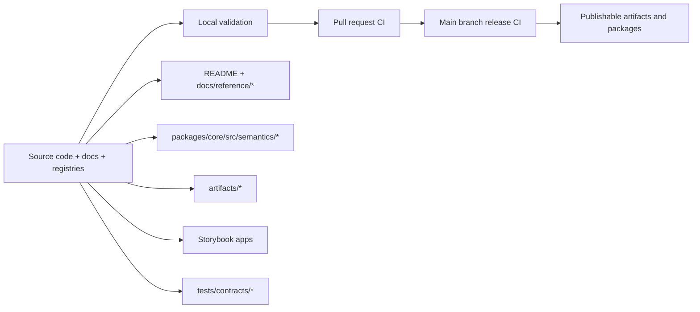
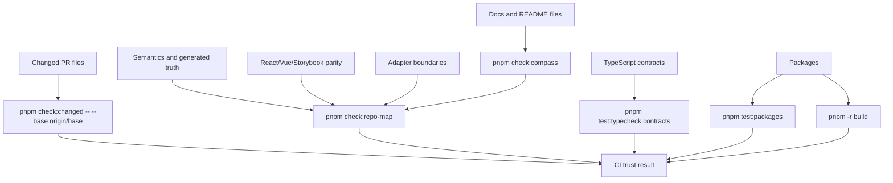
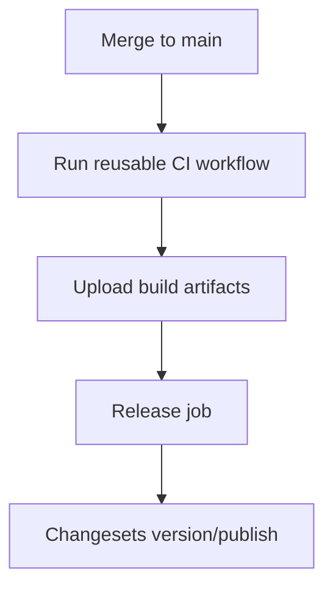

# Governance

Marwes treats trust as a product feature.

This document explains how local checks, CI gates, generated artifacts, and semantic contracts work together to keep the repository honest.

## Governance goal

The goal is simple:
- docs should match the shipped API
- React and Vue should stay meaningfully aligned
- semantic claims should come from source-owned registries
- generated artifacts should stay fresh
- release automation should enforce those rules, not just describe them
- accessibility claims should stay calibrated to what Marwes can actually prove

## Trust model



## Current governance gates

### Local trust gates

Primary local command:

```bash
pnpm validate:release
```

Current `pnpm validate:release` enforcement:
- `pnpm validate:security`
- `pnpm validate:packages`
- `pnpm check:repo-map`
- `pnpm exec biome check .`
- `pnpm test:storybook:a11y`

These gates protect:
- dependency audit health across full and production graphs
- package typecheck, build, and test health
- Compass docs-system integrity
- broken markdown links
- docs/API drift in package-facing docs
- semantic registry coherence
- stale generated trust artifacts
- stale generated component registry artifacts
- formatting and lint integrity
- React/Vue story and export parity expectations
- the first Storybook accessibility smoke set across React and Vue

For a narrower family pass, use:

```bash
pnpm validate:family <family>
```

For family story and accessibility-sensitive changes, use:

```bash
pnpm validate:family <family> --storybook
```

### CI trust gates

Reusable CI workflow:
- `.github/workflows/_ci.yml`

PR entrypoint:
- `.github/workflows/ci.yml`

Release entrypoint:
- `.github/workflows/release.yml`

The PR workflow enforces:
- `pnpm check:changed -- --base origin/${{ github.base_ref }}` as a changed-scope branch signal
- the reusable CI workflow below
- a changeset check for package changes

The reusable CI workflow now enforces:
- `pnpm exec biome check .`
- `pnpm check:repo-map` for docs, generated truth, parity, Storybook consistency, and adapter boundaries
- `pnpm -r typecheck`
- `pnpm test:typecheck:contracts`
- `pnpm test:packages`
- `pnpm -r build`

The release workflow runs the same reusable CI on `main` before publishing.

## Governance map



## Ownership boundaries

### Docs truth
Owns the public story.

Key files:
- `README.md`
- `packages/core/README.md`
- `packages/react/README.md`
- `packages/vue/README.md`
- `docs/reference/*`

Validation:
- `scripts/compass/check.mjs --rule=links`
- `scripts/compass/check.mjs --rule=api`

### Semantic truth
Owns the canonical vocabulary and family-purpose registry.

Key files:
- `packages/core/src/semantics/semantic-types.ts`
- `packages/core/src/semantics/semantic-attributes.ts`
- `packages/core/src/semantics/family-semantics.ts`
- `packages/core/src/semantics/purpose-semantics.ts`
- `packages/core/src/semantics/semantic-validators.ts`

Validation:
- `pnpm semantics:check`

### Artifact truth
Owns machine-readable repository truth for AI and audit flows.

Key files:
- `scripts/generate-trust-artifacts.ts`
- `artifacts/component-manifest.json`
- `artifacts/purpose-registry.json`
- `artifacts/framework-parity.json`
- `artifacts/design-provenance.json`

Validation:
- `pnpm artifacts:generate`
- `pnpm artifacts:check`

### Parity truth
Owns cross-framework alignment across public exports, family coverage, and story taxonomy.

Key files:
- `scripts/storybook-consistency.mjs`
- `apps/storybook-react/src/stories/`
- `apps/storybook-vue/src/stories/`
- `packages/react/src/components/`
- `packages/vue/src/components/`
- `tests/contracts/*`

Validation:
- `pnpm storybook:consistency`
- `pnpm test:storybook:a11y`
- `pnpm test:typecheck:contracts`
- targeted adapter and contract tests

## Release behavior

Release flow is intentionally conservative.



This means publication depends on the same trust gates used for normal CI, plus build artifact handoff.

## How to update the trust model safely

### When you change docs or package API
Run:

```bash
pnpm check:compass
pnpm check:compass
```

### When you change semantic families or purposes
Run:

```bash
pnpm semantics:check
pnpm artifacts:generate
pnpm artifacts:check
```

Also update:
- `docs/reference/ai-metadata.md`
- relevant contract tests under `tests/contracts/`

### When you add or rename React/Vue components or stories
Run:

```bash
pnpm storybook:consistency
pnpm test:storybook:a11y
pnpm test:typecheck:contracts
pnpm test:packages
```

## Accessibility governance status

Use [`docs/reference/accessibility.md`](./accessibility.md) as the canonical support-model document.
It explains:
- supported browser and assistive-technology assumptions
- current automation boundaries
- manual-review-heavy families and paths
- release expectations by risk tier

Current honest governance posture:
- shared contracts and family audits now make many shipped accessibility guarantees much clearer
- Storybook accessibility checks now have a first smoke-set gate via `pnpm test:storybook:a11y`, and that smoke set is part of `pnpm check`
- the repo is still not fully hard-gated across every story because only the promoted smoke set runs in this gate today
- manual review remains part of the trust model for higher-risk families and paths

## What this governance does not guarantee

It does not yet guarantee:
- full semantic formalization for every family in the repo
- exhaustive contract coverage for every component family
- perfect runtime parity for all edge cases across frameworks
- rich text editing correctness across all browser + assistive technology combinations
- successful remote CI execution from this local session

Those remain ongoing hardening work, not hidden assumptions.

## Practical working agreement

If a change affects public trust, update both the source of truth and the guardrail.

Examples:
- new semantic purpose -> update core semantics, docs, artifacts, and tests
- new export surface -> update package docs and parity coverage
- new story family -> update both frameworks and rerun consistency audit
- changed artifact shape -> update generator, committed artifacts, and docs that reference them
- manual-review-heavy widget behavior -> update automated contracts where possible and document the remaining manual-review boundary explicitly

## Command quick reference

```bash
pnpm check
pnpm check:compass
pnpm check:compass
pnpm semantics:check
pnpm artifacts:generate
pnpm artifacts:check
pnpm storybook:consistency
pnpm test:storybook:a11y
pnpm test:typecheck:contracts
pnpm test:packages
```

## Related docs

- [Documentation index](../README.md)
- [Accessibility support model](./accessibility.md)
- [Architecture](./architecture.md)
- [Testing](./testing.md)
- [AI Metadata Protocol](./ai-metadata.md)
- [Specification](./spec.md)
