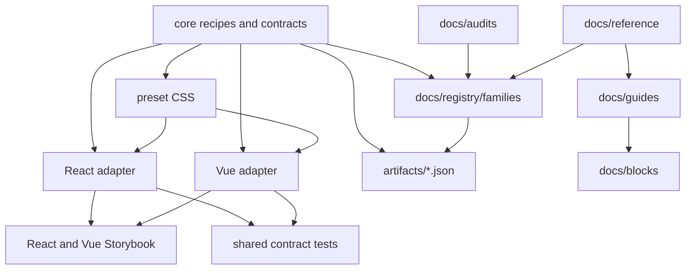

# Repo Map

Marwes has several useful but easy-to-mix-up threads. This map explains how they connect and what to update when one thread changes.

Use this as the first routing document after [Architecture](./architecture.md).

## Thread model

## Authority order

When two sources disagree, resolve the conflict in this order:

1. **Code and generated artifacts** — package source, tests, and `artifacts/*.json` are the highest-confidence current truth.
2. **Reference docs** — canonical architecture, testing, accessibility, governance, and spec surfaces.
3. **Registry family docs** — family-specific semantic, accessibility, Figma, and file topology knowledge.
4. **Audit docs** — evidence/history from a review pass. Valuable, but not the preferred current-status surface.
5. **Guides and blocks** — adoption and usage material. They should reflect package APIs, not create hidden APIs.
6. **Planning docs** — active work queues only. Promote decisions elsewhere when they become durable.

## Change matrix

| If you change... | Also inspect/update... | Minimum local gate |
|---|---|---|
| Core recipe, types, or a11y mapping | React adapter, Vue adapter, contracts, registry family, generated artifacts | `pnpm validate:family <family>` |
| Preset CSS for a family | React/Vue stories, visual states, preset CSS tests, registry notes | `pnpm validate:family <family>` |
| React adapter | Vue adapter parity, shared contracts, Storybook React/Vue coverage | `pnpm validate:family <family>` |
| Vue adapter | React adapter parity, shared contracts, Storybook React/Vue coverage | `pnpm validate:family <family>` |
| Purpose variant or semantic metadata | semantic registry, generated artifacts, registry family docs, docs/API drift check | `pnpm validate:docs` |
| Registry family docs | generated registry artifact and links | `pnpm registry:check && pnpm docs:links` |
| Audit findings | `docs/audits/status.md`, registry family status, reference accessibility docs if policy changed | `pnpm docs:links` |
| Public package API | README/package docs, guides, examples, changeset, typecheck, tests | `pnpm validate:packages` |
| Adoption guide | docs links and docs/API drift rules | `pnpm validate:docs` |
| Copyable block | block README, guide links, examples against current public API | `pnpm validate:docs` |
| Build or release plumbing | CI workflows, governance docs, release validation | `pnpm validate:release` |

## Blocks are not package APIs

`docs/blocks/**` contains copyable product patterns. A block may combine exported Marwes components, layout CSS, and app-owned markup, but it does not create a new Marwes API.

Promote a block idea into `packages/**` only after it repeats across real surfaces and has a clear package-level contract.

## Planning docs lifecycle

`docs/planning/**` should answer "what is actively being worked on?" It should not become the long-term truth source.

When planning work completes:

1. Move durable decisions into reference docs, registry docs, tests, or release notes.
2. Keep only active queues in planning.
3. Remove or archive implementation scaffolding when it stops guiding current work.

## Recommended routing

- New app builder: start with [Vite setup](../guides/vite.md), [Next.js setup](../guides/next.md), [Your First Marwes Screen](../guides/your-first-screen.md), then [Blocks](../blocks/README.md).
- Component contributor: start with [Architecture](./architecture.md), this repo map, [Adding Components](../guides/adding-components.md), then [Family Validation](./family-validation.md).
- Accessibility reviewer: start with [Accessibility support model](./accessibility.md), [Audit status](../audits/status.md), then the relevant family audit and registry entry.
- Release reviewer: start with [Governance](./governance.md), [Testing](./testing.md), and generated artifact checks.
