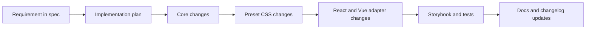

# Marwes Specification

This file is the canonical specification for Marwes.
If implementation, docs, or behavior diverge from this file, either the implementation is wrong or this spec must be updated explicitly.



## 1. Product Intent
Marwes is a component system that prioritizes:
- Strong defaults
- Small override API
- Consistent accessibility behavior
- Framework-agnostic core logic

## 2. Current Status (2026-04-09)
- Repository shape: pnpm monorepo with `core`, `presets`, `react`, `vue`, Storybook apps, and a React playground
- Adapter support: React and Vue are both first-class packages
- Current focus: keep docs, Storybook coverage, and implementation aligned with the V3 Figma component set
- Component family status is tracked through the registry docs and generated registry artifacts.

## 3. Core Principles
- Simple surface API, strong internal consistency
- Core is framework agnostic (no React, no Vue, no browser runtime behavior)
- Presets are static CSS (`.mw-*` classes and `--mw-*` vars)
- Accessibility behavior is authored in core
- Semantic metadata is source-owned in core for covered families
- Strict TypeScript (no `any`)

## 4. Architecture Contract
Marwes uses three layers:
1. `@marwes-ui/core`
   - Theme contract + normalization
   - Component recipes
   - A11y mappings
2. `@marwes-ui/presets`
   - Static CSS and preset defaults
3. Framework adapters (`@marwes-ui/react`, `@marwes-ui/vue`)
   - Thin adapters that apply core RenderKit output
   - Own browser runtime effects such as provider theme DOM sync and font loading

### RenderKit Contract
Core recipes return:
```ts
{
  tag: string,
  className: string,
  vars: Record<string, string>,
  a11y: Record<string, unknown>,
  policy?: {
    blockClick?: boolean,
    preventDefault?: boolean,
  }
}
```

Adapter requirements:
- Render `tag`
- Apply `className`
- Apply `style={vars}`
- Apply typed `a11y`
- Respect `policy`
- Emit registry-defined semantic attributes for covered families

## 5. Active Scope
### In Scope
- Core theme system and preset CSS
- React and Vue adapter parity for shipped components
- Storybook and playground validation
- Continued alignment with the synced V3 Figma references

### Out of Scope
- Replacing the three-layer architecture
- Runtime CSS-in-JS
- Pushing framework logic down into core

## 6. Spec-Driven Development Workflow (Required)
Every non-trivial change must follow this sequence:

1. **Spec first**
   - Add or update requirement(s) in this file.
2. **Acceptance criteria**
   - Each requirement includes testable outcomes.
3. **Implementation mapping**
   - Identify impacted files across core, presets, React, and Vue.
4. **Validation**
   - Typecheck/build and targeted behavior checks.
5. **Documentation + changelog**
   - Update relevant docs when behavior/API changes.
6. **Decision capture**
   - Record architecture/product tradeoffs in Section 9.

## 7. Requirement Template (Use For New Work)
Copy this block when adding a feature or behavior:

```md
### REQ-XXX: <short name>
- Problem:
- Scope:
- Non-goals:
- Acceptance criteria:
  - [ ] AC1 ...
  - [ ] AC2 ...
- Validation:
  - Unit:
  - Integration/manual:
- Files expected to change:
```

## 8. Traceability Matrix (Use In PRs)
Keep this mapping in PR description (or add temporarily to this file for major work):

| Requirement | Core files | Preset files | Adapter files | Tests/Verification |
|---|---|---|---|---|
| REQ-XXX | `...` | `...` | `...` | `...` |

## 9. Open Decisions
- DEC-001: Should Select stay native only by default?
  - Status: Resolved (see Decision Log)
  - Lean: Native-first by default
- DEC-002: Should value controls standardize on `onValueChange` at core boundaries?
  - Status: Open
  - Lean: Yes
- DEC-003: Preset naming after v1 (`firstEdition` keep or version by era)?
  - Status: Open
  - Lean: Keep for v0.x
- DEC-004: Vue adapter event API should be React-parity only or dual (Vue emits + parity callbacks)?
  - Status: Resolved (see Decision Log)
  - Lean: Dual support
- DEC-005: Where should adapter-shared non-rendering logic live?
  - Status: Resolved (see Decision Log)
  - Lean: Extend `@marwes-ui/core`
- DEC-006: Should rich text formatting extend `Textarea` / `TextareaField` or ship as a separate input-family component pair?
  - Status: Resolved (see Decision Log)
  - Lean: Separate `RichText` + `RichTextField`

## 10. Decision Log
Use this format when resolving an open decision:

```md
### DEC-00X - <title>
- Date: YYYY-MM-DD
- Decision:
- Rationale:
- Impacted docs/files:
```

## 11. Constraints
- Browser support: modern evergreen browsers
- Accessibility baseline: WCAG 2.1 AA
- Core runtime dependencies: zero
- Styling contract: static CSS + CSS variables

## 11.1 Semantic protocol requirements
- Canonical semantic vocabulary is defined in `@marwes-ui/core`
- Covered families must not invent divergent React/Vue semantic values
- `data-component` and purpose-level semantics are part of the public contract for covered families
- Family-local data attributes may exist, but are not automatically canonical protocol fields
- The canonical reference for semantic metadata is `docs/reference/ai-metadata.md`

## 12. Component Requirements

> Requirement entries are kept as a traceable record of why work was started. Some entries describe an original problem statement for work that is now complete. Use the acceptance checkboxes and decision log to understand current status.

### REQ-VUE-001: Vue Adapter Package (`@marwes-ui/vue`)
- **Problem**: Marwes core and presets are framework-agnostic, but only a React adapter exists, which blocks Vue users from consuming the same components and behaviors.
- **Scope**:
  - Add a new `@marwes-ui/vue` package under `packages/`
  - Implement a Vue provider/composables layer equivalent to React (`MarwesProvider`, `useSystem`, `useTheme`)
  - Implement Vue components for the current React export surface (atoms + molecules + semantic variants)
  - Keep core recipes/a11y as the source of truth (no duplicated a11y logic in Vue)
  - Support Vue-idiomatic events/model binding while preserving parity callback props where practical
- **Non-goals**:
  - Rewriting `@marwes-ui/core` recipes around Vue-specific types
  - Replacing `@marwes-ui/react` or changing its public API semantics
  - Introducing a runtime styling system or Vue-only preset CSS
- **Acceptance criteria**:
  - [x] `packages/vue` builds as `@marwes-ui/vue` with ESM + types and publishes from `dist/`
  - [x] Vue provider/composables use `createSystem`/`switchMode` from core and support light/dark mode
  - [x] Vue adapter exports the same component set currently exported by `@marwes-ui/react` for in-scope components
  - [x] Vue adapter renders core RenderKit outputs (className, vars, typed a11y) without re-implementing core a11y logic
  - [x] Vue adapter supports idiomatic Vue event usage (`emits` / `v-model` where applicable) and parity callbacks (`onValueChange`, `onCheckedChange`)
  - [x] React adapter behavior remains unchanged for existing stories/manual checks
- **Validation**:
  - Unit: TypeScript typecheck passes for `packages/vue`
  - Integration/manual: Verify representative components in Vue Storybook (button, input, checkbox, divider, field)
- **Files expected to change**:
  - New package: `packages/vue/*`
  - Root config: `tsconfig.base.json`, `package.json` scripts if needed
  - Shared logic: `packages/core/src/*` (adapter-independent helpers only)
  - Docs/changelog: package README/CHANGELOG and root docs as needed

### REQ-VUE-002: Vue Storybook Parity (`apps/storybook-vue`)
- **Problem**: There is no Vue Storybook to validate and demonstrate the Vue adapter with the same preset/theme behavior used in React Storybook.
- **Scope**:
  - Add `apps/storybook-vue` using `@storybook/vue3-vite`
  - Mirror local workspace aliasing used in React Storybook for `@marwes-ui/core`, `@marwes-ui/presets`, and adapter package source files
  - Add a Vue preview decorator that wraps stories in `MarwesProvider` and supports theme mode toolbar switching
  - Create a representative initial story set, then expand toward parity with React Storybook
- **Non-goals**:
  - Exact 1:1 file duplication of every React story before the app is functional
  - Replacing React Storybook as the primary reference during migration
- **Acceptance criteria**:
  - [x] `apps/storybook-vue` runs locally and renders Vue adapter components using `firstEdition` preset CSS
  - [x] Theme toolbar switches between light and dark mode using Vue `MarwesProvider`
  - [x] Vue Storybook includes smoke stories for representative atoms/molecules
  - [x] Storybook local aliases resolve package source code (not only published `dist`)
  - [x] Custom RenderKit debug panel is reusable or functionally matched for Vue stories
- **Validation**:
  - Integration/manual: `storybook dev` launches and representative stories render correctly
  - Build: `storybook build` succeeds for Vue Storybook app
- **Files expected to change**:
  - New app: `apps/storybook-vue/*`
  - Shared Storybook helpers/config (if extracted)
  - Root workspace config (if additional scripts/aliases are needed)

### REQ-VUE-003: Shared Adapter/Story Logic Extraction (Duplication Reduction)
- **Problem**: Copying React adapter and stories directly into Vue will create maintenance-heavy duplication for logic that is framework-independent.
- **Scope**:
  - Extract adapter-independent derivation logic into `@marwes-ui/core` (e.g., id suffix naming, `aria-describedby` merging, field state derivation, data-only semantic variant prop composition)
  - Extract reusable Storybook fixtures/config data where framework-neutral (args, argTypes, common parameters, icon option lists)
  - Keep rendering, framework lifecycle hooks, and framework-specific story render functions in adapter/app layers
- **Non-goals**:
  - Creating a generic cross-framework rendering abstraction
  - Moving React/Vue component rendering into core
- **Acceptance criteria**:
  - [x] New shared helpers in core are framework-agnostic and contain no React/Vue imports
  - [x] React and Vue adapters both consume shared helpers for at least one molecule/variant flow
  - [x] Shared Storybook fixture/config extraction reduces repeated args/argTypes definitions for equivalent stories
  - [x] Shared extraction does not change visual output or a11y behavior of React stories
- **Validation**:
  - Unit/type: Shared helpers typecheck in core and adapter consumers typecheck
  - Integration/manual: React and Vue story parity check for at least one shared fixture-backed component
- **Files expected to change**:
  - `packages/core/src/*` (new helper modules + exports)
  - `packages/react/src/*` (consuming helpers)
  - `packages/vue/src/*` (consuming helpers)
  - `apps/storybook-react/src/*` and `apps/storybook-vue/src/*` (shared story fixtures if extracted)

### REQ-INPUT-RT-001: RichText + RichTextField
- **Figma reference**: use `Text field` (`1364:7662`) and `Text area` (`1364:7696`) as the current visual baselines from `.figma/marwes/components/text-field.json` and `.figma/marwes/components/text-area.json` until a dedicated rich-text node is added
- **Problem**: Marwes has plain-text multiline controls (`Textarea`, `TextareaField`) but no Input-family component for inline formatting such as bold, italic, and underline.
- **Scope**:
  - Add a new Input-family atom `RichText`
  - Add a new Input-family molecule `RichTextField`
  - Keep `Textarea` and `TextareaField` as plain-text controls
  - Support toolbar actions for `bold`, `italic`, and `underline`
  - Support controlled and uncontrolled usage
  - Support disabled, read-only, invalid, helper-text, and error states
  - Use a constrained HTML string as the MVP value format
  - Add framework-agnostic core contracts and shared a11y helpers in `@marwes-ui/core`
  - Add React and Vue adapters, Storybook stories/docs, contracts, exports, and preset CSS
- **Non-goals**:
  - Retrofitting native `Textarea` into a rich text editor
  - Shipping links, lists, images, tables, headings, alignment, or arbitrary embedded media in MVP
  - Storing arbitrary unsanitized HTML as part of the public contract
  - Adding editor runtime dependencies to `@marwes-ui/core`
- **Acceptance criteria**:
  - [x] `RichText` ships as a new atom under the Input family in core, React, Vue, and Storybook
  - [x] `RichTextField` ships as a new molecule under the Input family in React, Vue, and Storybook
  - [x] `Textarea` and `TextareaField` remain plain-text components with unchanged conceptual scope
  - [x] MVP formatting actions support `bold`, `italic`, and `underline`
  - [x] The public value contract is an HTML string with a small, documented supported subset
  - [x] Core exposes rich-text types/recipe metadata and a dedicated helper for field labelling/description wiring
  - [x] React and Vue adapters stay in parity for props, value flow, disabled/read-only behavior, and toolbar actions
  - [x] Storybook titles follow the Input taxonomy: `Input/Atom/RichText` and `Input/Molecule/RichTextField`
  - [x] Input Introduction docs in both Storybooks explain when to use `RichText` / `RichTextField` vs `Textarea` / `TextareaField`
  - [x] Shared contracts cover atom behavior and field-level accessibility expectations across both adapters
- **Validation**:
  - Unit: Core types/recipes typecheck; React/Vue adapter tests cover formatting actions and value flow
  - Integration/manual: Verify React and Vue Storybook stories for basic, helper, error, disabled, read-only, and controlled states
- **Files expected to change**:
  - Core: `packages/core/src/components/atoms/input/rich-text-*`, `packages/core/src/shared/field-helpers.ts`, `packages/core/src/components/atoms/input/index.ts`, `packages/core/src/components/atoms/index.ts`, `packages/core/src/index.ts`
  - Presets: `packages/presets/src/firstEdition/rich-text.css`, optional `packages/presets/src/firstEdition/molecules/rich-text-field.css`, `packages/presets/src/firstEdition/styles.css`
  - React: `packages/react/src/components/input/rich-text.tsx`, `packages/react/src/components/input/rich-text-field.tsx`, adapter tests, package exports, and adapter dependencies
  - Vue: `packages/vue/src/components/input/rich-text.ts`, `packages/vue/src/components/input/rich-text-field.ts`, adapter tests, package exports, and adapter dependencies
  - Storybook: React/Vue input stories, `Introduction.mdx`, taxonomy tests, intro-docs tests
  - Shared tests: `tests/contracts/rich-text.contract.ts`, `tests/contracts/rich-text-field.contract.ts`
  - Docs/registry: `docs/registry/README.md`, `docs/registry/families/input/README.md`

### REQ-DIV-001: Divider Component
- **Figma reference**: node-id=1-932
- **Problem**: Need a semantic separator component for visually dividing content sections
- **Scope**: 
  - Horizontal and vertical orientation support
  - 7 size variants matching Figma spec (1px, 8px, 16px, 32px, 48px, 64px, 80px)
  - Semantic HTML using `<hr>` element
  - Built-in spacing based on divider size
  - Light and dark mode support via theme colors
- **Non-goals**:
  - Text-embedded dividers ("or" dividers) in v0.1
  - Custom colors beyond theme tokens in v0.1
  - Animated dividers
- **Acceptance criteria**:
  - [x] Core recipe produces RenderKit with correct className, vars, and a11y props
  - [x] Size API uses semantic names (xxs, xs, sm, md, lg, xl, xxl) mapped to pixel values
  - [x] Orientation prop supports "horizontal" (default) and "vertical"
  - [x] Generates aria-orientation attribute based on orientation
  - [x] Uses theme.color.border for divider color
  - [x] Preset CSS implements all 7 size variants with correct dimensions
  - [x] React adapter applies RenderKit to semantic `<hr>` element
  - [x] Storybook story demonstrates all sizes and both orientations
- **Validation**:
  - Unit: TypeScript typecheck passes, build completes
  - Integration/manual: Visual verification in Storybook against Figma designs
- **Files expected to change**:
  - Core: `packages/core/src/components/atoms/divider/` (types, recipe, index)
  - Core exports: `packages/core/src/components/atoms/index.ts`
  - Preset: `packages/presets/src/firstEdition/divider.css`
  - Preset imports: `packages/presets/src/firstEdition/styles.css`
  - React: `packages/react/src/components/divider.tsx`
  - React exports: `packages/react/src/index.ts`
- Stories: `apps/storybook-react/src/stories/divider/divider.stories.tsx`

**Design decisions**:
- Size mapping: xxs=1px, xs=8px, sm=16px, md=32px, lg=48px, xl=64px, xxl=80px
- Spacing: Built-in via CSS based on size (larger dividers = more surrounding space)
- Element: `<hr>` for semantic meaning and native accessibility
- Orientation: Explicit prop for better API clarity and accessibility

### REQ-SKELETON-001: Skeleton Atom Foundation
- **Figma reference**:
  - `.figma/marwes/pages/skeleton/skeleton_1921-34816.json`
  - `.figma/marwes/pages/-v2-skeleton/skeleton_1921-34816.json`
  - V3 checklist note: `.figma/marwes/pages/-v3-components-checklist/must-have-skeleton-needed-as-component-in-figma-though-nice_1896-33145.json`
- **Problem**: The synced component backlog marks Skeleton as a must-have loading placeholder, but the repo has no base Skeleton atom across core, presets, adapters, and Storybook.
- **Scope**:
  - Add a base `Skeleton` atom to core, presets, React, Vue, and Storybook
  - Support the three available synced shapes: `text`, `circular`, and `rectangular`
  - Match the local Figma baseline dimensions: text 120×12, circular 40×40, rectangular 120×120
  - Use the local Figma 4% black overlay as a semantic theme-relative preset color
  - Support custom width, height, radius, and `pulse` / `wave` / `none` animation modes
  - Keep skeletons decorative by default, but support standalone accessible status usage through `ariaLabel`
- **Non-goals**:
  - Shipping layout-specific skeleton wrappers in this change
  - Creating new raster or icon assets
  - Treating the V2/MUI-derived Skeleton page as a full V3 design-system component source beyond the baseline shape data
- **Acceptance criteria**:
  - [x] `Skeleton` ships as a standalone atom with stable variant, dimension, radius, and animation contracts in core, React, and Vue
  - [x] Preset CSS renders text, circular, and rectangular placeholders with theme-relative fill and loading animation hooks
  - [x] The atom is decorative by default and exposes accessible standalone status mode when `ariaLabel` is provided
  - [x] React and Vue Storybook document the atom and cover Figma shapes, custom dimensions, animations, and composition examples
- **Validation**:
  - Unit: Core recipe tests plus React/Vue adapter contract tests pass
  - Integration/manual: Verify React Skeleton stories against the synced Figma Skeleton page
- **Files expected to change**:
  - Core: `packages/core/src/components/atoms/skeleton/*`, `packages/core/src/components/atoms/index.ts`, `packages/core/src/index.ts`, `packages/core/src/storybook/storybook-fixtures.ts`
  - Presets: `packages/presets/src/firstEdition/skeleton.css`, `packages/presets/src/firstEdition/styles.css`, `packages/presets/test/skeleton-css-contract.test.ts`
  - React: `packages/react/src/components/skeleton/*`, `packages/react/src/index.ts`
  - Vue: `packages/vue/src/components/skeleton/*`, `packages/vue/src/index.ts`
  - Storybook: `apps/storybook-react/src/stories/skeleton/*`, `apps/storybook-vue/src/stories/skeleton/*`
  - Shared tests/docs: `tests/contracts/skeleton.contract.ts`, `docs/reference/spec.md`, `docs/guides/figma-to-marwes.md`, `.changeset/*`

### REQ-STAT-TILE-001: Stat Tile Atom Foundation
- **Figma source**:
  - `.figma/marwes/components/stat-tile.json`
  - `.figma/marwes/components/partsstat-tiletrend.json`
  - `.figma/marwes/pages/-v2-stat-tile/stat-tile_1411-6857.json`
  - `.figma/marwes/pages/-v2-stat-tile/partsstat-tiletrend_2695-25437.json`
- **Problem**: The synced V2 Stat Tile exists in Figma, but the repo had no first-class metric tile API across core, presets, React, Vue, and Storybook.
- **In scope**:
  - Add a base `StatTile` component to core, presets, React, Vue, and Storybook
  - Support label, value, optional subtitle, optional trend value, positive/negative trend direction, and neutral/brand/success/warning/danger tones
  - Preserve the Figma baseline geometry: 164px tile width, 20px padding, 8px vertical spacing, 12px radius, and compact 20px trend pill
  - Generate stable `data-component=stat-tile`, `data-tone`, and trend metadata for auditable output
- **Out of scope**:
  - Charting, sparkline, loading, or responsive dashboard-grid behavior
  - Locale-aware number/currency formatting inside the component
  - Treating the V2 Stat Tile source as a broader metrics taxonomy beyond the shipped tile and trend states
- **Acceptance criteria**:
  - [x] `StatTile` ships as a standalone component with stable tone and trend contracts in core, React, and Vue
  - [x] Preset CSS maps the synced neutral, brand, success, warning, and danger treatments
  - [x] React and Vue Storybook each include `StatTile/Introduction` and `StatTile/Atom` stories
  - [x] Shared contract tests verify DOM tag, metadata, content, tone, and accessible trend labels
- **Validation**:
  - Unit/contract: `packages/core/test/recipes/stat-tile.test.ts`, `packages/presets/test/stat-tile-css-contract.test.ts`, `tests/contracts/stat-tile.contract.ts`
  - Integration/manual: Verify React Stat Tile Storybook tone matrix against the synced Figma Stat Tile page
- **Affected surfaces**:
  - Core: `packages/core/src/components/atoms/stat-tile/*`, `packages/core/src/components/atoms/index.ts`, `packages/core/src/index.ts`, `packages/core/src/storybook/storybook-fixtures.ts`
  - Presets: `packages/presets/src/firstEdition/stat-tile.css`, `packages/presets/src/firstEdition/styles.css`, `packages/presets/test/stat-tile-css-contract.test.ts`
  - React: `packages/react/src/components/stat-tile/*`, `packages/react/src/index.ts`
  - Vue: `packages/vue/src/components/stat-tile/*`, `packages/vue/src/index.ts`
  - Storybook: `apps/storybook-react/src/stories/stat-tile/*`, `apps/storybook-vue/src/stories/stat-tile/*`

### REQ-SPINNER-001: Spinner Atom Foundation
- **Figma reference**:
  - `.figma/marwes/components/spinnerclassic.json`
  - `.figma/marwes/components/spinnerring.json`
  - `.figma/marwes/components/spinnerdual.json`
  - `.figma/marwes/components/spinnerdots-round.json`
  - `.figma/marwes/components/spinnerdots-square.json`
  - `.figma/marwes/components/spinnerlines.json`
  - `.figma/marwes/components/spinnercross.json`
  - `.figma/marwes/pages/-spinner/-spinner_1737-10635.json`
  - `.figma/marwes/pages/-spinner/-spinner-dark_1780-1543.json`
  - `.figma/marwes/pages/cover/spinnerdots-round_1825-30933.json`
  - `.figma/marwes/components/newspinner.json`
  - `.figma/marwes/components/spinner-animation.json`
- **Problem**: The synced V3 Figma library includes a dedicated Spinner family, but the repo has no base Spinner atom that adapters and future semantic wrappers can reuse.
- **Scope**:
  - Add a base `Spinner` atom to core, presets, React, Vue, and Storybook
  - Support the seven synced Spinner visual styles: `classic`, `ring`, `dual`, `dots-round`, `dots-square`, `lines`, and `cross`
  - Support the synced spinner scale `16`, `24`, `32`, and `40` via the `xs`/`sm`/`md`/`lg` API
  - Support custom pixel sizing for larger empty-state or dashboard loading treatments
  - Keep the atom decorative by default, but support standalone accessible status usage through `ariaLabel`
  - Keep future semantic/contextual spinner wrappers out of scope for this change
- **Non-goals**:
  - Shipping button-specific or empty-state-specific wrapper components in this change
  - Adding progress percentages, determinate loading, or skeleton behavior
  - Adding theme-level spinner token APIs beyond the atom CSS-variable contract
- **Acceptance criteria**:
  - [x] `Spinner` ships as a standalone atom with stable `variant` and `size` contracts in core, React, and Vue
  - [x] The atom covers the seven synced Spinner visual styles from the Figma showcase
  - [x] The spinner size API covers the synced 16/24/32/40px scale and also accepts explicit pixel sizes
  - [x] Preset CSS provides the loading animation shell plus light and dark indicator defaults aligned with the synced designs
  - [x] The atom is decorative by default and exposes an accessible standalone status mode when `ariaLabel` is provided
  - [x] React and Vue Storybook document the atom and cover style, size, and composition examples
- **Validation**:
  - Unit: Core recipe tests plus React/Vue adapter contract tests pass
  - Integration/manual: Verify React and Vue Spinner stories against the synced Figma Spinner page in light and dark mode
- **Files expected to change**:
  - Core: `packages/core/src/components/atoms/spinner/*`, `packages/core/src/components/atoms/index.ts`, `packages/core/src/index.ts`, `packages/core/test/recipes/spinner.test.ts`, `packages/core/src/storybook/storybook-fixtures.ts`
  - Presets: `packages/presets/src/firstEdition/spinner.css`, `packages/presets/src/firstEdition/styles.css`, `packages/presets/test/spinner-css-contract.test.ts`
  - React: `packages/react/src/components/spinner/*`, `packages/react/src/index.ts`
  - Vue: `packages/vue/src/components/spinner/*`, `packages/vue/src/index.ts`
  - Storybook: `apps/storybook-react/src/stories/spinner/*`, `apps/storybook-vue/src/stories/spinner/*`
  - Shared tests/docs: `tests/contracts/spinner.contract.ts`, `docs/reference/spec.md`, `docs/guides/figma-to-marwes.md`, `.changeset/*`

### REQ-SPINNER-002: Spinner Context Variants + Button Loading Integration
- **Figma reference**:
  - `.figma/marwes/pages/-spinner/-spinner_1737-10635.json`
  - `.figma/marwes/pages/-spinner/-spinner-dark_1780-1543.json`
  - Button usage row from the synced Spinner page (classic 16px loading treatment)
  - Empty-state row from the synced Spinner page (dots-round 40px treatment)
- **Problem**: The base Spinner atom now exists, but the library still needs the first context-specific compositions and the existing Button loading prop should use the synced spinner treatment instead of only toggling accessibility state.
- **Scope**:
  - Wire `Button loading` to render a prepended `ButtonSpinner`
  - Hide button icon affordances while loading and keep the button disabled/busy
  - Add `ButtonSpinner` and `EmptyStateSpinner` purpose wrappers in React and Vue
  - Document the purpose wrappers in Storybook with dedicated purpose stories
- **Non-goals**:
  - Adding molecule-level loading panels or full-page loading layouts
  - Expanding button API beyond the existing `loading` prop
  - Adding new core spinner variants beyond the existing atom contract
- **Acceptance criteria**:
  - [x] `Button loading` renders the synced classic spinner treatment before button content in React and Vue
  - [x] Button loading hides icon affordances and preserves disabled/busy behavior across both adapters
  - [x] `ButtonSpinner` and `EmptyStateSpinner` ship as thin purpose wrappers in React and Vue
  - [x] Purpose wrappers attach stable semantic metadata and Storybook purpose coverage
- **Validation**:
  - Unit: React/Vue button tests and spinner purpose-wrapper tests pass
  - Integration/manual: Verify Button loading plus Spinner purpose stories in React and Vue Storybook
- **Files expected to change**:
  - React: `packages/react/src/components/button/*`, `packages/react/src/components/spinner/*`, `packages/react/src/index.ts`
  - Vue: `packages/vue/src/components/button/*`, `packages/vue/src/components/spinner/*`, `packages/vue/src/index.ts`
  - Storybook: `apps/storybook-react/src/stories/spinner/*`, `apps/storybook-vue/src/stories/spinner/*`, existing button stories as needed
  - Shared docs/tests: `tests/contracts/button.contract.ts`, `docs/reference/spec.md`, `.changeset/*`

### REQ-AVATAR-001: Avatar Atom
- **Figma reference**:
  - `.figma/marwes/components/avatar.json`
  - `.figma/marwes/pages/-avatar/-avatar_1574-27460.json`
  - `.figma/marwes/pages/-avatar/-avatar-dark_1574-27570.json`
- **Problem**: The synced V3 Figma library includes Avatar as a top-level family, but the repo has no base Avatar atom yet.
- **Scope**:
  - Add a base `Avatar` atom to core, presets, React, Vue, and Storybook
  - Support the current Figma base variants: `small`, `medium`, `large`
  - Support the current Figma content types: `initials`, `icon`, `image`
  - Use a user icon fallback when no initials or image source is provided
  - Keep the core contract framework-agnostic and let adapters render the actual inner content
- **Non-goals**:
  - Shipping `Avatar badge` in this change
  - Shipping `Avatar group` in this change
  - Adding upload, editing, or other interactive avatar behavior
- **Acceptance criteria**:
  - [x] Core recipe returns stable classnames and data attributes for avatar size and resolved content type
  - [x] Base avatar supports initials, icon fallback, and image content across all three sizes
  - [x] Preset CSS matches the current light and dark Figma treatments for initials, icon, and image shells
  - [x] React and Vue adapters render the same visual and accessibility contract from the core recipe
  - [x] Storybook documents the atom and shows all size × type combinations in light and dark mode
- **Validation**:
  - Unit: Core, React, and Vue typecheck passes; cross-adapter avatar contracts pass
  - Integration/manual: React and Vue Storybook avatar stories match the current synced Figma references
- **Files expected to change**:
  - Core: `packages/core/src/components/atoms/avatar/*`, `packages/core/src/components/atoms/index.ts`, `packages/core/src/index.ts`
  - Presets: `packages/presets/src/firstEdition/avatar.css`, `packages/presets/src/firstEdition/styles.css`
  - React: `packages/react/src/components/avatar/*`, `packages/react/src/index.ts`
  - Vue: `packages/vue/src/components/avatar/*`, `packages/vue/src/index.ts`
  - Storybook: `apps/storybook-react/src/stories/avatar/*`, `apps/storybook-vue/src/stories/avatar/*`
  - Shared tests: `tests/contracts/avatar.contract.ts`
  - Docs/changelog: `docs/registry/families/avatar/README.md`, `.changeset/*`

### REQ-AVATAR-002: Avatar Molecules
- **Figma reference**:
  - `.figma/marwes/pages/-avatar/component-container_1574-27051.json`
  - `.figma/marwes/pages/-avatar/component-container_1574-27408.json`
  - `.figma/marwes/pages/-avatar/-avatar_1574-27460.json`
  - `.figma/marwes/pages/-avatar/-avatar-dark_1574-27570.json`
  - `.figma/marwes/pages/cover/avatar-group_1825-30447.json`
- **Problem**: The synced Avatar family includes two composition patterns beyond the base atom: the online presence badge and the stacked avatar group with overflow counter.
- **Scope**:
  - Add `AvatarBadge` as a molecule built on top of `Avatar`
  - Add `AvatarGroup` as a molecule built on top of `Avatar`
  - Match the current Figma online-indicator treatment and stacked medium-avatar group treatment
  - Keep these compositions in adapters and presets while reusing the existing Avatar atom contract
- **Non-goals**:
  - Inventing semantic avatar purpose wrappers in this change
  - Adding interactive menu, upload, edit, or click behavior to avatar molecules
  - Expanding AvatarGroup beyond the current stacked medium-avatar layout from Figma
- **Acceptance criteria**:
  - [x] `AvatarBadge` renders the online indicator in light and dark mode across the Figma avatar sizes
  - [x] `AvatarGroup` renders the overlapping medium-avatar pattern with an optional overflow counter
  - [x] React and Vue expose matching molecule APIs and Storybook coverage
  - [x] Package exports include the new molecules
- **Validation**:
  - Unit: React/Vue molecule tests and barrel export tests pass
  - Integration/manual: React and Vue Storybook molecule stories match the synced Figma references
- **Files expected to change**:
  - Presets: `packages/presets/src/firstEdition/avatar.css`
  - React: `packages/react/src/components/avatar/*`, `packages/react/src/index.ts`
  - Vue: `packages/vue/src/components/avatar/*`, `packages/vue/src/index.ts`
  - Storybook: `apps/storybook-react/src/stories/avatar/*`, `apps/storybook-vue/src/stories/avatar/*`
  - Shared tests: `tests/contracts/avatar-badge.contract.ts`, `tests/contracts/avatar-group.contract.ts`

### REQ-AVATAR-003: Avatar Purpose Components
- **Problem**: The base Avatar atom and Figma molecules now exist, but the library still needs semantic wrappers for common avatar intents so product code can express meaning directly and attach stable AI-friendly metadata.
- **Scope**:
  - Add purpose wrappers for base profile identity, online presence, and grouped team/member clusters
  - Keep wrappers thin and build them on top of `Avatar`, `AvatarBadge`, and `AvatarGroup`
  - Expose the same purpose wrapper surface in React, Vue, and Storybook
- **Non-goals**:
  - Adding new visual states beyond the existing avatar atom and molecules
  - Adding interaction logic such as menus, upload/edit flows, or presence state switching
- **Acceptance criteria**:
  - [x] `ProfileAvatar` wraps `Avatar` and sets stable semantic metadata
  - [x] `PresenceAvatar` wraps `AvatarBadge` and sets stable semantic metadata
  - [x] `TeamAvatarGroup` wraps `AvatarGroup` and sets stable semantic metadata
  - [x] React and Vue exports, tests, and Storybook purpose stories stay in parity
- **Validation**:
  - Unit: React/Vue purpose wrapper tests and barrel export tests pass
  - Integration/manual: Storybook purpose stories render correctly in React and Vue
- **Files expected to change**:
  - React: `packages/react/src/components/avatar/*`, `packages/react/src/index.ts`
  - Vue: `packages/vue/src/components/avatar/*`, `packages/vue/src/index.ts`
  - Storybook: `apps/storybook-react/src/stories/avatar/*`, `apps/storybook-vue/src/stories/avatar/*`
  - Docs/changelog: `docs/reference/spec.md`, `.changeset/*`

### REQ-TAB-001: Tab Family Accessibility Contract
- **Problem**: Marwes already ships `Tab`, `TabGroup`, `TabPanel`, and purpose-tab wrappers, but the accessibility contract for keyboard activation, disabled-tab behavior, and panel wiring has lived mostly in implementation and Storybook docs rather than the canonical spec.
- **Scope**:
  - Treat `TabGroup` as the canonical coordinated tabs primitive in React and Vue
  - Keep raw `Tab` as the low-level atom for bespoke tablists
  - Standardize automatic activation for `TabGroup` keyboard navigation
  - Standardize disabled-tab skipping and first-enabled fallback resolution
  - Standardize tablist naming and tab-to-panel wiring expectations
  - Add shared React/Vue contract coverage for the family
- **Non-goals**:
  - Adding vertical tab orientation or remapping arrow-key behavior in this pass
  - Adding lazy panel mounting, closable tabs, drag-reorder, or overflow menus
  - Turning the raw `Tab` atom into a fully managed tabs solution on its own
- **Acceptance criteria**:
  - [x] `TabGroup` exposes a named `tablist` via visible label text when `label` is present, or via `ariaLabel` when no visible label is present
  - [x] Each tab wires `aria-controls` to its matching `tabpanel`, and each panel wires `aria-labelledby` back to its controlling tab
  - [x] `TabGroup` uses automatic activation: `ArrowLeft`, `ArrowRight`, `Home`, and `End` move focus and selection immediately among enabled tabs
  - [x] Disabled tabs are not activatable and are skipped during roving-focus movement and fallback resolution
  - [x] When `defaultActiveTab` or controlled `activeTab` points to a disabled or missing tab, `TabGroup` resolves to the first enabled tab
  - [x] Raw icon-only `Tab` usage requires an explicit `ariaLabel`
  - [x] React and Vue run the same shared `tests/contracts/tab.contract.ts` coverage for the family
- **Validation**:
  - Unit: `tests/contracts/tab.contract.ts` via the React and Vue `TabGroup` tests
  - Integration/manual: Verify Tab, TabGroup, and purpose-tab stories in React and Vue Storybook
- **Files expected to change**:
  - `docs/reference/spec.md`
  - `tests/contracts/tab.contract.ts`
  - `packages/react/src/components/tab/__tests__/*`
  - `packages/vue/src/components/tab/__tests__/*`
  - `docs/audits/tab-family-accessibility.md`

### REQ-SWITCH-001: Switch Family Accessibility Contract
- **Problem**: Marwes already ships `Switch`, `SwitchField`, and purpose switch wrappers, but the accessibility contract for checked state, disabled behavior, and field wiring has not been recorded explicitly in the canonical spec or shared across React and Vue through one contract file.
- **Scope**:
  - Treat `Switch` as the low-level button-backed `role="switch"` primitive
  - Treat `SwitchField` as the canonical labeled switch composition
  - Standardize visible-label, description, and error wiring for `SwitchField`
  - Standardize disabled-switch behavior and checked-state emission expectations
  - Add shared React/Vue contract coverage for the family
- **Non-goals**:
  - Replacing the button-backed switch with a hidden checkbox pattern in this pass
  - Adding grouped switch-list semantics or form serialization behavior beyond the current component surface
  - Adding tri-state switch behavior
- **Acceptance criteria**:
  - [x] `Switch` renders as a button-backed control with `role="switch"` and `aria-checked` reflecting the supplied checked state
  - [x] Disabled switches are not interactive and do not emit checked-change callbacks
  - [x] `SwitchField` wires the visible label through `aria-labelledby`
  - [x] `SwitchField` merges description and error ids into `aria-describedby` when present
  - [x] Empty description and error strings are treated as absent
  - [x] Purpose wrappers preserve the base field contract and attach stable `data-purpose` metadata
  - [x] React and Vue run the same shared `tests/contracts/switch.contract.ts` coverage for atom and field behavior
- **Validation**:
  - Unit: `tests/contracts/switch.contract.ts` via the React and Vue switch tests
  - Integration/manual: Verify Switch, SwitchField, and purpose-switch stories in React and Vue Storybook
- **Files expected to change**:
  - `docs/reference/spec.md`
  - `tests/contracts/switch.contract.ts`
  - `packages/react/src/components/switch/__tests__/*`
  - `packages/vue/src/components/switch/__tests__/*`
  - `docs/audits/switch-family-accessibility.md`

### REQ-ACCORDION-001: Accordion Family Accessibility Contract
- **Problem**: Marwes already ships `Accordion`, `AccordionField`, and purpose accordion wrappers, but the accessibility contract for trigger-panel wiring, grouped field semantics, and controlled open-state behavior has not been recorded explicitly in the canonical spec or shared across React and Vue through one contract file.
- **Scope**:
  - Treat `Accordion` as the low-level disclosure primitive for one trigger and one controlled panel
  - Treat `AccordionField` as the canonical labeled accordion-group composition
  - Standardize trigger/panel id wiring and disabled behavior
  - Standardize description, error, and invalid-state wiring on the grouped field wrapper
  - Standardize single-open and multi-open behavior expectations
  - Add shared React/Vue contract coverage for the family
- **Non-goals**:
  - Adding roving-focus keyboard navigation between accordion headers in this pass
  - Adding nested accordion orchestration, lazy mounting, or animation policy
  - Refactoring the current React and Vue item-content APIs to full surface parity in this pass
- **Acceptance criteria**:
  - [x] `Accordion` exposes a trigger button with `aria-expanded`, `aria-controls`, and a matching named controlled region wired via `aria-labelledby`
  - [x] Disabled accordions are not interactive and do not emit toggle callbacks
  - [x] `AccordionField` exposes a labeled group with description and error ids merged into `aria-describedby`
  - [x] `AccordionField` sets `aria-invalid` when error text is present
  - [x] `AccordionField` supports both single-open and multi-open behavior intentionally
  - [x] Controlled `openItems` remain source-of-truth while change callbacks receive the next open state
  - [x] React and Vue run the same shared `tests/contracts/accordion.contract.ts` coverage for atom and field behavior
- **Validation**:
  - Unit: `tests/contracts/accordion.contract.ts` via the React and Vue accordion tests
  - Integration/manual: Verify Accordion, AccordionField, and purpose-accordion stories in React and Vue Storybook
- **Files expected to change**:
  - `docs/reference/spec.md`
  - `tests/contracts/accordion.contract.ts`
  - `packages/react/src/components/accordion/__tests__/*`
  - `packages/vue/src/components/accordion/__tests__/*`
  - `docs/audits/accordion-family-accessibility.md`

### REQ-CHECKBOX-001: Checkbox Family Accessibility Contract
- **Problem**: Marwes already ships `Checkbox`, `CheckboxField`, and `CheckboxGroupField`, but the accessibility contract for single-field wiring, grouped field semantics, and indeterminate/select-all behavior has not been recorded explicitly in the canonical spec or shared fully across React and Vue through one field-level contract set.
- **Scope**:
  - Treat `Checkbox` as the low-level native checkbox atom
  - Treat `CheckboxField` as the canonical labeled single-checkbox composition
  - Treat `CheckboxGroupField` as the canonical labeled multi-select `fieldset` composition
  - Standardize label, description, error, invalid, and disabled wiring for `CheckboxField`
  - Standardize grouped legend, description, error live-region, invalid propagation, and ordered value-array behavior for `CheckboxGroupField`
  - Keep indeterminate as an explicit parent-owned affordance for truthful select-all flows
  - Add shared React/Vue contract coverage for the single-field path in addition to the raw atom and grouped-field contracts
- **Non-goals**:
  - Inventing a Marwes-specific semantic metadata layer for a family that already has honest native HTML semantics
  - Turning indeterminate into a durable third selection state with unclear product meaning
  - Replacing the native checkbox atom with a custom widget
- **Acceptance criteria**:
  - [x] `Checkbox` stays a native `input[type="checkbox"]` atom with checked, disabled, and indeterminate behavior covered by a shared contract
  - [x] `CheckboxField` uses the visible label as the checkbox accessible name and merges description, error, and external described-by ids into `aria-describedby`
  - [x] `CheckboxField` marks the checkbox invalid when error text is present and exposes error text through a polite live region
  - [x] Empty description and error values are treated as absent
  - [x] `CheckboxGroupField` exposes a labeled group through native `fieldset` and `legend` semantics, with description and error wiring on the group
  - [x] `CheckboxGroupField` marks child checkboxes invalid when the group error state is present
  - [x] React and Vue run shared `tests/contracts/checkbox.contract.ts`, `tests/contracts/checkbox-field.contract.ts`, and `tests/contracts/checkbox-group-field.contract.ts`
- **Validation**:
  - Unit: shared checkbox contract files plus React/Vue checkbox tests
  - Integration/manual: Verify Checkbox, CheckboxField, and CheckboxGroupField stories plus introduction docs in React and Vue Storybook
- **Files expected to change**:
  - `docs/reference/spec.md`
  - `tests/contracts/checkbox.contract.ts`
  - `tests/contracts/checkbox-field.contract.ts`
  - `tests/contracts/checkbox-group-field.contract.ts`
  - `packages/react/src/components/checkbox/__tests__/*`
  - `packages/vue/src/components/checkbox/__tests__/*`
  - `apps/storybook-react/src/stories/checkbox/*`
  - `apps/storybook-vue/src/stories/checkbox/*`
  - `docs/audits/checkbox-family-accessibility.md`

### REQ-RADIO-001: Radio Family Accessibility Contract
- **Problem**: Marwes already ships `Radio`, `RadioGroupField`, and thin purpose-radio wrappers, but the accessibility contract for grouped single-selection wiring was not recorded explicitly in the canonical spec or shared across React and Vue through a dedicated grouped-field contract.
- **Scope**:
  - Treat `Radio` as the low-level native radio atom
  - Treat `RadioGroupField` as the canonical labeled grouped single-selection path
  - Keep purpose-radio wrappers thin and build them on top of `RadioGroupField`
  - Standardize group labeling, description wiring, error wiring, invalid propagation, required state, disabled behavior, and per-option disabled behavior
  - Add shared React/Vue contract coverage for `RadioGroupField` in addition to the existing raw-radio contract
- **Non-goals**:
  - Inventing a central semantic-registry layer for a family that still relies mainly on native radio and radiogroup semantics
  - Replacing the native radio atom with a custom widget
  - Teaching raw `Radio` as self-sufficient without consumer-owned radiogroup naming and shared `name` ownership
- **Acceptance criteria**:
  - [x] `Radio` stays a native `input[type="radio"]` atom with checked state, disabled behavior, and callback flow covered by a shared contract
  - [x] `RadioGroupField` exposes a labeled `radiogroup` with shared `name` ownership across all child radios
  - [x] `RadioGroupField` merges description, error, and external described-by ids into the group `aria-describedby`
  - [x] `RadioGroupField` marks the group invalid when error text is present and propagates invalid state to child radios
  - [x] `RadioGroupField` supports controlled and uncontrolled selection behavior intentionally
  - [x] `RadioGroupField` supports required state, disabled-group behavior, and per-option disabled behavior intentionally
  - [x] React and Vue run shared `tests/contracts/radio.contract.ts` and `tests/contracts/radio-group-field.contract.ts`
- **Validation**:
  - Unit: shared radio contract files plus React/Vue radio tests
  - Integration/manual: Verify Radio, RadioGroupField, and purpose-radio stories plus introduction docs in React and Vue Storybook
- **Files expected to change**:
  - `docs/reference/spec.md`
  - `tests/contracts/radio.contract.ts`
  - `tests/contracts/radio-group-field.contract.ts`
  - `packages/react/src/components/radio/__tests__/*`
  - `packages/vue/src/components/radio/__tests__/*`
  - `apps/storybook-react/src/stories/radio/*`
  - `apps/storybook-vue/src/stories/radio/*`
  - `docs/audits/radio-family-accessibility.md`

### REQ-TOOLTIP-001: Tooltip Family
- **Figma reference**:
  - `.figma/marwes/components/tooltip.json`
  - `.figma/marwes/components/tooltip-group.json`
  - `.figma/marwes/pages/-tooltip/tooltip_1364-7739.json`
  - `.figma/marwes/pages/-tooltip/tooltip-group_1574-21100.json`
  - `.figma/marwes/pages/-tooltip/-tooltip-group_1574-21179.json`
  - `.figma/marwes/pages/-tooltip/-tooltip-group-dark_1574-21235.json`
- **Problem**: The synced V3 Figma library includes a standalone tooltip bubble and an icon-trigger tooltip group, but the repo has no shipped Tooltip family yet.
- **Scope**:
  - Add a `Tooltip` atom to core, presets, React, Vue, and Storybook
  - Add a `TooltipGroup` molecule in React and Vue that matches the current Figma icon-trigger pattern
  - Support the current help and info trigger icons shown in Figma
  - Support hover and focus reveal behavior for the tooltip group
  - Support light and dark mode treatments through preset CSS and theme variables
- **Non-goals**:
  - General-purpose floating-positioning or collision detection in this change
  - Arbitrary trigger composition APIs outside the current icon-trigger Figma pattern
  - Adding arrows, delays, or animation variants not present in the current synced design files
- **Acceptance criteria**:
  - [x] `Tooltip` ships as a standalone atom with a stable RenderKit contract and `role="tooltip"`
  - [x] `TooltipGroup` ships as a molecule with the default help icon trigger and swappable info icon
  - [x] React and Vue adapters expose matching `Tooltip` and `TooltipGroup` APIs with open-state parity
  - [x] Storybook includes Tooltip atom and TooltipGroup molecule stories in React and Vue
  - [x] Preset CSS matches the current inverse-surface tooltip bubble treatment in light and dark mode
- **Validation**:
  - Unit: Core recipe tests plus React/Vue tooltip atom and molecule tests pass
  - Integration/manual: Verify Tooltip and TooltipGroup stories against the current synced Figma references in light and dark mode
- **Files expected to change**:
  - Core: `packages/core/src/components/atoms/tooltip/*`, `packages/core/src/components/atoms/index.ts`, `packages/core/src/index.ts`, `packages/core/test/recipes/tooltip.test.ts`
  - Presets: `packages/presets/src/firstEdition/tooltip.css`, `packages/presets/src/firstEdition/styles.css`
  - React: `packages/react/src/components/tooltip/*`, `packages/react/src/index.ts`
  - Vue: `packages/vue/src/components/tooltip/*`, `packages/vue/src/index.ts`
  - Storybook: `apps/storybook-react/src/stories/tooltip/*`, `apps/storybook-vue/src/stories/tooltip/*`
  - Docs/changelog: `docs/reference/spec.md`, `docs/registry/families/tooltip/README.md`, `.changeset/*`

### REQ-TOOLTIP-002: Tooltip Family Accessibility Contract
- **Problem**: Marwes already ships `Tooltip` and `TooltipGroup`, but the accessibility contract for trigger naming, `aria-describedby` wiring, dismissal behavior, and tooltip scope has not been recorded explicitly in the canonical spec or shared across React and Vue through one contract file.
- **Scope**:
  - Treat `Tooltip` as the low-level visible tooltip bubble primitive
  - Treat `TooltipGroup` as the canonical icon-trigger contextual-help composition
  - Standardize trigger naming through `triggerLabel`
  - Standardize hover/focus reveal and mouse-leave, blur, and `Escape` dismissal behavior
  - Standardize `aria-describedby` wiring between the trigger and tooltip bubble
  - Document tooltip content as non-interactive, with richer overlays directed to popover or dialog patterns
  - Add shared React/Vue contract coverage for the family
- **Non-goals**:
  - Turning `TooltipGroup` into a general-purpose popover system
  - Supporting interactive tooltip content such as links, buttons, forms, or focusable widgets
  - Adding collision detection, delay tuning, or arbitrary trigger composition in this pass
- **Acceptance criteria**:
  - [x] `Tooltip` renders with `role="tooltip"` and preserves an explicit `id` when one is provided
  - [x] `TooltipGroup` names its icon-only trigger from `triggerLabel`, with a stable default label when one is omitted
  - [x] `TooltipGroup` opens on hover and focus and dismisses on pointer leave, focus leaving the group, and `Escape`
  - [x] When open, `TooltipGroup` wires `aria-describedby` from the trigger to the tooltip id and removes that wiring when closed
  - [x] Controlled `open` remains the source of truth while change callbacks receive the next open state
  - [x] React and Vue run the same shared `tests/contracts/tooltip.contract.ts` coverage for atom and molecule behavior
  - [x] Storybook docs in both apps teach tooltip content as non-interactive and direct richer overlays toward popover or dialog patterns
- **Validation**:
  - Unit: `tests/contracts/tooltip.contract.ts` via the React and Vue tooltip tests
  - Integration/manual: Verify Tooltip and TooltipGroup stories plus intro docs in React and Vue Storybook
- **Files expected to change**:
  - `docs/reference/spec.md`
  - `tests/contracts/tooltip.contract.ts`
  - `packages/react/src/components/tooltip/__tests__/*`
  - `packages/vue/src/components/tooltip/__tests__/*`
  - `apps/storybook-react/src/stories/tooltip/*`
  - `apps/storybook-vue/src/stories/tooltip/*`
  - `docs/audits/tooltip-family-accessibility.md`

### REQ-SLIDER-001: Slider Family Accessibility Contract
- **Problem**: Marwes already ships `Slider`, `SliderField`, and purpose slider wrappers, but the accessibility contract for native range semantics, label/description wiring, disabled behavior, and value updates has not been recorded explicitly in the canonical spec or shared across React and Vue through one contract file.
- **Scope**:
  - Treat `Slider` as the low-level native `input[type="range"]` primitive
  - Treat `SliderField` as the canonical labeled slider composition
  - Standardize visible-label, description, and error wiring for `SliderField`
  - Standardize disabled behavior and numeric value-change expectations for the native slider path
  - Keep tooltip and touch-area affordances as visual-only enhancements on top of the native control
  - Add shared React/Vue contract coverage for the family
- **Non-goals**:
  - Replacing the native range input with a custom slider widget in this pass
  - Adding multi-thumb ranges, vertical orientation, or custom keyboard behavior beyond the native control
  - Treating the visual tooltip as an accessibility naming or value-description substitute
- **Acceptance criteria**:
  - [x] `Slider` renders a native `type="range"` control with normalized `min`, `max`, and `step` metadata
  - [x] Uncontrolled `Slider` updates its numeric value and emits `onValueChange(value)` with the next number
  - [x] Controlled `Slider` keeps the supplied value as source of truth while still emitting the next value
  - [x] Disabled sliders preserve native disabled semantics
  - [x] `SliderField` wires the visible label through `aria-labelledby`
  - [x] `SliderField` merges description, error, and external described-by ids into `aria-describedby`
  - [x] `SliderField` sets `aria-invalid` when error text is present
  - [x] `showTooltip` remains a visual-only affordance and does not replace `ariaValueText` or labeling paths
  - [x] React and Vue run the same shared `tests/contracts/slider.contract.ts` coverage for atom and field behavior
- **Validation**:
  - Unit: `tests/contracts/slider.contract.ts` via the React and Vue slider tests
  - Integration/manual: Verify Slider, SliderField, and purpose-slider stories plus intro docs in React and Vue Storybook
- **Files expected to change**:
  - `docs/reference/spec.md`
  - `tests/contracts/slider.contract.ts`
  - `packages/react/src/components/slider/__tests__/*`
  - `packages/vue/src/components/slider/__tests__/*`
  - `apps/storybook-react/src/stories/slider/*`
  - `apps/storybook-vue/src/stories/slider/*`
  - `docs/audits/slider-family-accessibility.md`

### REQ-DIALOG-001: Dialog Family Accessibility Contract
- **Problem**: Marwes already ships `Dialog`, `DialogModal`, and purpose dialog wrappers, but the accessibility contract for modal semantics, focus lifecycle, dismissal behavior, and the boundary between the raw shell and the modal wrapper has not been recorded explicitly in the canonical spec or shared across React and Vue through a dedicated modal contract.
- **Scope**:
  - Treat `Dialog` as the low-level named dialog shell
  - Treat `DialogModal` as the canonical modal overlay composition
  - Standardize accessible-name and description wiring for the raw shell
  - Standardize that modal semantics (`aria-modal`) belong to `DialogModal` unless parent code opts the raw shell into a fully managed modal boundary intentionally
  - Standardize initial focus, no-focusable fallback, focus trapping, Escape dismissal, scrim dismissal, and focus restoration for `DialogModal`
  - Keep purpose wrappers on top of the shared modal contract
  - Add shared React/Vue contract coverage for modal behavior
- **Non-goals**:
  - Adding nested-dialog orchestration in this pass
  - Treating background isolation via `inert` or sibling management as solved in this pass
  - Claiming that automated tests replace real assistive-technology review for modal behavior
- **Acceptance criteria**:
  - [x] `Dialog` renders a named `role="dialog"` shell from visible title text when present, or from `ariaLabel` when no visible title is provided
  - [x] `Dialog` wires description text through `aria-describedby`
  - [x] `Dialog` does not claim modal behavior by default
  - [x] `Dialog` supports an explicit `modal` opt-in for parent-managed modal shells
  - [x] `DialogModal` applies `aria-modal="true"` and keeps the raw shell inside the modal overlay
  - [x] `DialogModal` moves focus to the first focusable element on open, or to the dialog surface when no focusable child exists
  - [x] `DialogModal` traps `Tab` focus within the modal surface
  - [x] `DialogModal` supports configurable Escape and scrim dismissal and restores focus to the trigger when the modal closes
  - [x] Controlled `DialogModal` keeps `open` as the source of truth while still emitting one close request
  - [x] Purpose wrappers preserve the modal contract and continue to expose stable dialog purpose metadata
  - [x] React and Vue run the shared `tests/contracts/dialog-modal.contract.ts` coverage for modal behavior alongside the existing purpose-dialog contract
- **Validation**:
  - Unit: `tests/contracts/dialog-modal.contract.ts` plus React/Vue dialog tests
  - Integration/manual: Verify Dialog introduction docs and dialog stories in React and Vue Storybook
- **Files expected to change**:
  - `docs/reference/spec.md`
  - `tests/contracts/dialog-modal.contract.ts`
  - `tests/contracts/dialog.contract.ts`
  - `packages/core/src/components/atoms/dialog/*`
  - `packages/core/test/recipes/dialog.test.ts`
  - `packages/presets/src/firstEdition/dialog.css`
  - `packages/react/src/components/dialog/__tests__/*`
  - `packages/vue/src/components/dialog/__tests__/*`
  - `apps/storybook-react/src/stories/dialog/*`
  - `apps/storybook-vue/src/stories/dialog/*`
  - `docs/audits/dialog-family-accessibility.md`

### REQ-TOAST-001: Toast family accessibility contract and delivery timing
- **Problem**: Marwes already ships `Toast`, `ToastContainer`, `ToastProvider`, `useToast`, and purpose-toast wrappers, but the accessibility contract for live-region defaults, delivery timing, dismissal behavior, and adapter-owned queue semantics had not been recorded explicitly in the canonical spec or proved broadly through one shared contract file.
- **Scope**:
  - Treat raw `Toast` as the low-level live-region surface for transient feedback
  - Treat `SuccessToast`, `ErrorToast`, `WarningToast`, and `InfoToast` as the canonical semantic-first product path when intent is known
  - Treat `ToastContainer` and `ToastProvider` as the adapter-owned delivery layer for stacking, timing, and imperative queue behavior
  - Standardize `aria-live` and `role` defaults so ordinary toasts stay polite/status and urgent error toasts stay assertive/alert
  - Standardize that provider-managed toasts default to a short auto-dismiss window, but actionable or critical flows can opt into `duration: null` or a longer explicit duration
  - Standardize that auto-dismiss pauses while the user is hovering or focusing within a toast and resumes after interaction leaves the toast
  - Document that literal inline action text is visual-only unless product code passes a real interactive element
  - Expand shared React/Vue contract coverage beyond purpose-wrapper metadata to include raw toast semantics and delivery-layer timing behavior
- **Non-goals**:
  - Turning Toast into a blocking confirmation pattern or replacing dialog-level interactions
  - Claiming that automated tests replace real browser and assistive-technology review for repeated live-region announcements
  - Expanding the family into a full notification center, inbox, or persistence model
- **Acceptance criteria**:
  - [x] Raw `Toast` defaults to `role="status"`, `aria-live="polite"`, and `aria-atomic="true"`, while assertive toasts resolve to `role="alert"`
  - [x] Purpose-toast wrappers preserve canonical `data-purpose` and `data-intent` semantics with intentional urgency defaults
  - [x] `ToastContainer` supports placement, max-visible trimming, primitive neutral/brand forwarding, and dismiss forwarding intentionally
  - [x] Provider-managed toasts default to a 4000ms auto-dismiss, while `duration: null` keeps them visible until dismissed by product code
  - [x] Auto-dismiss pauses while pointer or focus is inside the toast and resumes with the remaining time after interaction leaves
  - [x] Storybook docs teach timing and inline-action boundaries more explicitly
  - [x] React and Vue run the same expanded `tests/contracts/toast.contract.ts` coverage for atom, purpose, and delivery behavior
- **Validation**:
  - Unit: `packages/core/test/recipes/toast.test.ts`, `tests/contracts/toast.contract.ts`, and React/Vue toast adapter tests
  - Integration/manual: Verify toast stories/docs in React and Vue Storybook, especially purpose toasts, container delivery, and provider timing expectations
- **Files expected to change**:
  - `docs/reference/spec.md`
  - `tests/contracts/toast.contract.ts`
  - `packages/core/src/components/atoms/toast/*`
  - `packages/react/src/components/toast/*`
  - `packages/vue/src/components/toast/*`
  - `apps/storybook-react/src/stories/toast/*`
  - `apps/storybook-vue/src/stories/toast/*`
  - `docs/audits/toast-family-accessibility.md`
  - `docs/registry/families/toast/*`
  - `AXE_ROADMAP.md`

### REQ-BUTTON-001: Button navigation semantics stay honest for anchor-backed paths
- **Problem**: Marwes already ships `Button` and `LinkButton`, but anchor-backed navigation paths previously overrode native link semantics with `role="button"`, which blurred the action-vs-navigation contract.
- **Scope**:
  - Keep native button semantics for real button paths
  - Keep native link semantics for anchor-backed navigation when `href` is present
  - Standardize disabled and loading anchor-backed behavior so link intent remains readable without pretending the element is still an active link target
  - Align shared React/Vue button contracts and Storybook guidance with the final semantics policy
- **Non-goals**:
  - Replacing the current Button family architecture or purpose-wrapper model
  - Turning disabled anchors into fully native disabled links, which HTML does not support
  - Reframing ordinary text links as the same thing as purpose-level action buttons
- **Acceptance criteria**:
  - [x] `LinkButton` and anchor-backed `Button` paths with `href` preserve native link semantics instead of forcing `role="button"`
  - [x] Disabled or loading anchor-backed paths remove `href`, set `aria-disabled`, and are not keyboard-focusable
  - [x] Shared React/Vue contract coverage asserts the final link semantics policy
  - [x] Storybook and audit docs distinguish navigation links from action buttons more clearly
- **Validation**:
  - Unit: `tests/contracts/button.contract.ts` plus React/Vue button tests
  - Integration/manual: Verify LinkButton and loading-anchor stories/docs in React and Vue Storybook
- **Files expected to change**:
  - `docs/reference/spec.md`
  - `tests/contracts/button.contract.ts`
  - `packages/core/src/components/atoms/button/*`
  - `packages/react/src/components/button/*`
  - `packages/vue/src/components/button/*`
  - `apps/storybook-react/src/stories/button/*`
  - `apps/storybook-vue/src/stories/button/*`
  - `docs/audits/button-family-accessibility.md`

### DEC-004 - Vue adapter event API supports parity callbacks and Vue emits
- Date: 2026-02-23
- Decision:
  - `@marwes-ui/vue` will support Vue-idiomatic emits / `v-model` style usage for value controls while also accepting parity callback props such as `onValueChange` and `onCheckedChange`.
- Rationale:
  - This preserves cross-framework API familiarity for Marwes docs/examples and internal conventions while giving Vue users ergonomic integration with standard Vue patterns.
- Impacted docs/files:
  - `docs/reference/spec.md`
  - `packages/vue/*`
  - Vue Storybook examples/docs

### DEC-005 - Adapter-independent helper extraction extends core
- Date: 2026-02-23
- Decision:
  - Adapter-shared non-rendering logic will be added to `@marwes-ui/core` rather than creating a separate internal `adapter-shared` package.
- Rationale:
  - The logic is framework-agnostic and belongs close to RenderKit/a11y contracts. This avoids a fourth architectural layer and keeps shared behavior discoverable.
- Impacted docs/files:
  - `docs/reference/spec.md`
  - `packages/core/src/*`
  - `packages/react/src/*`
  - `packages/vue/src/*`

### DEC-006 - Rich text ships as a separate Input-family component pair
- Date: 2026-04-08
- Decision:
  - Rich text editing will ship as new Input-family components, `RichText` and `RichTextField`, rather than extending `Textarea` or `TextareaField`.
- Rationale:
  - A native `<textarea>` is a plain-text control and cannot provide true inline formatting for selected ranges. Splitting the concepts keeps the API honest, preserves the existing plain-text surface, and aligns the feature with the Marwes Atom → Molecule → Storybook taxonomy.
- Impacted docs/files:
  - `docs/reference/spec.md`
  - `docs/registry/families/input/README.md`
  - `packages/core/src/components/atoms/input/*`
  - `packages/presets/src/firstEdition/*`
  - `packages/react/src/components/input/*`
  - `packages/vue/src/components/input/*`
  - `apps/storybook-react/src/stories/input/*`
  - `apps/storybook-vue/src/stories/input/*`

### DEC-001 - Select defaults to Marwes mode
- Date: 2026-04-17
- Decision:
  - `Select` and `SelectField` default to Marwes visual behavior.
  - Native browser select behavior remains supported as an explicit opt-in via `native={true}` or `appearance="native"`.
  - `DropdownField` remains the purpose-level wrapper for the custom Figma-aligned dropdown presentation.
- Rationale:
  - Marwes 1.0.0 prioritizes the Figma-aligned select presentation as the default design-system behavior.
  - The low-level `Select` atom still renders a native `<select>` element in Marwes mode, preserving platform form semantics while applying Marwes chrome.
  - Keeping native browser chrome as an explicit opt-in gives product teams a conservative fallback for contexts where platform styling is preferred.
- Impacted docs/files:
  - `docs/reference/spec.md`
  - `packages/core/src/components/atoms/input/select-types.ts`
  - `packages/react/src/components/input/*`
  - `packages/vue/src/components/input/*`
  - `apps/storybook-react/src/stories/input/*`
  - `apps/storybook-vue/src/stories/input/*`

### DEC-007 - Tabs use automatic activation and skip disabled tabs
- Date: 2026-04-17
- Decision:
  - `TabGroup` uses automatic activation rather than manual activation.
  - `ArrowLeft`, `ArrowRight`, `Home`, and `End` move both focus and selection immediately among enabled tabs.
  - Disabled tabs are never activatable and are skipped during roving-focus movement and fallback resolution.
  - When a requested `activeTab` or `defaultActiveTab` is missing or disabled, `TabGroup` resolves to the first enabled tab.
- Rationale:
  - This matches the current shipped Marwes behavior across React and Vue.
  - It keeps the coordinated widget contract simple: focus movement and active-panel state stay in sync.
  - Skipping disabled tabs avoids teaching a keyboard path that lands on controls users cannot activate.
- Impacted docs/files:
  - `docs/reference/spec.md`
  - `tests/contracts/tab.contract.ts`
  - `packages/react/src/components/tab/*`
  - `packages/vue/src/components/tab/*`
  - `apps/storybook-react/src/stories/tab/*`
  - `apps/storybook-vue/src/stories/tab/*`

### DEC-008 - Accordion item content uses `content` as the canonical cross-framework prop
- Date: 2026-04-17
- Decision:
  - `AccordionField` item objects use `content` as the canonical public prop for panel body content.
  - React keeps `children` as a temporary compatibility alias for existing item objects.
  - Vue widens `content` to renderable node content instead of string-only content.
- Rationale:
  - `content` is the clearer framework-agnostic item key for a data-driven accordion item shape.
  - Using one canonical item prop improves React/Vue parity and keeps Storybook/docs aligned across adapters.
  - Keeping the React `children` alias avoids an abrupt break while the docs and examples teach the canonical API.
- Impacted docs/files:
  - `docs/reference/spec.md`
  - `docs/audits/accordion-family-accessibility.md`
  - `packages/react/src/components/accordion/*`
  - `packages/vue/src/components/accordion/*`
  - `apps/storybook-react/src/stories/accordion/*`
  - `apps/storybook-vue/src/stories/accordion/*`

### DEC-009 - Tooltip content stays non-interactive contextual help
- Date: 2026-04-17
- Decision:
  - `Tooltip` and `TooltipGroup` stay limited to non-interactive contextual help content.
  - `TooltipGroup` opens on hover and focus and dismisses on pointer leave, focus leaving the group, and `Escape`.
  - Interactive overlays with links, buttons, forms, or other focusable content should use popover or dialog patterns instead.
- Rationale:
  - This matches the current Marwes tooltip implementation across React and Vue.
  - It keeps the tooltip family aligned with the expected accessibility model for `role="tooltip"` content.
  - It gives Storybook and future audits a clear misuse boundary instead of implying tooltip is a generic floating-surface primitive.
- Impacted docs/files:
  - `docs/reference/spec.md`
  - `docs/audits/tooltip-family-accessibility.md`
  - `tests/contracts/tooltip.contract.ts`
  - `packages/react/src/components/tooltip/__tests__/*`
  - `packages/vue/src/components/tooltip/__tests__/*`
  - `apps/storybook-react/src/stories/tooltip/*`
  - `apps/storybook-vue/src/stories/tooltip/*`

### DEC-010 - DialogModal owns modal semantics while Dialog stays non-modal by default
- Date: 2026-04-18
- Decision:
  - `Dialog` stays the low-level named dialog shell and does not emit `aria-modal` by default.
  - `DialogModal` is the canonical modal layer and always applies `aria-modal="true"`.
  - Parent-managed modal shells may opt the raw `Dialog` shell into modal semantics explicitly via `modal`.
  - `DialogModal` uses a deterministic initial-focus policy: focus the first focusable element in the surface, or the dialog surface itself when no focusable child exists.
- Rationale:
  - The raw shell does not own scrim, focus trap, or background isolation behavior, so it should not overclaim modal semantics by default.
  - Keeping modal semantics in `DialogModal` aligns the accessibility contract with the layer that actually owns modal lifecycle behavior.
  - The explicit `modal` escape hatch preserves advanced custom overlay compositions without teaching the raw shell as a standalone modal solution.
  - Recording the initial-focus policy makes React and Vue parity easier to test and document.
- Impacted docs/files:
  - `docs/reference/spec.md`
  - `docs/audits/dialog-family-accessibility.md`
  - `tests/contracts/dialog-modal.contract.ts`
  - `packages/core/src/components/atoms/dialog/*`
  - `packages/react/src/components/dialog/*`
  - `packages/vue/src/components/dialog/*`
  - `apps/storybook-react/src/stories/dialog/*`
  - `apps/storybook-vue/src/stories/dialog/*`

### DEC-011 - Anchor-backed button navigation preserves link semantics
- Date: 2026-04-19
- Decision:
  - Anchor-backed `Button` paths preserve native link semantics when `href` is present.
  - Marwes no longer forces `role="button"` onto navigational anchors.
  - Disabled or loading anchor-backed paths remove `href`, set `aria-disabled`, and become unfocusable with `tabIndex=-1`.
  - When the anchor path has no active `href`, Marwes keeps the intent readable with `role="link"` rather than changing the interaction model into a fake button.
- Rationale:
  - Navigation should stay navigation. An anchor with a real destination is more honest and better aligned with platform and assistive-technology expectations when it keeps link semantics.
  - HTML does not support a native disabled link state, so the disabled/loading anchor path must be expressed through removed navigation target, `aria-disabled`, and focus suppression.
  - Keeping the disabled fallback as link intent avoids collapsing the navigation/action distinction that the Button family is trying to teach.
- Impacted docs/files:
  - `docs/reference/spec.md`
  - `docs/audits/button-family-accessibility.md`
  - `tests/contracts/button.contract.ts`
  - `packages/core/src/components/atoms/button/*`
  - `packages/react/src/components/button/*`
  - `packages/vue/src/components/button/*`
  - `apps/storybook-react/src/stories/button/*`
  - `apps/storybook-vue/src/stories/button/*`
  - `docs/registry/families/button/README.md`
  - `AXE_ROADMAP.md`
