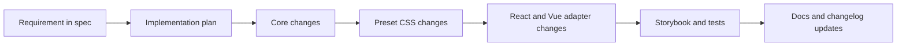

# Marwes Specification

This file is the canonical specification for Marwes.
If implementation, docs, or behavior diverge from this file, either the implementation is wrong or this spec must be updated explicitly.



## 1. Product Intent
Marwes is a component system that prioritizes:
- Strong defaults
- Small override API
- Consistent accessibility behavior
- Framework-agnostic core logic

## 2. Current Status (2026-04-09)
- Repository shape: pnpm monorepo with `core`, `presets`, `react`, `vue`, Storybook apps, and a React playground
- Adapter support: React and Vue are both first-class packages
- Current focus: keep docs, Storybook coverage, and implementation aligned with the V3 Figma component set
- Remaining backlog is component-level, not architecture-level, and is tracked in `docs/planning/component-backlog.md`

## 3. Core Principles
- Simple surface API, strong internal consistency
- Core is framework agnostic (no React, no DOM runtime behavior)
- Presets are static CSS (`.mw-*` classes and `--mw-*` vars)
- Accessibility behavior is authored in core
- Strict TypeScript (no `any`)

## 4. Architecture Contract
Marwes uses three layers:
1. `@marwes-ui/core`
   - Theme contract + normalization
   - Component recipes
   - A11y mappings
2. `@marwes-ui/presets`
   - Static CSS and preset defaults
3. Framework adapters (`@marwes-ui/react`, `@marwes-ui/vue`)
   - Thin adapters that apply core RenderKit output

### RenderKit Contract
Core recipes return:
```ts
{
  tag: string,
  className: string,
  vars: Record<string, string>,
  a11y: Record<string, unknown>,
  policy?: {
    blockClick?: boolean,
    preventDefault?: boolean,
  }
}
```

Adapter requirements:
- Render `tag`
- Apply `className`
- Apply `style={vars}`
- Apply typed `a11y`
- Respect `policy`

## 5. Active Scope
### In Scope
- Core theme system and preset CSS
- React and Vue adapter parity for shipped components
- Storybook and playground validation
- Continued alignment with the synced V3 Figma references

### Out of Scope
- Replacing the three-layer architecture
- Runtime CSS-in-JS
- Pushing framework logic down into core

## 6. Spec-Driven Development Workflow (Required)
Every non-trivial change must follow this sequence:

1. **Spec first**
   - Add or update requirement(s) in this file.
2. **Acceptance criteria**
   - Each requirement includes testable outcomes.
3. **Implementation mapping**
   - Identify impacted files across core, presets, React, and Vue.
4. **Validation**
   - Typecheck/build and targeted behavior checks.
5. **Documentation + changelog**
   - Update relevant docs when behavior/API changes.
6. **Decision capture**
   - Record architecture/product tradeoffs in Section 9.

## 7. Requirement Template (Use For New Work)
Copy this block when adding a feature or behavior:

```md
### REQ-XXX: <short name>
- Problem:
- Scope:
- Non-goals:
- Acceptance criteria:
  - [ ] AC1 ...
  - [ ] AC2 ...
- Validation:
  - Unit:
  - Integration/manual:
- Files expected to change:
```

## 8. Traceability Matrix (Use In PRs)
Keep this mapping in PR description (or add temporarily to this file for major work):

| Requirement | Core files | Preset files | Adapter files | Tests/Verification |
|---|---|---|---|---|
| REQ-XXX | `...` | `...` | `...` | `...` |

## 9. Open Decisions
- DEC-001: Should Select stay native only by default?
  - Status: Open
  - Lean: Yes
- DEC-002: Should value controls standardize on `onValueChange` at core boundaries?
  - Status: Open
  - Lean: Yes
- DEC-003: Preset naming after v1 (`firstEdition` keep or version by era)?
  - Status: Open
  - Lean: Keep for v0.x
- DEC-004: Vue adapter event API should be React-parity only or dual (Vue emits + parity callbacks)?
  - Status: Resolved (see Decision Log)
  - Lean: Dual support
- DEC-005: Where should adapter-shared non-rendering logic live?
  - Status: Resolved (see Decision Log)
  - Lean: Extend `@marwes-ui/core`
- DEC-006: Should rich text formatting extend `Textarea` / `TextareaField` or ship as a separate input-family component pair?
  - Status: Resolved (see Decision Log)
  - Lean: Separate `RichText` + `RichTextField`

## 10. Decision Log
Use this format when resolving an open decision:

```md
### DEC-00X - <title>
- Date: YYYY-MM-DD
- Decision:
- Rationale:
- Impacted docs/files:
```

## 11. Constraints
- Browser support: modern evergreen browsers
- Accessibility baseline: WCAG 2.1 AA
- Core runtime dependencies: zero
- Styling contract: static CSS + CSS variables

## 12. Component Requirements

> Requirement entries are kept as a traceable record of why work was started. Some entries describe an original problem statement for work that is now complete. Use the acceptance checkboxes and decision log to understand current status.

### REQ-VUE-001: Vue Adapter Package (`@marwes-ui/vue`)
- **Problem**: Marwes core and presets are framework-agnostic, but only a React adapter exists, which blocks Vue users from consuming the same components and behaviors.
- **Scope**:
  - Add a new `@marwes-ui/vue` package under `packages/`
  - Implement a Vue provider/composables layer equivalent to React (`MarwesProvider`, `useSystem`, `useTheme`)
  - Implement Vue components for the current React export surface (atoms + molecules + semantic variants)
  - Keep core recipes/a11y as the source of truth (no duplicated a11y logic in Vue)
  - Support Vue-idiomatic events/model binding while preserving parity callback props where practical
- **Non-goals**:
  - Rewriting `@marwes-ui/core` recipes around Vue-specific types
  - Replacing `@marwes-ui/react` or changing its public API semantics
  - Introducing a runtime styling system or Vue-only preset CSS
- **Acceptance criteria**:
  - [x] `packages/vue` builds as `@marwes-ui/vue` with ESM + types and publishes from `dist/`
  - [x] Vue provider/composables use `createSystem`/`switchMode` from core and support light/dark mode
  - [x] Vue adapter exports the same component set currently exported by `@marwes-ui/react` for in-scope components
  - [x] Vue adapter renders core RenderKit outputs (className, vars, typed a11y) without re-implementing core a11y logic
  - [x] Vue adapter supports idiomatic Vue event usage (`emits` / `v-model` where applicable) and parity callbacks (`onValueChange`, `onCheckedChange`)
  - [x] React adapter behavior remains unchanged for existing stories/manual checks
- **Validation**:
  - Unit: TypeScript typecheck passes for `packages/vue`
  - Integration/manual: Verify representative components in Vue Storybook (button, input, checkbox, divider, field)
- **Files expected to change**:
  - New package: `packages/vue/*`
  - Root config: `tsconfig.base.json`, `package.json` scripts if needed
  - Shared logic: `packages/core/src/*` (adapter-independent helpers only)
  - Docs/changelog: package README/CHANGELOG and root docs as needed

### REQ-VUE-002: Vue Storybook Parity (`apps/storybook-vue`)
- **Problem**: There is no Vue Storybook to validate and demonstrate the Vue adapter with the same preset/theme behavior used in React Storybook.
- **Scope**:
  - Add `apps/storybook-vue` using `@storybook/vue3-vite`
  - Mirror local workspace aliasing used in React Storybook for `@marwes-ui/core`, `@marwes-ui/presets`, and adapter package source files
  - Add a Vue preview decorator that wraps stories in `MarwesProvider` and supports theme mode toolbar switching
  - Create a representative initial story set, then expand toward parity with React Storybook
- **Non-goals**:
  - Exact 1:1 file duplication of every React story before the app is functional
  - Replacing React Storybook as the primary reference during migration
- **Acceptance criteria**:
  - [x] `apps/storybook-vue` runs locally and renders Vue adapter components using `firstEdition` preset CSS
  - [x] Theme toolbar switches between light and dark mode using Vue `MarwesProvider`
  - [x] Vue Storybook includes smoke stories for representative atoms/molecules
  - [x] Storybook local aliases resolve package source code (not only published `dist`)
  - [x] Custom RenderKit debug panel is reusable or functionally matched for Vue stories
- **Validation**:
  - Integration/manual: `storybook dev` launches and representative stories render correctly
  - Build: `storybook build` succeeds for Vue Storybook app
- **Files expected to change**:
  - New app: `apps/storybook-vue/*`
  - Shared Storybook helpers/config (if extracted)
  - Root workspace config (if additional scripts/aliases are needed)

### REQ-VUE-003: Shared Adapter/Story Logic Extraction (Duplication Reduction)
- **Problem**: Copying React adapter and stories directly into Vue will create maintenance-heavy duplication for logic that is framework-independent.
- **Scope**:
  - Extract adapter-independent derivation logic into `@marwes-ui/core` (e.g., id suffix naming, `aria-describedby` merging, field state derivation, data-only semantic variant prop composition)
  - Extract reusable Storybook fixtures/config data where framework-neutral (args, argTypes, common parameters, icon option lists)
  - Keep rendering, framework lifecycle hooks, and framework-specific story render functions in adapter/app layers
- **Non-goals**:
  - Creating a generic cross-framework rendering abstraction
  - Moving React/Vue component rendering into core
- **Acceptance criteria**:
  - [x] New shared helpers in core are framework-agnostic and contain no React/Vue imports
  - [x] React and Vue adapters both consume shared helpers for at least one molecule/variant flow
  - [x] Shared Storybook fixture/config extraction reduces repeated args/argTypes definitions for equivalent stories
  - [x] Shared extraction does not change visual output or a11y behavior of React stories
- **Validation**:
  - Unit/type: Shared helpers typecheck in core and adapter consumers typecheck
  - Integration/manual: React and Vue story parity check for at least one shared fixture-backed component
- **Files expected to change**:
  - `packages/core/src/*` (new helper modules + exports)
  - `packages/react/src/*` (consuming helpers)
  - `packages/vue/src/*` (consuming helpers)
  - `apps/storybook-react/src/*` and `apps/storybook-vue/src/*` (shared story fixtures if extracted)

### REQ-INPUT-RT-001: RichText + RichTextField
- **Figma reference**: use `Text field` (`1364:7662`) and `Text area` (`1364:7696`) as the current visual baselines from `.figma/marwes/components/text-field.json` and `.figma/marwes/components/text-area.json` until a dedicated rich-text node is added
- **Problem**: Marwes has plain-text multiline controls (`Textarea`, `TextareaField`) but no Input-family component for inline formatting such as bold, italic, and underline.
- **Scope**:
  - Add a new Input-family atom `RichText`
  - Add a new Input-family molecule `RichTextField`
  - Keep `Textarea` and `TextareaField` as plain-text controls
  - Support toolbar actions for `bold`, `italic`, and `underline`
  - Support controlled and uncontrolled usage
  - Support disabled, read-only, invalid, helper-text, and error states
  - Use a constrained HTML string as the MVP value format
  - Add framework-agnostic core contracts and shared a11y helpers in `@marwes-ui/core`
  - Add React and Vue adapters, Storybook stories/docs, contracts, exports, and preset CSS
- **Non-goals**:
  - Retrofitting native `Textarea` into a rich text editor
  - Shipping links, lists, images, tables, headings, alignment, or arbitrary embedded media in MVP
  - Storing arbitrary unsanitized HTML as part of the public contract
  - Adding editor runtime dependencies to `@marwes-ui/core`
- **Acceptance criteria**:
  - [x] `RichText` ships as a new atom under the Input family in core, React, Vue, and Storybook
  - [x] `RichTextField` ships as a new molecule under the Input family in React, Vue, and Storybook
  - [x] `Textarea` and `TextareaField` remain plain-text components with unchanged conceptual scope
  - [x] MVP formatting actions support `bold`, `italic`, and `underline`
  - [x] The public value contract is an HTML string with a small, documented supported subset
  - [x] Core exposes rich-text types/recipe metadata and a dedicated helper for field labelling/description wiring
  - [x] React and Vue adapters stay in parity for props, value flow, disabled/read-only behavior, and toolbar actions
  - [x] Storybook titles follow the Input taxonomy: `Input/Atom/RichText` and `Input/Molecule/RichTextField`
  - [x] Input Introduction docs in both Storybooks explain when to use `RichText` / `RichTextField` vs `Textarea` / `TextareaField`
  - [x] Shared contracts cover atom behavior and field-level accessibility expectations across both adapters
- **Validation**:
  - Unit: Core types/recipes typecheck; React/Vue adapter tests cover formatting actions and value flow
  - Integration/manual: Verify React and Vue Storybook stories for basic, helper, error, disabled, read-only, and controlled states
- **Files expected to change**:
  - Core: `packages/core/src/components/atoms/input/rich-text-*`, `packages/core/src/shared/field-helpers.ts`, `packages/core/src/components/atoms/input/index.ts`, `packages/core/src/components/atoms/index.ts`, `packages/core/src/index.ts`
  - Presets: `packages/presets/src/firstEdition/rich-text.css`, optional `packages/presets/src/firstEdition/molecules/rich-text-field.css`, `packages/presets/src/firstEdition/styles.css`
  - React: `packages/react/src/components/input/rich-text.tsx`, `packages/react/src/components/input/rich-text-field.tsx`, adapter tests, package exports, and adapter dependencies
  - Vue: `packages/vue/src/components/input/rich-text.ts`, `packages/vue/src/components/input/rich-text-field.ts`, adapter tests, package exports, and adapter dependencies
  - Storybook: React/Vue input stories, `Introduction.mdx`, taxonomy tests, intro-docs tests
  - Shared tests: `tests/contracts/rich-text.contract.ts`, `tests/contracts/rich-text-field.contract.ts`
  - Docs/backlog: `docs/planning/component-backlog.md`

### REQ-DIV-001: Divider Component
- **Figma reference**: node-id=1-932
- **Problem**: Need a semantic separator component for visually dividing content sections
- **Scope**: 
  - Horizontal and vertical orientation support
  - 7 size variants matching Figma spec (1px, 8px, 16px, 32px, 48px, 64px, 80px)
  - Semantic HTML using `<hr>` element
  - Built-in spacing based on divider size
  - Light and dark mode support via theme colors
- **Non-goals**:
  - Text-embedded dividers ("or" dividers) in v0.1
  - Custom colors beyond theme tokens in v0.1
  - Animated dividers
- **Acceptance criteria**:
  - [x] Core recipe produces RenderKit with correct className, vars, and a11y props
  - [x] Size API uses semantic names (xxs, xs, sm, md, lg, xl, xxl) mapped to pixel values
  - [x] Orientation prop supports "horizontal" (default) and "vertical"
  - [x] Generates aria-orientation attribute based on orientation
  - [x] Uses theme.color.border for divider color
  - [x] Preset CSS implements all 7 size variants with correct dimensions
  - [x] React adapter applies RenderKit to semantic `<hr>` element
  - [x] Storybook story demonstrates all sizes and both orientations
- **Validation**:
  - Unit: TypeScript typecheck passes, build completes
  - Integration/manual: Visual verification in Storybook against Figma designs
- **Files expected to change**:
  - Core: `packages/core/src/components/atoms/divider/` (types, recipe, index)
  - Core exports: `packages/core/src/components/atoms/index.ts`
  - Preset: `packages/presets/src/firstEdition/divider.css`
  - Preset imports: `packages/presets/src/firstEdition/styles.css`
  - React: `packages/react/src/components/divider.tsx`
  - React exports: `packages/react/src/index.ts`
- Stories: `apps/storybook-react/src/stories/divider/divider.stories.tsx`

**Design decisions**:
- Size mapping: xxs=1px, xs=8px, sm=16px, md=32px, lg=48px, xl=64px, xxl=80px
- Spacing: Built-in via CSS based on size (larger dividers = more surrounding space)
- Element: `<hr>` for semantic meaning and native accessibility
- Orientation: Explicit prop for better API clarity and accessibility

### REQ-AVATAR-001: Avatar Atom
- **Figma reference**:
  - `.figma/marwes/components/avatar.json`
  - `.figma/marwes/pages/-avatar/-avatar_1574-27460.json`
  - `.figma/marwes/pages/-avatar/-avatar-dark_1574-27570.json`
- **Problem**: The synced V3 Figma library includes Avatar as a top-level family, but the repo has no base Avatar atom yet.
- **Scope**:
  - Add a base `Avatar` atom to core, presets, React, Vue, and Storybook
  - Support the current Figma base variants: `small`, `medium`, `large`
  - Support the current Figma content types: `initials`, `icon`, `image`
  - Use a user icon fallback when no initials or image source is provided
  - Keep the core contract framework-agnostic and let adapters render the actual inner content
- **Non-goals**:
  - Shipping `Avatar badge` in this change
  - Shipping `Avatar group` in this change
  - Adding upload, editing, or other interactive avatar behavior
- **Acceptance criteria**:
  - [x] Core recipe returns stable classnames and data attributes for avatar size and resolved content type
  - [x] Base avatar supports initials, icon fallback, and image content across all three sizes
  - [x] Preset CSS matches the current light and dark Figma treatments for initials, icon, and image shells
  - [x] React and Vue adapters render the same visual and accessibility contract from the core recipe
  - [x] Storybook documents the atom and shows all size × type combinations in light and dark mode
- **Validation**:
  - Unit: Core, React, and Vue typecheck passes; cross-adapter avatar contracts pass
  - Integration/manual: React and Vue Storybook avatar stories match the current synced Figma references
- **Files expected to change**:
  - Core: `packages/core/src/components/atoms/avatar/*`, `packages/core/src/components/atoms/index.ts`, `packages/core/src/index.ts`
  - Presets: `packages/presets/src/firstEdition/avatar.css`, `packages/presets/src/firstEdition/styles.css`
  - React: `packages/react/src/components/avatar/*`, `packages/react/src/index.ts`
  - Vue: `packages/vue/src/components/avatar/*`, `packages/vue/src/index.ts`
  - Storybook: `apps/storybook-react/src/stories/avatar/*`, `apps/storybook-vue/src/stories/avatar/*`
  - Shared tests: `tests/contracts/avatar.contract.ts`
  - Docs/changelog: `docs/planning/component-backlog.md`, `.changeset/*`

### REQ-AVATAR-002: Avatar Molecules
- **Figma reference**:
  - `.figma/marwes/pages/-avatar/component-container_1574-27051.json`
  - `.figma/marwes/pages/-avatar/component-container_1574-27408.json`
  - `.figma/marwes/pages/-avatar/-avatar_1574-27460.json`
  - `.figma/marwes/pages/-avatar/-avatar-dark_1574-27570.json`
  - `.figma/marwes/pages/cover/avatar-group_1825-30447.json`
- **Problem**: The synced Avatar family includes two composition patterns beyond the base atom: the online presence badge and the stacked avatar group with overflow counter.
- **Scope**:
  - Add `AvatarBadge` as a molecule built on top of `Avatar`
  - Add `AvatarGroup` as a molecule built on top of `Avatar`
  - Match the current Figma online-indicator treatment and stacked medium-avatar group treatment
  - Keep these compositions in adapters and presets while reusing the existing Avatar atom contract
- **Non-goals**:
  - Inventing semantic avatar purpose wrappers in this change
  - Adding interactive menu, upload, edit, or click behavior to avatar molecules
  - Expanding AvatarGroup beyond the current stacked medium-avatar layout from Figma
- **Acceptance criteria**:
  - [x] `AvatarBadge` renders the online indicator in light and dark mode across the Figma avatar sizes
  - [x] `AvatarGroup` renders the overlapping medium-avatar pattern with an optional overflow counter
  - [x] React and Vue expose matching molecule APIs and Storybook coverage
  - [x] Package exports include the new molecules
- **Validation**:
  - Unit: React/Vue molecule tests and barrel export tests pass
  - Integration/manual: React and Vue Storybook molecule stories match the synced Figma references
- **Files expected to change**:
  - Presets: `packages/presets/src/firstEdition/avatar.css`
  - React: `packages/react/src/components/avatar/*`, `packages/react/src/index.ts`
  - Vue: `packages/vue/src/components/avatar/*`, `packages/vue/src/index.ts`
  - Storybook: `apps/storybook-react/src/stories/avatar/*`, `apps/storybook-vue/src/stories/avatar/*`
  - Shared tests: `tests/contracts/avatar-badge.contract.ts`, `tests/contracts/avatar-group.contract.ts`

### REQ-AVATAR-003: Avatar Purpose Components
- **Problem**: The base Avatar atom and Figma molecules now exist, but the library still needs semantic wrappers for common avatar intents so product code can express meaning directly and attach stable AI-friendly metadata.
- **Scope**:
  - Add purpose wrappers for base profile identity, online presence, and grouped team/member clusters
  - Keep wrappers thin and build them on top of `Avatar`, `AvatarBadge`, and `AvatarGroup`
  - Expose the same purpose wrapper surface in React, Vue, and Storybook
- **Non-goals**:
  - Adding new visual states beyond the existing avatar atom and molecules
  - Adding interaction logic such as menus, upload/edit flows, or presence state switching
- **Acceptance criteria**:
  - [x] `ProfileAvatar` wraps `Avatar` and sets stable semantic metadata
  - [x] `PresenceAvatar` wraps `AvatarBadge` and sets stable semantic metadata
  - [x] `TeamAvatarGroup` wraps `AvatarGroup` and sets stable semantic metadata
  - [x] React and Vue exports, tests, and Storybook purpose stories stay in parity
- **Validation**:
  - Unit: React/Vue purpose wrapper tests and barrel export tests pass
  - Integration/manual: Storybook purpose stories render correctly in React and Vue
- **Files expected to change**:
  - React: `packages/react/src/components/avatar/*`, `packages/react/src/index.ts`
  - Vue: `packages/vue/src/components/avatar/*`, `packages/vue/src/index.ts`
  - Storybook: `apps/storybook-react/src/stories/avatar/*`, `apps/storybook-vue/src/stories/avatar/*`
  - Docs/changelog: `docs/reference/spec.md`, `.changeset/*`

### DEC-004 - Vue adapter event API supports parity callbacks and Vue emits
- Date: 2026-02-23
- Decision:
  - `@marwes-ui/vue` will support Vue-idiomatic emits / `v-model` style usage for value controls while also accepting parity callback props such as `onValueChange` and `onCheckedChange`.
- Rationale:
  - This preserves cross-framework API familiarity for Marwes docs/examples and internal conventions while giving Vue users ergonomic integration with standard Vue patterns.
- Impacted docs/files:
  - `docs/reference/spec.md`
  - `packages/vue/*`
  - Vue Storybook examples/docs

### DEC-005 - Adapter-independent helper extraction extends core
- Date: 2026-02-23
- Decision:
  - Adapter-shared non-rendering logic will be added to `@marwes-ui/core` rather than creating a separate internal `adapter-shared` package.
- Rationale:
  - The logic is framework-agnostic and belongs close to RenderKit/a11y contracts. This avoids a fourth architectural layer and keeps shared behavior discoverable.
- Impacted docs/files:
  - `docs/reference/spec.md`
  - `packages/core/src/*`
  - `packages/react/src/*`
  - `packages/vue/src/*`

### DEC-006 - Rich text ships as a separate Input-family component pair
- Date: 2026-04-08
- Decision:
  - Rich text editing will ship as new Input-family components, `RichText` and `RichTextField`, rather than extending `Textarea` or `TextareaField`.
- Rationale:
  - A native `<textarea>` is a plain-text control and cannot provide true inline formatting for selected ranges. Splitting the concepts keeps the API honest, preserves the existing plain-text surface, and aligns the feature with the Marwes Atom → Molecule → Storybook taxonomy.
- Impacted docs/files:
  - `docs/reference/spec.md`
  - `docs/planning/component-backlog.md`
  - `packages/core/src/components/atoms/input/*`
  - `packages/presets/src/firstEdition/*`
  - `packages/react/src/components/input/*`
  - `packages/vue/src/components/input/*`
  - `apps/storybook-react/src/stories/input/*`
  - `apps/storybook-vue/src/stories/input/*`
