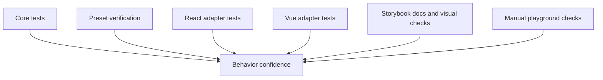
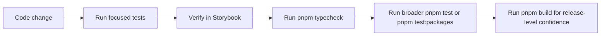

# Testing

Marwes uses layered testing that mirrors the architecture:

- `core` tests behavior and contracts
- `presets` tests styling-related integration where needed
- `react` and `vue` test adapters against the real core recipes
- Storybook covers documentation, interaction, and visual verification
- the playground is used for manual integration checks

## Testing map



## What to test at each layer

### Core
Location:
- `packages/core/src/**/__tests__/`

Test:
- recipe output
- accessibility mapping
- theme normalization and CSS variable generation
- shared helpers
- state and variant mapping

Core tests should run in a non-DOM environment when possible.

### Presets
Location:
- package-specific tests when styling logic needs verification

Test:
- emitted class hooks match CSS expectations
- key visual states are represented in stories
- preset imports and distribution work

### React and Vue adapters
Location:
- `packages/react/src/**/__tests__/`
- `packages/vue/src/**/__tests__/`

Test:
- adapters call the real core recipe
- props and events behave correctly
- accessibility wiring reaches the DOM
- controlled and uncontrolled state behavior
- disabled, invalid, focus, and read-only flows

Do not mock the core recipe in adapter tests.

### Storybook
Use Storybook to verify:
- docs structure
- visual state coverage
- interaction behavior
- accessibility checks
- taxonomy consistency across React and Vue story sets

### Playground
Use the playground for:
- integration sanity checks
- debugging provider and theme behavior
- validating realistic compositions

## Commands

### Repo-wide

```bash
pnpm typecheck
pnpm lint
pnpm test
pnpm build
```

### Focused package tests

```bash
pnpm test:core
pnpm test:presets
pnpm test:react
pnpm test:vue
pnpm test:packages
```

### Typecheck-only test contracts

```bash
pnpm test:typecheck:contracts
pnpm test:typecheck:packages
```

### Storybook and playground

```bash
pnpm dev:storybook:react
pnpm dev:storybook:vue
pnpm dev:playground
```

## Recommended workflow



## What good test coverage looks like

### Core
- every exported recipe has direct unit coverage
- every a11y mapping has meaningful edge-case coverage
- helper functions have deterministic tests

### Adapters
- public props are exercised through rendered output
- event flows are tested through user interaction
- field wrappers verify labelling and described-by wiring

### Stories
- atom, molecule, and purpose layers are represented where applicable
- docs pages reflect the actual exported API
- React and Vue stories stay aligned

## Accessibility verification

Automated:
- story-level accessibility checks
- adapter tests using semantic queries

Manual:
- keyboard navigation
- focus visibility
- screen reader naming and descriptions
- disabled and invalid state behavior

## Visual verification

Marwes relies on Storybook for visual inspection and Chromatic-style review workflows where available.

When design changes originate in Figma:
1. confirm the node and states
2. update core and presets
3. verify the story output matches the intended design
4. update docs if the public contract changed

## Allure reporting

Allure is optional and documented separately:
- [Allure reporting](../tooling/allure.md)

Use it when you want a richer HTML report for package test runs.

## Related docs

- [Documentation index](../README.md)
- [Architecture](./architecture.md)
- [Specification](./spec.md)
- [Adding Components](../guides/adding-components.md)
