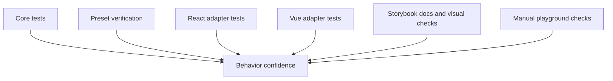
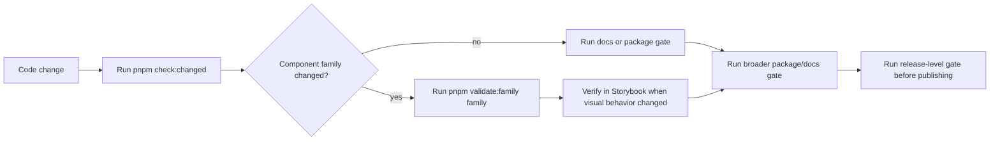

# Testing

Marwes uses layered testing that mirrors the architecture:

- `core` tests behavior and contracts
- `presets` tests styling-related integration where needed
- `react` and `vue` test adapters against the real core recipes
- Storybook covers documentation, interaction, and visual verification
- the playground is used for manual integration checks

## Testing map



## What to test at each layer

### Core
Location:
- `packages/core/src/**/__tests__/`

Test:
- recipe output
- accessibility mapping
- theme normalization and CSS variable generation
- shared helpers
- state and variant mapping

Core tests should run in a non-DOM environment when possible.

### Presets
Location:
- package-specific tests when styling logic needs verification

Test:
- emitted class hooks match CSS expectations
- key visual states are represented in stories
- preset imports and distribution work

### React and Vue adapters
Location:
- `packages/react/src/**/__tests__/`
- `packages/vue/src/**/__tests__/`

Test:
- adapters call the real core recipe
- props and events behave correctly
- accessibility wiring reaches the DOM
- controlled and uncontrolled state behavior
- disabled, invalid, focus, and read-only flows

Do not mock the core recipe in adapter tests.

### Storybook
Use Storybook to verify:
- docs structure
- visual state coverage
- interaction behavior
- accessibility checks
- taxonomy consistency across React and Vue story sets

### Playground
Use the playground for:
- integration sanity checks
- debugging provider and theme behavior
- validating realistic compositions

## Commands

### Validation presets

Use the smallest gate that matches the risk of the change, then move upward when the branch gets closer to review.

```bash
pnpm compass                       # print the singular repo route model
pnpm help:repo                     # compatibility alias for pnpm compass
pnpm check:changed                 # quick changed-scope gate against origin/main
pnpm check:changed -- --base main  # same gate against a different base
pnpm validate:family button        # full family path for one component family
pnpm check:repo-map                 # full docs/repo-map/generated-truth integrity gate
pnpm validate:packages             # typecheck, package builds, package tests
pnpm validate:release              # security, packages, docs, full biome check, Storybook a11y smoke
pnpm check                         # docs + full biome check + Storybook a11y smoke
```

### Repo-wide supporting commands

```bash
pnpm validate:security
pnpm typecheck
pnpm lint
pnpm format:all
pnpm test
pnpm build
pnpm check:adapter-boundaries
pnpm check:compass
pnpm check:repo-map
pnpm parity:summary:check
```

### Focused package tests

```bash
pnpm validate:family button
pnpm validate:family button --storybook
pnpm test:core
pnpm test:presets
pnpm test:react
pnpm test:vue
pnpm test:packages
```

### Typecheck-only test contracts

```bash
pnpm test:typecheck:contracts
pnpm test:typecheck:packages
```

### Storybook and playground

```bash
pnpm dev:storybook:react
pnpm dev:storybook:vue
pnpm dev:playground
pnpm test:storybook:a11y
```

## Recommended workflow



## What good test coverage looks like

### Core
- every exported recipe has direct unit coverage
- every a11y mapping has meaningful edge-case coverage
- helper functions have deterministic tests

### Adapters
- public props are exercised through rendered output
- event flows are tested through user interaction
- field wrappers verify labelling and described-by wiring
- covered semantic families verify canonical metadata output

### Stories
- atom, molecule, and purpose layers are represented where applicable
- docs pages reflect the actual exported API
- React and Vue stories stay aligned
- semantic claims in docs should match the core semantic registry for covered families

## Accessibility verification

Use [`docs/reference/accessibility.md`](./accessibility.md) as the canonical cross-family support model.
This file explains the test layers. The accessibility support doc explains what those layers can and cannot prove.

Automated:
- story-level accessibility checks for the first Storybook smoke set via `pnpm test:storybook:a11y`
- adapter tests using semantic queries
- shared React/Vue contracts for covered families
- registry-backed family posture references

Manual:
- keyboard navigation
- focus visibility
- screen reader naming and descriptions
- disabled and invalid state behavior
- live-region timing and interruption feel where relevant

Current honest repo-level boundary:
- Storybook accessibility tooling now has a first enforced smoke set, and that smoke set is part of `pnpm check`
- current smoke-set families are Button, Checkbox, Radio, Toast, and Spinner across React and Vue Storybook apps
- the repo is still not fully hard-gated across every story because only promoted smoke-set stories run in this gate today
- higher-risk families still need manual review even when automated checks pass

### Manual-review-heavy components

Some components need stronger manual review even when automated checks pass.

Current high-attention example:
- `RichText` / `RichTextField`

Why:
- they rely on `contentEditable`
- formatting state depends on browser editing behavior
- formatting actions currently use `document.execCommand()` where available
- assistive technology behavior can vary across browser and screen reader combinations

What automation currently proves for rich text:
- accessible naming and description wiring
- disabled and read-only semantics
- toolbar button semantics such as labels and pressed state
- basic value flow and formatting affordances in adapter tests

What still needs manual review for rich text:
- keyboard editing behavior in real browsers
- screen reader announcement quality during editing
- formatting behavior consistency across supported environments
- caret and selection behavior around formatting boundaries

Rule of thumb:
- use automated tests to protect the component contract
- use manual review to validate the real editing experience

## Changed-scope validation

Use `pnpm check:changed` before opening a branch for review. It compares changed files against `origin/main`, runs the adapter/core boundary guardrail, formats/lints changed files with Biome, runs docs checks when docs changed, runs `validate:family` for detected component families, and finishes with `git diff --check`.

Use a different base when needed:

```bash
pnpm check:changed -- --base main
```

This gate is intentionally pragmatic. It is not a release substitute; it is the fastest local confidence pass for branch work.

## Adapter/core boundary guardrail

Use `pnpm check:adapter-boundaries` when component adapter work touches architecture boundaries. The script currently checks strong constraints:

- no browser/DOM globals in `packages/core/src`
- no React imports in Vue component adapters
- no Vue imports in React component adapters
- no preset imports inside framework component adapters
- no hardcoded color tokens inside framework component adapters

Keep deeper judgement in [Architecture](./architecture.md) and [Repo Map](./repo-map.md).

## Family validation

Use [`docs/reference/family-validation.md`](./family-validation.md) as the canonical workflow for validating one component family across core, presets, React, Vue, Storybook, registry, and docs.

Default family gate:

```bash
pnpm validate:family <family>
```

Browser-backed Storybook/a11y family gate:

```bash
pnpm validate:family <family> --storybook
```

## Visual verification

Marwes relies on Storybook for visual inspection and Chromatic-style review workflows where available.

When design changes originate in Figma:
1. confirm the node and states
2. update core and presets
3. verify the story output matches the intended design
4. update docs if the public contract changed

## Related docs

- [Documentation index](../README.md)
- [Accessibility support model](./accessibility.md)
- [Family validation](./family-validation.md)
- [Architecture](./architecture.md)
- [Specification](./spec.md)
- [AI Metadata Protocol](./ai-metadata.md)
- [Governance](./governance.md)
- [Adding Components](../guides/adding-components.md)
