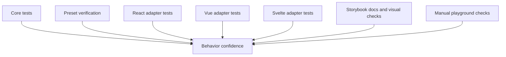
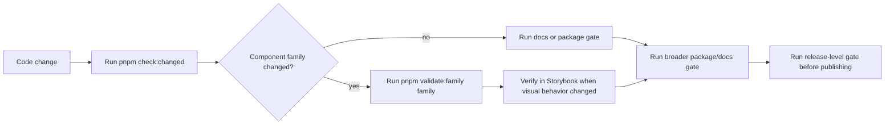

# Testing

Marwes uses layered testing that mirrors the architecture:

- `core` tests behavior and contracts
- `presets` tests styling-related integration where needed
- `react`, `vue`, and `svelte` test adapters against the real core recipes
- Storybook covers documentation, interaction, and visual verification
- the playground is used for manual integration checks

## Testing map



## What to test at each layer

### Core

Location:

- `packages/core/src/**/__tests__/`

Test:

- recipe output
- accessibility mapping
- theme normalization and CSS variable generation
- shared helpers
- state and variant mapping

Core tests should run in a non-DOM environment when possible.

### Presets

Location:

- package-specific tests when styling logic needs verification

Test:

- emitted class hooks match CSS expectations
- key visual states are represented in stories
- preset imports and distribution work

### React, Vue, and Svelte adapters

Location:

- `packages/react/src/**/__tests__/`
- `packages/vue/src/**/__tests__/`
- `packages/svelte/src/tests/`

Test:

- adapters call the real core recipe
- props and events behave correctly
- accessibility wiring reaches the DOM
- controlled and uncontrolled state behavior
- disabled, invalid, focus, and read-only flows

Do not mock the core recipe in adapter tests.

### Storybook

Use Storybook to verify:

- docs structure
- visual state coverage
- interaction behavior
- accessibility checks
- taxonomy consistency across React, Vue, and Svelte story sets

### Playground

Use the playground for:

- integration sanity checks
- debugging provider and theme behavior
- validating realistic compositions

## Commands

### Validation presets

Use the smallest gate that matches the risk of the change, then move upward when the branch gets closer to review.

```bash
pnpm compass                       # print the singular repo route model
pnpm check:changed                 # smart local gate: local worktree, or latest commit when clean
pnpm check:changed -- --branch      # whole branch against origin/main plus local changes
pnpm check:changed -- --base main   # whole branch against an explicit base
pnpm check:changed -- --all-families # force every detected family gate when scope is large
pnpm validate:family button        # full family path for one component family
pnpm check:repo-map                 # full docs/repo-map/generated-truth integrity gate
pnpm validate:packages             # typecheck, package builds, package tests
pnpm validate:release              # security, packages, repo-map, full biome check, Storybook a11y smoke
pnpm check                         # docs + full biome check + Storybook a11y smoke
pnpm cohesive:check:all            # static Figma/Reflection contract check for every Reflection family
pnpm cohesive:ci                   # CI visual gate: contract check + portal screenshots + review
```

### Changed-scope behavior

`pnpm check:changed` is optimized for daily work on long-lived branches. By default it validates the local worktree; when the worktree is clean, it validates the latest commit. Use `--branch` or `--base <ref>` when you intentionally want the full branch range.

For docs-only changes it uses a fast path: changed-file Biome, `pnpm check:compass`, and `git diff --check`. For large family scopes, it runs shared integrity once through `pnpm check:repo-map` instead of many per-family gates unless `--all-families` is passed.

### Repo-wide supporting commands

```bash
pnpm validate:security
pnpm typecheck
pnpm lint
pnpm format:all
pnpm test
pnpm build
pnpm check:adapter-boundaries
pnpm check:compass
pnpm check:repo-map
pnpm parity:summary:check
pnpm check:adapter-architecture
```

### Focused package tests

```bash
pnpm validate:family button
pnpm validate:family button --storybook
pnpm test:core
pnpm test:presets
pnpm test:react
pnpm test:vue
pnpm test:svelte
pnpm test:packages
```

### Typecheck-only test contracts

```bash
pnpm test:typecheck:contracts
pnpm test:typecheck:packages
```

### Storybook and playground

```bash
pnpm dev:storybook:react
pnpm dev:storybook:vue
pnpm dev:storybook:svelte
pnpm dev:playground
pnpm test:storybook:a11y
```

### Reflection visual evidence

Marwes uses `reflection-check` for Figma-backed component visual evidence through
generated Reflection portal routes. The root Reflection config targets the React
portal entry, with adapter-specific configs for Vue and Svelte:

```bash
pnpm reflection:doctor
pnpm reflection:visual
pnpm reflection:review
```

Figma baselines are exported from the manifest:

```bash
node scripts/reflection/export-figma-baselines.mjs --family button --dry-run
node scripts/reflection/export-figma-baselines.mjs --family button
```

Adapter-focused commands are also available:

```bash
pnpm reflection:visual:react
pnpm reflection:visual:vue
pnpm reflection:visual:svelte
```

Local runs write evidence to `.reflection/<adapter>/`. CI runs should use
`pnpm reflection:ci`, which writes evidence to `artifacts/reflection/<adapter>/`.
Approved baselines live under
`packages/design-governance/reflection-families/<family>/baselines/`. The
starter Button cases use the same Figma baseline image paths for React, Vue, and
Svelte so each adapter is checked against the same visual standard.

The Figma frame dimensions in
`packages/design-governance/reflection-families/<family>/reflection-contract.json`
must match the Reflection component `viewportSize`. Button v1 starts at
`390x220`; larger components should add their own per-case sizes instead of
using one wide universal frame. The contract `framing` must also match the Figma
frame fill, alignment, and padding so the portal runtime and Figma render into
the same rectangle.

Button Reflection cases remain blocking, but allow tiny documented thresholds for
known Figma-PNG versus Chromium text rasterization differences after
`pnpm cohesive:check -- --family button` proves frame size, baseline PNG size,
source nodes, component bounds, and variables. Do not use `reflection update`
for these Figma truth baselines; the PNGs must be exported from Figma.

Pre-push runs `pnpm cohesive:check:all` as a fast static gate. Pull request CI
runs `pnpm cohesive:ci`, which requires committed baseline receipts, runs the
portal screenshot comparison, and uploads `artifacts/reflection/` for review
evidence. `pnpm cohesive:ci:strict` additionally requires stable generated
Figma frame ids and is only for strict provenance audits.

## Recommended workflow



## What good test coverage looks like

### Core

- every exported recipe has direct unit coverage
- every a11y mapping has meaningful edge-case coverage
- helper functions have deterministic tests

### Adapters

- public props are exercised through rendered output
- event flows are tested through user interaction
- field wrappers verify labelling and described-by wiring
- covered semantic families verify canonical metadata output

### Stories

- atom, molecule, and purpose layers are represented where applicable
- docs pages reflect the actual exported API
- React, Vue, and Svelte stories stay aligned
- semantic claims in docs should match the core semantic registry for covered families

## Accessibility verification

Use [`docs/reference/accessibility.md`](./accessibility.md) as the canonical cross-family support model.
This file explains the test layers. The accessibility support doc explains what those layers can and cannot prove.

Automated:

- story-level accessibility checks for the first Storybook smoke set via `pnpm test:storybook:a11y`
- adapter tests using semantic queries
- shared React/Vue/Svelte contracts for covered families
- registry-backed family posture references

Manual:

- keyboard navigation
- focus visibility
- screen reader naming and descriptions
- disabled and invalid state behavior
- live-region timing and interruption feel where relevant

Current honest repo-level boundary:

- Storybook accessibility tooling now has a first enforced smoke set, and that smoke set is part of `pnpm check`
- current smoke-set families are Button, Checkbox, Radio, Toast, and Spinner across React, Vue, and Svelte Storybook apps
- the repo is still not fully hard-gated across every story because only promoted smoke-set stories run in this gate today
- higher-risk families still need manual review even when automated checks pass

### Manual-review-heavy components

Some components need stronger manual review even when automated checks pass.

Current high-attention example:

- `RichText` / `RichTextField`

Why:

- they rely on `contentEditable`
- formatting state depends on browser editing behavior
- formatting actions currently use `document.execCommand()` where available
- assistive technology behavior can vary across browser and screen reader combinations

What automation currently proves for rich text:

- accessible naming and description wiring
- disabled and read-only semantics
- toolbar button semantics such as labels and pressed state
- basic value flow and formatting affordances in adapter tests

What still needs manual review for rich text:

- keyboard editing behavior in real browsers
- screen reader announcement quality during editing
- formatting behavior consistency across supported environments
- caret and selection behavior around formatting boundaries

Rule of thumb:

- use automated tests to protect the component contract
- use manual review to validate the real editing experience

## Changed-scope validation

Use `pnpm check:changed` during daily branch work. It validates local worktree changes, or the latest commit when the worktree is clean.

Before PR review, use the branch form:

```bash
pnpm check:changed -- --branch
```

Use a different base when needed:

```bash
pnpm check:changed -- --base main
```

The gate prints the selected scope, formats/lints changed files with Biome, runs docs checks when docs changed, checks Changesets when package files changed, protects adapter/core boundaries for source/tooling changes, runs adapter architecture validation for adapter/story/contract authority changes, runs family validation for focused family changes, and falls back to `pnpm check:repo-map` for large family scopes. It finishes by checking committed branch whitespace plus staged/unstaged local whitespace when applicable.

This gate is intentionally pragmatic. It is not a release substitute; it is the fastest local confidence pass for branch work and a useful PR signal.

## Adapter/core boundary guardrail

Use `pnpm check:adapter-boundaries` when component adapter work touches architecture boundaries. The script currently checks strong constraints:

- no browser/DOM globals in `packages/core/src`
- no React imports in Vue component adapters
- no Vue imports in React component adapters
- no preset imports inside framework component adapters

## Adapter architecture guardrail

Use `pnpm check:adapter-architecture` when React, Vue, Svelte, Storybook, shared contracts, or authority docs change. The script checks role-identical adapter structure, package CSS policy, family barrels, root exports, Storybook introductions, and shared contract enrollment. See [Adapter Architecture](./adapter-architecture.md).

- no hardcoded color tokens inside framework component adapters

Keep deeper judgement in [Architecture](./architecture.md) and [Repo Map](./repo-map.md).

## Family validation

Use [`docs/reference/family-validation.md`](./family-validation.md) as the canonical workflow for validating one component family across core, presets, React, Vue, Svelte, Storybook, registry, and docs.

Default family gate:

```bash
pnpm validate:family <family>
```

Browser-backed Storybook/a11y family gate:

```bash
pnpm validate:family <family> --storybook
```

## Visual verification

Marwes relies on Storybook for visual inspection and Chromatic-style review workflows where available.

When design changes originate in Figma:

1. confirm the node and states
2. update core and presets
3. verify the story output matches the intended design
4. update docs if the public contract changed

For strict component baselines, follow
[Figma Reflection Baselines](../guides/figma-reflection-baselines.md).

## Related docs

- [Documentation index](../README.md)
- [Accessibility support model](./accessibility.md)
- [Family validation](./family-validation.md)
- [Architecture](./architecture.md)
- [Specification](./spec.md)
- [AI Metadata Protocol](./ai-metadata.md)
- [Governance](./governance.md)
- [Adding Components](../guides/adding-components.md)
