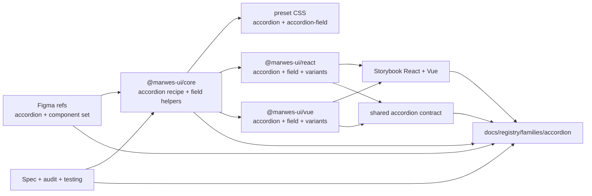
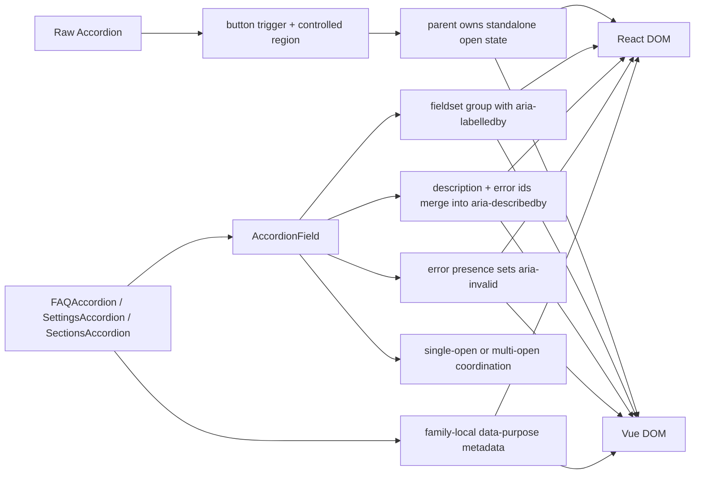

# Accordion Registry

> Family: `accordion`
>
> Local design refs only — this page uses the synced files under `.figma/` and makes no
> Figma API calls.

## Registry files

- [`registry.meta.json`](./registry.meta.json)
- [`registry.generated.json`](./registry.generated.json)
- [`../../../../artifacts/component-registry.json`](../../../../artifacts/component-registry.json)

## Registry snapshot

| Field | Value |
| --- | --- |
| Family status | Shipped |
| Audit status | First pass complete |
| Semantic coverage | Family-local — purpose-accordion metadata lives in adapter wrappers, not the wave-1 central semantic registry |
| Generated structural truth | `registry.generated.json` + `artifacts/component-registry.json` |
| Primary Figma nodes | accordion component set `1369:6218`, light frame `1364:11755`, dark frame `2276:47132`, component container `1369:6219` |
| Main AXE watch item | trigger-to-panel wiring plus `AccordionField` group semantics, invalid state, and open-state parity across adapters |

## Registry ownership

- `README.md` is the human teaching page.
- `registry.meta.json` is the authored structured summary for this family.
- `registry.generated.json` and `artifacts/component-registry.json` are generator-owned structural outputs.
- the family currently uses local purpose-accordion semantics in React and Vue wrappers, not the central wave-1 semantic registry.
- `visuals/*.mmd` help people orient themselves quickly, but they are not the canonical implementation source.

## Summary

The Accordion family is Marwes' collapsible disclosure family for grouped detail
sections.
It combines:
- a raw `Accordion` atom with one trigger and one controlled panel
- `AccordionField` as the canonical labeled accordion-group composition
- purpose wrappers for `FAQAccordion`, `SettingsAccordion`, and `SectionsAccordion`
- shared React/Vue contract coverage for trigger wiring, disabled behavior, field semantics, and open-state behavior

This makes Accordion a strong sixth registry family because it ties together:
- a clear low-level disclosure contract in core
- field-helper-backed label, description, error, and invalid-state wiring
- an explicit first-pass audit with shared cross-framework contract coverage
- purpose wrappers that teach product intent without duplicating behavior

## Family surface map

| Surface level | Main members | Why it matters |
| --- | --- | --- |
| Atom | `Accordion` | low-level disclosure primitive with one trigger button and one controlled panel |
| Molecule | `AccordionField` | canonical labeled group with description, error, invalid-state, and open-state management |
| Purpose variants | `FAQAccordion`, `SettingsAccordion`, `SectionsAccordion` | thin semantic wrappers that attach stable family-local `data-purpose` metadata |
| Canonical grouped path | `AccordionField` + purpose wrappers | recommended accessible path for most product usage |
| Architecture boundary | raw `Accordion` vs `AccordionField` | separates the standalone disclosure primitive from the fully wired grouped-field composition |
| Escape hatch | raw `Accordion` in custom layouts | supported when consumers intentionally own state coordination and list/group semantics |

## Canonical visual understanding

Read this section in this order:
1. canonical Storybook story references for runtime visuals
2. the layer map for repo placement
3. the interaction map for trigger wiring, grouped semantics, and open-state flow

## Primary visual sources

| Source | Path | Why it matters |
| --- | --- | --- |
| React Storybook | `apps/storybook-react/src/stories/accordion/Introduction.mdx` | canonical React teaching surface for the family layers |
| React Storybook | `apps/storybook-react/src/stories/accordion/accordion-field.stories.tsx` | canonical grouped field path with controlled, invalid, disabled, and multi-open examples |
| React Storybook | `apps/storybook-react/src/stories/accordion/accordion.stories.tsx` | raw atom states and standalone accordion-list baseline |
| React Storybook | `apps/storybook-react/src/stories/accordion/faq-accordion.stories.tsx` | purpose-wrapper baseline with single-open FAQ semantics |
| Vue Storybook | `apps/storybook-vue/src/stories/accordion/Introduction.mdx` | canonical Vue teaching surface for the same family split |
| Vue Storybook | `apps/storybook-vue/src/stories/accordion/accordion-field.stories.ts` | canonical grouped field path in Vue |
| Vue Storybook | `apps/storybook-vue/src/stories/accordion/accordion.stories.ts` | raw Vue atom states and standalone list baseline |
| Vue Storybook | `apps/storybook-vue/src/stories/accordion/faq-accordion.stories.ts` | purpose-wrapper mirror in Vue |
| Figma showcase | `.figma/marwes/pages/-accordion/-accordion_1364-11755.json` | family baseline light frame with expanded/collapsed state rows |
| Figma showcase | `.figma/marwes/pages/-accordion/-accordion-dark_2276-47132.json` | dark-mode accordion baseline |
| Figma showcase | `.figma/marwes/pages/-accordion/component-container_1369-6219.json` | component-set baseline and spacing context |

> Minimum visual reading set for this family: Storybook Introduction, `accordion-field`, `faq-accordion`, then the light and dark Figma accordion frames.

## Figma references

Primary synced refs:
- `.figma/INDEX.md`
- `.figma/marwes/components/accordion.json`
- `.figma/NODE_REFERENCE.md`
- `.figma/nodes.json`
- `.figma/marwes/pages/-accordion/README.md`

Primary showcase nodes from the synced accordion page:
- Accordion component set: `1369:6218`
- Accordion light frame: `1364:11755`
- Accordion dark frame: `2276:47132`
- Component container: `1369:6219`

Related synced page refs:
- `.figma/marwes/pages/-accordion/-accordion_1364-11755.json`
- `.figma/marwes/pages/-accordion/-accordion-dark_2276-47132.json`
- `.figma/marwes/pages/-accordion/component-container_1369-6219.json`

## Figma variant summary

| Surface | Variants | States | Notable tokens |
| --- | --- | --- | --- |
| Accordion showcase light/dark frames | expanded + collapsed rows | `default`, `hover`, `pressed`, `disabled`, `focus` | `accordion/surface`, `accordion/border`, `accordion/title`, `accordion/content` |
| Accordion component set JSON | `Expanded=True`, `Expanded=False` | structural expanded/collapsed baseline rather than the full interaction matrix | header, body, chevron, and bordered surface composition |
| Component container | component baseline in context | disclosure layout rather than state rows | spacing and size context for the standalone atom |

> Important family distinction: the synced Figma page teaches the accordion atom surface and expanded/collapsed presentation, but the shipped `AccordionField` contract also includes grouped `<fieldset>` semantics, merged `aria-describedby`, `aria-invalid`, and coordinated single-open or multi-open behavior.
>
> In other words: Figma is the visual baseline for the disclosure surface, while Storybook and the shared contract are the better references for field semantics and coordination behavior.

## Visual model

### Layer map



Source copy: [`visuals/layer-map.mmd`](./visuals/layer-map.mmd)

### File map

```mermaid
flowchart TD
  Registry["docs/registry/families/accordion"]
  Registry --> Meta["registry.meta.json"]
  Registry --> Generated["registry.generated.json"]
  Registry --> Visuals["visuals/*.mmd"]

  Core["packages/core/src/components/atoms/accordion/"]
  Core --> CoreFiles["accordion-a11y.ts accordion-recipe.ts accordion-types.ts"]
  Helpers["packages/core/src/shared/field-helpers.ts"]

  Presets["packages/presets/src/firstEdition/"]
  Presets --> AtomCss["accordion.css"]
  Presets --> FieldCss["molecules/accordion-field.css"]

  React["packages/react/src/components/accordion/"]
  React --> ReactFiles["accordion.tsx accordion-field.tsx variants.tsx tests"]

  Vue["packages/vue/src/components/accordion/"]
  Vue --> VueFiles["accordion.ts accordion-field.ts variants.ts tests"]

  StoriesR["apps/storybook-react/src/stories/accordion/"]
  StoriesV["apps/storybook-vue/src/stories/accordion/"]
  Contracts["tests/contracts/accordion.contract.ts"]
```



Source copy: [`visuals/file-map.mmd`](./visuals/file-map.mmd)

### Interaction and semantics map



Source copy: [`visuals/interaction-map.mmd`](./visuals/interaction-map.mmd)

## Philosophy

- **Teach `AccordionField` first.** It is the canonical grouped path because it guarantees label, description, error, and invalid-state wiring.
- **Keep the raw atom deliberately small.** `Accordion` should stay useful for standalone disclosures without pretending it owns grouped field semantics on its own.
- **Keep trigger-to-panel wiring in core.** Trigger and panel ids are part of the family contract and should not drift between adapters.
- **Treat grouped invalid state as intentional.** `AccordionField` sets `aria-invalid` when error text is present, and that behavior should stay explicit.
- **Keep purpose wrappers thin and honest.** They add family-local `data-purpose` metadata without becoming a second accordion implementation or a central semantic-registry entry.

## AXE / accessibility posture

| Area | Status | Notes |
| --- | --- | --- |
| Risk tier | Medium | accordion is a coordinated disclosure widget with grouped semantics and state-management risk, but the surface is narrower than modal or rich-text families |
| Audit status | First pass complete | `docs/audits/accordion-family-accessibility.md` |
| Automated contract | Strong | shared accordion contract plus local variant tests cover the main family behavior |
| Manual review boundary | Medium | real keyboard feel, focus visibility, and screen-reader reading flow still deserve spot checks |
| AXE follow-up | Active discipline | future accessibility-gate story coverage is still undecided |

### What automation already covers

- trigger button and controlled-region wiring for the raw `Accordion` atom
- disabled accordion behavior and suppressed toggle callbacks
- grouped `AccordionField` naming, description wiring, error wiring, and invalid-state behavior
- single-open and multi-open behavior, including controlled and uncontrolled paths
- purpose metadata for `FAQAccordion`, `SettingsAccordion`, and `SectionsAccordion`

### What still needs manual review or policy clarity

- real browser and assistive-technology confirmation that the grouped-field experience reads clearly when labels, descriptions, and errors are present
- the exact future accessibility-gate story set is still open after the first-pass audit
- purpose-metadata behavior remains locally tested rather than part of the shared cross-framework contract

### Why the semantics are intentionally called family-local

This family already uses useful purpose metadata such as `data-purpose="faq"`, but that metadata currently lives in adapter-level purpose wrappers rather than the central wave-1 semantic registry in `@marwes-ui/core`.

That distinction matters because:
- the metadata is real and tested today
- it helps Storybook teaching and product-code readability
- but it should not be described as if accordion already has the same governance level as button, toast, or dialog semantics

### Current implementation hotspots

- `packages/core/src/components/atoms/accordion/accordion-a11y.ts` defines the core trigger and panel wiring contract.
- `packages/core/src/shared/field-helpers.ts` is the key grouped-field source of truth for `AccordionField` ids and described-by wiring.
- `tests/contracts/accordion.contract.ts` is the most important shared regression boundary for this family.

## Semantics snapshot

| Field | Current accordion family contract |
| --- | --- |
| `data-component` | no single canonical family-level value yet |
| canonical attributes | not yet part of the wave-1 central semantic registry |
| purpose vocabulary | `faq`, `settings`, `sections` |
| source of truth | `packages/react/src/components/accordion/variants.tsx` and `packages/vue/src/components/accordion/variants.ts` |

## Linked files

This family follows the same repo tree order used elsewhere in Marwes:

```text
spec/decision → core → preset CSS → React adapter → React stories/tests → Vue adapter → Vue stories/tests → contracts → registry
```

| Layer | Path | Why it matters |
| --- | --- | --- |
| Spec | `docs/reference/spec.md` | explicit accordion-family trigger wiring, grouped semantics, invalid-state, and open-state requirements |
| AI metadata | `docs/reference/ai-metadata.md` | clarifies that accordion is still outside the wave-1 canonical semantic registry |
| Testing docs | `docs/reference/testing.md` | shared-contract expectations and manual review boundaries |
| Audit | `docs/audits/accordion-family-accessibility.md` | detailed AXE execution record for this family |
| Core | `packages/core/src/components/atoms/accordion/accordion-types.ts` | public accordion atom contract |
| Core | `packages/core/src/components/atoms/accordion/accordion-a11y.ts` | trigger and panel id wiring plus expanded and disabled state mapping |
| Core | `packages/core/src/components/atoms/accordion/accordion-recipe.ts` | accordion RenderKit assembly and class hooks |
| Core | `packages/core/src/shared/field-helpers.ts` | `AccordionField` label, description, error, and described-by id generation |
| Presets | `packages/presets/src/firstEdition/accordion.css` | accordion atom visuals for open, hover, pressed, disabled, and focus states |
| Presets | `packages/presets/src/firstEdition/molecules/accordion-field.css` | grouped label, description, error, and invalid styling |
| React | `packages/react/src/components/accordion/accordion.tsx` | raw accordion atom adapter |
| React | `packages/react/src/components/accordion/accordion-field.tsx` | canonical React grouped-field surface |
| React | `packages/react/src/components/accordion/variants.tsx` | family-local purpose-accordion metadata in React |
| Vue | `packages/vue/src/components/accordion/accordion.ts` | raw accordion atom adapter in Vue |
| Vue | `packages/vue/src/components/accordion/accordion-field.ts` | canonical Vue grouped-field surface |
| Vue | `packages/vue/src/components/accordion/variants.ts` | family-local purpose-accordion metadata in Vue |
| Stories | `apps/storybook-react/src/stories/accordion/Introduction.mdx` | canonical React teaching surface |
| Stories | `apps/storybook-vue/src/stories/accordion/Introduction.mdx` | canonical Vue teaching surface |
| Contracts | `tests/contracts/accordion.contract.ts` | shared trigger wiring, grouped semantics, invalid-state, and open-state coverage |
| Figma | `.figma/marwes/pages/-accordion/README.md` | synced design page inventory |
| Figma | `.figma/marwes/components/accordion.json` | accordion component-set structure |

## Verification

Focused commands for this family:

```bash
pnpm --filter @marwes-ui/core exec vitest run test/recipes/accordion.test.ts
pnpm test:typecheck:contracts
pnpm --filter @marwes-ui/react exec vitest run src/components/accordion/__tests__/accordion.test.tsx src/components/accordion/__tests__/accordion-field.test.tsx src/components/accordion/__tests__/variants.test.tsx
pnpm --filter @marwes-ui/vue exec vitest run src/components/accordion/__tests__/accordion.test.ts src/components/accordion/__tests__/accordion-field.test.ts src/components/accordion/__tests__/variants.test.ts
pnpm storybook:consistency
pnpm docs:links
```

Broader confidence:

```bash
pnpm check
pnpm test:packages
```

## Registry notes

Current limitations of the PoC:
- the accordion registry is generator-backed, but the family source map is still maintained manually in `scripts/component-registry-sources.ts`
- the family uses Storybook references and Mermaid diagrams for visual orientation rather than committed preview assets
- purpose-accordion semantics are family-local today and do not yet come from the central semantic registry
- the synced Figma refs teach the standalone disclosure surface well, but they do not show the full shipped `AccordionField` semantics contract
- the current synced page uses dark frame `2276:47132`, while `NODE_REFERENCE.md` still mentions the older dark frame id `1369:6310`

## Open questions

- Which Accordion-family stories should later join automated accessibility gates?
- Should purpose-metadata behavior eventually move into the shared accordion contract, or remain package-local coverage?
