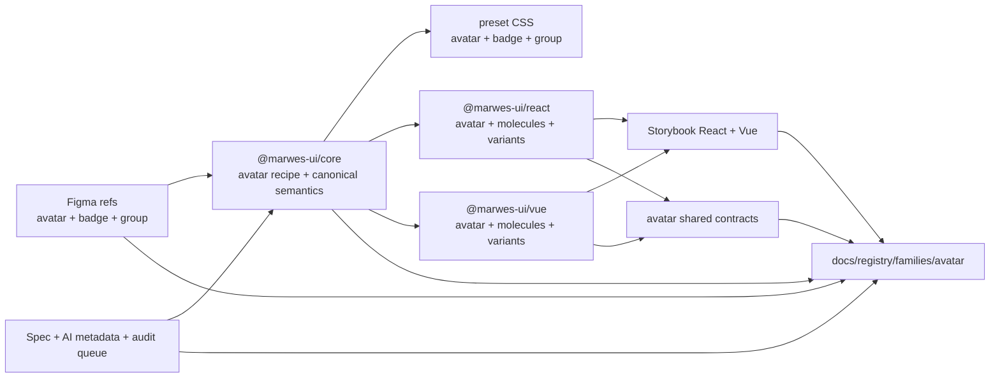
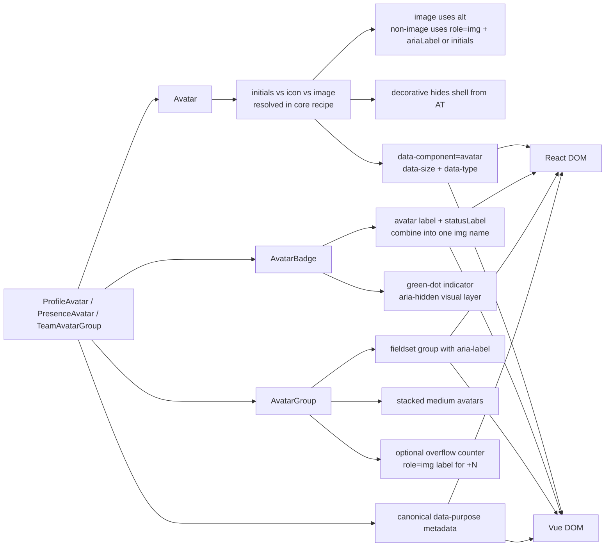

# Avatar Registry

> Family: `avatar`
>
> Local design refs only — this page uses the synced files under `.figma/` and makes no
> Figma API calls.

## Registry files

- [`registry.meta.json`](./registry.meta.json)
- [`registry.generated.json`](./registry.generated.json)
- [`../../../../artifacts/component-registry.json`](../../../../artifacts/component-registry.json)

## Registry snapshot

| Field | Value |
| --- | --- |
| Family status | Shipped |
| Audit status | Queued — later wave, no dedicated family audit doc yet |
| Semantic coverage | Canonical — part of the wave-1 central semantic registry |
| Generated structural truth | `registry.generated.json` + `artifacts/component-registry.json` |
| Primary Figma nodes | avatar component set `1574:27371`, avatar-badge component set `1574:27394`, avatar-group component `1574:27395`, light frame `1574:27460`, dark frame `1574:27570` |
| Main AXE watch item | image-avatar naming quality, decorative-vs-informative intent, and grouped overflow labeling |

## Registry ownership

- `README.md` is the human teaching page.
- `registry.meta.json` is the authored structured summary for this family.
- `registry.generated.json` and `artifacts/component-registry.json` are generator-owned structural outputs.
- this family already uses canonical central semantic metadata in `@marwes-ui/core`, not only family-local wrapper metadata.
- `visuals/*.mmd` help people orient themselves quickly, but they are not the canonical implementation source.

## Summary

The Avatar family is Marwes' identity-surface family for people, members, and grouped presence.
It combines:
- a raw `Avatar` atom for initials, icon fallback, and image content
- `AvatarBadge` for the online presence-dot composition
- `AvatarGroup` for the stacked medium-avatar group with overflow counter
- purpose wrappers for `ProfileAvatar`, `PresenceAvatar`, and `TeamAvatarGroup`
- canonical family and purpose semantics in core

This makes Avatar a strong ninth registry family because it ties together:
- one of the clearest non-interactive semantic families in the central registry
- synced Figma refs that already show the atom plus both shipped molecules on one page
- shared React/Vue contracts for atom, badge, and group behavior
- Storybook guidance that cleanly teaches raw avatar surfaces vs semantic purpose wrappers
- an honest AXE posture where automation is strong even though a dedicated family audit doc has not been written yet

## Family surface map

| Surface level | Main members | Why it matters |
| --- | --- | --- |
| Atom | `Avatar` | low-level identity primitive for initials, icon fallback, and image content across three sizes |
| Molecules | `AvatarBadge`, `AvatarGroup` | canonical online-indicator and stacked-group compositions taken from the current Figma scope |
| Purpose variants | `ProfileAvatar`, `PresenceAvatar`, `TeamAvatarGroup` | thin semantic wrappers that attach canonical `data-purpose` metadata |
| Canonical product path | purpose wrappers when the identity context is known | recommended semantic-first surface for product code |
| Architecture boundary | raw `Avatar` vs molecules | separates the standalone identity primitive from the presence and grouped-layout compositions |
| Escape hatch | raw `Avatar`, `AvatarBadge`, or `AvatarGroup` | supported when consumers intentionally own surrounding labels, status wording, or roster context |

## Canonical visual understanding

Read this section in this order:
1. canonical Storybook story references for runtime visuals
2. the layer map for repo placement
3. the interaction map for naming, decoration, and grouped-avatar flow

## Primary visual sources

| Source | Path | Why it matters |
| --- | --- | --- |
| React Storybook | `apps/storybook-react/src/stories/avatar/Introduction.mdx` | canonical React teaching surface for atom, molecule, and purpose layers |
| React Storybook | `apps/storybook-react/src/stories/avatar/avatar.stories.tsx` | full atom matrix across size and content variants |
| React Storybook | `apps/storybook-react/src/stories/avatar/avatar-group.stories.tsx` | canonical stacked-group runtime surface |
| React Storybook | `apps/storybook-react/src/stories/avatar/team-avatar-group.stories.tsx` | semantic grouped-avatar baseline |
| Vue Storybook | `apps/storybook-vue/src/stories/avatar/Introduction.mdx` | canonical Vue teaching surface for the same family layers |
| Vue Storybook | `apps/storybook-vue/src/stories/avatar/avatar.stories.ts` | full Vue atom matrix across size and content variants |
| Vue Storybook | `apps/storybook-vue/src/stories/avatar/avatar-group.stories.ts` | canonical stacked-group runtime surface in Vue |
| Vue Storybook | `apps/storybook-vue/src/stories/avatar/team-avatar-group.stories.ts` | semantic grouped-avatar baseline in Vue |
| Figma showcase | `.figma/marwes/pages/-avatar/-avatar_1574-27460.json` | family baseline light frame covering atom sizes, types, badge, and group |
| Figma showcase | `.figma/marwes/pages/-avatar/-avatar-dark_1574-27570.json` | dark-mode avatar baseline |
| Figma showcase | `.figma/marwes/pages/-avatar/component-container_1574-27408.json` | compact component inventory view for avatar, badge, and group |
| Figma showcase | `.figma/marwes/pages/cover/avatar-group_1825-30447.json` | cover-level stacked avatar-group baseline |

> Minimum visual reading set for this family: Storybook Introduction, `avatar`, `avatar-group`, `team-avatar-group`, then the light and dark Figma avatar frames.

## Figma references

Primary synced refs:
- `.figma/INDEX.md`
- `.figma/marwes/components/avatar.json`
- `.figma/marwes/components/avatar-badge.json`
- `.figma/marwes/components/avatar-group.json`
- `.figma/NODE_REFERENCE.md`
- `.figma/nodes.json`
- `.figma/marwes/pages/-avatar/README.md`

Primary showcase nodes from the synced avatar page:
- Avatar component set: `1574:27371`
- Avatar-badge component set: `1574:27394`
- Avatar-group component: `1574:27395`
- Avatar light frame: `1574:27460`
- Avatar dark frame: `1574:27570`
- Main component container: `1574:27408`
- Cover avatar-group frame: `1825:30447`

Related synced page refs:
- `.figma/marwes/pages/-avatar/component-container_1574-27051.json`
- `.figma/marwes/pages/-avatar/component-container_1574-27408.json`
- `.figma/marwes/pages/-avatar/-avatar_1574-27460.json`
- `.figma/marwes/pages/-avatar/-avatar-dark_1574-27570.json`
- `.figma/marwes/pages/cover/avatar-group_1825-30447.json`

## Figma variant summary

| Surface | Variants | States | Notable tokens |
| --- | --- | --- | --- |
| Avatar showcase light/dark frames | atom sizes, content types, online badge, and stacked group | `small`, `medium`, `large`, `initials`, `icon`, `image`, `online`, `stacked` | the synced page teaches brand-filled initials, bordered icon/image shells, badge green-dot treatment, and stacked overlap, but `.figma/NODE_REFERENCE.md` does not yet list a dedicated avatar token inventory |
| Avatar component JSON | `Size=Small|Medium|Large` × `Type=Initials|Icon|Image` | structural size/type matrix | 9 component variants with direct initials, icon, and image composition baselines |
| Avatar-badge component JSON | `Size=Small|Medium|Large` | online indicator only | badge is structurally tied to the initials avatar baseline in Figma, while the shipped adapters allow the same molecule on top of other avatar content types |
| Avatar-group component JSON | one stacked group composition | overlap + counter baseline | stacked medium avatars plus a `+3` counter rather than a large interaction matrix |

> Important family distinction: the synced avatar page is already strong for visual scope, but the shipped family contract also includes canonical `data-component="avatar"` semantics, purpose wrappers, decorative handling, and grouped labeling behavior that Figma does not prove on its own.
>
> In other words: Figma is the visual baseline for sizes, content types, badge placement, and stacked overlap, while Storybook and the shared contracts are the better references for semantic metadata and accessibility behavior.
>
> Also note: `.figma/NODE_REFERENCE.md` does not currently include an Avatar row, so the synced avatar page JSON files are the better direct design references for this family right now.

## Visual model

### Layer map



Source copy: [`visuals/layer-map.mmd`](./visuals/layer-map.mmd)

### File map

```mermaid
flowchart TD
  Registry["docs/registry/families/avatar"]
  Registry --> Meta["registry.meta.json"]
  Registry --> Generated["registry.generated.json"]
  Registry --> Visuals["visuals/*.mmd"]

  Semantics["packages/core/src/semantics/"]
  Semantics --> FamilySemantics["family-semantics.ts"]
  Semantics --> PurposeSemantics["purpose-semantics.ts"]

  Core["packages/core/src/components/atoms/avatar/"]
  Core --> CoreFiles["avatar-a11y.ts avatar-recipe.ts avatar-types.ts"]

  Presets["packages/presets/src/firstEdition/"]
  Presets --> AvatarCss["avatar.css"]

  React["packages/react/src/components/avatar/"]
  React --> ReactFiles["avatar.tsx avatar-badge.tsx avatar-group.tsx variants.tsx tests"]

  Vue["packages/vue/src/components/avatar/"]
  Vue --> VueFiles["avatar.ts avatar-badge.ts avatar-group.ts variants.ts tests"]

  StoriesR["apps/storybook-react/src/stories/avatar/"]
  StoriesV["apps/storybook-vue/src/stories/avatar/"]
  Contracts["tests/contracts/avatar*.contract.ts"]
```



Source copy: [`visuals/file-map.mmd`](./visuals/file-map.mmd)

### Interaction and semantics map



Source copy: [`visuals/interaction-map.mmd`](./visuals/interaction-map.mmd)

## Philosophy

- **Teach purpose wrappers first when the context is known.** `ProfileAvatar`, `PresenceAvatar`, and `TeamAvatarGroup` make product intent more readable than raw avatar props alone.
- **Keep the atom deliberately small and non-interactive.** `Avatar` should stay focused on rendering identity content, not on upload, editing, menus, or click behavior.
- **Keep canonical semantics in core.** The family-level `data-component="avatar"` contract and purpose vocabulary should stay source-owned in the semantic registry.
- **Keep naming rules honest by content type.** Image avatars rely on `alt`, while non-image avatars use `ariaLabel` or normalized initials when they are informative.
- **Keep the molecule scope tied to current design truth.** `AvatarBadge` and `AvatarGroup` should stay faithful to the online-indicator and stacked-medium group patterns that are actually shown in the synced Figma refs.

## AXE / accessibility posture

| Area | Status | Notes |
| --- | --- | --- |
| Risk tier | Low | avatar is non-interactive and visually simple, but name quality and grouped labeling still matter |
| Audit status | Queued | `docs/audits/README.md` lists Avatar in Wave 2; no dedicated family audit doc exists yet |
| Automated contract | Strong | shared avatar, avatar-badge, and avatar-group contracts cover the main family behavior in both adapters |
| Manual review boundary | Narrow | product-level image alt quality, status wording, and overflow labeling still need human judgment |
| AXE follow-up | Active discipline | `AXE_ROADMAP.md` tracks a possible warning for likely unlabeled non-decorative image avatars |

### What automation already covers

- default icon fallback and medium-size baseline for the raw `Avatar` atom
- initials normalization, size variants, image avatars with alt text, and decorative hiding behavior
- `AvatarBadge` online labeling, size variants, and decorative behavior
- `AvatarGroup` grouped fieldset labeling and overflow counter rendering
- canonical purpose metadata for `profile`, `presence`, and `team`
- Storybook introduction and taxonomy coverage in both apps

### What still needs manual review or policy clarity

- whether likely unlabeled non-decorative image avatars should trigger a dev-time warning in core
- product-level quality of `alt`, `ariaLabel`, `statusLabel`, and overflow wording in real usage
- whether the current grouped-count model is enough if future avatar-group variants need richer participant summaries

### Why the semantics are intentionally called canonical

This family is part of the wave-1 central semantic registry in `@marwes-ui/core`.

That matters because:
- `data-component="avatar"` is source-owned in core rather than inferred only from adapter wrappers
- purpose vocabulary such as `profile`, `presence`, and `team` is centralized in the semantic registry
- React and Vue purpose wrappers are expected to emit the same semantic contract rather than inventing their own family-local meanings

### Current implementation hotspots

- `packages/core/src/components/atoms/avatar/avatar-a11y.ts` is the main policy point for decorative handling and accessible naming.
- `packages/core/src/components/atoms/avatar/avatar-recipe.ts` is the semantic source for `data-component`, `data-size`, and resolved avatar type.
- `packages/react/src/components/avatar/avatar-group.tsx` and `packages/vue/src/components/avatar/avatar-group.ts` are the key grouped-label and overflow surfaces.

## Semantics snapshot

| Field | Current avatar family contract |
| --- | --- |
| `data-component` | `avatar` at the canonical family root; `AvatarBadge` and `AvatarGroup` currently add their own molecule-level `data-component` values |
| canonical attributes | `data-component`, `data-size` |
| purpose vocabulary | `profile`, `presence`, `team` |
| source of truth | `packages/core/src/semantics/family-semantics.ts` and `packages/core/src/semantics/purpose-semantics.ts` |

## Linked files

This family follows the same repo tree order used elsewhere in Marwes:

```text
spec/decision → core → preset CSS → React adapter → React stories/tests → Vue adapter → Vue stories/tests → contracts → registry
```

| Layer | Path | Why it matters |
| --- | --- | --- |
| Spec | `docs/reference/spec.md` | explicit avatar atom, molecule, and purpose-wrapper requirements |
| AI metadata | `docs/reference/ai-metadata.md` | canonical avatar family and purpose vocabulary |
| Testing docs | `docs/reference/testing.md` | shared-contract expectations and manual-review framing |
| Audit queue | `docs/audits/README.md` | Avatar is currently queued in Wave 2 and has no dedicated family audit doc yet |
| Core semantics | `packages/core/src/semantics/family-semantics.ts` | canonical family-level avatar attributes |
| Core semantics | `packages/core/src/semantics/purpose-semantics.ts` | `profile`, `presence`, and `team` purpose metadata |
| Core | `packages/core/src/components/atoms/avatar/avatar-types.ts` | public avatar atom contract for size, type, and accessible naming inputs |
| Core | `packages/core/src/components/atoms/avatar/avatar-a11y.ts` | decorative and accessible-naming policy |
| Core | `packages/core/src/components/atoms/avatar/avatar-recipe.ts` | avatar RenderKit assembly and canonical atom metadata |
| Presets | `packages/presets/src/firstEdition/avatar.css` | atom, badge, and group styling |
| React | `packages/react/src/components/avatar/avatar.tsx` | raw avatar atom adapter |
| React | `packages/react/src/components/avatar/avatar-badge.tsx` | presence-dot molecule in React |
| React | `packages/react/src/components/avatar/avatar-group.tsx` | stacked-group molecule in React |
| React | `packages/react/src/components/avatar/variants.tsx` | canonical purpose-avatar wrappers in React |
| Vue | `packages/vue/src/components/avatar/avatar.ts` | raw avatar atom adapter in Vue |
| Vue | `packages/vue/src/components/avatar/avatar-badge.ts` | presence-dot molecule in Vue |
| Vue | `packages/vue/src/components/avatar/avatar-group.ts` | stacked-group molecule in Vue |
| Vue | `packages/vue/src/components/avatar/variants.ts` | canonical purpose-avatar wrappers in Vue |
| Stories | `apps/storybook-react/src/stories/avatar/Introduction.mdx` | canonical React teaching surface |
| Stories | `apps/storybook-vue/src/stories/avatar/Introduction.mdx` | canonical Vue teaching surface |
| Contracts | `tests/contracts/avatar.contract.ts` | shared atom behavior coverage |
| Contracts | `tests/contracts/avatar-badge.contract.ts` | shared badge behavior coverage |
| Contracts | `tests/contracts/avatar-group.contract.ts` | shared group behavior coverage |
| Figma | `.figma/marwes/pages/-avatar/README.md` | synced design page inventory |
| Figma | `.figma/marwes/components/avatar.json` | atom component-set structure |
| Figma | `.figma/marwes/components/avatar-badge.json` | online-indicator molecule structure |
| Figma | `.figma/marwes/components/avatar-group.json` | stacked-group molecule structure |

## Verification

Focused commands for this family:

```bash
pnpm test:typecheck:contracts
pnpm --filter @marwes-ui/react exec vitest run src/components/avatar/__tests__/avatar.test.tsx src/components/avatar/__tests__/avatar-badge.test.tsx src/components/avatar/__tests__/avatar-group.test.tsx src/components/avatar/__tests__/variants.test.tsx src/components/avatar/__tests__/index-exports.test.tsx
pnpm --filter @marwes-ui/vue exec vitest run src/components/avatar/__tests__/avatar.test.ts src/components/avatar/__tests__/avatar-badge.test.ts src/components/avatar/__tests__/avatar-group.test.ts src/components/avatar/__tests__/variants.test.ts src/components/avatar/__tests__/index-exports.test.ts
pnpm --filter ./apps/storybook-react exec vitest run src/stories/avatar/__tests__/avatar-introduction-docs.test.ts src/stories/avatar/__tests__/avatar-taxonomy.test.ts
pnpm --filter ./apps/storybook-vue exec vitest run src/stories/avatar/__tests__/avatar-introduction-docs.test.ts src/stories/avatar/__tests__/avatar-taxonomy.test.ts
pnpm docs:links
```

Broader confidence:

```bash
pnpm check
pnpm test:packages
pnpm storybook:consistency
```

## Registry notes

Current limitations of the PoC:
- the avatar registry is generator-backed, but the family source map is still maintained manually in `scripts/component-registry-sources.ts`
- the family uses Storybook references and Mermaid diagrams for visual orientation rather than committed preview assets
- there is no dedicated `docs/audits/avatar-family-accessibility.md` file yet, so AXE posture currently points at the queue and roadmap rather than a finished family audit doc
- `.figma/NODE_REFERENCE.md` does not currently include the Avatar family, even though the synced avatar page and component JSON files are present and current
- the current molecule scope intentionally stays narrow to the shipped online badge and stacked medium avatar-group patterns

## Open questions

- Should likely unlabeled non-decorative image avatars eventually trigger a dev-time warning in core?
- When Avatar gets a dedicated audit pass, should `AvatarGroup` keep the current count-only overflow model or grow richer participant-summary guidance?
