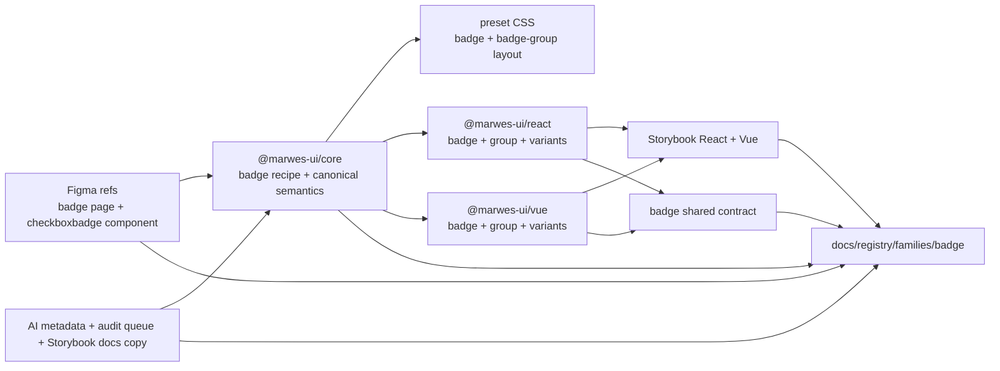
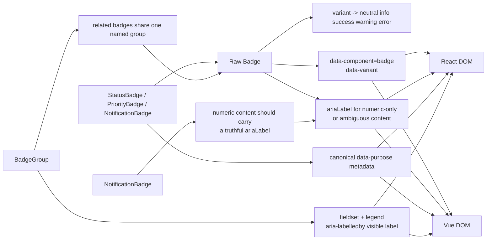

# Badge Registry

> Family: `badge`
>
> Local design refs only — this page uses the synced files under `.figma/` and makes no
> Figma API calls.

## Registry files

- [`registry.meta.json`](./registry.meta.json)
- [`registry.generated.json`](./registry.generated.json)
- [`../../../../artifacts/component-registry.json`](../../../../artifacts/component-registry.json)

## Registry snapshot

| Field | Value |
| --- | --- |
| Family status | Shipped |
| Audit status | Queued — later wave, no dedicated family audit doc yet |
| Semantic coverage | Canonical — part of the wave-1 central semantic registry |
| Generated structural truth | `registry.generated.json` + `artifacts/component-registry.json` |
| Primary Figma nodes | badge light frame `1364:11603`, badge dark frame `2276:56582`, component container `1369:6125`, Checkbox/Badge component `1364:7721`, cover frame `1825:30440` |
| Main AXE watch item | numeric-only badge naming, grouped badge labeling, and keeping the Figma-only brand row distinct from the shipped badge API |

## Registry ownership

- `README.md` is the human teaching page.
- `registry.meta.json` is the authored structured summary for this family.
- `registry.generated.json` and `artifacts/component-registry.json` are generator-owned structural outputs.
- this family already uses canonical central semantic metadata in `@marwes-ui/core`, not only family-local wrapper metadata.
- `visuals/*.mmd` help people orient themselves quickly, but they are not the canonical implementation source.

## Summary

The Badge family is Marwes' compact status-label family for passive, non-interactive state cues.
It combines:
- a raw `Badge` atom for the single badge surface
- `BadgeGroup` as the labeled grouping surface for related badges
- purpose wrappers for `StatusBadge`, `PriorityBadge`, and `NotificationBadge`
- canonical family and purpose semantics in core

This makes Badge a strong eleventh registry family because it ties together:
- one of the smaller canonical semantic families in the central registry
- synced Figma refs that clearly teach the single-badge light and dark visual matrix
- shared React/Vue contract coverage for the canonical purpose wrappers
- Storybook guidance that cleanly separates purpose wrappers, grouped usage, and the raw atom
- an honest registry note that the current Figma page still shows a `brand` row that Marwes does not ship

## Family surface map

| Surface level | Main members | Why it matters |
| --- | --- | --- |
| Atom | `Badge` | low-level passive badge surface for compact text, status cues, and numeric content |
| Molecule | `BadgeGroup` | canonical labeled grouping surface for related badges rendered together |
| Purpose variants | `StatusBadge`, `PriorityBadge`, `NotificationBadge` | thin semantic wrappers that attach canonical `data-purpose` metadata |
| Canonical product path | purpose wrappers and `BadgeGroup` when several related badges are shown together | recommended semantic-first surface for product code |
| Architecture boundary | raw `Badge` vs grouped and purpose surfaces | separates the single badge primitive from grouping and semantic intent |
| Escape hatch | raw `Badge` in custom layouts | supported when consumers intentionally own surrounding context and naming for ambiguous content |

## Canonical visual understanding

Read this section in this order:
1. canonical Storybook story references for runtime visuals
2. the layer map for repo placement
3. the interaction map for badge semantics, numeric naming, and grouped labeling

## Primary visual sources

| Source | Path | Why it matters |
| --- | --- | --- |
| React Storybook | `apps/storybook-react/src/stories/badge/Introduction.mdx` | canonical React teaching surface for purpose wrappers, BadgeGroup, and the raw atom |
| React Storybook | `apps/storybook-react/src/stories/badge/badge.stories.tsx` | raw badge visual matrix across shipped variants and light/dark presentation |
| React Storybook | `apps/storybook-react/src/stories/badge/badge-group.stories.tsx` | canonical grouped-badge runtime surface |
| React Storybook | `apps/storybook-react/src/stories/badge/status-badge.stories.tsx` | semantic-first status path in React |
| React Storybook | `apps/storybook-react/src/stories/badge/priority-badge.stories.tsx` | semantic-first priority path in React |
| React Storybook | `apps/storybook-react/src/stories/badge/notification-badge.stories.tsx` | numeric badge naming baseline in React |
| Vue Storybook | `apps/storybook-vue/src/stories/badge/Introduction.mdx` | canonical Vue teaching surface for the same family split |
| Vue Storybook | `apps/storybook-vue/src/stories/badge/badge.stories.ts` | raw badge visual matrix in Vue |
| Vue Storybook | `apps/storybook-vue/src/stories/badge/badge-group.stories.ts` | canonical grouped-badge runtime surface in Vue |
| Vue Storybook | `apps/storybook-vue/src/stories/badge/status-badge.stories.ts` | semantic-first status path in Vue |
| Vue Storybook | `apps/storybook-vue/src/stories/badge/priority-badge.stories.ts` | semantic-first priority path in Vue |
| Vue Storybook | `apps/storybook-vue/src/stories/badge/notification-badge.stories.ts` | numeric badge naming baseline in Vue |
| Figma showcase | `.figma/marwes/pages/-badge/-badge_1364-11603.json` | family baseline light matrix across the synced badge tones |
| Figma showcase | `.figma/marwes/pages/-badge/-badge-dark_2276-56582.json` | dark-mode badge matrix baseline |
| Figma showcase | `.figma/marwes/pages/-badge/component-container_1369-6125.json` | compact inventory view for the single badge component |
| Figma showcase | `.figma/marwes/pages/cover/badges_1825-30440.json` | small cover-level badge inventory reference |

> Minimum visual reading set for this family: Storybook Introduction, `badge-group`, `notification-badge`, then the light and dark Figma badge frames.

## Figma references

Primary synced refs:
- `.figma/INDEX.md`
- `.figma/marwes/components/checkboxbadge.json`
- `.figma/NODE_REFERENCE.md`
- `.figma/nodes.json`
- `.figma/marwes/pages/-badge/README.md`

> Current sync note: there is no dedicated `.figma/marwes/components/badge.json` file right now. The live sync still exposes the underlying badge component as `Checkbox/Badge`, and the main family overview comes from the page JSON files.

Primary showcase nodes from the synced badge page:
- Badge light frame: `1364:11603`
- Badge dark frame: `2276:56582`
- Component container: `1369:6125`
- Checkbox/Badge component: `1364:7721`
- Cover badges frame: `1825:30440`

Related synced page refs:
- `.figma/marwes/pages/-badge/-badge_1364-11603.json`
- `.figma/marwes/pages/-badge/-badge-dark_2276-56582.json`
- `.figma/marwes/pages/-badge/component-container_1369-6125.json`
- `.figma/marwes/pages/cover/badges_1825-30440.json`

## Figma variant summary

| Surface | Variants | States | Notable tokens |
| --- | --- | --- | --- |
| Badge showcase light/dark frames | tone rows for the single badge surface | `neutral`, `brand`, `info`, `success`, `warning`, `error` across `light` and `dark` pages | `badge/surface`, `badge/border`, `badge/label` |
| Checkbox/Badge component JSON + component container | one structural badge component with a label toggle | standalone pill baseline rather than a multi-variant component set | the current sync exposes the family as `Checkbox/Badge`, not as a dedicated `badge.json` component set |
| Cover badges frame | repeated badge instances | compact inventory reference | useful as a quick orientation frame, but it does not teach grouping or purpose-wrapper semantics |

> Important family distinction: the synced Figma page teaches the single badge surface well, but the shipped Marwes family also includes `BadgeGroup`, canonical purpose wrappers, and explicit numeric-badge naming guidance.
>
> In other words: Figma is the visual baseline for passive badge tone and theme treatment, while Storybook and the shared contracts are the better references for grouping, semantic purpose, and accessibility behavior.
>
> Also note: the Figma light/dark matrices include a `brand` row, but the shipped Badge API currently exposes only `neutral`, `info`, `success`, `warning`, and `error` variants.
>
> One more sync wrinkle: `.figma/NODE_REFERENCE.md` still points badge dark-token provenance at the older V3 dark frame `1368:5847`, while the current dedicated badge page uses `2276:56582`.

## Visual model

### Layer map



Source copy: [`visuals/layer-map.mmd`](./visuals/layer-map.mmd)

### File map

```mermaid
flowchart TD
  Registry["docs/registry/families/badge"]
  Registry --> Meta["registry.meta.json"]
  Registry --> Generated["registry.generated.json"]
  Registry --> Visuals["visuals/*.mmd"]

  Semantics["packages/core/src/semantics/"]
  Semantics --> FamilySemantics["family-semantics.ts"]
  Semantics --> PurposeSemantics["purpose-semantics.ts"]

  Core["packages/core/src/components/atoms/badge/"]
  Core --> CoreFiles["badge-a11y.ts badge-recipe.ts badge-types.ts"]
  StoriesCopy["packages/core/src/storybook/docs-copy.ts"]
  CoreTests["packages/core/test/recipes/badge.test.ts"]
  Core --> CoreTests

  Presets["packages/presets/src/firstEdition/"]
  Presets --> BadgeCss["badge.css"]

  React["packages/react/src/components/badge/"]
  React --> ReactFiles["badge.tsx badge-group.tsx variants.tsx tests"]

  Vue["packages/vue/src/components/badge/"]
  Vue --> VueFiles["badge.ts badge-group.ts variants.ts tests"]

  StoriesR["apps/storybook-react/src/stories/badge/"]
  StoriesR --> StoriesCopy
  StoriesV["apps/storybook-vue/src/stories/badge/"]
  StoriesV --> StoriesCopy
  Contracts["tests/contracts/badge.contract.ts"]
```



Source copy: [`visuals/file-map.mmd`](./visuals/file-map.mmd)

### Interaction and semantics map



Source copy: [`visuals/interaction-map.mmd`](./visuals/interaction-map.mmd)

## Philosophy

- **Teach purpose badges first when the intent is known.** `StatusBadge`, `PriorityBadge`, and `NotificationBadge` read more clearly than a raw `Badge` with hand-wired metadata.
- **Keep the raw atom deliberately small and passive.** `Badge` should stay a non-interactive visual-semantic primitive rather than becoming a chip, filter, or dismissible token.
- **Keep canonical semantics in core.** The base `data-component="badge"` contract and the purpose vocabulary belong in the central semantic registry.
- **Keep BadgeGroup structural and labeled.** It should help with grouped reading and accessible naming without becoming a second semantic root for the family.
- **Keep design truth honest to shipped truth.** The synced Figma page still shows a `brand` row, but the registry should describe only the variants the code actually ships today.

## AXE / accessibility posture

| Area | Status | Notes |
| --- | --- | --- |
| Risk tier | Low | badge is passive and visually small, but naming quality and grouped meaning still matter |
| Audit status | Queued | `docs/audits/README.md` lists Badge in Wave 2; no dedicated family audit doc exists yet |
| Automated contract | Strong | core recipe tests, a shared badge contract, local adapter tests, and Storybook docs/taxonomy tests already cover the main shipped family behavior |
| Manual review boundary | Narrow | product-level wording, numeric badge labeling, and real grouped-context quality still need human judgment |
| AXE follow-up | Active discipline | the family is still queued for a dedicated audit pass and broader support-model work |

### What automation already covers

- default neutral behavior, variant class names, and `ariaLabel` passthrough in the core recipe
- canonical purpose semantics for `status`, `priority`, and `notification` through shared React/Vue contract coverage
- `BadgeGroup` fieldset, legend, and `aria-labelledby` wiring in both adapters
- Storybook introduction and taxonomy coverage in both apps

### What still needs manual review or policy clarity

- whether numeric-only notification badges consistently receive truthful `ariaLabel` values in product usage
- whether grouped badges always have enough visible labeling or surrounding context in real layouts
- whether the current Figma-only `brand` row should stay design-only or eventually become a shipped variant

### Why the semantics are intentionally called canonical

This family is part of the wave-1 central semantic registry in `@marwes-ui/core`.

That matters because:
- `data-component="badge"` is source-owned in core rather than inferred only from adapter wrappers
- purpose vocabulary such as `status`, `priority`, and `notification` is centralized in the semantic registry
- React and Vue purpose wrappers are expected to emit the same semantic contract rather than inventing their own family-local meanings

### Current implementation hotspots

- `packages/core/src/components/atoms/badge/badge-recipe.ts` is the main policy point for canonical badge family identity and `data-variant` emission.
- `packages/react/src/components/badge/badge-group.tsx` and `packages/vue/src/components/badge/badge-group.ts` are the key grouped-label surfaces.
- `tests/contracts/badge.contract.ts` is the most important shared regression boundary for this family.

## Semantics snapshot

| Field | Current badge family contract |
| --- | --- |
| `data-component` | `badge` |
| canonical attributes | `data-component`, `data-variant` |
| purpose vocabulary | `status`, `priority`, `notification` |
| source of truth | `packages/core/src/semantics/family-semantics.ts` and `packages/core/src/semantics/purpose-semantics.ts` |

## Linked files

This family follows the same repo tree order used elsewhere in Marwes:

```text
spec/decision → core → preset CSS → React adapter → React stories/tests → Vue adapter → Vue stories/tests → contracts → registry
```

| Layer | Path | Why it matters |
| --- | --- | --- |
| Spec | `docs/reference/spec.md` | there is no badge-specific section yet, which makes the semantic registry, Storybook docs, and tests the more important current contract sources |
| AI metadata | `docs/reference/ai-metadata.md` | canonical badge family and purpose vocabulary |
| Testing docs | `docs/reference/testing.md` | shared-contract expectations and manual-review framing |
| Audit queue | `docs/audits/README.md` | Badge is currently queued in Wave 2 and has no dedicated family audit doc yet |
| Core semantics | `packages/core/src/semantics/family-semantics.ts` | canonical family-level badge attributes |
| Core semantics | `packages/core/src/semantics/purpose-semantics.ts` | `status`, `priority`, and `notification` purpose metadata |
| Core | `packages/core/src/components/atoms/badge/badge-types.ts` | public raw badge contract for variant and accessible naming inputs |
| Core | `packages/core/src/components/atoms/badge/badge-a11y.ts` | minimal accessible-naming passthrough policy |
| Core | `packages/core/src/components/atoms/badge/badge-recipe.ts` | badge RenderKit assembly and canonical atom metadata |
| Core docs copy | `packages/core/src/storybook/docs-copy.ts` | Introduction-doc teaching copy reused by both Storybook apps |
| Presets | `packages/presets/src/firstEdition/badge.css` | raw badge visuals plus grouped-badge layout styling |
| React | `packages/react/src/components/badge/badge.tsx` | raw badge atom adapter |
| React | `packages/react/src/components/badge/badge-group.tsx` | labeled grouped-badge surface in React |
| React | `packages/react/src/components/badge/variants.tsx` | canonical purpose-badge wrappers in React |
| Vue | `packages/vue/src/components/badge/badge.ts` | raw badge atom adapter in Vue |
| Vue | `packages/vue/src/components/badge/badge-group.ts` | labeled grouped-badge surface in Vue |
| Vue | `packages/vue/src/components/badge/variants.ts` | canonical purpose-badge wrappers in Vue |
| Stories | `apps/storybook-react/src/stories/badge/Introduction.mdx` | canonical React teaching surface |
| Stories | `apps/storybook-react/src/stories/badge/notification-badge.stories.tsx` | clearest numeric-label badge reference in React |
| Stories | `apps/storybook-vue/src/stories/badge/Introduction.mdx` | canonical Vue teaching surface |
| Stories | `apps/storybook-vue/src/stories/badge/notification-badge.stories.ts` | clearest numeric-label badge reference in Vue |
| Contracts | `tests/contracts/badge.contract.ts` | shared canonical purpose-badge semantics |
| Core test | `packages/core/test/recipes/badge.test.ts` | recipe-level baseline for classes and naming |
| Figma | `.figma/marwes/pages/-badge/README.md` | synced design page inventory |
| Figma | `.figma/marwes/components/checkboxbadge.json` | current structural badge component JSON in the local sync |
| Figma | `.figma/NODE_REFERENCE.md` | badge node ids, token list, and the current dark-frame provenance mismatch note |

## Verification

Focused commands for this family:

```bash
pnpm --filter @marwes-ui/core exec vitest run test/recipes/badge.test.ts
pnpm test:typecheck:contracts
pnpm --filter @marwes-ui/react exec vitest run src/components/badge/__tests__/badge.test.tsx src/components/badge/__tests__/badge-group.test.tsx src/components/badge/__tests__/variants.test.tsx src/components/badge/__tests__/index-exports.test.tsx
pnpm --filter @marwes-ui/vue exec vitest run src/components/badge/__tests__/badge.test.ts src/components/badge/__tests__/badge-group.test.ts src/components/badge/__tests__/variants.test.ts src/components/badge/__tests__/index-exports.test.ts
pnpm --filter ./apps/storybook-react exec vitest run src/stories/badge/__tests__/badge-introduction-docs.test.ts src/stories/badge/__tests__/badge-taxonomy.test.ts
pnpm --filter ./apps/storybook-vue exec vitest run src/stories/badge/__tests__/badge-introduction-docs.test.ts src/stories/badge/__tests__/badge-taxonomy.test.ts
pnpm docs:links
```

Broader confidence:

```bash
pnpm check
pnpm test:packages
pnpm storybook:consistency
```

## Registry notes

Current limitations of the PoC:
- the badge registry is generator-backed, but the family source map is still maintained manually in `scripts/component-registry-sources.ts`
- the family uses Storybook references and Mermaid diagrams for visual orientation rather than committed preview assets
- there is no dedicated `docs/audits/badge-family-accessibility.md` file yet, so AXE posture currently points at the queue and support-model work rather than a finished family audit doc
- the synced Figma family currently comes through page frames plus `checkboxbadge.json`, not a dedicated `badge.json` component file
- the current synced badge page includes a `brand` row that is not part of the shipped Badge API today
- the badge page also includes an `overall-status` instance that is intentionally not treated as a shipped Marwes badge surface in this registry entry

## Open questions

- Should the Figma-only `brand` badge row eventually become a shipped Badge variant, or should the registry keep treating it as design-only?
- If product teams ask for clickable filters, dismissible tags, or chips, should that remain a separate family instead of expanding the current passive badge contract?
