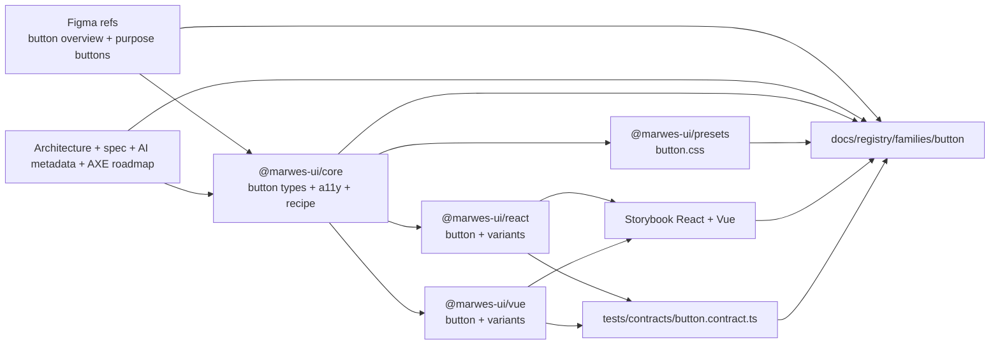
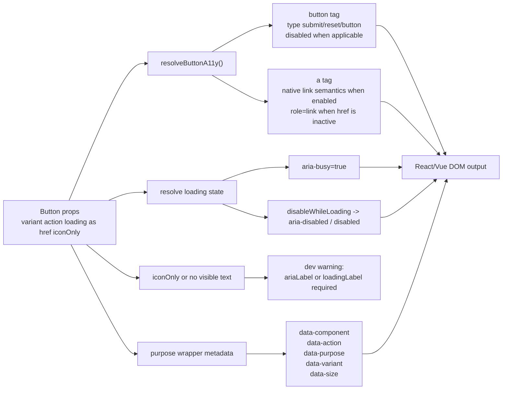

# Button Registry

> Family: `button`
>
> Local design refs only — this page uses the synced files under `.figma/` and makes no Figma API calls.

## Registry files

- [`registry.meta.json`](./registry.meta.json)
- [`registry.generated.json`](./registry.generated.json)
- [`../../../../artifacts/component-registry.json`](../../../../artifacts/component-registry.json)

## Registry snapshot

| Field | Value |
| --- | --- |
| Family status | Shipped |
| Audit status | First pass complete |
| Semantic coverage | Canonical — part of the wave-1 central semantic registry |
| Generated structural truth | `registry.generated.json` + `artifacts/component-registry.json` |
| Primary Figma nodes | base light `1371:11172`, base dark `1371:11537`, purpose light `1371:8933`, purpose dark `1371:9188` |
| Main AXE watch item | keeping navigation links honest, preserving the action-vs-navigation distinction, and avoiding fake-button semantics on anchors |

## Registry ownership

- `README.md` is the human teaching page.
- `registry.meta.json` is the authored structured summary for this family.
- `registry.generated.json` and `artifacts/component-registry.json` are generator-owned structural outputs.
- this family already uses canonical central semantic metadata in `@marwes-ui/core`, not only family-local wrapper metadata.
- `visuals/*.mmd` help people orient themselves quickly, but they are not the canonical implementation source.

## Summary

The Button family is one of the clearest expressions of the Marwes philosophy:
- the base `Button` atom stays available as the escape hatch
- purpose wrappers are the recommended path when intent is known
- semantics live in core and are emitted consistently by React and Vue
- Storybook teaches the semantic-first path instead of only exposing raw props

This family is also a good first registry proof of concept because it ties together:
- Figma base variants and purpose buttons
- core a11y logic and semantic metadata
- thin React and Vue adapters
- shared cross-adapter contract coverage
- a resolved first-pass semantics cleanup for anchor-backed navigation paths

## Family surface map

| Surface level | Main members | Why it matters |
| --- | --- | --- |
| Atom | `Button` | lowest-level action surface with explicit `variant`, `action`, loading, and tag behavior |
| Visual wrappers | `PrimaryButton`, `SecondaryButton`, `TextButton`, `SuccessButton` | stable visual treatments without additional semantic purpose |
| Purpose variants | `SubmitButton`, `CancelButton`, `SaveButton`, `DestructiveButton`, and related wrappers | common workflow wrappers with stable semantic intent |
| Canonical path | purpose wrappers | recommended semantic-first surface for product code |
| Escape hatch | raw `Button` | explicit fallback when the canonical purpose wrappers are not the right fit |

## Canonical visual understanding

Read this section in this order:
1. canonical Storybook story references for runtime visuals
2. the layer map for repo placement
3. the interaction map for a11y and semantics flow

## Primary visual sources

| Source | Path | Why it matters |
| --- | --- | --- |
| React Storybook | `apps/storybook-react/src/stories/button/button.stories.tsx` | canonical base button runtime surface |
| React Storybook | `apps/storybook-react/src/stories/button/submit-button.stories.tsx` | canonical purpose-button teaching surface |
| Vue Storybook | `apps/storybook-vue/src/stories/button/button.stories.ts` | canonical Vue base button runtime surface |
| Vue Storybook | `apps/storybook-vue/src/stories/button/submit-button.stories.ts` | canonical Vue purpose-button teaching surface |
| Vue Storybook | `apps/storybook-vue/src/stories/button/link-button.stories.ts` | anchor-backed navigation edge case in Vue |
| Figma showcase | `.figma/marwes/pages/-button/component-container_1364-11870.json` | curated base visual baseline |
| Figma showcase | `.figma/marwes/pages/-button/-purpose-buttons_1371-8933.json` | curated purpose-button visual baseline |

> Minimum visual reading set for this family: Storybook Introduction, `button`, `submit-button`, `link-button`, then the Figma base and purpose-button frames.

## Figma references

Primary synced refs:
- `.figma/INDEX.md`
- `.figma/marwes/components/button.json`
- `.figma/NODE_REFERENCE.md`
- `.figma/nodes.json`

Primary showcase nodes from `.figma/NODE_REFERENCE.md`:
- Base button light frame: `1371:11172`
- Base button dark frame: `1371:11537`
- Purpose buttons light frame: `1371:8933`
- Purpose buttons dark frame: `1371:9188`

Related synced page refs:
- `.figma/marwes/pages/-button/component-container_1364-11870.json`
- `.figma/marwes/pages/-button/-purpose-buttons_1371-8933.json`
- `.figma/marwes/pages/cover/buttons_1825-30427.json`
- `.figma/marwes/pages/cover/buttons_1825-30431.json`
- `.figma/marwes/pages/cover/buttons_1825-30435.json`

## Figma variant summary

| Surface | Variants | States | Notable tokens |
| --- | --- | --- | --- |
| Base button showcase | `primary`, `secondary`, `text` | `default`, `hover`, `pressed`, `disabled`, `focus` | `Primary/Surface`, `Primary/Label`, `Secondary/Outline`, `Secondary/Label`, `Text/Label` |
| Synced component JSON | `primary`, `secondary`, `text`, `neutral` | icon left, icon right, icon none | 4px radius, 16px icon slot, 40px standard height, 24px text-button height |
| Purpose buttons showcase | 25 intent examples | canonical visual treatment per purpose | `action/primary/*`, `action/secondary/*`, `action/destructive/*`, `action/success/*` |

> Note: the curated showcase in `.figma/NODE_REFERENCE.md` highlights state rows for `primary`, `secondary`, and `text`. The synced component JSON also includes `neutral`, so the registry treats `neutral` as part of the shipped family surface.
>
> Important family distinction: the base button showcase teaches visual variants, while the purpose-button showcase teaches semantic workflow mappings. The registry needs both because Marwes intentionally separates variant styling from purpose intent.

## Visual model

### Layer map



Source copy: [`visuals/layer-map.mmd`](./visuals/layer-map.mmd)

### File map

```mermaid
flowchart TD
  Registry["docs/registry/families/button"]
  Registry --> Meta["registry.meta.json"]
  Registry --> Generated["registry.generated.json"]
  Registry --> Visuals["visuals/*.mmd"]

  Core["packages/core/src/components/atoms/button/"]
  Core --> CoreA11y["button-a11y.ts"]
  Core --> CoreLoading["button-loading.ts"]
  Core --> CoreRecipe["button-recipe.ts"]
  Core --> CoreTypes["button-types.ts"]

  React["packages/react/src/components/button/"]
  React --> ReactButton["button.tsx"]
  React --> ReactVariants["variants.tsx"]
  React --> ReactTests["__tests__/*"]

  Vue["packages/vue/src/components/button/"]
  Vue --> VueButton["button.ts"]
  Vue --> VueVariants["variants.ts"]
  Vue --> VueTests["__tests__/*"]

  Preset["packages/presets/src/firstEdition/button.css"]
  StoriesR["apps/storybook-react/src/stories/button/"]
  StoriesV["apps/storybook-vue/src/stories/button/"]
  Contract["tests/contracts/button.contract.ts"]
```



Source copy: [`visuals/file-map.mmd`](./visuals/file-map.mmd)

### Interaction and semantics map



Source copy: [`visuals/interaction-map.mmd`](./visuals/interaction-map.mmd)

## Philosophy

- **Semantic-first, not prop-first.** The base `Button` exists, but purpose wrappers are the preferred teaching surface.
- **Core owns semantics and accessibility.** `resolveButtonA11y()` decides whether the family renders a native button or anchor-backed control and emits the a11y contract from core.
- **Adapters stay thin.** React and Vue should apply the same RenderKit and semantic metadata without re-implementing the rules.
- **Purpose wrappers should teach intent.** `SubmitButton`, `CancelButton`, `DestructiveButton`, and friends are meant to make product code self-documenting.
- **AXE posture still matters.** This family is not a high-risk custom widget, but it still needs disciplined guidance about when a product should use navigation links vs action buttons.

## AXE / accessibility posture

| Area | Status | Notes |
| --- | --- | --- |
| Risk tier | Medium | lower risk than custom widgets, but still important because Button teaches the action-vs-navigation boundary used throughout product code |
| Audit status | First pass complete | `docs/audits/button-family-accessibility.md` |
| Automated contract | Strong | `tests/contracts/button.contract.ts` plus local React/Vue button tests cover native button behavior, loading behavior, and anchor-backed navigation semantics |
| Dev-time warning | Present | icon-only button path warns when no accessible name exists |
| Manual review boundary | Present | product teams still need to choose honestly between action buttons, navigation links, and plain inline links |
| AXE follow-up | Resolved for first pass | the anchor-backed semantics cleanup is complete; broader accessibility-gate and support-model work still applies |

### What automation already covers

- primary button renders a native button and calls `onClick`
- loading button is busy and disabled
- enabled `LinkButton` preserves native link semantics in both adapters
- disabled/loading anchor-backed paths remove `href`, set `aria-disabled`, and stay unfocusable in both adapters
- Storybook introduction and taxonomy docs are present in both apps

### What still needs manual review or policy clarity

- where product teams should prefer navigation links over action buttons visually styled as links
- when a plain inline text link is the more honest UI than a button-family surface

### Why the semantics are intentionally called canonical

This family is part of the wave-1 central semantic registry in `@marwes-ui/core`.

That matters because:
- `data-component="button"` is source-owned in core rather than inferred only from adapter wrappers
- purpose vocabulary such as `submit`, `cancel`, `destructive`, and `navigation` is centralized in the semantic registry
- React and Vue purpose wrappers are expected to emit the same semantic contract rather than inventing their own family-local meanings

### Current implementation hotspots

- `resolveButtonA11y()` is the most important core policy point for this family.
- loading behavior is part of the shipped button contract, not just a Storybook embellishment.
- icon-only naming is guarded by a dev-time warning, which makes this family a good example of lightweight preventative a11y guidance.

## Semantics snapshot

| Field | Current button family contract |
| --- | --- |
| `data-component` | `button` |
| canonical attributes | `data-component`, `data-action`, `data-variant`, `data-size` |
| purpose vocabulary | `destructive`, `create`, `submit`, `cancel`, `navigation`, `save`, `confirm`, `verify`, `edit`, `close`, `refresh`, `upload`, `download`, `copy`, `search`, `filter`, `sort`, `dropdown`, `success` |
| source of truth | `packages/core/src/semantics/*` |

## Linked files

This family follows the same tree order used in the rest of the repo:

```text
spec/decision → core → preset CSS → React adapter → React stories/tests → Vue adapter → Vue stories/tests → contracts → registry
```

| Layer | Path | Why it matters |
| --- | --- | --- |
| Spec | `docs/reference/spec.md` | button requirements plus the resolved anchor-backed navigation semantics policy |
| Testing docs | `docs/reference/testing.md` | contract expectations and manual review framing |
| Semantics | `packages/core/src/semantics/family-semantics.ts` | canonical family-level semantic attributes and allowed purposes |
| Semantics | `packages/core/src/semantics/purpose-semantics.ts` | canonical purpose metadata for wrappers such as submit, cancel, and destructive |
| Core | `packages/core/src/components/atoms/button/button-types.ts` | public button options, variants, actions, and RenderKit contract |
| Core | `packages/core/src/components/atoms/button/button-a11y.ts` | native button vs anchor-backed semantics, loading, and icon-only rules |
| Core | `packages/core/src/components/atoms/button/button-loading.ts` | normalized loading behavior |
| Core | `packages/core/src/components/atoms/button/button-recipe.ts` | RenderKit assembly |
| Preset | `packages/presets/src/firstEdition/button.css` | static visual treatment |
| React | `packages/react/src/components/button/button.tsx` | thin React adapter |
| React | `packages/react/src/components/button/variants.tsx` | purpose and visual wrappers |
| Vue | `packages/vue/src/components/button/button.ts` | thin Vue adapter |
| Vue | `packages/vue/src/components/button/variants.ts` | purpose and visual wrappers |
| Stories | `apps/storybook-react/src/stories/button/Introduction.mdx` | canonical React teaching surface |
| Stories | `apps/storybook-vue/src/stories/button/Introduction.mdx` | canonical Vue teaching surface |
| Shared contract | `tests/contracts/button.contract.ts` | cross-adapter behavior proof |
| AXE status | `AXE_ROADMAP.md` | records the semantics cleanup as completed first-pass button work |
| Audit | `docs/audits/button-family-accessibility.md` | dedicated execution record for the button family |
| Audit queue | `docs/audits/README.md` | button family status is first-pass complete |
| Figma | `.figma/marwes/components/button.json` | synced base component structure |
| Figma | `.figma/NODE_REFERENCE.md` | canonical node refs and token summary |

## Verification

Focused commands for this family:

```bash
pnpm test:typecheck:contracts
pnpm --filter @marwes-ui/react exec vitest run src/components/button/__tests__/button.test.tsx
pnpm --filter @marwes-ui/vue exec vitest run src/components/button/__tests__/button.test.ts
pnpm storybook:consistency
pnpm check:compass
```

Broader confidence:

```bash
pnpm check
pnpm test:packages
```

## Registry notes

This is the first registry family proof of concept.

Current limitations of the PoC:
- the generator currently has an explicit source map only for `button`
- the registry currently relies on Storybook references and diagrams for visual orientation
- the registry is not yet part of the main trust model

## Open questions

- Which Button-family stories should join the first automated accessibility smoke set?
- Should the registry generator later harvest canonical Storybook story IDs automatically?
