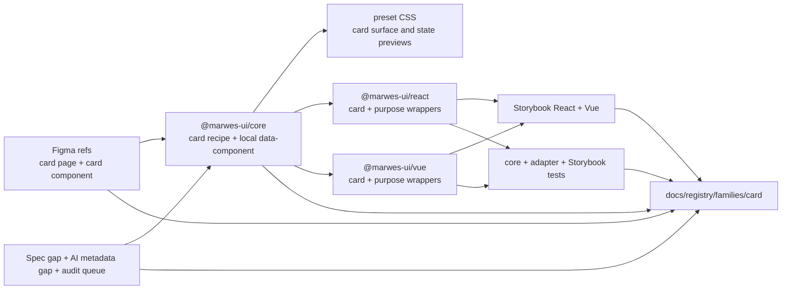
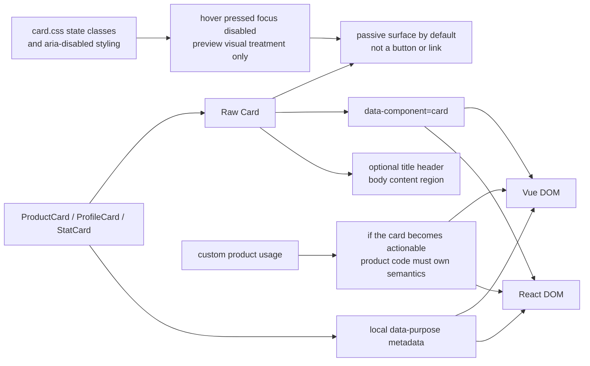

# Card Registry

> Family: `card`
>
> Local design refs only — this page uses the synced files under `.figma/` and makes no
> Figma API calls.

## Registry files

- [`registry.meta.json`](./registry.meta.json)
- [`registry.generated.json`](./registry.generated.json)
- [`../../../../artifacts/component-registry.json`](../../../../artifacts/component-registry.json)

## Registry snapshot

| Field | Value |
| --- | --- |
| Family status | Shipped |
| Audit status | Queued — later wave, no dedicated family audit doc yet |
| Semantic coverage | Family-local — the atom emits local `data-component="card"` metadata in core and the purpose wrappers add local `data-purpose` values, but the family is not part of the wave-1 central semantic registry |
| Generated structural truth | `registry.generated.json` + `artifacts/component-registry.json` |
| Primary Figma nodes | card component `1364:7718`, card light frame `1364:11556`, card dark frame `1368:5891`, component container `1371:13326`, cover frame `1825:30426` |
| Main AXE watch item | keeping the passive card surface distinct from clickable tile semantics and not over-reading the Figma hover/pressed/focus matrix as an interactive contract |

## Registry ownership

- `README.md` is the human teaching page.
- `registry.meta.json` is the authored structured summary for this family.
- `registry.generated.json` and `artifacts/component-registry.json` are generator-owned structural outputs.
- the family currently uses local card metadata in core and local purpose-card metadata in React and Vue wrappers, not the central wave-1 semantic registry.
- `visuals/*.mmd` help people orient themselves quickly, but they are not the canonical implementation source.

## Summary

The Card family is Marwes' simple surface-container family for titled summary content.
It combines:
- a raw `Card` atom for the bordered content shell
- purpose wrappers for `ProductCard`, `ProfileCard`, and `StatCard`
- a light and dark Figma state matrix that teaches the base shell styling
- local React and Vue parity for the raw atom and the purpose wrappers

This makes Card a strong thirteenth registry family because it ties together:
- a compact non-widget family that still benefits from better cross-linking between Figma, Storybook, and code
- a clear design baseline for the shell, spacing, and typography tokens
- an honest semantic story where `data-component="card"` exists in core but the family still sits outside the canonical semantic registry
- purpose wrappers that are simple and readable, even though they are not yet backed by a shared tests/contracts card contract
- a useful warning boundary around not treating visual state previews as proof that the card itself is interactive

## Family surface map

| Surface level | Main members | Why it matters |
| --- | --- | --- |
| Atom | `Card` | low-level titled surface container for grouped content |
| Purpose variants | `ProductCard`, `ProfileCard`, `StatCard` | thin semantic wrappers that attach stable local `data-purpose` metadata |
| Canonical product path | purpose wrappers when the summary context is known | recommended semantic-first surface for product code |
| Architecture boundary | raw `Card` vs purpose wrappers | keeps the surface shell in core and the current semantic intent wrappers in the adapters |
| Visual teaching surface | `Card/Atom` Storybook state matrix | makes the Figma state rows understandable without implying richer runtime behavior |
| Escape hatch | raw `Card` | supported when consumers intentionally own content structure and any surrounding semantics |

## Canonical visual understanding

Read this section in this order:
1. canonical Storybook story references for runtime visuals
2. the layer map for repo placement
3. the interaction map for local metadata, passive-surface scope, and purpose-wrapper flow

## Primary visual sources

| Source | Path | Why it matters |
| --- | --- | --- |
| React Storybook | `apps/storybook-react/src/stories/card/Introduction.mdx` | canonical React teaching surface for the atom and purpose-card split |
| React Storybook | `apps/storybook-react/src/stories/card/card.stories.tsx` | closest runtime mirror of the light/dark state matrix plus body-only and rich-content examples |
| React Storybook | `apps/storybook-react/src/stories/card/product-card.stories.tsx` | canonical product-summary wrapper example in React |
| React Storybook | `apps/storybook-react/src/stories/card/profile-card.stories.tsx` | identity-summary wrapper example in React |
| React Storybook | `apps/storybook-react/src/stories/card/stat-card.stories.tsx` | KPI-summary wrapper example in React |
| Vue Storybook | `apps/storybook-vue/src/stories/card/Introduction.mdx` | canonical Vue teaching surface for the same family split |
| Vue Storybook | `apps/storybook-vue/src/stories/card/card.stories.ts` | closest runtime mirror of the state matrix in Vue |
| Vue Storybook | `apps/storybook-vue/src/stories/card/product-card.stories.ts` | canonical product-summary wrapper example in Vue |
| Vue Storybook | `apps/storybook-vue/src/stories/card/profile-card.stories.ts` | identity-summary wrapper example in Vue |
| Vue Storybook | `apps/storybook-vue/src/stories/card/stat-card.stories.ts` | KPI-summary wrapper example in Vue |
| Figma showcase | `.figma/marwes/pages/-card/-card_1364-11556.json` | family baseline light matrix for the five card states |
| Figma showcase | `.figma/marwes/pages/-card/-card-dark_1368-5891.json` | dark-mode card state matrix baseline |
| Figma showcase | `.figma/marwes/pages/-card/component-container_1371-13326.json` | compact side-by-side state inventory for the base card component |
| Figma showcase | `.figma/marwes/pages/cover/card_1825-30426.json` | quick cover-level orientation view of the single card component |

> Minimum visual reading set for this family: Storybook Introduction, `card`, one purpose-card story, then the light and dark Figma card frames.

## Figma references

Primary synced refs:
- `.figma/INDEX.md`
- `.figma/marwes/components/card.json`
- `.figma/NODE_REFERENCE.md`
- `.figma/nodes.json`
- `.figma/marwes/pages/-card/README.md`

Primary showcase nodes from the synced card page:
- Card component: `1364:7718`
- Card light frame: `1364:11556`
- Card dark frame: `1368:5891`
- Component container: `1371:13326`
- Cover card frame: `1825:30426`

Related synced page refs:
- `.figma/marwes/pages/-card/-card_1364-11556.json`
- `.figma/marwes/pages/-card/component-container_1371-13326.json`
- `.figma/marwes/pages/-card/-card-dark_1368-5891.json`
- `.figma/marwes/pages/cover/card_1825-30426.json`

## Figma variant summary

| Surface | Variants | States | Notable tokens |
| --- | --- | --- | --- |
| Card showcase light/dark frames | one base card shell | `default`, `hover`, `pressed`, `disabled`, `focus` across `light` and `dark` | `card/surface`, `card/border`, `card/title`, `card/body` |
| Card component JSON | one structural base card component | titled shell with a text body region | this file maps directly to the shipped atom and does not encode the purpose-card wrappers |
| Component container + cover frame | base card shown in quick inventory layouts | side-by-side state comparison and one cover instance | useful orientation views for the shell, but they do not teach product-specific purpose wrappers |

> Important family distinction: the synced card page teaches the base shell and its five state previews, but the shipped Marwes family also includes `ProductCard`, `ProfileCard`, and `StatCard` wrappers that exist in adapter code and Storybook rather than in a dedicated Figma card-purpose matrix.
>
> In other words: Figma is the visual baseline for container styling, while Storybook and adapter code are the better references for the current purpose-wrapper vocabulary.
>
> Also note: the Figma page shows hover, pressed, disabled, and focus rows even though the shipped `Card` atom is still a passive surface, not a clickable tile component.
>
> There is also an exploratory `.figma/marwes/components/notification-card.json` plus a `pages/test-claude-do-not-use/notification-card_1411-6919.json` frame in the sync, but this registry entry intentionally excludes that work because it is not part of the shipped Card family today.
>
> The `Overall status` instance on the synced card page is likewise not treated as a shipped Marwes card surface in this registry entry.

## Visual model

### Layer map



Source copy: [`visuals/layer-map.mmd`](./visuals/layer-map.mmd)

### File map

```mermaid
flowchart TD
  Registry["docs/registry/families/card"]
  Registry --> Meta["registry.meta.json"]
  Registry --> Generated["registry.generated.json"]
  Registry --> Visuals["visuals/*.mmd"]

  Core["packages/core/src/components/atoms/card/"]
  Core --> CoreFiles["card-recipe.ts card-types.ts"]
  CoreTests["packages/core/test/recipes/card.test.ts"]
  Core --> CoreTests
  StoriesCopy["packages/core/src/storybook/docs-copy.ts"]

  Presets["packages/presets/src/firstEdition/"]
  Presets --> CardCss["card.css"]

  React["packages/react/src/components/card/"]
  React --> ReactFiles["card.tsx variants.tsx tests"]
  StoriesR["apps/storybook-react/src/stories/card/"]
  StoriesR --> StoriesCopy

  Vue["packages/vue/src/components/card/"]
  Vue --> VueFiles["card.ts variants.ts tests"]
  StoriesV["apps/storybook-vue/src/stories/card/"]
  StoriesV --> StoriesCopy

  SharedContracts["tests/contracts/\nno dedicated card contract yet"]
```



Source copy: [`visuals/file-map.mmd`](./visuals/file-map.mmd)

### Interaction and semantics map



Source copy: [`visuals/interaction-map.mmd`](./visuals/interaction-map.mmd)

## Philosophy

- **Teach purpose cards first when the surface meaning is known.** `ProductCard`, `ProfileCard`, and `StatCard` make intent clearer than a generic container with hand-added metadata.
- **Keep the base card non-interactive.** `Card` should stay a passive surface container rather than implying button, link, or disclosure semantics by styling alone.
- **Treat the Figma state matrix as visual guidance, not as a behavior contract.** The hover, pressed, focus, and disabled rows explain styling possibilities, but they do not automatically make the card a widget.
- **Keep local semantics honest.** The atom owns `data-component="card"` in core today, while the purpose wrappers attach local `data-purpose` values in the adapters.
- **Keep richer shells out of scope.** Notification-card or alert-card explorations should become their own governed family if they ever ship, rather than stretching the current Card atom beyond recognition.

## AXE / accessibility posture

| Area | Status | Notes |
| --- | --- | --- |
| Risk tier | Low | card is a passive content surface, but semantic drift into clickable-tile behavior is still a real misuse risk |
| Audit status | Queued | `docs/audits/README.md` lists Card in Wave 2; no dedicated family audit doc exists yet |
| Automated contract | Partial | core recipe tests, local adapter tests, and Storybook docs/taxonomy tests exist, but there is no shared tests/contracts card contract file yet |
| Manual review boundary | Narrow | the main human judgment is whether a product card stays passive or needs real button/link semantics |
| AXE follow-up | Active discipline | the family is still queued for a dedicated audit pass and broader support-model work |

### What automation already covers

- stable `mw-card` class output, `data-component="card"`, and custom data-attribute merging in the core recipe tests
- raw card title/body rendering and passthrough behavior in both adapters
- Storybook introduction and taxonomy coverage in both apps for the atom and purpose-story structure
- visual state previews in the atom stories for light and dark card baselines

### What still needs manual review or policy clarity

- whether product teams are using cards as passive surfaces or silently treating them like actionable tiles
- whether purpose-card wrappers remain simple semantic surfaces instead of accumulating richer behavior that belongs in a different family
- whether a future richer shell such as notification-card should become a separate family instead of extending the current Card contract

### Why the semantics are intentionally called family-local

This family already emits useful local metadata, but it is not currently part of the wave-1 canonical semantic registry in `@marwes-ui/core`.

That distinction matters because:
- the `Card` atom emits `data-component="card"` directly from core today
- `ProductCard`, `ProfileCard`, and `StatCard` add local `data-purpose` metadata in the adapters
- but the family should not be described as if it already has the same governance level as the covered semantic-registry families

### Current implementation hotspots

- `packages/core/src/components/atoms/card/card-recipe.ts` is the main source of truth for the local `data-component` contract.
- `packages/presets/src/firstEdition/card.css` is the visual source of truth for the state-matrix styling that can otherwise be over-read as runtime interactivity.
- `packages/react/src/components/card/variants.tsx` and `packages/vue/src/components/card/variants.ts` are the current local source of purpose-card metadata.

## Semantics snapshot

| Field | Current card family contract |
| --- | --- |
| `data-component` | `card` on the atom; purpose wrappers add local `data-purpose` metadata |
| canonical attributes | not yet part of the wave-1 central semantic registry |
| purpose vocabulary | `product-card`, `profile-card`, `stat-card` |
| source of truth | `packages/core/src/components/atoms/card/card-recipe.ts`, `packages/react/src/components/card/variants.tsx`, and `packages/vue/src/components/card/variants.ts` |

## Linked files

This family follows the same repo tree order used elsewhere in Marwes:

```text
spec/decision → core → preset CSS → React adapter → React stories/tests → Vue adapter → Vue stories/tests → contracts → registry
```

| Layer | Path | Why it matters |
| --- | --- | --- |
| Spec | `docs/reference/spec.md` | there is no dedicated card-specific section yet, so code, Storybook, and Figma carry most of the current contract weight |
| AI metadata | `docs/reference/ai-metadata.md` | useful because Card is absent here today, which reinforces that card purpose metadata is still local rather than centrally governed |
| Testing docs | `docs/reference/testing.md` | shared-contract expectations and manual-review framing |
| Audit queue | `docs/audits/README.md` | Card is currently queued in Wave 2 and has no dedicated family audit doc yet |
| Core | `packages/core/src/components/atoms/card/card-types.ts` | public card atom contract |
| Core | `packages/core/src/components/atoms/card/card-recipe.ts` | card RenderKit assembly and local `data-component` metadata |
| Core test | `packages/core/test/recipes/card.test.ts` | recipe-level baseline for class output and local metadata |
| Core docs copy | `packages/core/src/storybook/docs-copy.ts` | purpose-card introduction copy reused by both Storybook apps |
| Presets | `packages/presets/src/firstEdition/card.css` | shell spacing, typography, and visual state-preview styling |
| React | `packages/react/src/components/card/card.tsx` | raw card atom adapter |
| React | `packages/react/src/components/card/variants.tsx` | purpose-card wrappers in React |
| Vue | `packages/vue/src/components/card/card.ts` | raw card atom adapter in Vue |
| Vue | `packages/vue/src/components/card/variants.ts` | purpose-card wrappers in Vue |
| Stories | `apps/storybook-react/src/stories/card/Introduction.mdx` | canonical React teaching surface |
| Stories | `apps/storybook-react/src/stories/card/card.stories.tsx` | closest runtime mirror of the Figma state matrix |
| Stories | `apps/storybook-vue/src/stories/card/Introduction.mdx` | canonical Vue teaching surface |
| Stories | `apps/storybook-vue/src/stories/card/card.stories.ts` | closest runtime mirror of the Figma state matrix in Vue |
| Contracts | `tests/contracts/` | there is no dedicated `card.contract.ts` shared contract file yet |
| Figma | `.figma/marwes/pages/-card/README.md` | synced design page inventory |
| Figma | `.figma/marwes/components/card.json` | base card component structure |
| Figma | `.figma/NODE_REFERENCE.md` | card node ids and token inventory |

## Verification

Focused commands for this family:

```bash
pnpm --filter @marwes-ui/core exec vitest run test/recipes/card.test.ts
pnpm --filter @marwes-ui/react exec vitest run src/components/card/__tests__/card.test.tsx
pnpm --filter @marwes-ui/vue exec vitest run src/components/card/__tests__/card.test.ts
pnpm --filter ./apps/storybook-react exec vitest run src/stories/card/__tests__/card-introduction-docs.test.ts src/stories/card/__tests__/card-taxonomy.test.ts
pnpm --filter ./apps/storybook-vue exec vitest run src/stories/card/__tests__/card-introduction-docs.test.ts src/stories/card/__tests__/card-taxonomy.test.ts
pnpm check:compass
```

Broader confidence:

```bash
pnpm check
pnpm test:packages
pnpm storybook:consistency
```

## Registry notes

Current limitations of the PoC:
- the card registry is generator-backed, but the family source map is still maintained manually in `scripts/component-registry-sources.ts`
- the family uses Storybook references and Mermaid diagrams for visual orientation rather than committed preview assets
- there is no dedicated `docs/audits/card-family-accessibility.md` file yet, so AXE posture currently points at the queue and support-model work rather than a finished family audit doc
- there is no dedicated shared `tests/contracts/card.contract.ts` file yet, so cross-adapter parity is currently proved through local adapter tests and Storybook taxonomy/docs tests instead of one shared contract
- the synced Figma page includes an `Overall status` instance that is intentionally not treated as a shipped Card surface in this registry entry
- the sync also includes exploratory notification-card design material under `test-claude-do-not-use`, which this registry entry intentionally excludes from the shipped family scope

## Open questions

- Should Card eventually gain a shared `tests/contracts/card.contract.ts` file, or is the current local test coverage enough for this low-risk family?
- If teams need richer notification or alert surfaces, should that become a separate family instead of expanding the current passive Card contract?
