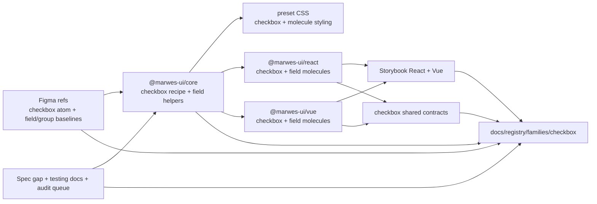
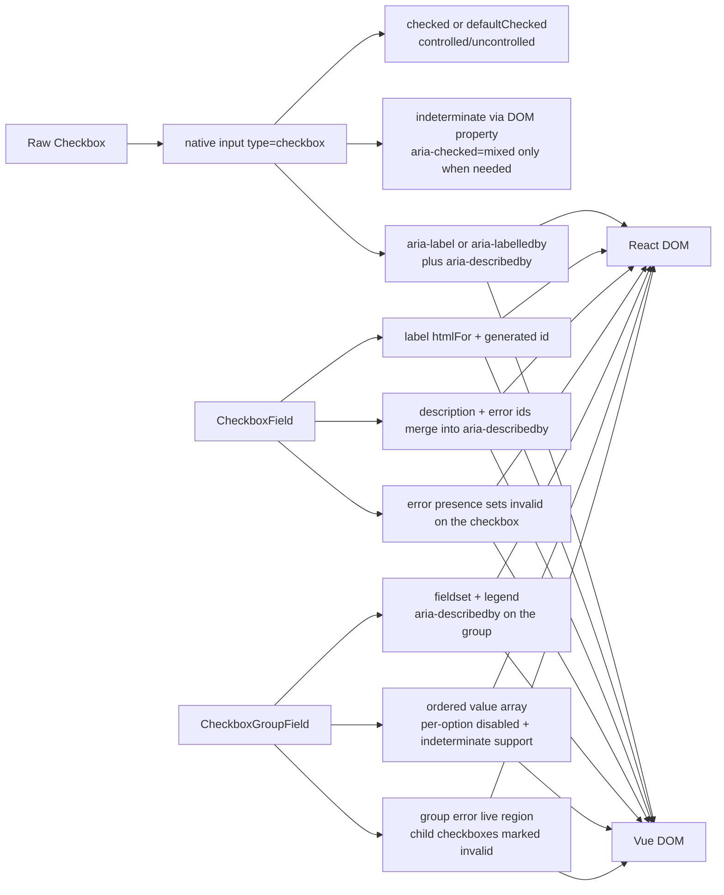

# Checkbox Registry

> Family: `checkbox`
>
> Local design refs only — this page uses the synced files under `.figma/` and makes no
> Figma API calls.

## Registry files

- [`registry.meta.json`](./registry.meta.json)
- [`registry.generated.json`](./registry.generated.json)
- [`../../../../artifacts/component-registry.json`](../../../../artifacts/component-registry.json)

## Registry snapshot

| Field | Value |
| --- | --- |
| Family status | Shipped |
| Audit status | Queued — later wave, no dedicated family audit doc yet |
| Semantic coverage | None — Checkbox relies on native `input[type="checkbox"]` and `fieldset` semantics; it is not part of the wave-1 central semantic registry and does not emit family-local `data-*` metadata |
| Generated structural truth | `registry.generated.json` + `artifacts/component-registry.json` |
| Primary Figma nodes | checkbox component set `1369:4628`, checkbox-field component set `1364:5566`, checkbox-group component `1369:4673`, light frame `1369:4700`, dark frame `1369:4905`, component containers `1369:4657` and `1369:6165` |
| Main AXE watch item | label, description, and error wiring across single and grouped checkbox fields, plus keeping indeterminate “select all” behavior truthful in real product flows |

## Registry ownership

- `README.md` is the human teaching page.
- `registry.meta.json` is the authored structured summary for this family.
- `registry.generated.json` and `artifacts/component-registry.json` are generator-owned structural outputs.
- this family intentionally has no Marwes semantic-registry or family-local `data-*` layer; the real semantic contract is the native checkbox control plus grouped `fieldset` wiring in the field molecules.
- `visuals/*.mmd` help people orient themselves quickly, but they are not the canonical implementation source.

## Summary

The Checkbox family is Marwes' multi-select control family for native checked, unchecked, and indeterminate selection.
It combines:
- a raw `Checkbox` atom rendered as a native `input[type="checkbox"]`
- `CheckboxField` as the canonical single-checkbox labeled field path
- `CheckboxGroupField` as the canonical labeled multi-select `fieldset` path
- shared React/Vue contract coverage for the raw atom and the grouped multi-select molecule

This makes Checkbox a strong sixteenth registry family because it ties together:
- one of the repo's densest native form-control families without drifting into custom-widget semantics
- clear field-helper-backed accessibility wiring for single and grouped checkbox usage
- shared React/Vue contract coverage for the raw atom and the grouped field path
- a useful design-to-runtime distinction where Figma teaches the atom and group visually, while the shipped field molecules also own helper text, error live regions, and runtime wiring that Figma does not prove by itself

## Family surface map

| Surface level | Main members | Why it matters |
| --- | --- | --- |
| Atom | `Checkbox` | low-level native checkbox primitive with checked, unchecked, disabled, invalid, and indeterminate behavior |
| Molecule | `CheckboxField` | canonical visible-label path for one checkbox with description and error wiring |
| Molecule | `CheckboxGroupField` | canonical grouped multi-select path with `fieldset`, `legend`, shared helper text, and shared error treatment |
| Canonical labeled path | `CheckboxField` for one control, `CheckboxGroupField` for multi-select groups | recommended accessible path for most product usage |
| Architecture boundary | raw `Checkbox` vs field molecules | keeps the native atom small while letting the molecules own field structure and grouped semantics |
| Escape hatch | raw `Checkbox` in custom layouts | supported when consumers intentionally own surrounding label, description, grouping, and select-all logic |

## Canonical visual understanding

Read this section in this order:
1. canonical Storybook story references for runtime visuals
2. the layer map for repo placement
3. the interaction map for native checkbox semantics, field wiring, and indeterminate group behavior

## Primary visual sources

| Source | Path | Why it matters |
| --- | --- | --- |
| React Storybook | `apps/storybook-react/src/stories/checkbox/Introduction.mdx` | canonical React teaching surface for atom vs molecule usage |
| React Storybook | `apps/storybook-react/src/stories/checkbox/checkbox-field.stories.tsx` | canonical single-checkbox labeled field path in React |
| React Storybook | `apps/storybook-react/src/stories/checkbox/checkbox-group-field.stories.tsx` | canonical grouped multi-select path, including indeterminate parent examples |
| React Storybook | `apps/storybook-react/src/stories/checkbox/checkbox.stories.tsx` | raw atom state matrix for checked, unchecked, indeterminate, disabled, invalid, and size variants |
| Vue Storybook | `apps/storybook-vue/src/stories/checkbox/Introduction.mdx` | canonical Vue teaching surface for the same family split |
| Vue Storybook | `apps/storybook-vue/src/stories/checkbox/checkbox-field.stories.ts` | canonical single-checkbox labeled field path in Vue |
| Vue Storybook | `apps/storybook-vue/src/stories/checkbox/checkbox-group-field.stories.ts` | canonical grouped multi-select path and indeterminate parent pattern in Vue |
| Vue Storybook | `apps/storybook-vue/src/stories/checkbox/checkbox.stories.ts` | raw atom state matrix in Vue |
| Figma showcase | `.figma/marwes/pages/-checkbox/-checkbox_1369-4700.json` | family baseline light matrix across six states and three selection columns |
| Figma showcase | `.figma/marwes/pages/-checkbox/-checkbox-dark_1369-4905.json` | dark-mode checkbox baseline |
| Figma showcase | `.figma/marwes/pages/-checkbox/component-container_1369-4657.json` | compact inventory of the three atom selection variants |
| Figma showcase | `.figma/marwes/pages/-checkbox/component-container_1369-6165.json` | grouped-checkbox inventory baseline |
| Figma showcase | `.figma/marwes/pages/cover/checkbox-group_1825-30425.json` | quick grouped usage orientation reference |

> Minimum visual reading set for this family: Storybook Introduction, `checkbox-field`, `checkbox-group-field`, `checkbox`, then the light and dark checkbox frames.

## Figma references

Primary synced refs:
- `.figma/INDEX.md`
- `.figma/marwes/components/checkbox.json`
- `.figma/marwes/components/checkbox-field.json`
- `.figma/marwes/components/checkbox-group.json`
- `.figma/NODE_REFERENCE.md`
- `.figma/nodes.json`
- `.figma/marwes/pages/-checkbox/README.md`

Primary showcase nodes from the synced checkbox page:
- Checkbox component set: `1369:4628`
- Checkbox-field component set: `1364:5566`
- Checkbox-group component: `1369:4673`
- Checkbox light frame: `1369:4700`
- Checkbox dark frame: `1369:4905`
- Atom component container: `1369:4657`
- Group component container: `1369:6165`
- Cover checkbox-group frame: `1825:30425`

Related synced page refs:
- `.figma/marwes/pages/-checkbox/component-container_1369-4657.json`
- `.figma/marwes/pages/-checkbox/component-container_1369-6165.json`
- `.figma/marwes/pages/-checkbox/-checkbox_1369-4700.json`
- `.figma/marwes/pages/-checkbox/-checkbox-dark_1369-4905.json`
- `.figma/marwes/pages/-checkbox/checkbox_1893-32830.json`
- `.figma/marwes/pages/-checkbox/checkbox_1893-32839.json`
- `.figma/marwes/pages/cover/checkbox-group_1825-30425.json`

> Current sync note: the repo also contains older or duplicate checkbox refs under
> `pages/-v3-components/`, `pages/-feedback-moved-to-notion/`, and `pages/to-do---components/`.
> This registry entry intentionally uses the current `pages/-checkbox/` material plus the live
> component JSON files as the active local design baseline.
>
> Another important distinction: the synced checkbox page subtitle still references
> “Semantic → Brand → Primitives,” but the shipped Marwes Checkbox family does not currently expose
> purpose wrappers or semantic-registry metadata.
>
> The local `checkbox-field.json` and `checkbox-group.json` files are still useful structural refs,
> but the shipped React/Vue molecules also add helper-text, error, and live-region behavior that
> the Figma component files do not fully express.

## Figma variant summary

| Surface | Variants | States | Notable tokens |
| --- | --- | --- | --- |
| Checkbox showcase light/dark frames | one checkbox atom across three selection columns plus a grouped example | `default`, `hover`, `pressed`, `disabled`, `focus`, `error` × `unchecked`, `checked`, `indeterminate` across `light` and `dark` | `Checkbox/Surface`, `Checkbox/Border`, `Checkbox/Surface-checked`, `Checkbox/Icon`, `Checkbox/Text` |
| Checkbox component set JSON + atom component container | `Checked=Unchecked`, `Checked=Checked`, `Checked=Indeterminate` | structural atom baseline with focus ring, box, label slot, and optional description slot | this is the clearest direct design-to-code bridge for the raw atom |
| Checkbox-field component JSON | one single-field shell across `Enabled`, `Hover`, `Disabled`, `Error` | molecule-level visual states rather than runtime wiring states | useful visual shell reference, but it does not prove the shipped `aria-describedby` or live-region behavior |
| Checkbox-group component JSON + group container + cover frame | one grouped multi-select shell | group label, helper text, and vertical list of options | strong grouped visual baseline, but it does not encode controlled value arrays, invalid propagation, or select-all logic |

> Important family distinction: the synced Figma page teaches the checkbox atom states and grouped checkbox baseline well, but the shipped Marwes family also includes `CheckboxField`, `CheckboxGroupField`, helper-text merging, error live regions, and real grouped form semantics.
>
> In other words: Figma is the visual baseline for checkbox geometry, selection states, and grouped layout, while Storybook and the shared contracts are the better references for runtime wiring and accessibility behavior.
>
> Also note: the shipped family exposes indeterminate behavior as a real runtime API for select-all patterns, but the synced page still presents that mostly as one column in the visual matrix rather than as a documented interaction policy.

## Visual model

### Layer map



Source copy: [`visuals/layer-map.mmd`](./visuals/layer-map.mmd)

### File map

```mermaid
flowchart TD
  Registry["docs/registry/families/checkbox"]
  Registry --> Meta["registry.meta.json"]
  Registry --> Generated["registry.generated.json"]
  Registry --> Visuals["visuals/*.mmd"]

  Core["packages/core/src/components/atoms/checkbox/"]
  Core --> CoreFiles["checkbox-a11y.ts checkbox-recipe.ts checkbox-types.ts"]
  CoreTests["packages/core/test/recipes/checkbox.test.ts"]
  Core --> CoreTests
  Helpers["packages/core/src/shared/field-helpers.ts"]

  Presets["packages/presets/src/firstEdition/"]
  Presets --> CheckboxCss["checkbox.css"]
  Presets --> FieldCss["molecules/checkbox-field.css"]
  Presets --> GroupCss["molecules/checkbox-group-field.css"]

  React["packages/react/src/components/checkbox/"]
  React --> ReactFiles["checkbox.tsx checkbox-field.tsx checkbox-group-field.tsx tests"]

  Vue["packages/vue/src/components/checkbox/"]
  Vue --> VueFiles["checkbox.ts checkbox-field.ts checkbox-group-field.ts tests"]

  StoriesR["apps/storybook-react/src/stories/checkbox/"]
  StoriesV["apps/storybook-vue/src/stories/checkbox/"]
  Contracts["tests/contracts/checkbox.contract.ts + checkbox-group-field.contract.ts"]
```



Source copy: [`visuals/file-map.mmd`](./visuals/file-map.mmd)

### Interaction and semantics map



Source copy: [`visuals/interaction-map.mmd`](./visuals/interaction-map.mmd)

## Philosophy

- **Teach the field molecules first.** `CheckboxField` and `CheckboxGroupField` are the canonical labeled paths for most product usage.
- **Keep the raw atom native and small.** `Checkbox` should stay a straightforward native checkbox primitive rather than growing its own layout or metadata system.
- **Treat indeterminate as an explicit parent-owned affordance.** It is useful for select-all flows, but it should not become a vague third selection model with unclear product meaning.
- **Keep field wiring source-owned in shared helpers.** Description, error, and grouped labeling logic should not drift between React and Vue.
- **Keep richer semantic layers out of scope.** If future product patterns need governed purpose wrappers or bulk-selection policy objects, that should be a conscious family expansion rather than an accidental one.

## AXE / accessibility posture

| Area | Status | Notes |
| --- | --- | --- |
| Risk tier | Medium | checkbox is native, but grouped field semantics, indeterminate behavior, and validation wiring still affect accessibility meaningfully |
| Audit status | Queued | `docs/audits/README.md` lists Checkbox in Wave 2; no dedicated family audit doc exists yet |
| Automated contract | Partial | the raw atom and grouped molecule have shared contracts, but `CheckboxField` still relies on local adapter tests rather than a dedicated shared contract file |
| Manual review boundary | Medium | select-all truthfulness, focus visibility, and longer helper/error content still deserve human review |
| AXE follow-up | Active discipline | the family is still queued for a dedicated audit pass and broader support-model work |

### What automation already covers

- raw checkbox checked-state, disabled behavior, callback flow, and indeterminate DOM support through the shared React/Vue checkbox contract
- grouped checkbox labeling, description wiring, error live region behavior, invalid propagation, disabled-group behavior, and indeterminate option support through the shared `checkbox-group-field` contract
- `CheckboxField` label, description, and polite error-region wiring through local React and Vue adapter tests
- Storybook introduction and taxonomy coverage in both apps
- core recipe coverage for controlled vs uncontrolled state output

### What still needs manual review or policy clarity

- whether select-all and indeterminate parent checkboxes remain truthful when product logic gets more complex than the Storybook example
- whether the heavy `appearance: none` preset styling keeps focus visibility and browser consistency where the design system expects it
- whether longer helper text, longer error text, or dense checkbox groups still read clearly in real layouts

### Why the semantics are intentionally called none

This family does not participate in the wave-1 central semantic registry and does not emit family-local `data-*` metadata either.

That distinction matters because:
- the core semantic meaning already comes from the native checkbox control and grouped `fieldset` structure
- there is no `data-component="checkbox"` or purpose-wrapper vocabulary in the shipped family today
- the registry should not imply a metadata contract that does not actually exist in code

### Current implementation hotspots

- `packages/core/src/components/atoms/checkbox/checkbox-a11y.ts` and `checkbox-recipe.ts` are the main raw-checkbox policy points.
- `packages/core/src/shared/field-helpers.ts` is the key source of truth for `CheckboxField` and `CheckboxGroupField` description and error id wiring.
- `tests/contracts/checkbox-group-field.contract.ts` is the most important grouped-behavior regression boundary in the family today.

## Semantics snapshot

| Field | Current checkbox family contract |
| --- | --- |
| `data-component` | none — the family relies on native checkbox and fieldset semantics instead of emitting family metadata |
| canonical attributes | none in the Marwes semantic registry; native checked state, grouping, and accessible naming are the real contract |
| purpose vocabulary | n/a |
| source of truth | `packages/core/src/components/atoms/checkbox/checkbox-a11y.ts`, `packages/core/src/shared/field-helpers.ts`, and the shared checkbox contract files |

## Linked files

This family follows the same repo tree order used elsewhere in Marwes:

```text
spec/decision → core → preset CSS → React adapter → React stories/tests → Vue adapter → Vue stories/tests → contracts → registry
```

| Layer | Path | Why it matters |
| --- | --- | --- |
| Spec | `docs/reference/spec.md` | there is no dedicated checkbox-specific section yet, so code, Storybook, tests, and Figma refs carry most of the current contract weight |
| AI metadata | `docs/reference/ai-metadata.md` | useful because Checkbox is absent here today, which reinforces that the family relies on native semantics rather than registry metadata |
| Testing docs | `docs/reference/testing.md` | shared-contract expectations and manual-review framing |
| Audit queue | `docs/audits/README.md` | Checkbox is currently queued in Wave 2 and has no dedicated family audit doc yet |
| Core | `packages/core/src/components/atoms/checkbox/checkbox-types.ts` | public raw checkbox contract for size, checked state, indeterminate state, and naming inputs |
| Core | `packages/core/src/components/atoms/checkbox/checkbox-a11y.ts` | native checkbox a11y mapping, including `aria-checked="mixed"` when indeterminate |
| Core | `packages/core/src/components/atoms/checkbox/checkbox-recipe.ts` | checkbox RenderKit assembly and controlled/uncontrolled output |
| Core helper | `packages/core/src/shared/field-helpers.ts` | `CheckboxField` and `CheckboxGroupField` description, error, and grouped label ids |
| Core test | `packages/core/test/recipes/checkbox.test.ts` | recipe-level baseline for controlled vs uncontrolled state output |
| Presets | `packages/presets/src/firstEdition/checkbox.css` | raw checkbox visual treatment across size, checked, indeterminate, disabled, invalid, and dark-mode states |
| Presets | `packages/presets/src/firstEdition/molecules/checkbox-field.css` | single-field label, description, and error styling |
| Presets | `packages/presets/src/firstEdition/molecules/checkbox-group-field.css` | grouped fieldset, option-row, description, and error styling |
| React | `packages/react/src/components/checkbox/checkbox.tsx` | raw checkbox atom adapter |
| React | `packages/react/src/components/checkbox/checkbox-field.tsx` | canonical single-checkbox labeled field surface in React |
| React | `packages/react/src/components/checkbox/checkbox-group-field.tsx` | canonical grouped multi-select field surface in React |
| Vue | `packages/vue/src/components/checkbox/checkbox.ts` | raw checkbox atom adapter in Vue |
| Vue | `packages/vue/src/components/checkbox/checkbox-field.ts` | canonical single-checkbox labeled field surface in Vue |
| Vue | `packages/vue/src/components/checkbox/checkbox-group-field.ts` | canonical grouped multi-select field surface in Vue |
| Stories | `apps/storybook-react/src/stories/checkbox/Introduction.mdx` | canonical React teaching surface |
| Stories | `apps/storybook-react/src/stories/checkbox/checkbox-group-field.stories.tsx` | clearest grouped checkbox and indeterminate-parent reference in React |
| Stories | `apps/storybook-vue/src/stories/checkbox/Introduction.mdx` | canonical Vue teaching surface |
| Stories | `apps/storybook-vue/src/stories/checkbox/checkbox-group-field.stories.ts` | clearest grouped checkbox and indeterminate-parent reference in Vue |
| Contracts | `tests/contracts/checkbox.contract.ts` | shared raw checkbox behavior coverage |
| Contracts | `tests/contracts/checkbox-group-field.contract.ts` | shared grouped checkbox semantics and error-wiring coverage |
| Figma | `.figma/marwes/pages/-checkbox/README.md` | synced checkbox page inventory |
| Figma | `.figma/marwes/components/checkbox.json` | raw checkbox component-set structure |
| Figma | `.figma/marwes/components/checkbox-field.json` | single-field visual shell reference |
| Figma | `.figma/marwes/components/checkbox-group.json` | grouped multi-select visual shell reference |
| Figma | `.figma/marwes/pages/cover/checkbox-group_1825-30425.json` | grouped usage orientation frame |

## Verification

Focused commands for this family:

```bash
pnpm --filter @marwes-ui/core exec vitest run test/recipes/checkbox.test.ts
pnpm test:typecheck:contracts
pnpm --filter @marwes-ui/react exec vitest run src/components/checkbox/__tests__/checkbox.test.tsx src/components/checkbox/__tests__/checkbox-field.test.tsx src/components/checkbox/__tests__/checkbox-group-field.test.tsx
pnpm --filter @marwes-ui/vue exec vitest run src/components/checkbox/__tests__/checkbox.test.ts src/components/checkbox/__tests__/checkbox-field.test.ts src/components/checkbox/__tests__/checkbox-group-field.test.ts
pnpm --filter ./apps/storybook-react exec vitest run src/stories/checkbox/__tests__/checkbox-introduction-docs.test.ts src/stories/checkbox/__tests__/checkbox-taxonomy.test.ts
pnpm --filter ./apps/storybook-vue exec vitest run src/stories/checkbox/__tests__/checkbox-introduction-docs.test.ts src/stories/checkbox/__tests__/checkbox-taxonomy.test.ts
pnpm docs:links
```

Broader confidence:

```bash
pnpm check
pnpm test:packages
pnpm storybook:consistency
```

## Registry notes

Current limitations of the PoC:
- the checkbox registry is generator-backed, but the family source map is still maintained manually in `scripts/component-registry-sources.ts`
- the family uses Storybook references and Mermaid diagrams for visual orientation rather than committed preview assets
- there is no dedicated `docs/audits/checkbox-family-accessibility.md` file yet, so AXE posture currently points at the queue and support-model work rather than a finished family audit doc
- there is no dedicated shared `tests/contracts/checkbox-field.contract.ts` file yet, so single-field behavior is currently proved through local adapter tests instead of one shared contract
- the synced checkbox page teaches the raw atom and grouped baseline more directly than the shipped field-molecule semantics
- the current local sync still contains older duplicate checkbox refs under `pages/-v3-components/` and `pages/-feedback-moved-to-notion/`, which this registry entry intentionally excludes from the active family baseline

## Open questions

- Should `CheckboxField` eventually gain a dedicated shared `tests/contracts/checkbox-field.contract.ts` file instead of relying on local adapter tests only?
- Should the local Figma sync gain clearer molecule-level `CheckboxField` and `CheckboxGroupField` refs that mirror the shipped helper-text and error behavior more directly?
