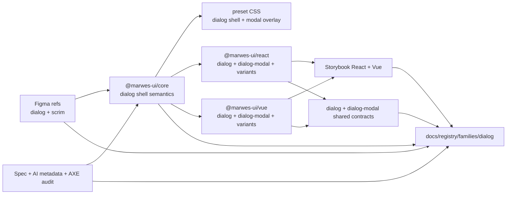
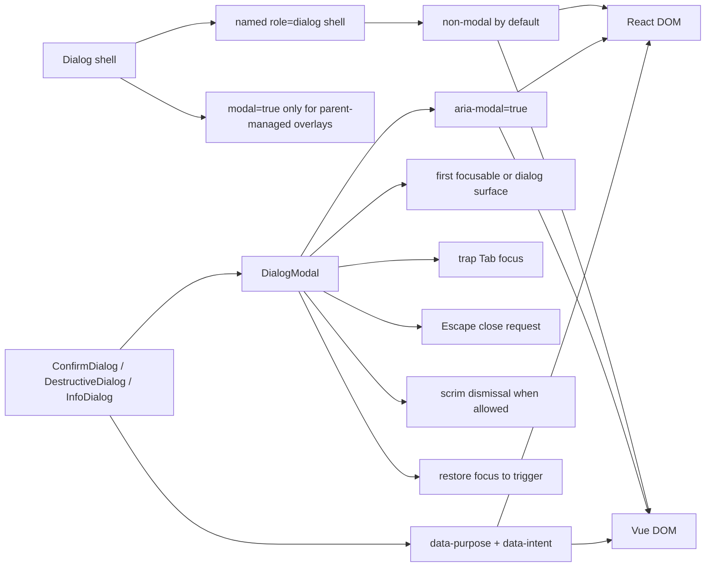

# Dialog Registry

> Family: `dialog`
>
> Local design refs only — this page uses the synced files under `.figma/` and makes no Figma API calls.

## Registry files

- [`registry.meta.json`](./registry.meta.json)
- [`registry.generated.json`](./registry.generated.json)
- [`../../../../artifacts/component-registry.json`](../../../../artifacts/component-registry.json)

## Registry snapshot

| Field | Value |
| --- | --- |
| Family status | Shipped |
| Audit status | First pass complete |
| Semantic coverage | Canonical — part of the wave-1 central semantic registry |
| Generated structural truth | `registry.generated.json` + `artifacts/component-registry.json` |
| Primary Figma nodes | dialog component `1609:15459`, light frame `1609:15527`, dark frame `1615:17130` |
| Main AXE watch item | shell-vs-modal boundary, focus lifecycle, and future background isolation hardening |

## Registry ownership

- `README.md` is the human teaching page.
- `registry.meta.json` is the authored structured summary for this family.
- `registry.generated.json` and `artifacts/component-registry.json` are generator-owned structural outputs.
- this family already uses canonical central semantic metadata in `@marwes-ui/core`, not only family-local wrapper metadata.
- `visuals/*.mmd` help people orient themselves quickly, but they are not the canonical implementation source.

## Summary

The Dialog family is Marwes' modal and overlay decision boundary.
It combines:
- a low-level `Dialog` atom that stays non-modal by default
- a `DialogModal` molecule that owns overlay lifecycle behavior
- purpose wrappers for `ConfirmDialog`, `DestructiveDialog`, and `InfoDialog`
- a strong canonical semantics layer in core

This makes Dialog a strong third registry family because it ties together:
- one of the clearest architecture decisions in the repo
- a high-risk accessibility surface with cross-framework modal behavior
- central semantic metadata with stable purpose vocabulary
- a completed AXE audit with explicit findings and decisions
- thin purpose wrappers built on top of a canonical modal layer

## Family surface map

| Surface level | Main members | Why it matters |
| --- | --- | --- |
| Atom | `Dialog` | low-level named dialog shell with header, body, and optional footer |
| Molecule | `DialogModal` | canonical modal overlay composition with scrim, `aria-modal`, focus lifecycle, and dismissal behavior |
| Purpose variants | `ConfirmDialog`, `DestructiveDialog`, `InfoDialog` | common workflow wrappers with stable intent metadata |
| Canonical modal path | `DialogModal` + purpose wrappers | recommended accessible modal surface |
| Architecture boundary | `Dialog` vs `DialogModal` | the core family decision: shell semantics stay separate from modal lifecycle behavior |
| Escape hatch | `Dialog modal={true}` | parent-managed modal shell opt-in for advanced compositions |

## Canonical visual understanding

Read this section in this order:
1. canonical Storybook story references for runtime visuals
2. the layer map for repo placement
3. the interaction map for modal lifecycle and semantics flow

## Primary visual sources

| Source | Path | Why it matters |
| --- | --- | --- |
| React Storybook | `apps/storybook-react/src/stories/dialog/Introduction.mdx` | canonical React teaching surface for the family layers |
| React Storybook | `apps/storybook-react/src/stories/dialog/dialog.stories.tsx` | raw dialog shell examples |
| React Storybook | `apps/storybook-react/src/stories/dialog/dialog-modal.stories.tsx` | canonical modal overlay runtime surface |
| React Storybook | `apps/storybook-react/src/stories/dialog/destructive-dialog.stories.tsx` | highest-risk purpose wrapper path |
| Vue Storybook | `apps/storybook-vue/src/stories/dialog/Introduction.mdx` | canonical Vue teaching surface for the family layers |
| Vue Storybook | `apps/storybook-vue/src/stories/dialog/dialog.stories.ts` | raw dialog shell examples in Vue |
| Vue Storybook | `apps/storybook-vue/src/stories/dialog/dialog-modal.stories.ts` | canonical Vue modal overlay runtime surface |
| Vue Storybook | `apps/storybook-vue/src/stories/dialog/destructive-dialog.stories.ts` | highest-risk purpose wrapper path in Vue |
| Figma showcase | `.figma/marwes/pages/-dialog/-dialog_1609-15527.json` | family baseline light frame |
| Figma showcase | `.figma/marwes/pages/-dialog/-dialog-dark_1615-17130.json` | family baseline dark frame |
| Figma component | `.figma/marwes/pages/-dialog/dialog_1609-15459.json` | raw shell baseline used in the page showcase |

> Minimum visual reading set for this family: Storybook Introduction, `dialog-modal`, `destructive-dialog`, then the two Figma light/dark dialog frames.

## Figma references

Primary synced refs:
- `.figma/INDEX.md`
- `.figma/marwes/components/dialog.json`
- `.figma/marwes/components/scrim.json`
- `.figma/NODE_REFERENCE.md`
- `.figma/nodes.json`
- `.figma/marwes/pages/-dialog/README.md`

Primary showcase nodes from the synced dialog page:
- Dialog component: `1609:15459`
- Dialog light frame: `1609:15527`
- Dialog dark frame: `1615:17130`
- Close icon instance: `1595:13879`

Related synced page refs:
- `.figma/marwes/pages/-dialog/dialog_1609-15459.json`
- `.figma/marwes/pages/-dialog/-dialog_1609-15527.json`
- `.figma/marwes/pages/-dialog/-dialog-dark_1615-17130.json`
- `.figma/marwes/pages/-dialog/dialog_1935-14085.json`
- `.figma/marwes/pages/-dialog/frame-1_1935-14109.json`
- `.figma/marwes/pages/-dialog/icons-interface-x_1595-13879.json`

## Figma variant summary

| Surface | Variants | States | Notable tokens |
| --- | --- | --- | --- |
| Dialog page light frame | shell + footer visibility + close affordance | open showcase frame | dialog shell surface, border, title, body, close control |
| Dialog page dark frame | dark shell treatment | open showcase frame | dark-mode surface, border, title, body, close control |
| Dialog component JSON | `Show footer` boolean | shell structure rather than interaction states | fixed-width shell, header/body/footer composition |

> Important family distinction: the synced Figma page mainly shows the shell surface, but the shipped Marwes family also includes `DialogModal`, which owns modal lifecycle behavior such as `aria-modal`, focus trap, scrim dismissal, and focus restoration.
>
> In other words: Figma is the visual shell baseline here, while Storybook and the contracts are the better references for the actual modal lifecycle boundary.

## Visual model

### Layer map



Source copy: [`visuals/layer-map.mmd`](./visuals/layer-map.mmd)

### File map

```mermaid
flowchart TD
  Registry["docs/registry/families/dialog"]
  Registry --> Meta["registry.meta.json"]
  Registry --> Generated["registry.generated.json"]
  Registry --> Visuals["visuals/*.mmd"]

  Core["packages/core/src/components/atoms/dialog/"]
  Core --> CoreFiles["dialog-a11y.ts dialog-recipe.ts dialog-types.ts"]

  Presets["packages/presets/src/firstEdition/"]
  Presets --> ShellCss["dialog.css"]
  Presets --> ModalCss["molecules/dialog-modal.css"]

  React["packages/react/src/components/dialog/"]
  React --> ReactFiles["dialog.tsx dialog-modal.tsx variants.tsx tests"]

  Vue["packages/vue/src/components/dialog/"]
  Vue --> VueFiles["dialog.ts dialog-modal.ts variants.ts tests"]

  StoriesR["apps/storybook-react/src/stories/dialog/"]
  StoriesV["apps/storybook-vue/src/stories/dialog/"]
  Contracts["tests/contracts/dialog.contract.ts + dialog-modal.contract.ts"]
```



Source copy: [`visuals/file-map.mmd`](./visuals/file-map.mmd)

### Interaction and semantics map



Source copy: [`visuals/interaction-map.mmd`](./visuals/interaction-map.mmd)

## Philosophy

- **Keep shell and modal responsibilities separate.** `Dialog` is the named shell; `DialogModal` is the canonical modal overlay layer.
- **Do not overclaim modal semantics.** `Dialog` should not emit `aria-modal` by default because it does not own the full modal lifecycle on its own.
- **Let the modal layer own focus lifecycle.** `DialogModal` is responsible for initial focus, focus trap, dismissal, and focus restoration.
- **Keep purpose wrappers thin and semantic.** Confirm, destructive, and info variants should add stable intent metadata without re-implementing modal behavior.
- **Stay honest about remaining hardening work.** Background isolation through `inert` or equivalent sibling management is still future hardening, not a hidden solved problem.

## AXE / accessibility posture

| Area | Status | Notes |
| --- | --- | --- |
| Risk tier | High | modal behavior is a high-risk accessibility surface across focus, dismissal, and assistive-technology expectations |
| Audit status | First pass complete | `docs/audits/dialog-family-accessibility.md` |
| Automated contract | Strong | shared dialog and dialog-modal contracts cover semantics and lifecycle behavior |
| Manual review boundary | Medium | automated tests are strong, but real modal AT behavior still deserves validation |
| AXE follow-up | Active hardening | background isolation remains future work |

### What automation already covers

- canonical purpose metadata for confirm, destructive, and info wrappers
- `DialogModal` naming, `aria-modal`, initial focus, no-focusable fallback, focus trap, dismissal behavior, and focus restoration
- React and Vue parity through shared contracts rather than only mirrored local assertions
- Storybook docs that teach `DialogModal` and purpose wrappers as the canonical modal layers

### What still needs manual review or policy clarity

- background isolation through `inert` or equivalent sibling management remains future hardening work
- real browser and assistive-technology review is still appropriate for modal flows even with strong automated coverage
- teams using the raw `Dialog modal={true}` escape hatch still need to own the parent-managed modal boundary intentionally

### Why the semantics are intentionally called canonical

This family is part of the wave-1 central semantic registry in `@marwes-ui/core`.

That matters because:
- `data-component="dialog"` is source-owned in core rather than inferred only from adapter wrappers
- purpose vocabulary such as `confirm-dialog`, `destructive-dialog`, and `info-dialog` is centralized in the semantic registry
- React and Vue purpose wrappers are expected to emit the same semantic contract rather than inventing their own family-local meanings

### Current implementation hotspots

- `packages/core/src/components/atoms/dialog/dialog-a11y.ts` defines the shell-vs-modal semantic boundary.
- `packages/react/src/components/dialog/dialog-modal.tsx` and `packages/vue/src/components/dialog/dialog-modal.ts` own the runtime modal lifecycle.
- `tests/contracts/dialog-modal.contract.ts` is the most important shared regression boundary for this family.

## Semantics snapshot

| Field | Current dialog family contract |
| --- | --- |
| `data-component` | `dialog` |
| canonical attributes | `data-component`, `data-size`, `data-intent` |
| purpose vocabulary | `confirm-dialog`, `destructive-dialog`, `info-dialog` |
| source of truth | `packages/core/src/semantics/family-semantics.ts` and `packages/core/src/semantics/purpose-semantics.ts` |

## Linked files

This family follows the same repo tree order used elsewhere in Marwes:

```text
spec/decision → core → preset CSS → React adapter → React stories/tests → Vue adapter → Vue stories/tests → contracts → registry
```

| Layer | Path | Why it matters |
| --- | --- | --- |
| Spec | `docs/reference/spec.md` | shell-vs-modal boundary, initial-focus policy, and dialog requirements |
| AI metadata | `docs/reference/ai-metadata.md` | canonical dialog intent and purpose metadata |
| Testing docs | `docs/reference/testing.md` | modal automation expectations and manual-review boundary |
| Audit | `docs/audits/dialog-family-accessibility.md` | detailed AXE execution record for this family |
| Core semantics | `packages/core/src/semantics/family-semantics.ts` | canonical family-level dialog attributes |
| Core semantics | `packages/core/src/semantics/purpose-semantics.ts` | confirm, destructive, and info purpose metadata |
| Core | `packages/core/src/components/atoms/dialog/dialog-a11y.ts` | shell-vs-modal semantic boundary |
| Core | `packages/core/src/components/atoms/dialog/dialog-types.ts` | public dialog contracts including the modal escape hatch |
| Core | `packages/core/src/components/atoms/dialog/dialog-recipe.ts` | shell RenderKit assembly |
| Presets | `packages/presets/src/firstEdition/dialog.css` | shell styling and focus treatment |
| Presets | `packages/presets/src/firstEdition/molecules/dialog-modal.css` | scrim and overlay styling |
| React | `packages/react/src/components/dialog/dialog.tsx` | raw shell adapter surface |
| React | `packages/react/src/components/dialog/dialog-modal.tsx` | canonical React modal behavior layer |
| React | `packages/react/src/components/dialog/variants.tsx` | purpose wrappers on top of the modal layer |
| Vue | `packages/vue/src/components/dialog/dialog.ts` | raw shell adapter surface in Vue |
| Vue | `packages/vue/src/components/dialog/dialog-modal.ts` | canonical Vue modal behavior layer |
| Vue | `packages/vue/src/components/dialog/variants.ts` | purpose wrappers on top of the modal layer |
| Stories | `apps/storybook-react/src/stories/dialog/Introduction.mdx` | canonical React teaching surface |
| Stories | `apps/storybook-vue/src/stories/dialog/Introduction.mdx` | canonical Vue teaching surface |
| Contracts | `tests/contracts/dialog.contract.ts` | canonical purpose-dialog metadata |
| Contracts | `tests/contracts/dialog-modal.contract.ts` | shared modal lifecycle behavior |
| Figma | `.figma/marwes/pages/-dialog/README.md` | synced design page inventory |
| Figma | `.figma/marwes/components/dialog.json` | shell component structure |
| Figma | `.figma/marwes/components/scrim.json` | overlay baseline asset |

## Verification

Focused commands for this family:

```bash
pnpm --filter @marwes-ui/core exec vitest run test/recipes/dialog.test.ts
pnpm test:typecheck:contracts
pnpm --filter @marwes-ui/react exec vitest run src/components/dialog/__tests__/dialog.test.tsx src/components/dialog/__tests__/dialog-modal.test.tsx src/components/dialog/__tests__/variants.test.tsx
pnpm --filter @marwes-ui/vue exec vitest run src/components/dialog/__tests__/dialog.test.ts src/components/dialog/__tests__/dialog-modal.test.ts src/components/dialog/__tests__/variants.test.ts
pnpm storybook:consistency
pnpm check:compass
```

Broader confidence:

```bash
pnpm check
pnpm test:packages
```

## Registry notes

Current limitations of the PoC:
- the dialog registry is generator-backed, but the family source map is still maintained manually in `scripts/component-registry-sources.ts`
- the family uses Storybook references and Mermaid diagrams for visual orientation rather than committed preview assets
- background isolation remains documented future hardening rather than solved runtime behavior
- the synced Figma refs are better at teaching the shell surface than the full shipped modal lifecycle

## Open questions

- Should dialog-family stories eventually join stricter automated accessibility gates once the broader AXE verification command lands?
- When background isolation is hardened further, should the registry split current behavior vs future target behavior more explicitly?
