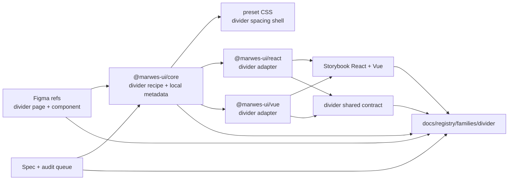
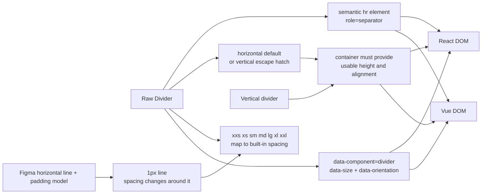

# Divider Registry

> Family: `divider`
>
> Local design refs only — this page uses the synced files under `.figma/` and makes no
> Figma API calls.

## Registry files

- [`registry.meta.json`](./registry.meta.json)
- [`registry.generated.json`](./registry.generated.json)
- [`../../../../artifacts/component-registry.json`](../../../../artifacts/component-registry.json)

## Registry snapshot

| Field | Value |
| --- | --- |
| Family status | Shipped |
| Audit status | Queued — later wave, no dedicated family audit doc yet |
| Semantic coverage | Family-local — the atom emits local `data-component`, `data-size`, and `data-orientation` metadata from core, but Divider is not part of the wave-1 central semantic registry |
| Generated structural truth | `registry.generated.json` + `artifacts/component-registry.json` |
| Primary Figma nodes | divider component `1574:21053`, component container `1574:24629`, light frame `1574:24658`, dark frame `1574:24738` |
| Main AXE watch item | using Divider only when a real semantic separator is helpful, and not as a substitute for spacing, headings, or richer labeled-section structure |

## Registry ownership

- `README.md` is the human teaching page.
- `registry.meta.json` is the authored structured summary for this family.
- `registry.generated.json` and `artifacts/component-registry.json` are generator-owned structural outputs.
- the family currently uses local divider metadata in core and is not part of the central wave-1 semantic registry.
- `visuals/*.mmd` help people orient themselves quickly, but they are not the canonical implementation source.

## Summary

The Divider family is Marwes' baseline separator family for simple content boundaries.
It consists of:
- one raw `Divider` atom
- a semantic `<hr>` baseline in both adapters
- a size scale that maps the synced Figma spacing modes into the shipped `xxs` → `xxl` API
- shared React/Vue contract coverage for orientation and separator semantics

This makes Divider a strong fourteenth registry family because it ties together:
- one of the repo's smallest shipped atoms with a clean shared contract
- a clear design baseline where the Figma page teaches line thickness and spacing rather than a large behavior matrix
- an honest semantic posture where the atom emits stable local metadata but is not centrally governed in the wave-1 semantic registry
- Storybook guidance that shows both horizontal content separation and the shipped vertical escape hatch
- a useful mismatch note that the current code supports vertical orientation even though the synced Figma page mainly teaches the horizontal baseline

## Family surface map

| Surface level | Main members | Why it matters |
| --- | --- | --- |
| Atom | `Divider` | low-level semantic separator for horizontal or vertical content boundaries |
| Canonical product path | raw `Divider` | the only shipped family surface and the recommended direct usage path |
| Architecture boundary | horizontal default vs vertical escape hatch | keeps one atom while making it explicit that vertical usage depends more on layout context |
| Visual teaching surface | `Divider/Atom` Storybook story | mirrors the size scale, content-separation examples, and vertical-layout guidance |
| Escape hatch | raw `Divider` with custom class or style | supported when consumers intentionally need layout-specific adjustments without changing the base API |

## Canonical visual understanding

Read this section in this order:
1. canonical Storybook story references for runtime visuals
2. the layer map for repo placement
3. the interaction map for separator semantics, size mapping, and vertical-layout expectations

## Primary visual sources

| Source | Path | Why it matters |
| --- | --- | --- |
| React Storybook | `apps/storybook-react/src/stories/divider/Introduction.mdx` | canonical React teaching surface for the single-atom family |
| React Storybook | `apps/storybook-react/src/stories/divider/divider.stories.tsx` | runtime baseline for the full size scale, content separation, visual hierarchy, and vertical usage |
| Vue Storybook | `apps/storybook-vue/src/stories/divider/Introduction.mdx` | canonical Vue teaching surface for the same atom |
| Vue Storybook | `apps/storybook-vue/src/stories/divider/divider.stories.ts` | runtime baseline for the same size and orientation matrix in Vue |
| Figma showcase | `.figma/marwes/pages/-divider/-divider_1574-24658.json` | family baseline light frame for the seven spacing modes |
| Figma showcase | `.figma/marwes/pages/-divider/-divider-dark_1574-24738.json` | dark-mode divider spacing matrix |
| Figma showcase | `.figma/marwes/pages/-divider/component-container_1574-24629.json` | compact inventory of the base divider component and spacing labels |

> Minimum visual reading set for this family: Storybook Introduction, `divider`, then the light and dark Figma divider frames.

## Figma references

Primary synced refs:
- `.figma/INDEX.md`
- `.figma/marwes/components/divider.json`
- `.figma/NODE_REFERENCE.md`
- `.figma/nodes.json`
- `.figma/marwes/pages/-divider/README.md`

Primary showcase nodes from the synced divider page:
- Divider component: `1574:21053`
- Component container: `1574:24629`
- Divider light frame: `1574:24658`
- Divider dark frame: `1574:24738`

Related synced page refs:
- `.figma/marwes/pages/-divider/component-container_1574-24629.json`
- `.figma/marwes/pages/-divider/-divider_1574-24658.json`
- `.figma/marwes/pages/-divider/-divider-dark_1574-24738.json`

## Figma variant summary

| Surface | Variants | States | Notable tokens |
| --- | --- | --- | --- |
| Divider showcase light/dark frames | spacing rows for the single divider surface | `sp-80`, `sp-64`, `sp-48`, `sp-32`, `sp-16`, `sp-8`, `sp-1` across `light` and `dark` | `divider/default` |
| Divider component JSON + component container | one base horizontal divider component | 1px line with padding-driven spacing around it | the component JSON maps directly to the horizontal Figma baseline and does not teach the shipped vertical orientation |
| Curated node refs | older divider node inventory | older `1364:*` divider section in `NODE_REFERENCE.md` and `nodes.json` | useful as a historical token map, but the current `1574:*` page files are the better direct references for the shipped family now |

> Important family distinction: the synced Figma page teaches one horizontal 1px line whose surrounding spacing changes by mode, while the shipped Marwes family also supports vertical orientation as a code-level layout escape hatch.
>
> In other words: Figma is the visual baseline for divider spacing and theme color treatment, while Storybook and the shared contract are the better references for orientation behavior and real layout usage.
>
> Also note: `docs/reference/spec.md`, `.figma/NODE_REFERENCE.md`, and `.figma/nodes.json` still point at older divider node ids in places, while the current live page JSON files use the newer `1574:*` node set.
>
> The `Overall status` instance on the synced divider page is intentionally not treated as part of the shipped Divider family surface here.

## Visual model

### Layer map



Source copy: [`visuals/layer-map.mmd`](./visuals/layer-map.mmd)

### File map

```mermaid
flowchart TD
  Registry["docs/registry/families/divider"]
  Registry --> Meta["registry.meta.json"]
  Registry --> Generated["registry.generated.json"]
  Registry --> Visuals["visuals/*.mmd"]

  Core["packages/core/src/components/atoms/divider/"]
  Core --> CoreFiles["divider-recipe.ts divider-types.ts"]
  CoreTests["packages/core/test/recipes/divider.test.ts"]
  Core --> CoreTests

  Presets["packages/presets/src/firstEdition/"]
  Presets --> DividerCss["divider.css"]

  React["packages/react/src/components/divider/"]
  React --> ReactFiles["divider.tsx tests"]

  Vue["packages/vue/src/components/divider/"]
  Vue --> VueFiles["divider.ts tests"]

  StoriesR["apps/storybook-react/src/stories/divider/"]
  StoriesV["apps/storybook-vue/src/stories/divider/"]
  Contracts["tests/contracts/divider.contract.ts"]
```



Source copy: [`visuals/file-map.mmd`](./visuals/file-map.mmd)

### Interaction and semantics map



Source copy: [`visuals/interaction-map.mmd`](./visuals/interaction-map.mmd)

## Philosophy

- **Keep Divider single-purpose.** It should stay a baseline separator atom rather than growing into a family of labeled or ornamental separators by default.
- **Keep the semantic `<hr>` baseline.** Divider should remain a real separator element, not a decorative `<div>` pretending to be one.
- **Treat vertical orientation as an explicit layout escape hatch.** It is supported and shipped, but it depends more on product layout context than the horizontal Figma baseline does.
- **Keep size names readable while staying design-aligned.** The API uses `xxs` → `xxl`, but those names still map directly to the synced Figma spacing modes.
- **Use Divider only when structure benefits from it.** If spacing, headings, or section wrappers are the more honest tool, Divider should not be added just to decorate the layout.

## AXE / accessibility posture

| Area | Status | Notes |
| --- | --- | --- |
| Risk tier | Low | divider is a simple semantic separator, but misuse still matters when teams add it where structure or spacing would be clearer |
| Audit status | Queued | `docs/audits/README.md` lists Divider in Wave 3; no dedicated family audit doc exists yet |
| Automated contract | Strong | core recipe tests, shared React/Vue contract coverage, and Storybook docs/taxonomy tests cover the main shipped behavior |
| Manual review boundary | Narrow | the main human judgment is whether Divider improves real document structure and whether vertical use fits the layout |
| AXE follow-up | Active discipline | the family is still queued for a dedicated audit pass and broader support-model work |

### What automation already covers

- semantic separator rendering with horizontal orientation by default in both adapters
- vertical orientation, size variants, and optional id handling through the shared React/Vue divider contract
- size-to-spacing mapping in core recipe tests for the full `xxs` → `xxl` scale
- Storybook introduction and taxonomy coverage in both apps

### What still needs manual review or policy clarity

- whether a divider is adding meaningful section separation or just compensating for weak layout structure
- whether vertical dividers have enough container height and alignment to read correctly in real product layouts
- whether future labeled or text-embedded divider patterns should live in this family or be treated as something distinct

### Why the semantics are intentionally called family-local

This family already emits useful local metadata, but it is not currently part of the wave-1 canonical semantic registry in `@marwes-ui/core`.

That distinction matters because:
- the `Divider` atom emits `data-component="divider"`, `data-size`, and `data-orientation` directly from core today
- there is no central semantic-registry definition for Divider yet
- the family should not be described as if it already has the same governance level as the covered semantic-registry families

### Current implementation hotspots

- `packages/core/src/components/atoms/divider/divider-recipe.ts` is the main source of truth for orientation and size metadata.
- `packages/presets/src/firstEdition/divider.css` is the visual source of truth for how spacing wraps the 1px line.
- `tests/contracts/divider.contract.ts` is the most important shared regression boundary for this family.

## Semantics snapshot

| Field | Current divider family contract |
| --- | --- |
| `data-component` | `divider` |
| canonical attributes | not yet part of the wave-1 central semantic registry |
| purpose vocabulary | n/a |
| source of truth | `packages/core/src/components/atoms/divider/divider-recipe.ts` |

## Linked files

This family follows the same repo tree order used elsewhere in Marwes:

```text
spec/decision → core → preset CSS → React adapter → React stories/tests → Vue adapter → Vue stories/tests → contracts → registry
```

| Layer | Path | Why it matters |
| --- | --- | --- |
| Spec | `docs/reference/spec.md` | explicit divider requirements for semantic `<hr>`, size mapping, and horizontal/vertical orientation |
| AI metadata | `docs/reference/ai-metadata.md` | useful because Divider is absent here today, which reinforces that divider metadata is still local rather than centrally governed |
| Testing docs | `docs/reference/testing.md` | shared-contract expectations and manual-review framing |
| Audit queue | `docs/audits/README.md` | Divider is currently queued in Wave 3 and has no dedicated family audit doc yet |
| Core | `packages/core/src/components/atoms/divider/divider-types.ts` | public divider atom contract |
| Core | `packages/core/src/components/atoms/divider/divider-recipe.ts` | divider RenderKit assembly, size mapping, and local metadata |
| Core test | `packages/core/test/recipes/divider.test.ts` | recipe-level baseline for size and orientation behavior |
| Presets | `packages/presets/src/firstEdition/divider.css` | 1px line rendering plus spacing shell for horizontal and vertical variants |
| React | `packages/react/src/components/divider/divider.tsx` | raw divider adapter in React |
| Vue | `packages/vue/src/components/divider/divider.ts` | raw divider adapter in Vue |
| Stories | `apps/storybook-react/src/stories/divider/Introduction.mdx` | canonical React teaching surface |
| Stories | `apps/storybook-react/src/stories/divider/divider.stories.tsx` | full size and orientation matrix in React |
| Stories | `apps/storybook-vue/src/stories/divider/Introduction.mdx` | canonical Vue teaching surface |
| Stories | `apps/storybook-vue/src/stories/divider/divider.stories.ts` | full size and orientation matrix in Vue |
| Contracts | `tests/contracts/divider.contract.ts` | shared cross-adapter separator semantics |
| Figma | `.figma/marwes/pages/-divider/README.md` | synced design page inventory |
| Figma | `.figma/marwes/components/divider.json` | base divider component structure |
| Figma | `.figma/NODE_REFERENCE.md` | curated token list and older divider node inventory |
| Figma | `.figma/nodes.json` | curated token map plus the older divider node inventory that still differs from the current page ids |

## Verification

Focused commands for this family:

```bash
pnpm --filter @marwes-ui/core exec vitest run test/recipes/divider.test.ts
pnpm test:typecheck:contracts
pnpm --filter @marwes-ui/react exec vitest run src/components/divider/__tests__/divider.test.tsx
pnpm --filter @marwes-ui/vue exec vitest run src/components/divider/__tests__/divider.test.ts
pnpm --filter ./apps/storybook-react exec vitest run src/stories/divider/__tests__/divider-introduction-docs.test.ts src/stories/divider/__tests__/divider-taxonomy.test.ts
pnpm --filter ./apps/storybook-vue exec vitest run src/stories/divider/__tests__/divider-introduction-docs.test.ts src/stories/divider/__tests__/divider-taxonomy.test.ts
pnpm docs:links
```

Broader confidence:

```bash
pnpm check
pnpm test:packages
pnpm storybook:consistency
```

## Registry notes

Current limitations of the PoC:
- the divider registry is generator-backed, but the family source map is still maintained manually in `scripts/component-registry-sources.ts`
- the family uses Storybook references and Mermaid diagrams for visual orientation rather than committed preview assets
- there is no dedicated `docs/audits/divider-family-accessibility.md` file yet, so AXE posture currently points at the queue and support-model work rather than a finished family audit doc
- the synced Figma page teaches the horizontal divider baseline very clearly, but it does not directly teach the shipped vertical orientation
- `docs/reference/spec.md`, `.figma/NODE_REFERENCE.md`, and `.figma/nodes.json` still include older divider node references in places even though the current page JSON files use the newer `1574:*` ids
- the synced page includes an `Overall status` instance that is intentionally not treated as part of the shipped Divider family surface in this registry entry

## Open questions

- If labeled or `or` dividers eventually ship, should they become a separate family or remain an extension of the current Divider atom?
- Should the curated Figma node references for Divider be refreshed so `NODE_REFERENCE.md` and `nodes.json` point at the newer `1574:*` divider page instead of the older `1364:*` section?
