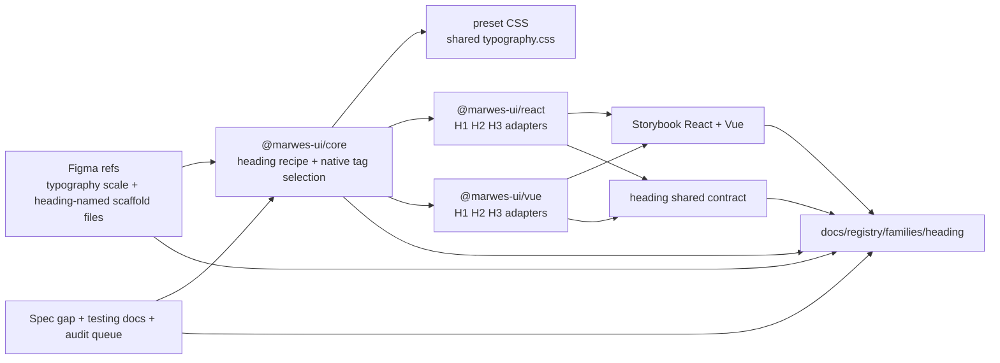
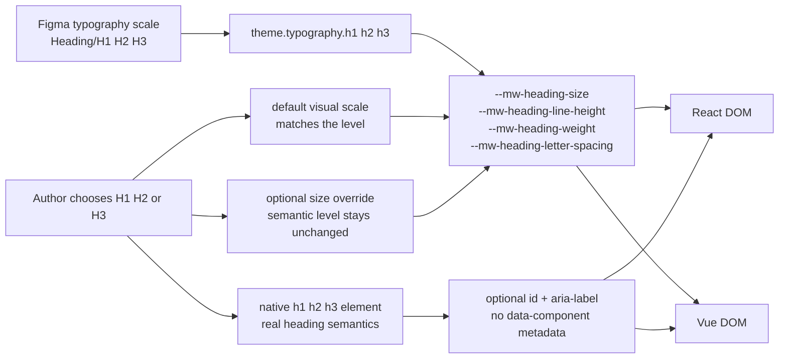

# Heading Registry

> Family: `heading`
>
> Local design refs only — this page uses the synced files under `.figma/` and makes no
> Figma API calls.

## Registry files

- [`registry.meta.json`](./registry.meta.json)
- [`registry.generated.json`](./registry.generated.json)
- [`../../../../artifacts/component-registry.json`](../../../../artifacts/component-registry.json)

## Registry snapshot

| Field | Value |
| --- | --- |
| Family status | Shipped |
| Audit status | First pass complete — dedicated family audit doc now exists |
| Semantic coverage | None — Heading relies on native `<h1>`, `<h2>`, and `<h3>` semantics; it is not part of the wave-1 central semantic registry and does not emit family-local `data-*` metadata |
| Generated structural truth | `registry.generated.json` + `artifacts/component-registry.json` |
| Primary Figma nodes | typography light section `1368:5656`, typography dark section `1368:5677`, H1 row `1368:5665`, H2 row `1368:5666`, H3 row `1368:5667`, heading-named scaffold component `1918:15754` |
| Main AXE watch item | keeping document-outline decisions honest, using `size` only as a visual escape hatch, and avoiding decorative heading styling that weakens real content structure |

## Registry ownership

- `README.md` is the human teaching page.
- `registry.meta.json` is the authored structured summary for this family.
- `registry.generated.json` and `artifacts/component-registry.json` are generator-owned structural outputs.
- this family intentionally has no Marwes semantic-registry or family-local `data-*` layer; the real semantic contract is the native `h1`/`h2`/`h3` element that each adapter renders.
- `visuals/*.mmd` help people orient themselves quickly, but they are not the canonical implementation source.

## Summary

The Heading family is Marwes' baseline document-structure typography family.
It consists of:
- three raw heading atoms: `H1`, `H2`, and `H3`
- one shared core `headingRecipe` that maps semantic level and optional visual `size`
- one shared `typography.css` preset that Heading also shares with Paragraph
- shared React/Vue contract coverage for native heading semantics, `id`, `aria-label`, and size override behavior

This makes Heading a strong fifteenth registry family because it ties together:
- one of the repo's smallest but most semantically important baseline families
- a clear runtime contract where native HTML semantics matter more than Marwes-specific metadata
- strong parity between React and Vue through one core recipe and one shared contract
- a useful design-source clarification: the real Figma baseline lives in typography tokens and page sections, not in the literal `component-heading` scaffold files that appear elsewhere in the sync

## Family surface map

| Surface level | Main members | Why it matters |
| --- | --- | --- |
| Atom set | `H1`, `H2`, `H3` | direct native heading wrappers for page, section, and subsection structure |
| Core primitive | `headingRecipe` | shared source of truth for tag selection, size mapping, and typography CSS variables |
| Canonical product path | raw heading atoms with outline-first level choice | the recommended direct usage path because this family is intentionally small and native-first |
| Architecture boundary | semantic level vs visual `size` override | makes it explicit that visual scale can change without changing the underlying heading tag |
| Visual teaching surface | `Heading/Atom` Storybook story + Introduction docs | shows the full shipped API: levels, overrides, ids, long text, and real hierarchy examples |
| Escape hatch | `size`, `id`, `className`, and local spacing styles | supported when consumers intentionally own anchor links, local spacing, or semantic/visual mismatch |

## Canonical visual understanding

Read this section in this order:
1. canonical Storybook story references for runtime visuals
2. the layer map for repo placement
3. the interaction map for native heading semantics, size override behavior, and the absence of Marwes metadata

## Primary visual sources

| Source | Path | Why it matters |
| --- | --- | --- |
| React Storybook | `apps/storybook-react/src/stories/heading/Introduction.mdx` | canonical React teaching surface for outline-first usage and the raw-atom-only family shape |
| React Storybook | `apps/storybook-react/src/stories/heading/heading.stories.tsx` | runtime baseline for `H1`, `H2`, `H3`, size overrides, ids, long text, and real content hierarchy |
| Vue Storybook | `apps/storybook-vue/src/stories/heading/Introduction.mdx` | canonical Vue teaching surface for the same atom-only family |
| Vue Storybook | `apps/storybook-vue/src/stories/heading/heading.stories.ts` | runtime baseline for the same hierarchy and size-override coverage in Vue |
| Figma showcase | `.figma/marwes/pages/-typography/typography_1368-5656.json` | light-mode typography scale with the three heading rows that match the shipped defaults |
| Figma showcase | `.figma/marwes/pages/-typography/typography_1368-5677.json` | dark-mode typography scale baseline for the same three heading rows |
| Figma tokens | `.figma/marwes/tokens/typography.json` | clearest local source for the named `Heading/H1`, `Heading/H2`, and `Heading/H3` styles |

> Minimum visual reading set for this family: Storybook Introduction, `heading.stories`, then the light and dark typography sections.

## Figma references

Primary synced refs:
- `.figma/INDEX.md`
- `.figma/marwes/tokens/typography.json`
- `.figma/marwes/pages/-typography/README.md`
- `.figma/NODE_REFERENCE.md`
- `.figma/nodes.json`

Primary showcase nodes from the synced typography page:
- Typography light section: `1368:5656`
- Typography dark section: `1368:5677`
- Heading/H1 light row: `1368:5665`
- Heading/H2 light row: `1368:5666`
- Heading/H3 light row: `1368:5667`
- Heading/H1 dark row: `1368:5686`
- Heading/H2 dark row: `1368:5687`
- Heading/H3 dark row: `1368:5688`
- Instrument Sans light section: `1368:5698`
- Instrument Sans dark section: `1368:5717`

Related synced page refs:
- `.figma/marwes/pages/-typography/typography_1368-5656.json`
- `.figma/marwes/pages/-typography/typography_1368-5677.json`
- `.figma/marwes/pages/-typography/typography_1368-5698.json`
- `.figma/marwes/pages/-typography/typography_1368-5717.json`

Related heading-named sync refs that were inspected but are not treated as the shipped family baseline:
- `.figma/marwes/components/component-heading.json`
- `.figma/marwes/pages/-banner/component-heading_1932-7061.json`
- `.figma/marwes/pages/-banner/component-heading_1935-7184.json`
- `.figma/marwes/pages/additional-to-this-file/component-heading_1918-15754.json`
- `.figma/marwes/pages/additional-to-this-file/component-heading_1918-15800.json`
- `.figma/marwes/pages/additional-to-this-file/component-heading_1918-15833.json`

> Current sync note: there is no dedicated `.figma/marwes/components/heading.json` file.
> The real design baseline for the shipped `H1` / `H2` / `H3` family lives in the typography
> tokens and typography page sections above.
>
> The literal `component-heading` files in the local sync are documentation/header scaffolds for
> showcase pages, not the shipped Marwes heading atom family.
>
> `.figma/NODE_REFERENCE.md` likewise only gives Heading indirect coverage through the Typography
> section rather than a dedicated heading-family row.

## Figma variant summary

| Surface | Variants | States | Notable tokens |
| --- | --- | --- | --- |
| Typography light/dark sections | one heading scale with three rows | `Heading/H1`, `Heading/H2`, `Heading/H3` across `light` and `dark` | `Heading/H1`, `Heading/H2`, `Heading/H3` |
| Typography token JSON | three named heading styles plus the surrounding type scale | token-style definitions rather than component states | direct mapping to the shipped font size, line height, weight, and letter spacing defaults |
| Heading-named scaffold refs | documentation card/header chrome, not heading atoms | description/link toggles and layout-only variations | useful only as a naming-mismatch reference; not a source of truth for `H1`, `H2`, `H3` |

> Important family distinction: the local Figma sync teaches Heading primarily as part of the Typography page and token set, not as a dedicated interactive component family.
>
> In other words: Figma is the visual baseline for the three heading sizes and their light/dark token values, while Storybook and the shared contract are the better references for native heading semantics, `size` overrides, `id`, and adapter parity.
>
> Also note: the shipped Heading family supports semantic/visual mismatch through the `size` prop, but that escape hatch does not appear as a dedicated design matrix in the synced typography page.
>
> One more sync wrinkle: the literal `component-heading` files look relevant by name, but they actually describe documentation scaffolds for other synced pages rather than the shipped heading atoms.

## Visual model

### Layer map



Source copy: [`visuals/layer-map.mmd`](./visuals/layer-map.mmd)

### File map

```mermaid
flowchart TD
  Registry["docs/registry/families/heading"]
  Registry --> Meta["registry.meta.json"]
  Registry --> Generated["registry.generated.json"]
  Registry --> Visuals["visuals/*.mmd"]

  Core["packages/core/src/components/atoms/heading/"]
  Core --> CoreFiles["heading-a11y.ts heading-recipe.ts heading-types.ts"]
  CoreTests["packages/core/test/recipes/heading.test.ts"]
  Core --> CoreTests
  Theme["packages/core/src/theme/"]
  Theme --> ThemeDefaults["theme-defaults.ts"]

  Presets["packages/presets/src/firstEdition/"]
  Presets --> TypographyCss["typography.css"]

  React["packages/react/src/components/heading/"]
  React --> ReactFiles["h1.tsx h2.tsx h3.tsx tests"]

  Vue["packages/vue/src/components/heading/"]
  Vue --> VueFiles["create-heading.ts heading-variants.ts tests"]

  StoriesR["apps/storybook-react/src/stories/heading/"]
  StoriesV["apps/storybook-vue/src/stories/heading/"]
  Contracts["tests/contracts/heading.contract.ts"]
```



Source copy: [`visuals/file-map.mmd`](./visuals/file-map.mmd)

### Interaction and semantics map



Source copy: [`visuals/interaction-map.mmd`](./visuals/interaction-map.mmd)

## Philosophy

- **Choose semantic level by document structure first.** `H1`, `H2`, and `H3` should describe the outline honestly before any visual styling concerns.
- **Keep native semantics as the contract.** This family should stay grounded in real `h1`/`h2`/`h3` elements rather than growing a parallel Marwes metadata layer just for the sake of uniformity.
- **Treat `size` as a deliberate escape hatch.** Visual mismatch is supported, but it should stay secondary to an honest outline and not become a shortcut for skipping hierarchy decisions.
- **Keep heading styling source-owned in theme typography and shared preset CSS.** One recipe plus one `typography.css` file keeps Heading and Paragraph aligned.
- **Keep richer title surfaces out of scope.** Hero banners, section headers with metadata, or other display shells should become their own governed family if they ever ship.

## AXE / accessibility posture

| Area | Status | Notes |
| --- | --- | --- |
| Risk tier | Low | heading is a native semantic element, but document-outline mistakes still affect accessibility meaningfully |
| Audit status | First pass complete | `docs/audits/heading-family-accessibility.md` captures the completed first-pass audit and follow-up boundaries |
| Automated contract | Strong | core recipe tests, shared React/Vue contract coverage, and Storybook docs/taxonomy tests cover the shipped family behavior |
| Manual review boundary | Narrow | the main human judgment is whether product teams choose the right heading level and use `size` overrides sparingly |
| AXE follow-up | Active discipline | the dedicated family audit is complete; broader support-model work remains non-blocking |

### What automation already covers

- semantic `h1`, `h2`, and `h3` rendering in both adapters through the shared heading contract
- size defaults that match the heading level plus explicit size override behavior in core recipe tests
- `id` and `aria-label` passthrough in both adapters
- Storybook introduction and taxonomy coverage in both apps

### What still needs manual review or policy clarity

- whether real product screens choose heading levels that produce an honest document outline
- whether teams use `size` only when semantic and visual hierarchy truly need to diverge
- whether ids and anchor-link patterns remain useful and consistent when headings are used for table-of-contents or deep-link navigation

### Why the semantics are intentionally called none

This family does not participate in the wave-1 central semantic registry and does not emit family-local `data-*` metadata either.

That distinction matters because:
- the accessible meaning already comes from the actual `h1`, `h2`, or `h3` element
- there is no `data-component="heading"` or purpose-wrapper vocabulary in the current shipped family
- the registry should not pretend that a metadata system exists when native HTML semantics are the real source of truth

### Current implementation hotspots

- `packages/core/src/components/atoms/heading/heading-recipe.ts` is the main source of truth for semantic tag selection, size mapping, and typography CSS variables.
- `packages/presets/src/firstEdition/typography.css` is the shared preset source for heading and paragraph styling.
- `packages/vue/src/components/heading/create-heading.ts` and the three React heading adapters are the key framework surfaces that must preserve native tag semantics.

## Semantics snapshot

| Field | Current heading family contract |
| --- | --- |
| `data-component` | none — the family relies on native `<h1>`, `<h2>`, and `<h3>` semantics instead of emitting family metadata |
| canonical attributes | none in the Marwes semantic registry; native tag choice plus optional accessible name is the real contract |
| purpose vocabulary | n/a |
| source of truth | `packages/core/src/components/atoms/heading/heading-recipe.ts`, the React/Vue heading adapters, and `tests/contracts/heading.contract.ts` |

## Linked files

This family follows the same repo tree order used elsewhere in Marwes:

```text
spec/decision → core → preset CSS → React adapter → React stories/tests → Vue adapter → Vue stories/tests → contracts → registry
```

| Layer | Path | Why it matters |
| --- | --- | --- |
| Spec | `docs/reference/spec.md` | there is no dedicated heading-specific section yet, so code, Storybook, tests, and typography refs carry most of the current contract weight |
| AI metadata | `docs/reference/ai-metadata.md` | useful because Heading is absent here today, which reinforces that the family relies on native semantics rather than registry metadata |
| Testing docs | `docs/reference/testing.md` | shared-contract expectations and manual-review framing |
| Audit queue | `docs/audits/README.md` | Heading is first-pass complete in Wave 3 and now has a dedicated family audit doc |
| Core | `packages/core/src/components/atoms/heading/heading-types.ts` | public heading contract for semantic level, optional visual size, and minimal accessibility props |
| Core | `packages/core/src/components/atoms/heading/heading-a11y.ts` | minimal id and `ariaLabel` mapping for the native heading surface |
| Core | `packages/core/src/components/atoms/heading/heading-recipe.ts` | heading RenderKit assembly, native tag selection, and typography CSS variable output |
| Core test | `packages/core/test/recipes/heading.test.ts` | recipe-level baseline for default size mapping and explicit override behavior |
| Theme defaults | `packages/core/src/theme/theme-defaults.ts` | shipped heading typography defaults that mirror the current Figma heading scale |
| Presets | `packages/presets/src/firstEdition/typography.css` | shared heading and paragraph styling shell |
| React | `packages/react/src/components/heading/h1.tsx` | native top-level heading adapter in React |
| React | `packages/react/src/components/heading/h2.tsx` | native section-heading adapter in React |
| React | `packages/react/src/components/heading/h3.tsx` | native subsection-heading adapter in React |
| Vue | `packages/vue/src/components/heading/create-heading.ts` | shared native heading adapter factory in Vue |
| Vue | `packages/vue/src/components/heading/heading-variants.ts` | `H1`, `H2`, and `H3` assembly in Vue |
| Stories | `apps/storybook-react/src/stories/heading/Introduction.mdx` | canonical React teaching surface |
| Stories | `apps/storybook-react/src/stories/heading/heading.stories.tsx` | full runtime hierarchy and size-override baseline in React |
| Stories | `apps/storybook-vue/src/stories/heading/Introduction.mdx` | canonical Vue teaching surface |
| Stories | `apps/storybook-vue/src/stories/heading/heading.stories.ts` | full runtime hierarchy and size-override baseline in Vue |
| Contracts | `tests/contracts/heading.contract.ts` | shared cross-adapter heading semantics and size override coverage |
| Figma | `.figma/marwes/pages/-typography/README.md` | synced typography page inventory |
| Figma | `.figma/marwes/tokens/typography.json` | named heading style tokens that map directly to the shipped defaults |
| Figma | `.figma/marwes/components/component-heading.json` | inspected mismatch reference that proves the literal heading-named sync file is documentation chrome rather than the shipped atom family |
| Figma | `.figma/NODE_REFERENCE.md` | typography-section node ids for the heading scale |

## Verification

Focused commands for this family:

```bash
pnpm --filter @marwes-ui/core exec vitest run test/recipes/heading.test.ts
pnpm test:typecheck:contracts
pnpm --filter @marwes-ui/react exec vitest run src/components/heading/__tests__/heading.test.tsx
pnpm --filter @marwes-ui/vue exec vitest run src/components/heading/__tests__/heading.test.ts
pnpm --filter ./apps/storybook-react exec vitest run src/stories/heading/__tests__/heading-introduction-docs.test.ts src/stories/heading/__tests__/heading-taxonomy.test.ts
pnpm --filter ./apps/storybook-vue exec vitest run src/stories/heading/__tests__/heading-introduction-docs.test.ts src/stories/heading/__tests__/heading-taxonomy.test.ts
pnpm check:compass
```

Broader confidence:

```bash
pnpm check
pnpm test:packages
pnpm storybook:consistency
```

## Registry notes

Current limitations of the PoC:
- the heading registry is generator-backed, but the family source map is still maintained manually in `scripts/component-registry-sources.ts`
- the family uses Storybook references and Mermaid diagrams for visual orientation rather than committed preview assets
- the dedicated `docs/audits/heading-family-accessibility.md` file now captures the finished first-pass audit, while support-model work remains a separate non-blocking track
- there is no dedicated `heading.css`; the family shares `packages/presets/src/firstEdition/typography.css` with Paragraph
- there is no dedicated `heading.json` component file in the current local Figma sync, so the real design baseline comes from typography tokens and page sections instead
- the literal `component-heading` sync files were inspected, but they are intentionally not treated as the shipped Heading family surface because they describe documentation scaffolds

## Open questions

- If Marwes later needs `H4+`, should that extend the current Heading family or arrive as part of a broader typography contract update?
- Should the local Figma sync eventually gain a dedicated heading component/page that maps directly to the shipped `H1` / `H2` / `H3` API, or is the typography-page baseline sufficient?
