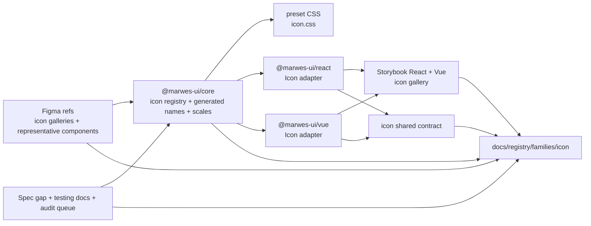
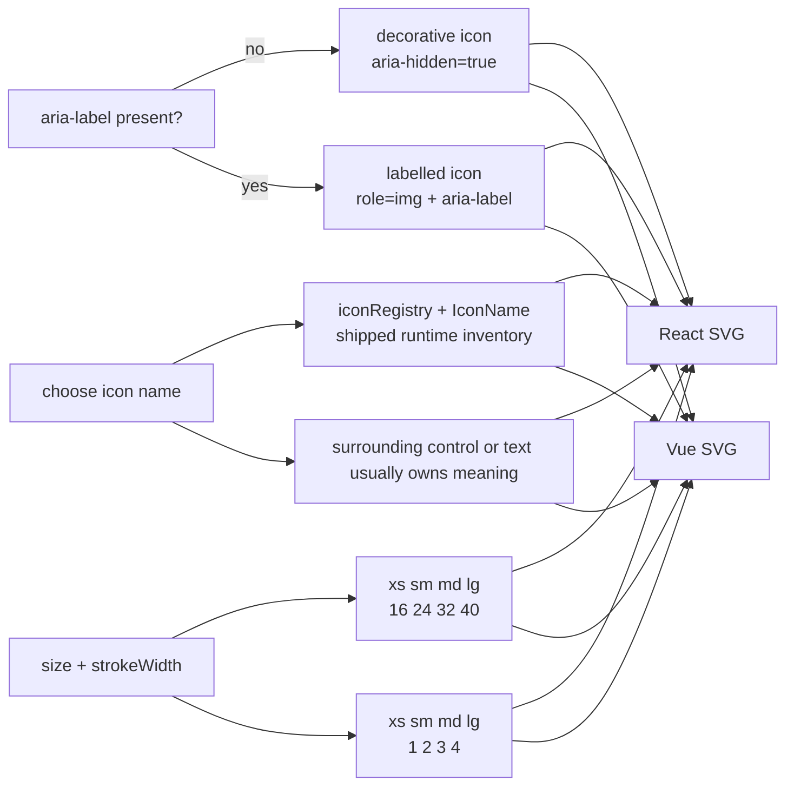

# Icon Registry

> Family: `icon`
>
> Local design refs only — this page uses the synced files under `.figma/` and makes no
> Figma API calls.

## Registry files

- [`registry.meta.json`](./registry.meta.json)
- [`registry.generated.json`](./registry.generated.json)
- [`../../../../artifacts/component-registry.json`](../../../../artifacts/component-registry.json)

## Registry snapshot

| Field | Value |
| --- | --- |
| Family status | Shipped |
| Audit status | First pass complete — dedicated family audit doc now exists |
| Semantic coverage | None — Icon relies on native SVG semantics and parent control context; it is not part of the wave-1 central semantic registry and does not emit family-local `data-*` metadata |
| Generated structural truth | `registry.generated.json` + `artifacts/component-registry.json` |
| Primary Figma nodes | icon light frame `1384:10135`, icon dark frame `1384:10579`, interface container `1384:11023`, arrows container `1384:11076`, users container `1384:11137`, editor container `2015:6777`, medias container `2015:7449`, size legend text `1455:8865` |
| Main AXE watch item | keeping decorative icons hidden, keeping icon-only parent controls labelled, and staying honest about the current adapter-vs-recipe implementation split |

## Registry ownership

- `README.md` is the human teaching page.
- `registry.meta.json` is the authored structured summary for this family.
- `registry.generated.json` and `artifacts/component-registry.json` are generator-owned structural outputs.
- this family intentionally has no Marwes semantic-registry or family-local `data-*` layer; the real contract is the SVG's decorative-versus-labelled behavior plus the parent control context around it.
- `visuals/*.mmd` help people orient themselves quickly, but they are not the canonical implementation source.

## Summary

The Icon family is Marwes' named SVG icon inventory family.
It consists of:
- one raw `Icon` atom
- one generated runtime inventory in `icon-registry.ts` and `icon-names.ts`
- one shared size and stroke-width scale
- shared React/Vue contract coverage for decorative-versus-labelled behavior
- one Storybook gallery per framework for inventory discovery, filtering, and scale comparison

This makes Icon a strong nineteenth registry family because it ties together:
- one of the repo's broadest generated asset inventories behind one very small public atom
- a low-risk but high-frequency accessibility contract where decorative defaults and parent-owned naming matter more than bespoke metadata
- a useful design-to-runtime mismatch that is worth documenting explicitly: the synced Figma page currently showcases a 98-icon light/dark gallery plus extra editor/media inventory containers, while the shipped runtime inventory exposes 227 generated icon names
- an important implementation nuance where core recipe and preset-CSS infrastructure exist, but the shipped React and Vue adapters currently render directly from `iconRegistry` and the scale helpers instead of consuming that full recipe path

## Family surface map

| Surface level | Main members | Why it matters |
| --- | --- | --- |
| Atom | `Icon` | low-level named SVG icon surface for inline UI affordances, status adjuncts, and parent-controlled icon-only patterns |
| Core inventory | `iconRegistry`, `IconName`, `iconNamesList` | generated source of truth for the shipped runtime icon names and SVG node data |
| Core scale layer | `icon-scales.ts` | maps `xs` / `sm` / `md` / `lg` into 16 / 24 / 32 / 40 size values and 1 / 2 / 3 / 4 stroke-width values |
| Canonical discovery path | Storybook `Icon/Atom` gallery | recommended way to choose a name, inspect size and stroke weight, and verify the shipped inventory |
| Architecture boundary | shipped adapter path vs adjacent recipe/preset path | makes it explicit that React and Vue currently render icons directly rather than consuming the full `createIconRecipe` + `icon.css` class path |
| Escape hatch | explicit numeric `size` and `strokeWidth`, custom `className`, explicit `aria-label` | supported when consumers intentionally need non-token scaling or a standalone labelled icon |

## Canonical visual understanding

Read this section in this order:
1. canonical Storybook story references for runtime visuals
2. the layer map for repo placement
3. the interaction map for decorative-versus-labelled semantics, scale mapping, and parent-owned meaning

## Primary visual sources

| Source | Path | Why it matters |
| --- | --- | --- |
| React Storybook | `apps/storybook-react/src/stories/icon/Introduction.mdx` | canonical React teaching surface for the atom-only family and gallery-led discovery workflow |
| React Storybook | `apps/storybook-react/src/stories/icon/icon.stories.tsx` | runtime baseline for the searchable icon gallery, size controls, stroke-width controls, and grid density |
| Vue Storybook | `apps/storybook-vue/src/stories/icon/Introduction.mdx` | canonical Vue teaching surface for the same atom-only family |
| Vue Storybook | `apps/storybook-vue/src/stories/icon/icon.stories.ts` | runtime baseline for the same searchable gallery in Vue |
| Figma showcase | `.figma/marwes/pages/-icons/-icons_1384-10135.json` | main light-mode icon gallery with the 98-icon, 3-category showcase and size section |
| Figma showcase | `.figma/marwes/pages/-icons/-icons-dark_1384-10579.json` | dark-mode gallery baseline for the same showcased inventory |
| Figma showcase | `.figma/marwes/pages/-icons/component-container_1384-11023.json` | interface icon inventory container with 44 icons |
| Figma showcase | `.figma/marwes/pages/-icons/component-container_1384-11076.json` | arrows icon inventory container with 51 icons |
| Figma showcase | `.figma/marwes/pages/-icons/component-container_1384-11137.json` | users icon inventory container with 3 icons |
| Figma showcase | `.figma/marwes/pages/-icons/component-container_2015-6777.json` | editor icon inventory container with 20 icons |
| Figma showcase | `.figma/marwes/pages/-icons/component-container_2015-7449.json` | medias icon inventory container with 21 icons |

> Minimum visual reading set for this family: Storybook Introduction, `icon.stories`, then the light and dark icon frames and the category containers.

## Figma references

Primary synced refs:
- `.figma/INDEX.md`
- `.figma/marwes/components/_index.json`
- `.figma/marwes/components/icons-interface-search.json`
- `.figma/marwes/components/icons-arrows-chevron-down.json`
- `.figma/marwes/components/icons-users-user.json`
- `.figma/marwes/components/bold-1.json`
- `.figma/marwes/components/play-1.json`
- `.figma/NODE_REFERENCE.md`
- `.figma/nodes.json`
- `.figma/marwes/pages/-icons/README.md`

Primary showcase nodes from the synced icons page:
- Icon light frame: `1384:10135`
- Icon dark frame: `1384:10579`
- Interface container: `1384:11023`
- Arrows container: `1384:11076`
- Users container: `1384:11137`
- Editor container: `2015:6777`
- Medias container: `2015:7449`
- Size legend text: `1455:8865`
- Representative search icon component: `1382:9204`
- Representative chevron-down icon component: `1382:9262`
- Representative user icon component: `1382:9330`
- Representative bold icon component: `2015:7037`
- Representative play icon component: `2015:7436`

Related synced page refs:
- `.figma/marwes/pages/-icons/-icons_1384-10135.json`
- `.figma/marwes/pages/-icons/-icons-dark_1384-10579.json`
- `.figma/marwes/pages/-icons/component-container_1384-11023.json`
- `.figma/marwes/pages/-icons/component-container_1384-11076.json`
- `.figma/marwes/pages/-icons/component-container_1384-11137.json`
- `.figma/marwes/pages/-icons/component-container_2015-6777.json`
- `.figma/marwes/pages/-icons/component-container_2015-7449.json`
- `.figma/marwes/pages/-icons/default-24px-xs-sm-md-lg_1455-8865.json`

> Current sync note: there is no dedicated `.figma/marwes/components/icon.json` file.
> The local design baseline is spread across many per-icon component JSON files plus the `pages/-icons/`
> gallery inventory.
>
> Another important distinction: the main light and dark icon frames currently describe a 98-icon,
> 3-category showcase (`Interface`, `Arrows`, `Users`), but the same page also includes separate
> editor and medias component containers, and the shipped code inventory currently exposes 227
> generated icon names.
>
> This registry entry therefore treats `.figma/marwes/components/_index.json` as the primary lookup
> surface for the broader Figma inventory, while using the page galleries and a representative set
> of per-icon component JSON files as the practical local design baseline.

## Figma variant summary

| Surface | Variants | States | Notable tokens |
| --- | --- | --- | --- |
| Main icon light/dark frames | 98 showcased icons across `Interface (44)`, `Arrows (51)`, and `Users (3)` | `xs`, `sm`, `md`, `lg` guidance plus `light` and `dark` gallery frames | page subtitle references `icon/default` |
| Category component containers | separate inventory slices for `Interface`, `Arrows`, `Users`, `Editor`, and `Medias` | each container reiterates the same 16 / 24 / 32 / 40 size guidance | useful as category lookup aids, but they do not explain runtime `strokeWidth` behavior |
| Representative per-icon component JSONs | individual 16×16 icon primitives such as `search`, `chevron-down`, `user`, `bold`, and `play` | one static component per icon rather than interactive states | these JSONs flatten each icon into vector unions, so Storybook and code are the better references for the shipped stroke-width API |

> Important family distinction: the synced Figma materials teach icon categories, inventory slices,
> and size guidance well, but they do not describe the full shipped runtime behavior around
> decorative defaults, explicit `aria-label`, or numeric `size` and `strokeWidth` overrides.
>
> In other words: Figma is the visual baseline for icon inventory and broad category grouping,
> while Storybook and the package tests are the better references for accessibility semantics and
> the shipped runtime scale API.
>
> One more meaningful mismatch: the Figma page still frames the main gallery as a 98-icon showcase,
> while the shipped `IconName` runtime inventory currently contains 227 generated names.

## Visual model

### Layer map



Source copy: [`visuals/layer-map.mmd`](./visuals/layer-map.mmd)

### File map

```mermaid
flowchart TD
  Registry["docs/registry/families/icon"]
  Registry --> Meta["registry.meta.json"]
  Registry --> Generated["registry.generated.json"]
  Registry --> Visuals["visuals/*.mmd"]

  Core["packages/core/src/components/atoms/icon/"]
  Core --> RegistryFiles["icon-registry.ts icon-names.ts icon-recipe.ts icon-scales.ts icon-types.ts"]
  CoreScript["packages/core/scripts/generate-icon-names.ts"]
  Core --> CoreScript
  CoreTests["packages/core/test/recipes/icon.test.ts"]
  Core --> CoreTests

  Presets["packages/presets/src/firstEdition/"]
  Presets --> IconCss["icon.css"]

  React["packages/react/src/components/icon/"]
  React --> ReactFiles["icon.tsx tests"]

  Vue["packages/vue/src/components/icon/"]
  Vue --> VueFiles["icon.ts tests"]

  StoriesR["apps/storybook-react/src/stories/icon/"]
  StoriesV["apps/storybook-vue/src/stories/icon/"]
  Contracts["tests/contracts/icon.contract.ts"]
  FigmaLookup[".figma/marwes/components/_index.json"]
```



Source copy: [`visuals/file-map.mmd`](./visuals/file-map.mmd)

### Interaction and semantics map



Source copy: [`visuals/interaction-map.mmd`](./visuals/interaction-map.mmd)

## Philosophy

- **Keep Icon low-level.** It should stay a small visual primitive rather than becoming the semantic center of a control or status message by default.
- **Default to decorative.** An unlabeled icon should be hidden from assistive technology unless it is intentionally being exposed as an image with an accessible name.
- **Let parent controls own the meaning.** Buttons, tabs, tooltip triggers, and other icon-heavy surfaces should usually get their accessible name from the parent component, not from the icon atom itself.
- **Teach the inventory through Storybook.** The gallery is the clearest way to discover shipped names, compare scales, and catch naming drift.
- **Be honest about the implementation split.** Core recipe and preset CSS infrastructure exist, but the shipped adapters currently render directly from `iconRegistry` and the shared scale helpers.

## AXE / accessibility posture

| Area | Status | Notes |
| --- | --- | --- |
| Risk tier | Low | icon is a small atom, but misuse still matters when icon-only parent controls lack an accessible name or decorative icons are exposed unnecessarily |
| Audit status | First pass complete | `docs/audits/icon-family-accessibility.md` captures the completed first-pass audit and follow-up boundaries |
| Automated contract | Strong on the shipped adapter surface | shared React/Vue contract coverage, core recipe tests, and Storybook docs/taxonomy tests cover the current atom behavior |
| Manual review boundary | Narrow but real | the main human judgment is whether icon-only parent controls are named correctly and whether the visual inventory stays design-aligned |
| AXE follow-up | Active discipline | the dedicated family audit is complete; broader support-model work remains non-blocking |

### What automation already covers

- decorative-by-default behavior when no accessible label is provided
- labelled icon behavior with `role="img"` and explicit `aria-label`
- token-based size and stroke-width resolution through the shared React/Vue contract
- core recipe output for size, stroke-width, and labelled-versus-decorative variants
- Storybook introduction and taxonomy coverage in both apps

### What still needs manual review or policy clarity

- whether icon-only buttons, tabs, tooltip triggers, and similar parent controls always get an accessible name from the parent surface or an intentional icon label
- whether the broad shipped runtime inventory should stay larger than the current showcased Figma baseline, or be narrowed for stronger design parity
- whether the current direct-adapter rendering path should eventually converge with `createIconRecipe` and `icon.css`, or whether the adjacent recipe-layer affordances should be simplified away

### Why the semantics are intentionally called none

This family does not participate in the wave-1 central semantic registry and does not emit family-local `data-*` metadata either.

That distinction matters because:
- the accessible meaning usually comes from either `aria-hidden` or an explicit `aria-label`
- there is no `data-component="icon"` or purpose-wrapper vocabulary in the current shipped family
- the icon atom often borrows its actual product meaning from the surrounding parent control or nearby text, not from standalone metadata

### Current implementation hotspots

- `packages/core/src/components/atoms/icon/icon-registry.ts` and `icon-names.ts` define the shipped runtime inventory.
- `packages/core/scripts/generate-icon-names.ts` is the generator that keeps the public icon-name surface aligned with the registry.
- `packages/react/src/components/icon/icon.tsx` and `packages/vue/src/components/icon/icon.ts` are the key parity surfaces because they currently render directly from the registry rather than consuming the full core recipe path.

## Semantics snapshot

| Field | Current icon family contract |
| --- | --- |
| `data-component` | none — the family relies on SVG accessibility semantics instead of emitting family metadata |
| canonical attributes | none in the Marwes semantic registry; decorative `aria-hidden` or explicit `aria-label` are the real contract |
| purpose vocabulary | n/a |
| source of truth | `packages/core/src/components/atoms/icon/icon-registry.ts`, `packages/react/src/components/icon/icon.tsx`, `packages/vue/src/components/icon/icon.ts`, and `tests/contracts/icon.contract.ts` |

## Linked files

This family follows the same repo tree order used elsewhere in Marwes:

```text
spec/decision → core → preset CSS → React adapter → React stories/tests → Vue adapter → Vue stories/tests → contracts → registry
```

| Layer | Path | Why it matters |
| --- | --- | --- |
| Spec | `docs/reference/spec.md` | there is no dedicated icon-family section yet, so code, Storybook, tests, and Figma refs carry most of the current contract weight |
| AI metadata | `docs/reference/ai-metadata.md` | useful because Icon is absent here today, which reinforces that the family relies on SVG semantics rather than registry metadata |
| Testing docs | `docs/reference/testing.md` | shared-contract expectations and manual-review framing |
| Audit queue | `docs/audits/README.md` | Icon is first-pass complete in Wave 3 and now has a dedicated family audit doc |
| Core | `packages/core/src/components/atoms/icon/icon-types.ts` | public icon atom contract for names, size, stroke width, and accessibility inputs |
| Core | `packages/core/src/components/atoms/icon/icon-scales.ts` | canonical size and stroke-width token mapping |
| Core | `packages/core/src/components/atoms/icon/icon-registry.ts` | generated SVG node inventory for the shipped icon set |
| Core | `packages/core/src/components/atoms/icon/icon-names.ts` | generated public icon-name surface and runtime icon name list |
| Core | `packages/core/src/components/atoms/icon/icon-recipe.ts` | adjacent core recipe path for icon class names and CSS vars |
| Core script | `packages/core/scripts/generate-icon-names.ts` | generator that keeps `icon-names.ts` aligned with the registry inventory |
| Core test | `packages/core/test/recipes/icon.test.ts` | recipe-level baseline for decorative defaults and size or stroke output |
| Presets | `packages/presets/src/firstEdition/icon.css` | adjacent preset styling path for icon classes and button-context size overrides |
| React | `packages/react/src/components/icon/icon.tsx` | shipped React icon adapter |
| Vue | `packages/vue/src/components/icon/icon.ts` | shipped Vue icon adapter |
| Stories | `apps/storybook-react/src/stories/icon/Introduction.mdx` | canonical React teaching surface |
| Stories | `apps/storybook-react/src/stories/icon/icon.stories.tsx` | full runtime icon gallery in React |
| Stories | `apps/storybook-vue/src/stories/icon/Introduction.mdx` | canonical Vue teaching surface |
| Stories | `apps/storybook-vue/src/stories/icon/icon.stories.ts` | full runtime icon gallery in Vue |
| Contracts | `tests/contracts/icon.contract.ts` | shared decorative-versus-labelled semantics and scale coverage |
| Figma | `.figma/marwes/pages/-icons/README.md` | synced icon page inventory |
| Figma | `.figma/marwes/components/_index.json` | the best local lookup surface for the large per-icon component inventory |
| Figma | `.figma/marwes/components/icons-interface-search.json` | representative interface icon component JSON |
| Figma | `.figma/marwes/components/icons-arrows-chevron-down.json` | representative arrows icon component JSON |
| Figma | `.figma/marwes/components/icons-users-user.json` | representative users icon component JSON |
| Figma | `.figma/marwes/components/bold-1.json` | representative editor icon component JSON |
| Figma | `.figma/marwes/components/play-1.json` | representative media icon component JSON |

## Verification

Focused commands for this family:

```bash
pnpm --filter @marwes-ui/core exec vitest run test/recipes/icon.test.ts
pnpm test:typecheck:contracts
pnpm --filter @marwes-ui/react exec vitest run src/components/icon/__tests__/icon.test.tsx
pnpm --filter @marwes-ui/vue exec vitest run src/components/icon/__tests__/icon.test.ts
pnpm --filter ./apps/storybook-react exec vitest run src/stories/icon/__tests__/icon-introduction-docs.test.ts src/stories/icon/__tests__/icon-taxonomy.test.ts
pnpm --filter ./apps/storybook-vue exec vitest run src/stories/icon/__tests__/icon-introduction-docs.test.ts src/stories/icon/__tests__/icon-taxonomy.test.ts
pnpm docs:links
```

Broader confidence:

```bash
pnpm check
pnpm test:packages
pnpm storybook:consistency
```

## Registry notes

Current limitations of the PoC:
- the icon registry is generator-backed, but the family source map is still maintained manually in `scripts/component-registry-sources.ts`
- the family uses Storybook references and Mermaid diagrams for visual orientation rather than committed preview assets
- the dedicated `docs/audits/icon-family-accessibility.md` file now captures the finished first-pass audit, while support-model work remains a separate non-blocking track
- the synced Figma page currently presents a 98-icon main showcase plus separate editor and medias containers, while the shipped runtime inventory exposes 227 generated icon names
- `createIconRecipe` and `icon.css` exist, but the shipped React and Vue adapters currently render SVGs directly from `iconRegistry` and the scale helpers instead of using that full recipe and preset path
- the representative per-icon Figma component JSONs flatten icons into vector unions, so they do not directly teach the runtime `strokeWidth` API

## Open questions

- Should the React and Vue Icon adapters converge on `createIconRecipe` and `icon.css`, or should the unused recipe and preset affordances be trimmed so the family has one obvious runtime path?
- Should the local Figma sync gain a fuller icon inventory or clearer category mapping that matches the 227 shipped code icon names, or should the runtime inventory be narrowed closer to the current design baseline?
