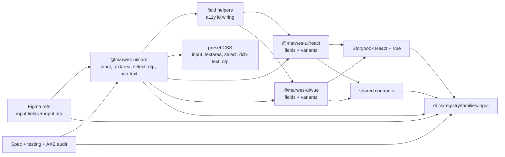
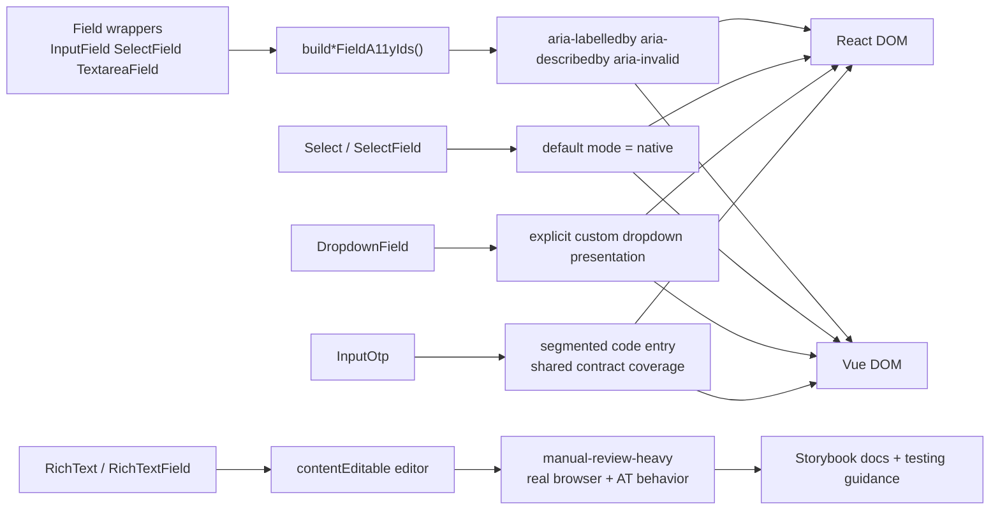

# Input Registry

> Family: `input`
>
> Local design refs only — this page uses the synced files under `.figma/` and makes no Figma API calls.

## Registry files

- [`registry.meta.json`](./registry.meta.json)
- [`registry.generated.json`](./registry.generated.json)
- [`../../../../artifacts/component-registry.json`](../../../../artifacts/component-registry.json)

## Registry snapshot

| Field | Value |
| --- | --- |
| Family status | Shipped |
| Audit status | First pass complete |
| Semantic coverage | Family-local — not yet part of the wave-1 central semantic registry |
| Generated structural truth | `registry.generated.json` + `artifacts/component-registry.json` |
| Primary Figma nodes | input fields light `1364:11372`, input fields dark `1368:5944`, input types overview `1364:11817`, OTP light `1803:15024` |
| Main AXE watch item | Marwes-default select boundary + rich text manual-review-heavy editing behavior |

## Registry ownership

- `README.md` is the human teaching page.
- `registry.meta.json` is the authored structured summary for this family.
- `registry.generated.json` and `artifacts/component-registry.json` are generator-owned structural outputs.
- the family currently uses local input-purpose semantics, not the central wave-1 semantic registry.
- `visuals/*.mmd` help people orient themselves quickly, but they are not the canonical implementation source.

## Summary

The Input family is the broadest text-entry family in Marwes.
It combines:
- low-risk native controls such as `Input` and `Textarea`
- Marwes-default `Select` behavior with native browser chrome as an opt-in fallback
- an explicit custom presentation path through `DropdownField`
- segmented entry through `InputOtp`
- a higher-risk rich editing surface through `RichText`

This makes Input a strong second registry family because it ties together:
- multiple synced Figma component refs instead of one simple component set
- a large core file tree with field helpers and multiple atom contracts
- React and Vue parity across many wrappers and variants
- the first completed AXE family audit in the repo
- a clear split between platform-native element semantics, custom presentation, and manual-review-heavy behavior

## Family surface map

| Surface level | Main members | Why it matters |
| --- | --- | --- |
| Atoms | `Input`, `Textarea`, `Select`, `InputOtp`, `RichText` | the lowest-level family surfaces with the least wrapper UX |
| Fields | `InputField`, `TextareaField`, `SelectField`, `RichTextField` | own visible label, helper text, error text, and described-by wiring |
| Purpose variants | `DropdownField`, `SearchField`, `PasswordField`, `EmailField`, `DateOfBirthField`, `ZipCodeField`, `PhoneField`, `URLField`, `CurrencyField` | encode intent-specific defaults and family-local purpose metadata |
| Native-element boundary | `Input`, `Textarea`, `Select` atom | preferred browser-semantics baseline |
| Higher-risk boundary | `SelectField` custom combobox path, `DropdownField`, `RichText` | where AXE hardening and manual review matter most |

## Canonical visual understanding

Read this section in this order:
1. canonical Storybook story references for runtime visuals
2. the layer map for repo placement
3. the interaction map for a11y and semantics flow

## Primary visual sources

| Source | Path | Why it matters |
| --- | --- | --- |
| React Storybook | `apps/storybook-react/src/stories/input/Introduction.mdx` | canonical React teaching surface for the whole family |
| React Storybook | `apps/storybook-react/src/stories/input/input.stories.tsx` | base text-input atom |
| React Storybook | `apps/storybook-react/src/stories/input/select-field.stories.tsx` | Marwes-default select field surface |
| React Storybook | `apps/storybook-react/src/stories/input/dropdown-field.stories.tsx` | explicit custom dropdown path |
| React Storybook | `apps/storybook-react/src/stories/input/rich-text.stories.tsx` | manual-review-heavy rich-text atom |
| React Storybook | `apps/storybook-react/src/stories/input/input-otp.stories.tsx` | segmented one-time-code path |
| Vue Storybook | `apps/storybook-vue/src/stories/input/Introduction.mdx` | canonical Vue teaching surface for the whole family |
| Vue Storybook | `apps/storybook-vue/src/stories/input/input.stories.ts` | base text-input atom |
| Vue Storybook | `apps/storybook-vue/src/stories/input/select-field.stories.ts` | Marwes-default select field surface |
| Vue Storybook | `apps/storybook-vue/src/stories/input/dropdown-field.stories.ts` | explicit custom dropdown path |
| Vue Storybook | `apps/storybook-vue/src/stories/input/rich-text.stories.ts` | manual-review-heavy rich-text atom in Vue |
| Vue Storybook | `apps/storybook-vue/src/stories/input/input-otp.stories.ts` | segmented one-time-code path in Vue |
| Figma showcase | `.figma/marwes/pages/-input-fields/-input-fields_1364-11372.json` | family baseline for states |
| Figma showcase | `.figma/marwes/pages/-input-fields/-input-types-overview_1364-11817.json` | type overview for text field, textarea, search, password, phone, zip, dropdown, select |
| Figma showcase | `.figma/marwes/pages/-input-otp/-input-otp_1803-15024.json` | OTP-specific visual baseline |

> Minimum visual reading set for this family: Storybook Introduction, `select-field`, `dropdown-field`, `rich-text`, and `input-otp`, then the two Figma page baselines.

## Figma references

Primary synced refs:
- `.figma/INDEX.md`
- `.figma/marwes/components/text-field.json`
- `.figma/marwes/components/text-area.json`
- `.figma/marwes/components/select.json`
- `.figma/marwes/components/dropdown.json`
- `.figma/marwes/components/input-otp.json`
- `.figma/NODE_REFERENCE.md`
- `.figma/nodes.json`
- `.figma/marwes/pages/-input-fields/README.md`
- `.figma/marwes/pages/-input-otp/README.md`

Primary showcase nodes from `.figma/NODE_REFERENCE.md`:
- Input Fields light frame: `1364:11372`
- Input Fields dark frame: `1368:5944`
- Input Types Overview light frame: `1364:11817`
- Input Types Overview dark frame: `1368:6014`
- Text field: `1364:7662`
- Textarea: `1364:7696`
- Search field: `1364:7667`
- Password field: `1364:7673`
- Date of birth field: `1364:7679`
- Phone field: `1364:7685`
- Zip code field: `1364:7691`
- Dropdown field: `1364:7701`
- Select atom: `1364:7707`

Related synced page refs:
- `.figma/marwes/pages/-input-fields/-input-fields_1364-11372.json`
- `.figma/marwes/pages/-input-fields/-input-fields-dark_1368-5944.json`
- `.figma/marwes/pages/-input-fields/-input-types-overview_1364-11817.json`
- `.figma/marwes/pages/-input-fields/-input-types-overview-dark_1368-6014.json`
- `.figma/marwes/pages/-input-fields/dropdown_1384-13225.json`
- `.figma/marwes/pages/-input-otp/-input-otp_1803-15024.json`
- `.figma/marwes/pages/-input-otp/-input-otp-dark_1803-15155.json`

## Figma variant summary

| Surface | Variants | States | Notable tokens |
| --- | --- | --- | --- |
| Input Fields showcase | input family states | `default`, `hover`, `active`, `disabled`, `focus`, `error` | `input/surface`, `input/border`, `input/label`, `input/value`, `input/placeholder`, `input/hint` |
| Input Types Overview | `text`, `textarea`, `search`, `password`, `date-of-birth`, `phone`, `zip-code`, `dropdown`, `select` | type-level overview rather than state rows | `dropdown/item-surface`, `dropdown/list-surface`, `dropdown/list-border`, `dropdown/item-label`, `dropdown/item-check` |
| Input OTP showcase | OTP cells and grouped code entry | light and dark showcase frames | segmented one-time-code layout |

> Important family distinction: the `Select` atom keeps native `<select>` semantics while defaulting to Marwes chrome, while `SelectField` and `DropdownField` own the custom combobox presentation path. The registry should keep those surfaces distinct even though they live in the same family.
>
> Note: the synced Figma refs do not currently include a dedicated RichText component node. Per the spec, `RichText` uses the current `Text field` and `Text area` refs as the temporary visual baselines until a dedicated rich-text node exists.

## Visual model

### Layer map



Source copy: [`visuals/layer-map.mmd`](./visuals/layer-map.mmd)

### File map

```mermaid
flowchart TD
  Registry["docs/registry/families/input"]
  Registry --> Meta["registry.meta.json"]
  Registry --> Generated["registry.generated.json"]
  Registry --> Visuals["visuals/*.mmd"]

  Core["packages/core/src/components/atoms/input/"]
  Core --> InputFiles["input, textarea, select, input-otp, rich-text"]
  Helpers["packages/core/src/shared/field-helpers.ts"]

  Presets["packages/presets/src/firstEdition/"]
  Presets --> InputCss["input.css + textarea.css + select.css"]
  Presets --> RichTextCss["rich-text.css"]
  Presets --> OtpCss["input-otp.css"]
  Presets --> FieldCss["molecules/input-field.css"]

  React["packages/react/src/components/input/"]
  React --> ReactFields["atoms + fields + field-variants + tests"]

  Vue["packages/vue/src/components/input/"]
  Vue --> VueFields["atoms + fields + field-variants + tests"]

  StoriesR["apps/storybook-react/src/stories/input/"]
  StoriesV["apps/storybook-vue/src/stories/input/"]
  Contracts["tests/contracts/input*.ts + select*.ts + rich-text*.ts + otp*.ts"]
```



Source copy: [`visuals/file-map.mmd`](./visuals/file-map.mmd)

### Interaction and semantics map



Source copy: [`visuals/interaction-map.mmd`](./visuals/interaction-map.mmd)

## Philosophy

- **Group text-like entry in one family.** Marwes treats plain text, multiline text, selects, OTP, and rich text as one input-domain cluster.
- **Prefer native controls first.** `Input`, `Textarea`, and default `Select` should preserve browser semantics whenever possible.
- **Keep custom presentation explicit.** `DropdownField` is the purpose-level opt-in for the custom Marwes dropdown presentation.
- **Use fields to own UX wiring.** `InputField`, `SelectField`, `TextareaField`, and `RichTextField` should own visible labels, helper text, error text, and described-by wiring.
- **Be honest about rich-text risk.** `RichText` is shipped, but it remains a manual-review-heavy component because the editor relies on `contentEditable` and browser editing behavior.

## AXE / accessibility posture

| Area | Status | Notes |
| --- | --- | --- |
| Risk tier | High | this family mixes low-risk native controls with custom combobox and rich-text editing risk |
| Audit status | First pass complete | `docs/audits/input-family-accessibility.md` |
| Automated contract | Strong | shared contracts cover input, fields, select, combobox path, OTP, textarea, and rich text |
| Manual review boundary | High | especially rich text editing and any custom dropdown interaction edge cases |
| AXE follow-up | Active discipline | input family is the first and most detailed AXE audit family |

### What automation already covers

- base input and textarea naming, description, and invalid-state wiring
- Marwes-default select behavior plus native opt-in and explicit custom combobox coverage
- field-helper id wiring across wrappers such as `InputField`, `SelectField`, and `TextareaField`
- InputOtp shared contract coverage beyond only local adapter tests
- Storybook docs that teach `RichText` as manual-review-heavy and `DropdownField` as the explicit custom path

### What still needs manual review or policy clarity

- real `RichText` editing behavior across supported browser and assistive-technology combinations
- long-term scope of the custom dropdown path now that 1.0.0 defaults to Marwes presentation
- whether family-local input purpose metadata should eventually graduate into the central semantic registry

### Why the semantics are intentionally called family-local

This family already uses useful purpose metadata such as `data-purpose="search"` and `data-purpose="dropdown"`, but that metadata currently lives in adapter-level field variants rather than the central wave-1 semantic registry in `@marwes-ui/core`.

That distinction matters because:
- the metadata is real and useful today
- it helps Storybook teaching and product code readability
- but it should not be described as if it already has the same governance level as button, badge, avatar, toast, or dialog

### Current implementation hotspots

- `packages/core/src/components/atoms/input/select-types.ts` owns the Marwes-default select mode and native opt-in boundary.
- `packages/core/src/shared/field-helpers.ts` is the key field-level a11y wiring surface.
- `packages/core/src/components/atoms/input/rich-text-a11y.ts` and `rich-text-html.ts` define the most manual-review-heavy part of the family.

## Semantics snapshot

| Field | Current input family contract |
| --- | --- |
| `data-component` | no single canonical family-level value yet |
| canonical attributes | not yet part of the wave-1 central semantic registry |
| purpose vocabulary | `dropdown`, `search`, `password`, `email`, `date-of-birth`, `zip-code`, `phone`, `url`, `currency` |
| source of truth | family-local wrappers in `packages/react/src/components/input/field-variants.tsx` and `packages/vue/src/components/input/field-variants.ts` |

## Linked files

This family follows the same repo tree order used elsewhere in Marwes:

```text
spec/decision → core → preset CSS → React adapter → React stories/tests → Vue adapter → Vue stories/tests → contracts → registry
```

| Layer | Path | Why it matters |
| --- | --- | --- |
| Spec | `docs/reference/spec.md` | Marwes-default select decision and rich-text scope |
| Testing docs | `docs/reference/testing.md` | rich-text manual-review boundary and contract expectations |
| Audit | `docs/audits/input-family-accessibility.md` | detailed AXE execution record for this family |
| Core | `packages/core/src/components/atoms/input/select-types.ts` | Marwes-default select mode and explicit native-mode boundary |
| Core | `packages/core/src/components/atoms/input/rich-text-a11y.ts` | rich-text naming and a11y contract surface |
| Core | `packages/core/src/components/atoms/input/` | input, textarea, select, input-otp, and rich-text contracts |
| Core | `packages/core/src/shared/field-helpers.ts` | field-level label, helper, and error id wiring |
| Presets | `packages/presets/src/firstEdition/input.css` | base text-input styling |
| Presets | `packages/presets/src/firstEdition/textarea.css` | multiline control styling |
| Presets | `packages/presets/src/firstEdition/select.css` | select and dropdown styling surface |
| Presets | `packages/presets/src/firstEdition/rich-text.css` | editor and toolbar styling |
| Presets | `packages/presets/src/firstEdition/input-otp.css` | segmented OTP cell styling |
| Presets | `packages/presets/src/firstEdition/molecules/input-field.css` | field wrapper styling |
| React | `packages/react/src/components/input/field-variants.tsx` | family-local purpose metadata such as dropdown, search, password, and email |
| React | `packages/react/src/components/input/` | atoms, fields, field variants, and tests |
| Vue | `packages/vue/src/components/input/field-variants.ts` | Vue family-local purpose metadata mirror |
| Vue | `packages/vue/src/components/input/` | atoms, fields, field variants, and tests |
| Stories | `apps/storybook-react/src/stories/input/Introduction.mdx` | canonical React teaching surface |
| Stories | `apps/storybook-vue/src/stories/input/Introduction.mdx` | canonical Vue teaching surface |
| Contracts | `tests/contracts/select-combobox.contract.ts` | explicit custom-combobox keyboard behavior |
| Contracts | `tests/contracts/input-otp.contract.ts` | shared OTP contract coverage |
| Contracts | `tests/contracts/rich-text.contract.ts` | rich-text atom contract boundary |
| Figma | `.figma/marwes/pages/-input-fields/README.md` | synced design page inventory |
| Figma | `.figma/marwes/pages/-input-otp/README.md` | OTP-specific synced page inventory |

## Verification

Focused commands for this family:

```bash
pnpm test:typecheck:contracts
pnpm --filter @marwes-ui/react exec vitest run src/components/input/__tests__
pnpm --filter @marwes-ui/vue exec vitest run src/components/input/__tests__
pnpm storybook:consistency
pnpm check:compass
```

Broader confidence:

```bash
pnpm check
pnpm test:packages
```

## Registry notes

Current limitations of the PoC:
- the input registry is generator-backed, but the family source map is still maintained manually in `scripts/component-registry-sources.ts`
- the family uses Storybook references and Mermaid diagrams for visual orientation rather than committed preview assets
- Input is not yet part of the wave-1 central semantic registry, so the semantics snapshot is intentionally family-local

## Open questions

- Should the input-family purpose metadata eventually move into the central semantic registry in `@marwes-ui/core`?
- When a dedicated RichText Figma component arrives, should the registry split rich-text provenance out more explicitly inside the family page?
