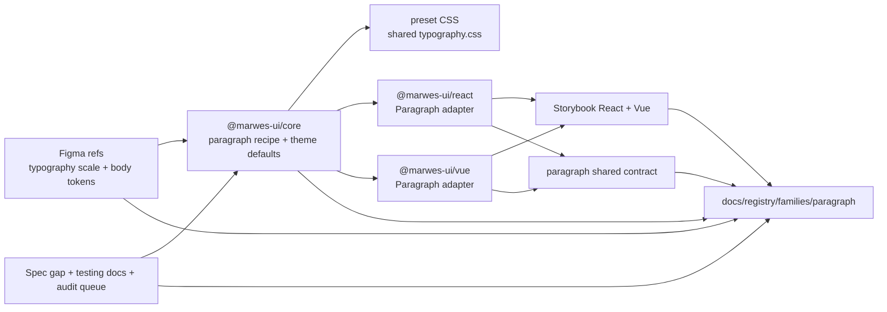
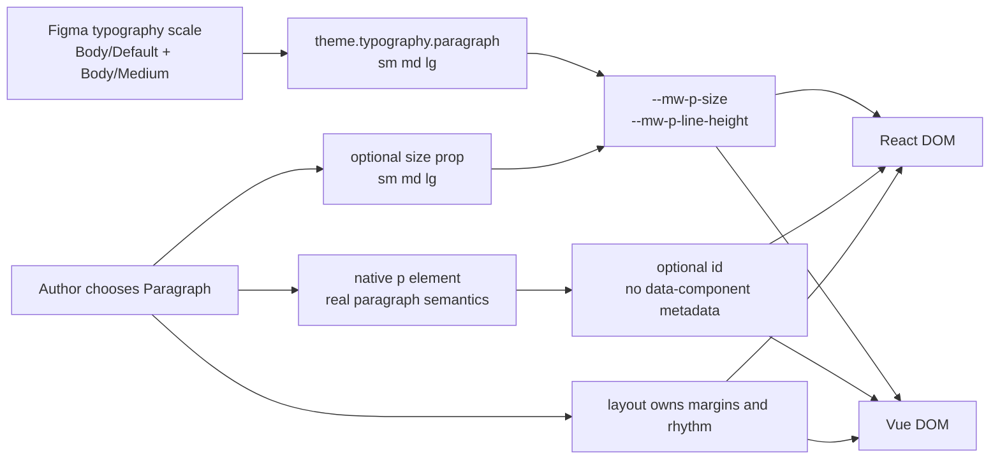

# Paragraph Registry

> Family: `paragraph`
>
> Local design refs only — this page uses the synced files under `.figma/` and makes no
> Figma API calls.

## Registry files

- [`registry.meta.json`](./registry.meta.json)
- [`registry.generated.json`](./registry.generated.json)
- [`../../../../artifacts/component-registry.json`](../../../../artifacts/component-registry.json)

## Registry snapshot

| Field | Value |
| --- | --- |
| Family status | Shipped |
| Audit status | First pass complete — dedicated family audit doc now exists |
| Semantic coverage | None — Paragraph relies on native `<p>` semantics; it is not part of the wave-1 central semantic registry and does not emit family-local `data-*` metadata |
| Generated structural truth | `registry.generated.json` + `artifacts/component-registry.json` |
| Primary Figma nodes | typography light section `1368:5656`, typography dark section `1368:5677`, body light section `1368:5669`, body medium light row `1368:5671`, body default light row `1368:5742`, body dark section `1368:5690`, body medium dark row `1368:5692`, body default dark row `1368:5746` |
| Main AXE watch item | keeping Paragraph for real body copy, preserving readable long-form layouts, and not using size as a substitute for richer semantic structure |

## Registry ownership

- `README.md` is the human teaching page.
- `registry.meta.json` is the authored structured summary for this family.
- `registry.generated.json` and `artifacts/component-registry.json` are generator-owned structural outputs.
- this family intentionally has no Marwes semantic-registry or family-local `data-*` layer; the real semantic contract is the native paragraph element that each adapter renders.
- `visuals/*.mmd` help people orient themselves quickly, but they are not the canonical implementation source.

## Summary

The Paragraph family is Marwes' baseline body-copy typography family.
It consists of:
- one raw `Paragraph` atom
- one shared core `paragraphRecipe` that maps the optional `size` prop into typography CSS variables
- one shared `typography.css` preset that Paragraph also shares with Heading
- shared React/Vue contract coverage for native paragraph rendering, size classes, and `id` passthrough

This makes Paragraph a strong eighteenth registry family because it ties together:
- one of the repo's smallest but most common text primitives
- a clean runtime contract where native HTML semantics matter more than Marwes-specific metadata
- strong parity between React and Vue through one core recipe, one shared preset, and one shared contract
- a useful design-source clarification: the current local Figma sync teaches paragraph primarily through typography tokens and body rows, not through a dedicated paragraph component or a full `sm` / `md` / `lg` runtime matrix

## Family surface map

| Surface level | Main members | Why it matters |
| --- | --- | --- |
| Atom | `Paragraph` | direct native body-copy wrapper for reading text, explanatory copy, and supporting text blocks |
| Core primitive | `paragraphRecipe` | shared source of truth for size mapping and typography CSS variables |
| Canonical product path | raw `Paragraph` atom | the recommended direct usage path because this family is intentionally small and native-first |
| Architecture boundary | paragraph semantics vs visual `size` choice | makes it explicit that `size` changes reading emphasis, not the underlying semantic role |
| Visual teaching surface | `Paragraph/Atom` Storybook story + Introduction docs | shows the full shipped API: `sm`, `md`, `lg`, long text, article layouts, and external spacing control |
| Escape hatch | `size`, `id`, `className`, and local layout styles | supported when consumers intentionally own spacing, local emphasis, or page rhythm |

## Canonical visual understanding

Read this section in this order:
1. canonical Storybook story references for runtime visuals
2. the layer map for repo placement
3. the interaction map for native paragraph semantics, size mapping, and external spacing ownership

## Primary visual sources

| Source | Path | Why it matters |
| --- | --- | --- |
| React Storybook | `apps/storybook-react/src/stories/paragraph/Introduction.mdx` | canonical React teaching surface for the atom-only family |
| React Storybook | `apps/storybook-react/src/stories/paragraph/paragraph.stories.tsx` | runtime baseline for `sm`, `md`, `lg`, long text, article examples, and external spacing control |
| Vue Storybook | `apps/storybook-vue/src/stories/paragraph/Introduction.mdx` | canonical Vue teaching surface for the same atom-only family |
| Vue Storybook | `apps/storybook-vue/src/stories/paragraph/paragraph.stories.ts` | runtime baseline for the same size and long-form examples in Vue |
| Figma showcase | `.figma/marwes/pages/-typography/typography_1368-5656.json` | light-mode typography scale with the body rows that anchor the current paragraph baseline |
| Figma showcase | `.figma/marwes/pages/-typography/typography_1368-5677.json` | dark-mode typography scale baseline for the same body rows |
| Figma tokens | `.figma/marwes/tokens/typography.json` | clearest local source for `Body/Medium`, `Body/Default`, and the legacy paragraph-related typography tokens |

> Minimum visual reading set for this family: Storybook Introduction, `paragraph.stories`, then the light and dark typography sections.

## Figma references

Primary synced refs:
- `.figma/INDEX.md`
- `.figma/marwes/tokens/typography.json`
- `.figma/marwes/pages/-typography/README.md`
- `.figma/NODE_REFERENCE.md`
- `.figma/nodes.json`

Primary showcase nodes from the synced typography page:
- Typography light section: `1368:5656`
- Typography dark section: `1368:5677`
- Body light section label: `1368:5669`
- Body medium light row: `1368:5671`
- Body default light row: `1368:5742`
- Body dark section label: `1368:5690`
- Body medium dark row: `1368:5692`
- Body default dark row: `1368:5746`
- Instrument Sans light section: `1368:5698`
- Instrument Sans dark section: `1368:5717`

Related synced page refs:
- `.figma/marwes/pages/-typography/typography_1368-5656.json`
- `.figma/marwes/pages/-typography/typography_1368-5677.json`
- `.figma/marwes/pages/-typography/typography_1368-5698.json`
- `.figma/marwes/pages/-typography/typography_1368-5717.json`

> Current sync note: there is no dedicated `.figma/marwes/components/paragraph.json` file.
> The real design baseline for the shipped `Paragraph` family lives in the typography tokens and
> the body rows inside the typography page.
>
> Another important distinction: the current synced typography page mainly teaches two 16px body
> rows (`Body/Medium` and `Body/Default`), while the shipped Marwes Paragraph API exposes three
> sizes: `sm`, `md`, and `lg`.
>
> That means Storybook, theme defaults, and the shared contract are the better references for the
> full runtime size API, while Figma remains the better reference for the typography tone and body
> copy baseline.
>
> `.figma/NODE_REFERENCE.md` likewise only gives Paragraph indirect coverage through the Typography
> section rather than a dedicated paragraph-family row.

## Figma variant summary

| Surface | Variants | States | Notable tokens |
| --- | --- | --- | --- |
| Typography light/dark body sections | two body rows in the current synced page | `Body/Medium` and `Body/Default` across `light` and `dark` | `Body/Medium`, `Body/Default` |
| Typography token JSON | paragraph-related text styles rather than a component matrix | `Body/Medium`, `Body/Default`, `Body/16 Paragraph`, and legacy `P - Paragraph` style definitions | useful for tracing the design language, but not a direct proof of the shipped `sm` / `md` / `lg` API |
| Storybook runtime API | one native paragraph atom with three shipped size variants | `sm`, `md`, `lg`, long-form content, article layout, and multiple-paragraph compositions | this is the clearest source for the actual runtime size surface Marwes ships today |

> Important family distinction: the local Figma sync teaches Paragraph primarily as part of the
> Typography page and token set, not as a dedicated interactive component family.
>
> In other words: Figma is the visual baseline for body-copy tone and the 16px body rows, while
> Storybook, theme defaults, and the shared contract are the better references for the shipped
> `sm` / `md` / `lg` API and long-form layout guidance.
>
> One more useful mismatch: the shipped `Paragraph` family currently exposes `sm` and `lg`, but
> those sizes are not shown as a dedicated paragraph scale in the synced typography page.

## Visual model

### Layer map



Source copy: [`visuals/layer-map.mmd`](./visuals/layer-map.mmd)

### File map

```mermaid
flowchart TD
  Registry["docs/registry/families/paragraph"]
  Registry --> Meta["registry.meta.json"]
  Registry --> Generated["registry.generated.json"]
  Registry --> Visuals["visuals/*.mmd"]

  Core["packages/core/src/components/atoms/paragraph/"]
  Core --> CoreFiles["paragraph-recipe.ts paragraph-types.ts"]
  CoreTests["packages/core/test/recipes/paragraph.test.ts"]
  Core --> CoreTests
  Theme["packages/core/src/theme/"]
  Theme --> ThemeDefaults["theme-defaults.ts"]

  Presets["packages/presets/src/firstEdition/"]
  Presets --> TypographyCss["typography.css"]

  React["packages/react/src/components/paragraph/"]
  React --> ReactFiles["paragraph.tsx tests"]

  Vue["packages/vue/src/components/paragraph/"]
  Vue --> VueFiles["paragraph.ts tests"]

  StoriesR["apps/storybook-react/src/stories/paragraph/"]
  StoriesV["apps/storybook-vue/src/stories/paragraph/"]
  Contracts["tests/contracts/paragraph.contract.ts"]
```



Source copy: [`visuals/file-map.mmd`](./visuals/file-map.mmd)

### Interaction and semantics map



Source copy: [`visuals/interaction-map.mmd`](./visuals/interaction-map.mmd)

## Philosophy

- **Keep Paragraph native and small.** It should stay a straightforward paragraph atom rather than growing layout, metadata, or wrapper semantics by default.
- **Choose real body copy first.** Use Paragraph when content should actually be a paragraph, not when visual scale alone is the goal.
- **Treat `size` as a reading-context tool.** `sm`, `md`, and `lg` should shape emphasis and readability without pretending to change the semantic role.
- **Keep layout rhythm outside the component.** Paragraph intentionally does not own margins, which keeps composition decisions visible in product code.
- **Keep shared typography source-owned.** One recipe plus one `typography.css` file keeps Paragraph and Heading aligned.

## AXE / accessibility posture

| Area | Status | Notes |
| --- | --- | --- |
| Risk tier | Low | paragraph is a native semantic element, but misuse still matters when teams replace headings, labels, or other richer structure with plain body text |
| Audit status | First pass complete | `docs/audits/paragraph-family-accessibility.md` captures the completed first-pass audit and follow-up boundaries |
| Automated contract | Strong | core recipe tests, shared React/Vue contract coverage, and Storybook docs/taxonomy tests cover the shipped family behavior |
| Manual review boundary | Narrow | the main human judgment is whether Paragraph is being used for real body copy and whether long-form layouts stay readable |
| AXE follow-up | Active discipline | the dedicated family audit is complete; broader support-model work remains non-blocking |

### What automation already covers

- semantic `p` rendering in both adapters through the shared paragraph contract
- default `md` sizing plus explicit size and `id` passthrough behavior in core recipe tests
- Storybook introduction and taxonomy coverage in both apps
- the atom-only family teaching surface for long text, article layouts, and external spacing control

### What still needs manual review or policy clarity

- whether product teams choose Paragraph for real body copy instead of using it as a visually convenient stand-in for headings, labels, or list structure
- whether long-form content, article layouts, and multiple-paragraph compositions stay readable in real page widths and spacing systems
- whether the current `sm` / `md` / `lg` API should stay as-is if the Figma typography baseline continues to emphasize only the 16px body styles

### Why the semantics are intentionally called none

This family does not participate in the wave-1 central semantic registry and does not emit family-local `data-*` metadata either.

That distinction matters because:
- the accessible meaning already comes from the actual paragraph element
- there is no `data-component="paragraph"` or purpose-wrapper vocabulary in the current shipped family
- the registry should not pretend that a metadata system exists when native HTML semantics are the real source of truth

### Current implementation hotspots

- `packages/core/src/components/atoms/paragraph/paragraph-recipe.ts` is the main source of truth for the runtime size classes and CSS variable output.
- `packages/core/src/theme/theme-defaults.ts` is the source of the shipped `sm`, `md`, and `lg` paragraph scale.
- `packages/presets/src/firstEdition/typography.css` is the shared preset source for Paragraph and Heading styling.

## Semantics snapshot

| Field | Current paragraph family contract |
| --- | --- |
| `data-component` | none — the family relies on native `<p>` semantics instead of emitting family metadata |
| canonical attributes | none in the Marwes semantic registry; native paragraph semantics plus optional `id` are the real contract |
| purpose vocabulary | n/a |
| source of truth | `packages/core/src/components/atoms/paragraph/paragraph-recipe.ts`, `packages/core/src/theme/theme-defaults.ts`, and `tests/contracts/paragraph.contract.ts` |

## Linked files

This family follows the same repo tree order used elsewhere in Marwes:

```text
spec/decision → core → preset CSS → React adapter → React stories/tests → Vue adapter → Vue stories/tests → contracts → registry
```

| Layer | Path | Why it matters |
| --- | --- | --- |
| Spec | `docs/reference/spec.md` | there is no dedicated paragraph-specific section yet, so code, Storybook, tests, and typography refs carry most of the current contract weight |
| AI metadata | `docs/reference/ai-metadata.md` | useful because Paragraph is absent here today, which reinforces that the family relies on native semantics rather than registry metadata |
| Testing docs | `docs/reference/testing.md` | shared-contract expectations and manual-review framing |
| Audit queue | `docs/audits/README.md` | Paragraph is first-pass complete in Wave 3 and now has a dedicated family audit doc |
| Core | `packages/core/src/components/atoms/paragraph/paragraph-types.ts` | public paragraph contract for size and minimal metadata |
| Core | `packages/core/src/components/atoms/paragraph/paragraph-recipe.ts` | paragraph RenderKit assembly, size mapping, and CSS variable output |
| Core test | `packages/core/test/recipes/paragraph.test.ts` | recipe-level baseline for default sizing and explicit size or id behavior |
| Theme defaults | `packages/core/src/theme/theme-defaults.ts` | shipped paragraph typography defaults for `sm`, `md`, and `lg` |
| Presets | `packages/presets/src/firstEdition/typography.css` | shared paragraph and heading styling shell |
| React | `packages/react/src/components/paragraph/paragraph.tsx` | native paragraph adapter in React |
| Vue | `packages/vue/src/components/paragraph/paragraph.ts` | native paragraph adapter in Vue |
| Stories | `apps/storybook-react/src/stories/paragraph/Introduction.mdx` | canonical React teaching surface |
| Stories | `apps/storybook-react/src/stories/paragraph/paragraph.stories.tsx` | full runtime size and long-form baseline in React |
| Stories | `apps/storybook-vue/src/stories/paragraph/Introduction.mdx` | canonical Vue teaching surface |
| Stories | `apps/storybook-vue/src/stories/paragraph/paragraph.stories.ts` | full runtime size and long-form baseline in Vue |
| Contracts | `tests/contracts/paragraph.contract.ts` | shared cross-adapter paragraph semantics and size coverage |
| Figma | `.figma/marwes/pages/-typography/README.md` | synced typography page inventory |
| Figma | `.figma/marwes/tokens/typography.json` | paragraph-related typography tokens and style ids |
| Figma | `.figma/NODE_REFERENCE.md` | typography-section node ids for the body scale |

## Verification

Focused commands for this family:

```bash
pnpm --filter @marwes-ui/core exec vitest run test/recipes/paragraph.test.ts
pnpm test:typecheck:contracts
pnpm --filter @marwes-ui/react exec vitest run src/components/paragraph/__tests__/paragraph.test.tsx
pnpm --filter @marwes-ui/vue exec vitest run src/components/paragraph/__tests__/paragraph.test.ts
pnpm --filter ./apps/storybook-react exec vitest run src/stories/paragraph/__tests__/paragraph-introduction-docs.test.ts src/stories/paragraph/__tests__/paragraph-taxonomy.test.ts
pnpm --filter ./apps/storybook-vue exec vitest run src/stories/paragraph/__tests__/paragraph-introduction-docs.test.ts src/stories/paragraph/__tests__/paragraph-taxonomy.test.ts
pnpm check:compass
```

Broader confidence:

```bash
pnpm check
pnpm test:packages
pnpm storybook:consistency
```

## Registry notes

Current limitations of the PoC:
- the paragraph registry is generator-backed, but the family source map is still maintained manually in `scripts/component-registry-sources.ts`
- the family uses Storybook references and Mermaid diagrams for visual orientation rather than committed preview assets
- the dedicated `docs/audits/paragraph-family-accessibility.md` file now captures the finished first-pass audit, while support-model work remains a separate non-blocking track
- there is no dedicated `paragraph.css`; the family shares `packages/presets/src/firstEdition/typography.css` with Heading
- there is no dedicated `paragraph.json` component file in the current local Figma sync, so the real design baseline comes from typography tokens and page sections instead
- the current local Figma sync teaches the 16px body styles more directly than the full shipped `sm` / `md` / `lg` Paragraph API

## Open questions

- Should the Paragraph size API keep the current `sm` / `md` / `lg` scale if the Figma typography baseline remains centered on 16px body styles rather than a full paragraph-size matrix?
- Should the local Figma sync eventually gain a dedicated paragraph component or clearer body-copy scale that maps directly to the shipped Paragraph API, or is the typography-page baseline sufficient?
