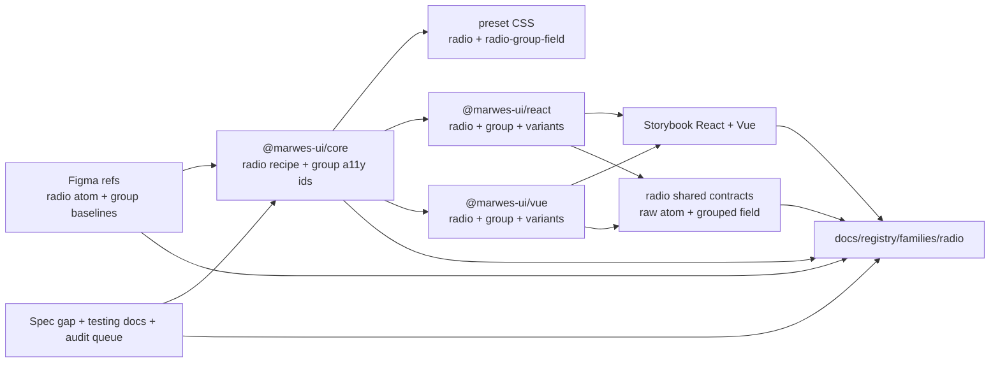
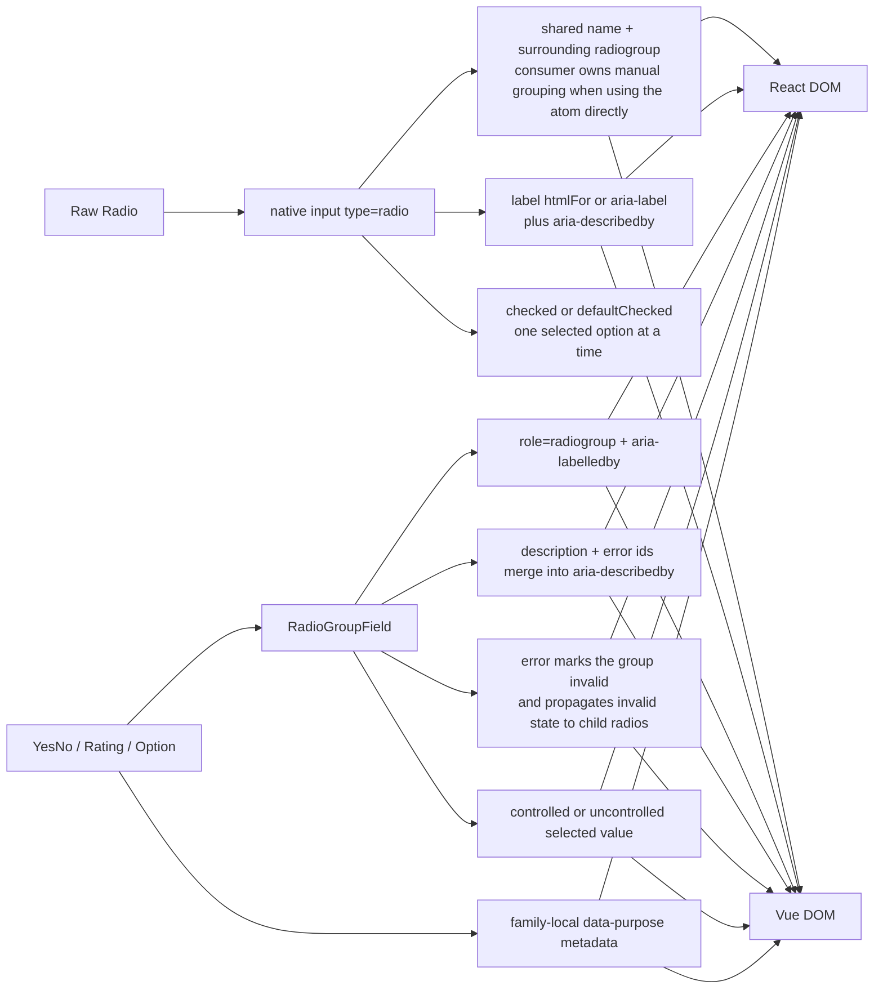

# Radio Registry

> Family: `radio`
>
> Local design refs only — this page uses the synced files under `.figma/` and makes no
> Figma API calls.

## Registry files

- [`registry.meta.json`](./registry.meta.json)
- [`registry.generated.json`](./registry.generated.json)
- [`../../../../artifacts/component-registry.json`](../../../../artifacts/component-registry.json)

## Registry snapshot

| Field | Value |
| --- | --- |
| Family status | Shipped |
| Audit status | First pass complete |
| Semantic coverage | Family-local — purpose-radio metadata lives in adapter wrappers, not the wave-1 central semantic registry |
| Generated structural truth | `registry.generated.json` + `artifacts/component-registry.json` |
| Primary Figma nodes | radio button component set `1368:6733`, radio group component `1368:6450`, light frame `1368:6734`, dark frame `2276:51787`, combined component container `1371:13445`, state container `1571:19716`, group container `1571:19757`, cover frame `1825:30421` |
| Main AXE watch item | keeping grouped single-selection wiring aligned across adapters, plus keeping raw-radio usage honest when consumers bypass `RadioGroupField` |

## Registry ownership

- `README.md` is the human teaching page.
- `registry.meta.json` is the authored structured summary for this family.
- `registry.generated.json` and `artifacts/component-registry.json` are generator-owned structural outputs.
- the family currently uses local purpose-radio semantics in React and Vue wrappers, not the central wave-1 semantic registry.
- `visuals/*.mmd` help people orient themselves quickly, but they are not the canonical implementation source.

## Summary

The Radio family is Marwes' native single-selection family for one-of-many choices.
It combines:
- a raw `Radio` atom rendered as a native `input[type="radio"]`
- `RadioGroupField` as the canonical labeled single-selection field path
- purpose wrappers for `YesNoRadioGroup`, `RatingRadioGroup`, and `OptionRadioGroup`
- shared React/Vue contract coverage for the raw atom and grouped field, plus local tests for purpose metadata

This makes Radio a strong seventeenth registry family because it ties together:
- a close sibling to Checkbox that stays native rather than becoming a custom single-select widget
- clear group-label, description, error, and required wiring through shared field helpers
- thin purpose wrappers that add stable family-local `data-purpose` metadata without creating a second implementation
- a design-to-runtime split where Figma teaches atom states, RTL label positions, and the group shell, while Storybook and adapter tests prove controlled selection, error wiring, and purpose-wrapper behavior

## Family surface map

| Surface level | Main members | Why it matters |
| --- | --- | --- |
| Atom | `Radio` | low-level native radio primitive with checked, unchecked, disabled, invalid, and naming behavior |
| Molecule | `RadioGroupField` | canonical visible-label path for grouped single selection with description and error wiring |
| Purpose variants | `YesNoRadioGroup`, `RatingRadioGroup`, `OptionRadioGroup` | thin semantic wrappers that attach stable family-local `data-purpose` metadata |
| Canonical product path | `RadioGroupField` + purpose wrappers | recommended accessible path for most product usage |
| Architecture boundary | raw `Radio` vs grouped field and wrappers | keeps the native atom small while letting grouped semantics and intent metadata live one layer up |
| Escape hatch | raw `Radio` in custom layouts | supported when consumers intentionally own surrounding `radiogroup` naming, state management, and label wiring |

## Canonical visual understanding

Read this section in this order:
1. canonical Storybook story references for runtime visuals
2. the layer map for repo placement
3. the interaction map for native radio semantics, grouped field wiring, and family-local purpose metadata

## Primary visual sources

| Source | Path | Why it matters |
| --- | --- | --- |
| React Storybook | `apps/storybook-react/src/stories/radio/Introduction.mdx` | canonical React teaching surface for atom vs grouped field vs purpose-wrapper usage |
| React Storybook | `apps/storybook-react/src/stories/radio/radio-group-field.stories.tsx` | canonical labeled single-selection path in React |
| React Storybook | `apps/storybook-react/src/stories/radio/option-radio-group.stories.tsx` | clearest general-purpose single-selection wrapper in React |
| React Storybook | `apps/storybook-react/src/stories/radio/yes-no-radio-group.stories.tsx` | binary-choice wrapper baseline in React |
| React Storybook | `apps/storybook-react/src/stories/radio/rating-radio-group.stories.tsx` | numeric-scale wrapper baseline in React |
| React Storybook | `apps/storybook-react/src/stories/radio/radio.stories.tsx` | raw atom state matrix and manual radiogroup example in React |
| Vue Storybook | `apps/storybook-vue/src/stories/radio/Introduction.mdx` | canonical Vue teaching surface for the same family split |
| Vue Storybook | `apps/storybook-vue/src/stories/radio/radio-group-field.stories.ts` | canonical labeled single-selection path in Vue |
| Vue Storybook | `apps/storybook-vue/src/stories/radio/option-radio-group.stories.ts` | clearest general-purpose single-selection wrapper in Vue |
| Vue Storybook | `apps/storybook-vue/src/stories/radio/radio.stories.ts` | raw atom state matrix and manual radiogroup example in Vue |
| Figma showcase | `.figma/marwes/pages/-radio-button/-radio-button_1368-6734.json` | family baseline light frame across six states, selected and unselected columns, and RTL label-position examples |
| Figma showcase | `.figma/marwes/pages/-radio-button/-radio-button-dark_2276-51787.json` | dark-mode radio baseline |
| Figma showcase | `.figma/marwes/pages/-radio-button/component-container_1571-19716.json` | compact inventory of the six radio atom states |
| Figma showcase | `.figma/marwes/pages/-radio-button/component-container_1571-19757.json` | grouped radio inventory with default and disabled group shells |
| Figma showcase | `.figma/marwes/pages/cover/radio-group-example_1825-30421.json` | quick grouped usage orientation reference |

> Minimum visual reading set for this family: Storybook Introduction, `radio-group-field`, `option-radio-group`, `radio`, then the light and dark radio frames.

## Figma references

Primary synced refs:
- `.figma/INDEX.md`
- `.figma/marwes/components/radio-button.json`
- `.figma/marwes/components/radio-group.json`
- `.figma/NODE_REFERENCE.md`
- `.figma/nodes.json`
- `.figma/marwes/pages/-radio-button/README.md`

Primary showcase nodes from the synced radio page:
- Radio button component set: `1368:6733`
- Radio group component: `1368:6450`
- Radio light frame: `1368:6734`
- Radio dark frame: `2276:51787`
- Combined component container: `1371:13445`
- Radio-state component container: `1571:19716`
- Radio-group component container: `1571:19757`
- Cover radio-group example: `1825:30421`

Related synced page refs:
- `.figma/marwes/pages/-radio-button/radio-button_1368-6733.json`
- `.figma/marwes/pages/-radio-button/-radio-button_1368-6734.json`
- `.figma/marwes/pages/-radio-button/-radio-button-dark_2276-51787.json`
- `.figma/marwes/pages/-radio-button/component-container_1371-13445.json`
- `.figma/marwes/pages/-radio-button/component-container_1571-19716.json`
- `.figma/marwes/pages/-radio-button/component-container_1571-19757.json`
- `.figma/marwes/pages/cover/radio-group-example_1825-30421.json`

> Current sync note: the repo also contains older or duplicate radio refs under
> `pages/-v3-components/` and `pages/-feedback-moved-to-notion/`, plus a small
> `components/radio-1.json` asset that is not the shipped radio-family baseline.
>
> This registry entry intentionally uses the current `pages/-radio-button/` material plus the
> live `radio-button.json` and `radio-group.json` component files as the active local design
> baseline.
>
> Another useful mismatch: `.figma/NODE_REFERENCE.md` still points at the older dark node
> `1368:6900`, while the current live synced page uses `2276:51787`.

## Figma variant summary

| Surface | Variants | States | Notable tokens |
| --- | --- | --- | --- |
| Radio showcase light/dark frames | selected and unselected rows with LTR and RTL label-position examples, plus a grouped example | `default`, `hover`, `pressed`, `disabled`, `focus`, `error` across `light` and `dark` | `radio/surface`, `radio/border`, `radio/dot`, `radio/label` |
| Radio button component JSON + radio-state component container | `Selected=True`, `Selected=False` × `Label position=Right`, `Label position=Left` | structural atom baseline rather than the full runtime matrix | clearest direct design-to-code bridge for raw atom geometry, dot visibility, and label position |
| Radio group component JSON + group container + cover frame | one grouped shell with group label, helper text, and three stacked radio instances | default and disabled group showcase states in the synced page containers | useful grouped-layout baseline, but it does not prove shipped error messaging, required handling, or purpose-wrapper metadata |

> Important family distinction: the synced Figma page teaches radio atom states, RTL label
> positions, and the grouped shell well, but the shipped Marwes family also includes
> `RadioGroupField` error text, `aria-describedby` merging, controlled and uncontrolled value
> handling, and purpose wrappers.
>
> In other words: Figma is the visual baseline for radio geometry and group layout, while
> Storybook and the package tests are the better references for runtime selection, error wiring,
> and family-local purpose metadata.
>
> One more sync wrinkle: the current page and README use the newer dark frame `2276:51787`,
> while curated node references still mention the older `1368:6900` dark frame.

## Visual model

### Layer map



Source copy: [`visuals/layer-map.mmd`](./visuals/layer-map.mmd)

### File map

```mermaid
flowchart TD
  Registry["docs/registry/families/radio"]
  Registry --> Meta["registry.meta.json"]
  Registry --> Generated["registry.generated.json"]
  Registry --> Visuals["visuals/*.mmd"]

  Core["packages/core/src/components/atoms/radio/"]
  Core --> CoreFiles["radio-a11y.ts radio-recipe.ts radio-types.ts"]
  CoreTests["packages/core/test/recipes/radio.test.ts"]
  Core --> CoreTests
  Helpers["packages/core/src/shared/field-helpers.ts"]

  Presets["packages/presets/src/firstEdition/"]
  Presets --> RadioCss["radio.css"]
  Presets --> GroupCss["molecules/radio-group-field.css"]

  React["packages/react/src/components/radio/"]
  React --> ReactFiles["radio.tsx radio-group-field.tsx variants.tsx tests"]

  Vue["packages/vue/src/components/radio/"]
  Vue --> VueFiles["radio.ts radio-group-field.ts variants.ts tests"]

  StoriesR["apps/storybook-react/src/stories/radio/"]
  StoriesV["apps/storybook-vue/src/stories/radio/"]
  Contracts["tests/contracts/radio.contract.ts + radio-group-field.contract.ts"]
```



Source copy: [`visuals/file-map.mmd`](./visuals/file-map.mmd)

### Interaction and semantics map



Source copy: [`visuals/interaction-map.mmd`](./visuals/interaction-map.mmd)

## Philosophy

- **Teach `RadioGroupField` first.** It is the canonical labeled path for most product usage because it guarantees visible group naming, description wiring, and error wiring.
- **Keep the raw atom native and small.** `Radio` should stay a straightforward native radio primitive rather than growing its own grouping or metadata system.
- **Keep single-selection meaning explicit.** Use Radio only when exactly one peer option should be chosen, not as a disguised checkbox, switch, or segmented navigation surface.
- **Keep field wiring source-owned in shared helpers.** Description, error, and required ids should not drift between React and Vue.
- **Keep purpose wrappers thin and honest.** They add family-local `data-purpose` metadata without pretending Radio is already part of the central semantic registry.

## AXE / accessibility posture

| Area | Status | Notes |
| --- | --- | --- |
| Risk tier | Medium | radio is native, but grouped single-selection semantics, required/error wiring, and wrapper guidance still affect accessibility meaningfully |
| Audit status | First pass complete | `docs/audits/radio-family-accessibility.md` |
| Automated contract | Strong | the raw atom and `RadioGroupField` now both have shared React/Vue contract coverage, while purpose-wrapper metadata remains covered by local adapter tests |
| Manual review boundary | Medium | raw-atom usage, focus visibility, and real grouped-form wording still deserve human review |
| AXE follow-up | Active discipline | the family first pass is complete; broader support-model and accessibility-gate work still applies |

### What automation already covers

- raw radio default-checked state, click callback flow, and disabled behavior through the shared React/Vue radio contract
- core recipe coverage for checked vs defaultChecked output plus disabled and invalid class policy
- `RadioGroupField` group labeling, description wiring, error live region behavior, invalid propagation, disabled handling, required state, controlled vs uncontrolled selection, and per-option disabled behavior through the shared `radio-group-field` contract
- purpose-wrapper option generation and `data-purpose` metadata through local React and Vue variant tests
- Storybook introduction and taxonomy coverage in both apps

### What still needs manual review or policy clarity

- whether raw `Radio` usage outside `RadioGroupField` stays honest about surrounding `radiogroup` naming and shared `name` ownership in real product code
- whether required messaging, helper text, and error text remain clear when groups get longer or validation wording becomes more complex
- whether the `appearance: none` preset styling keeps focus visibility and state clarity consistent across the browser and assistive-technology combinations Marwes wants to support

### Why the semantics are intentionally called family-local

This family already uses useful purpose metadata such as `data-purpose="binary-choice"`, but that metadata currently lives in adapter-level purpose wrappers rather than the central wave-1 semantic registry in `@marwes-ui/core`.

That distinction matters because:
- the metadata is real and tested today
- it helps Storybook teaching and product-code readability
- but the raw atom and grouped field still rely primarily on native `input[type="radio"]` and `role="radiogroup"` semantics instead of centrally governed Marwes metadata

### Current implementation hotspots

- `packages/core/src/components/atoms/radio/radio-recipe.ts` and `radio-a11y.ts` are the main raw-radio policy points.
- `packages/core/src/shared/field-helpers.ts`, `packages/react/src/components/radio/radio-group-field.tsx`, and `packages/vue/src/components/radio/radio-group-field.ts` are the key grouped-field wiring sources.
- `packages/react/src/components/radio/variants.tsx` and `packages/vue/src/components/radio/variants.ts` are the main family-local purpose-metadata boundaries.

## Semantics snapshot

| Field | Current radio family contract |
| --- | --- |
| `data-component` | no single canonical family-level value yet |
| canonical attributes | not yet part of the wave-1 central semantic registry |
| purpose vocabulary | `binary-choice`, `rating`, `selection` |
| source of truth | `packages/react/src/components/radio/variants.tsx`, `packages/vue/src/components/radio/variants.ts`, and `packages/core/src/shared/field-helpers.ts` |

## Linked files

This family follows the same repo tree order used elsewhere in Marwes:

```text
spec/decision → core → preset CSS → React adapter → React stories/tests → Vue adapter → Vue stories/tests → contracts → registry
```

| Layer | Path | Why it matters |
| --- | --- | --- |
| Spec | `docs/reference/spec.md` | dedicated Radio-family accessibility contract plus native-semantics framing |
| AI metadata | `docs/reference/ai-metadata.md` | useful because Radio is absent here today, which reinforces that purpose-radio metadata is still family-local rather than centrally governed |
| Testing docs | `docs/reference/testing.md` | shared-contract expectations and manual-review framing |
| Audit | `docs/audits/radio-family-accessibility.md` | dedicated execution record for the Radio family |
| Audit queue | `docs/audits/README.md` | Radio is first-pass complete in Wave 2 |
| Core | `packages/core/src/components/atoms/radio/radio-types.ts` | public raw radio contract for checked state, names, values, and minimal accessibility inputs |
| Core | `packages/core/src/components/atoms/radio/radio-a11y.ts` | native radio a11y mapping including invalid state passthrough |
| Core | `packages/core/src/components/atoms/radio/radio-recipe.ts` | radio RenderKit assembly and checked vs defaultChecked output |
| Core helper | `packages/core/src/shared/field-helpers.ts` | `RadioGroupField` label, description, and error id generation |
| Core test | `packages/core/test/recipes/radio.test.ts` | recipe-level baseline for classes, a11y output, and controlled vs uncontrolled state |
| Presets | `packages/presets/src/firstEdition/radio.css` | raw radio visual treatment across checked, disabled, invalid, focus, and dark-mode states |
| Presets | `packages/presets/src/firstEdition/molecules/radio-group-field.css` | grouped field label, description, option-row, and error styling |
| React | `packages/react/src/components/radio/radio.tsx` | raw radio atom adapter |
| React | `packages/react/src/components/radio/radio-group-field.tsx` | canonical grouped single-selection field surface in React |
| React | `packages/react/src/components/radio/variants.tsx` | family-local purpose-radio metadata in React |
| Vue | `packages/vue/src/components/radio/radio.ts` | raw radio atom adapter in Vue |
| Vue | `packages/vue/src/components/radio/radio-group-field.ts` | canonical grouped single-selection field surface in Vue |
| Vue | `packages/vue/src/components/radio/variants.ts` | family-local purpose-radio metadata in Vue |
| Stories | `apps/storybook-react/src/stories/radio/Introduction.mdx` | canonical React teaching surface |
| Stories | `apps/storybook-react/src/stories/radio/radio-group-field.stories.tsx` | clearest grouped radio baseline in React |
| Stories | `apps/storybook-react/src/stories/radio/option-radio-group.stories.tsx` | clearest general-purpose purpose-wrapper baseline in React |
| Stories | `apps/storybook-vue/src/stories/radio/Introduction.mdx` | canonical Vue teaching surface |
| Stories | `apps/storybook-vue/src/stories/radio/radio-group-field.stories.ts` | clearest grouped radio baseline in Vue |
| Stories | `apps/storybook-vue/src/stories/radio/option-radio-group.stories.ts` | clearest general-purpose purpose-wrapper baseline in Vue |
| Contracts | `tests/contracts/radio.contract.ts` | shared raw-radio behavior coverage across React and Vue |
| Contracts | `tests/contracts/radio-group-field.contract.ts` | shared grouped single-selection semantics and error-wiring coverage |
| Figma | `.figma/marwes/pages/-radio-button/README.md` | synced radio page inventory |
| Figma | `.figma/marwes/components/radio-button.json` | raw radio component-set structure |
| Figma | `.figma/marwes/components/radio-group.json` | grouped radio shell baseline |
| Figma | `.figma/marwes/pages/cover/radio-group-example_1825-30421.json` | grouped usage orientation frame |

## Verification

Focused commands for this family:

```bash
pnpm --filter @marwes-ui/core exec vitest run test/recipes/radio.test.ts
pnpm test:typecheck:contracts
pnpm --filter @marwes-ui/react exec vitest run src/components/radio/__tests__/radio.test.tsx src/components/radio/__tests__/radio-group-field.test.tsx src/components/radio/__tests__/variants.test.tsx
pnpm --filter @marwes-ui/vue exec vitest run src/components/radio/__tests__/radio.test.ts src/components/radio/__tests__/radio-group-field.test.ts src/components/radio/__tests__/variants.test.ts
pnpm --filter ./apps/storybook-react exec vitest run src/stories/radio/__tests__/radio-introduction-docs.test.ts src/stories/radio/__tests__/radio-taxonomy.test.ts
pnpm --filter ./apps/storybook-vue exec vitest run src/stories/radio/__tests__/radio-introduction-docs.test.ts src/stories/radio/__tests__/radio-taxonomy.test.ts
pnpm check:compass
```

Broader confidence:

```bash
pnpm check
pnpm test:packages
pnpm storybook:consistency
```

## Registry notes

Current limitations of the PoC:
- the radio registry is generator-backed, but the family source map is still maintained manually in `scripts/component-registry-sources.ts`
- the family uses Storybook references and Mermaid diagrams for visual orientation rather than committed preview assets
- the dedicated Radio family audit doc now exists and records the first-pass grouped-field contract hardening work
- the dedicated shared `tests/contracts/radio-group-field.contract.ts` file now complements the existing raw-radio contract
- the current local sync mixes the newer dark-page node `2276:51787` with older curated radio dark references such as `1368:6900`
- older duplicate radio refs under `pages/-v3-components/` and `pages/-feedback-moved-to-notion/`, plus the unrelated `components/radio-1.json` asset, are intentionally excluded from the active family baseline

## Open questions

- Which Radio-family stories should join the first automated accessibility smoke set?
- Should the family-local purpose vocabulary (`binary-choice`, `rating`, `selection`) stay adapter-local, or move into the central semantic registry if Radio becomes a governed semantic family?
