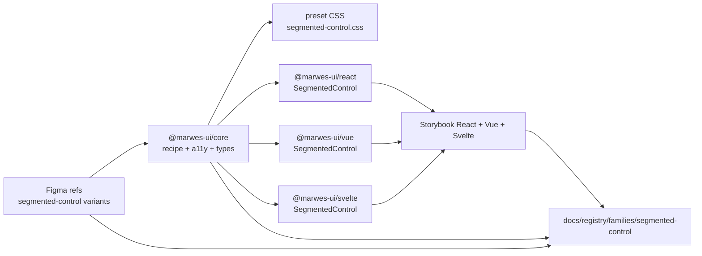
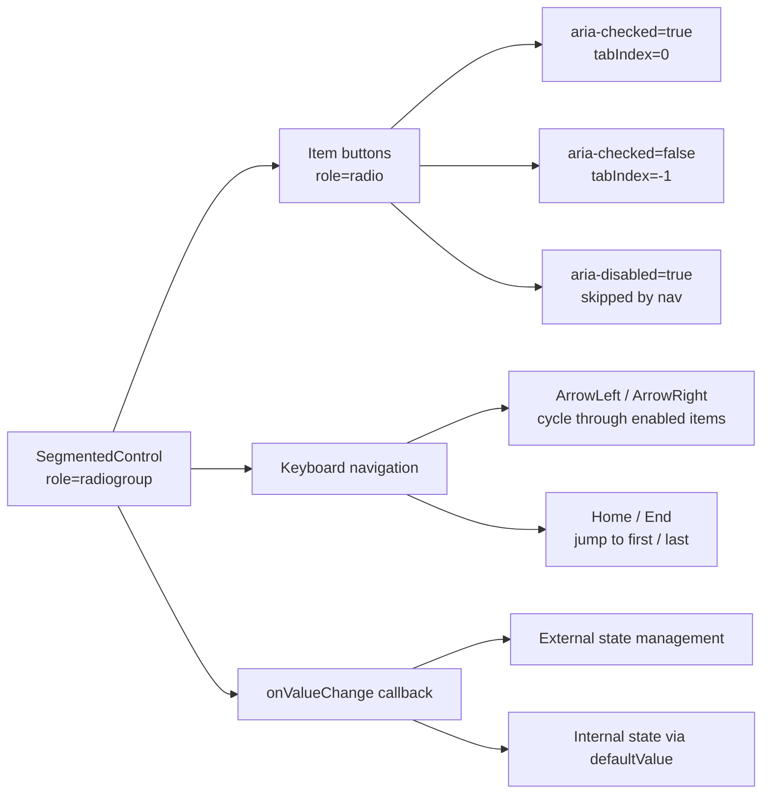

# Segmented Control Registry

> Family: `segmented-control`
>
> Local design refs only — this page uses the synced files under `.figma/` and makes no
> Figma API calls.

## Registry files

- [`registry.meta.json`](./registry.meta.json)
- [`registry.generated.json`](./registry.generated.json)
- [`../../../../artifacts/component-registry.json`](../../../../artifacts/component-registry.json)

## Registry snapshot

| Field | Value |
| --- | --- |
| Family status | Shipped |
| Audit status | Initial implementation |
| Semantic coverage | Core-level radiogroup semantics with keyboard navigation |
| Generated structural truth | `registry.generated.json` + `artifacts/component-registry.json` |
| Primary Figma nodes | segmented-control component set `1571:19333` |
| Main AXE watch item | radiogroup announcement pattern and roving tabindex across screen readers |

## Summary

The Segmented Control family is Marwes' compact single-select toggle for 2–4 options
without associated panel content. It uses `role="radiogroup"` with `role="radio"` items
and provides full keyboard navigation.

Key distinctions from other families:
- **vs Tabs**: no panel content — segmented control is purely a value selector
- **vs Switch**: multi-option (2–4) rather than binary on/off
- **vs Radio Group**: compact inline visual treatment rather than stacked form fields

The family ships with three variants:
- **default** — subtle track with elevated active pill
- **inverse** — inverted contrast for dark-on-light active state
- **pill** — fully rounded track for compact icon toggles (e.g. theme switcher)

## Family surface map

| Surface level | Main members | Why it matters |
| --- | --- | --- |
| Atom/Component | `SegmentedControl` | the single component handles the full track + items pattern |
| Core recipe | `createSegmentedControlRecipe` + `createSegmentedControlItemRecipe` | stable classnames and a11y for all adapters |
| Core a11y | `resolveSegmentedControlA11y` + `moveSegmentedControlSelection` | keyboard nav and value resolution |
| Preset CSS | `segmented-control.css` | token-based styling with variant and size modifiers |
| React adapter | `@marwes-ui/react` → `SegmentedControl` | controlled/uncontrolled with `value`/`defaultValue`/`onValueChange` |
| Vue adapter | `@marwes-ui/vue` → `SegmentedControl` | v-model support via `modelValue` |
| Svelte adapter | `@marwes-ui/svelte` → `SegmentedControl` | runes-based with `onvaluechange` |

## Canonical visual understanding

Read this section in this order:
1. Canonical Storybook story references for runtime visuals
2. The layer map for repo placement
3. The interaction map for selection and keyboard flow

## Primary visual sources

| Source | Path | Why it matters |
| --- | --- | --- |
| React Storybook | `apps/storybook-react/src/stories/segmented-control/segmented-control.stories.tsx` | all variants, sizes, and states |
| Vue Storybook | `apps/storybook-vue/src/stories/segmented-control/segmented-control.stories.ts` | Vue equivalent with v-model |
| Svelte Storybook | `apps/storybook-svelte/src/stories/segmented-control/segmented-control.stories.ts` | Svelte equivalent |
| Figma component | `.figma/marwes/components/segmented-control.json` | full variant matrix (2/3/4 segments × icon × inverse) |
| Figma showcase | `.figma/marwes/pages/-segmented-control/-segmented-control_1571-19406.json` | design page with all states |

## Figma references

Primary synced refs:
- `.figma/INDEX.md`
- `.figma/marwes/components/segmented-control.json`
- `.figma/NODE_REFERENCE.md`
- `.figma/nodes.json`

Figma variant matrix:
| Segments | Icon | Inverse | Node ID |
| --- | --- | --- | --- |
| 2 | False | False | `1571:19276` |
| 2 | True | False | `1571:19282` |
| 3 | False | False | `1571:19290` |
| 3 | True | False | `1571:19298` |
| 4 | False | False | `1571:19309` |
| 4 | True | False | `1571:19319` |
| 2 | False | True | `2696:28121` |
| 2 | True | True | `2696:28134` |
| 3 | False | True | `2696:28150` |
| 3 | True | True | `2696:28173` |
| 4 | False | True | `2696:28196` |
| 4 | True | True | `2696:28226` |

## Visual model

### Layer map



Source copy: [`visuals/layer-map.mmd`](./visuals/layer-map.mmd)

### File map

```mermaid
flowchart TD
  Registry["docs/registry/families/segmented-control"]
  Registry --> Meta["registry.meta.json"]
  Registry --> Generated["registry.generated.json"]
  Registry --> Visuals["visuals/*.mmd"]

  Core["packages/core/src/components/atoms/segmented-control/"]
  Core --> CoreFiles["segmented-control-types.ts\nsegmented-control-a11y.ts\nsegmented-control-recipe.ts"]

  Presets["packages/presets/src/firstEdition/"]
  Presets --> CSS["segmented-control.css"]

  React["packages/react/src/components/segmented-control/"]
  React --> ReactFiles["segmented-control.tsx\nindex.ts"]

  Vue["packages/vue/src/components/segmented-control/"]
  Vue --> VueFiles["segmented-control.ts\nindex.ts"]

  Svelte["packages/svelte/src/lib/components/segmented-control/"]
  Svelte --> SvelteFiles["SegmentedControl.svelte\ntypes.ts\nindex.ts"]

  StoriesR["apps/storybook-react/src/stories/segmented-control/"]
  StoriesV["apps/storybook-vue/src/stories/segmented-control/"]
  StoriesS["apps/storybook-svelte/src/stories/segmented-control/"]
```



Source copy: [`visuals/file-map.mmd`](./visuals/file-map.mmd)

### Interaction and semantics map



Source copy: [`visuals/interaction-map.mmd`](./visuals/interaction-map.mmd)

## Philosophy

- **Single component, no escape hatch needed.** Unlike larger families, the segmented control is compact enough that one component covers all use cases.
- **Radiogroup semantics for value selection.** This distinguishes it from tabs (which control panels) and makes screen reader behavior predictable.
- **Token-based dark mode.** The preset CSS uses `--mw-color-surface-elevated` for the active pill and `--mw-color-surface-subtle` for the track — both adapt automatically via the theme system.
- **Variant-driven visual treatment.** The `variant` prop controls whether the component uses default, inverse, or pill styling without requiring separate components.

## AXE / accessibility posture

| Area | Status | Notes |
| --- | --- | --- |
| Risk tier | Medium | custom widget with radiogroup semantics and keyboard navigation |
| Audit status | Initial implementation | no formal first-pass audit yet |
| Automated contract | Pending | core recipe tests needed, shared contract not yet written |
| Manual review boundary | High | screen reader radiogroup announcement patterns need validation |
| AXE follow-up | Queued | first formal audit after initial usage stabilizes |

## Linked files

| Layer | Path | Why it matters |
| --- | --- | --- |
| Core types | `packages/core/src/components/atoms/segmented-control/segmented-control-types.ts` | public types, variants, render kits |
| Core a11y | `packages/core/src/components/atoms/segmented-control/segmented-control-a11y.ts` | radiogroup semantics, keyboard nav, value resolution |
| Core recipe | `packages/core/src/components/atoms/segmented-control/segmented-control-recipe.ts` | stable classnames and modifier classes |
| Presets | `packages/presets/src/firstEdition/segmented-control.css` | token-based component styling |
| React | `packages/react/src/components/segmented-control/segmented-control.tsx` | React adapter |
| Vue | `packages/vue/src/components/segmented-control/segmented-control.ts` | Vue adapter |
| Svelte | `packages/svelte/src/lib/components/segmented-control/SegmentedControl.svelte` | Svelte adapter |
| Stories React | `apps/storybook-react/src/stories/segmented-control/segmented-control.stories.tsx` | React stories |
| Stories Vue | `apps/storybook-vue/src/stories/segmented-control/segmented-control.stories.ts` | Vue stories |
| Stories Svelte | `apps/storybook-svelte/src/stories/segmented-control/segmented-control.stories.ts` | Svelte stories |
| Figma | `.figma/marwes/components/segmented-control.json` | component set with 12 variants |

## Verification

Focused commands for this family:

```bash
pnpm --filter @marwes-ui/core exec vitest run --grep segmented
pnpm --filter @marwes-ui/react exec vitest run --grep segmented
pnpm --filter @marwes-ui/vue exec vitest run --grep segmented
pnpm typecheck
pnpm build
```

## Open questions

- Should purpose variants (e.g. `ThemeToggle`, `ViewDensityToggle`) be added as thin wrappers?
- Should the family support an animated sliding indicator for the active pill?
- When should the first formal accessibility audit be scheduled?
