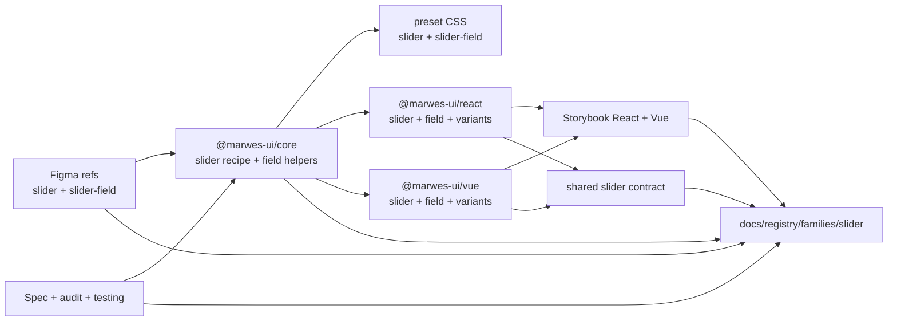
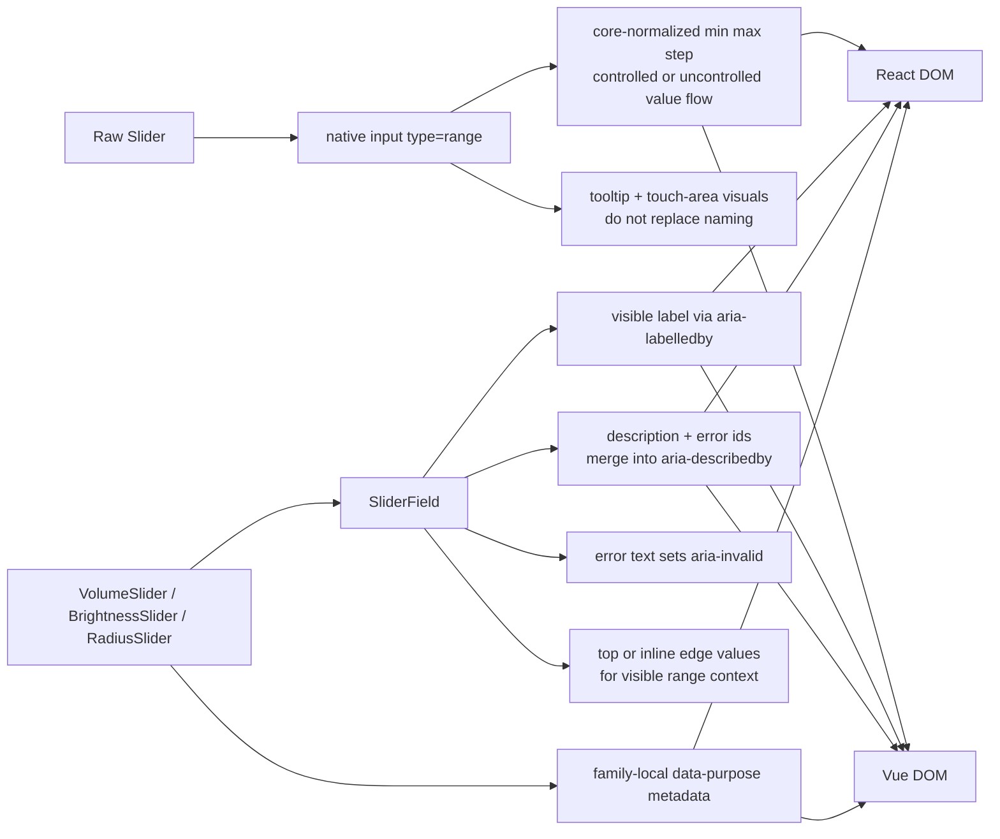

# Slider Registry

> Family: `slider`
>
> Local design refs only — this page uses the synced files under `.figma/` and makes no
> Figma API calls.

## Registry files

- [`registry.meta.json`](./registry.meta.json)
- [`registry.generated.json`](./registry.generated.json)
- [`../../../../artifacts/component-registry.json`](../../../../artifacts/component-registry.json)

## Registry snapshot

| Field | Value |
| --- | --- |
| Family status | Shipped |
| Audit status | First pass complete |
| Semantic coverage | Family-local — the atom emits local slider metadata and purpose wrappers add local `data-purpose` values, but the family is not part of the wave-1 central semantic registry |
| Generated structural truth | `registry.generated.json` + `artifacts/component-registry.json` |
| Primary Figma nodes | slider component set `1926:3827`, slider-field component set `1926:3720`, light frame `1921:33210`, dark frame `2010:12058` |
| Main AXE watch item | native range semantics, `SliderField` label and described-by wiring, and keeping tooltip and touch-area treatments visual-only |

## Registry ownership

- `README.md` is the human teaching page.
- `registry.meta.json` is the authored structured summary for this family.
- `registry.generated.json` and `artifacts/component-registry.json` are generator-owned structural outputs.
- the family currently uses local slider metadata in core and local purpose-slider semantics in React and Vue wrappers, not the central wave-1 semantic registry.
- `visuals/*.mmd` help people orient themselves quickly, but they are not the canonical implementation source.

## Summary

The Slider family is Marwes' continuous-value input family for native range selection.
It combines:
- a raw `Slider` atom that keeps a native `input[type="range"]` baseline
- `SliderField` as the canonical labeled field composition with description, error, and edge-value wiring
- purpose wrappers for `VolumeSlider`, `BrightnessSlider`, and `RadiusSlider`
- shared React/Vue contract coverage for value flow, disabled behavior, tooltip display, and field a11y wiring

This makes Slider a strong eighth registry family because it ties together:
- an explicit first-pass audit for one of the repo's remaining medium-risk interactive families
- a clear native-first decision that keeps keyboard and disabled behavior grounded in the platform
- field-helper-backed label, description, and error wiring that now has shared proof across adapters
- local design refs that show both the low-level slider surface and the top vs inline field layouts

## Family surface map

| Surface level | Main members | Why it matters |
| --- | --- | --- |
| Atom | `Slider` | low-level native range input with normalized min/max/step, optional tooltip, and optional touch-area treatment |
| Molecule | `SliderField` | canonical visible-label path with shared description, error, invalid, and edge-value wiring |
| Purpose variants | `VolumeSlider`, `BrightnessSlider`, `RadiusSlider` | thin semantic wrappers that attach stable family-local `data-purpose` metadata |
| Canonical labeled path | `SliderField` + purpose wrappers | recommended accessible path for most product usage |
| Architecture boundary | raw `Slider` vs `SliderField` | separates the native range primitive from the fully wired field composition |
| Escape hatch | raw `Slider` in custom layouts | supported when consumers intentionally own visible labeling, described-by wiring, and surrounding value context |

## Canonical visual understanding

Read this section in this order:
1. canonical Storybook story references for runtime visuals
2. the layer map for repo placement
3. the interaction map for native range semantics, field wiring, and visual-only tooltip behavior

## Primary visual sources

| Source | Path | Why it matters |
| --- | --- | --- |
| React Storybook | `apps/storybook-react/src/stories/slider/Introduction.mdx` | canonical React teaching surface for the atom, field, and purpose-wrapper split |
| React Storybook | `apps/storybook-react/src/stories/slider/slider-field.stories.tsx` | canonical labeled-field path with controlled, inline-label, invalid, and disabled examples |
| React Storybook | `apps/storybook-react/src/stories/slider/slider.stories.tsx` | raw atom states plus tooltip, touch-area, and full-width baselines |
| React Storybook | `apps/storybook-react/src/stories/slider/volume-slider.stories.tsx` | purpose-wrapper baseline with family-local semantics |
| Vue Storybook | `apps/storybook-vue/src/stories/slider/Introduction.mdx` | canonical Vue teaching surface for the same family layers |
| Vue Storybook | `apps/storybook-vue/src/stories/slider/slider-field.stories.ts` | canonical labeled-field path in Vue |
| Vue Storybook | `apps/storybook-vue/src/stories/slider/slider.stories.ts` | raw Vue atom states plus tooltip, touch-area, and full-width baselines |
| Vue Storybook | `apps/storybook-vue/src/stories/slider/volume-slider.stories.ts` | purpose-wrapper mirror in Vue |
| Figma showcase | `.figma/marwes/pages/-v2-slider/-slider_1921-33210.json` | family baseline light frame with default, hover, pressed, disabled, and focus rows |
| Figma showcase | `.figma/marwes/pages/-v2-slider/-slider-dark_2010-12058.json` | dark-mode slider baseline |
| Figma component | `.figma/marwes/pages/-v2-slider/slider-field_1926-3720.json` | top and inline field-layout baseline |
| Figma showcase | `.figma/marwes/pages/-v2-slider/component-container_1574-26984.json` | compact orientation view for raw slider plus field-layout variants |

> Minimum visual reading set for this family: Storybook Introduction, `slider-field`, `volume-slider`, then the light and dark Figma slider frames.

## Figma references

Primary synced refs:
- `.figma/INDEX.md`
- `.figma/marwes/components/slider.json`
- `.figma/marwes/components/slider-field.json`
- `.figma/NODE_REFERENCE.md`
- `.figma/nodes.json`
- `.figma/marwes/pages/-v2-slider/README.md`

Primary showcase nodes from the synced slider page:
- Slider component set: `1926:3827`
- Slider-field component set: `1926:3720`
- Slider light frame: `1921:33210`
- Slider dark frame: `2010:12058`
- Component container: `1574:26984`
- Range-field exploration: `2010:12026`

Related synced page refs:
- `.figma/marwes/pages/-v2-slider/slider_1926-3827.json`
- `.figma/marwes/pages/-v2-slider/slider-field_1926-3720.json`
- `.figma/marwes/pages/-v2-slider/-slider_1921-33210.json`
- `.figma/marwes/pages/-v2-slider/-slider-dark_2010-12058.json`
- `.figma/marwes/pages/-v2-slider/component-container_1574-26984.json`
- `.figma/marwes/pages/-v2-slider/range-field_2010-12026.json`

## Figma variant summary

| Surface | Variants | States | Notable tokens |
| --- | --- | --- | --- |
| Slider showcase light/dark frames | state rows for the raw slider surface | `default`, `hover track`, `hover thumb`, `pressed`, `disabled`, `focus` | the synced page clearly shows primary fill, neutral track, thumb, tooltip, and touch-area visuals, but no dedicated slider token list is documented in `.figma/NODE_REFERENCE.md` |
| Slider component JSON | `Label position=Top`, `Label position=Label position2` | structural raw-slider baseline with optional tooltip and touch-area sublayers | the component JSON still exposes legacy label-position naming even though the shipped public API treats raw `Slider` as unlabeled |
| Slider Field component JSON + component container | `Top`, `Inline` field layouts | top labels, inline labels, edge values, and wider page-level composition context | `SliderField` layout variants match the shipped `labelPosition` API more closely than the raw slider component-set naming |

> Important family distinction: the synced Figma page teaches the raw slider surface and top vs inline field layouts, but the shipped family contract also includes native range semantics, shared described-by wiring, purpose-wrapper metadata, and the rule that `showTooltip` stays visual-only.
>
> In other words: Figma is the visual baseline for the track, thumb, tooltip, and field layouts, while Storybook and the shared contract are the better references for accessibility wiring and value behavior.

## Visual model

### Layer map



Source copy: [`visuals/layer-map.mmd`](./visuals/layer-map.mmd)

### File map

```mermaid
flowchart TD
  Registry["docs/registry/families/slider"]
  Registry --> Meta["registry.meta.json"]
  Registry --> Generated["registry.generated.json"]
  Registry --> Visuals["visuals/*.mmd"]

  Core["packages/core/src/components/atoms/slider/"]
  Core --> CoreFiles["slider-a11y.ts slider-recipe.ts slider-types.ts"]
  Helpers["packages/core/src/shared/field-helpers.ts"]

  Presets["packages/presets/src/firstEdition/"]
  Presets --> AtomCss["slider.css"]
  Presets --> FieldCss["molecules/slider-field.css"]

  React["packages/react/src/components/slider/"]
  React --> ReactFiles["slider.tsx slider-field.tsx variants.tsx tests"]

  Vue["packages/vue/src/components/slider/"]
  Vue --> VueFiles["slider.ts slider-field.ts variants.ts tests"]

  StoriesR["apps/storybook-react/src/stories/slider/"]
  StoriesV["apps/storybook-vue/src/stories/slider/"]
  Contracts["tests/contracts/slider.contract.ts"]
```



Source copy: [`visuals/file-map.mmd`](./visuals/file-map.mmd)

### Interaction and semantics map



Source copy: [`visuals/interaction-map.mmd`](./visuals/interaction-map.mmd)

## Philosophy

- **Teach `SliderField` first.** It is the canonical labeled path because it guarantees visible-label, description, error, and edge-value wiring.
- **Keep the raw atom deliberately native.** `Slider` should stay a thin `input[type="range"]` surface rather than recreating slider semantics on custom elements.
- **Keep tooltip and touch-area treatments visual-only.** They help orientation and touch affordance, but they do not replace visible labeling or `ariaValueText`.
- **Keep range normalization in core and field ids in shared helpers.** The numeric contract and field-wiring contract should not drift between React and Vue.
- **Keep purpose wrappers thin and honest.** They add family-local `data-purpose` metadata without becoming a second slider implementation or a central semantic-registry entry.

## AXE / accessibility posture

| Area | Status | Notes |
| --- | --- | --- |
| Risk tier | Medium | slider is native-first, but it still carries value-flow, labeling, and visual-affordance drift risk across adapters |
| Audit status | First pass complete | `docs/audits/slider-family-accessibility.md` |
| Automated contract | Strong | shared slider contract plus local adapter and Storybook tests cover the main family behavior |
| Manual review boundary | Medium | real browser and assistive-technology validation still matters for announcement quality, focus feel, and tooltip expectations |
| AXE follow-up | Active discipline | future accessibility-gate story coverage and keyboard-proof scope are still open questions |

### What automation already covers

- native `type="range"` semantics with normalized `min`, `max`, and `step`
- uncontrolled and controlled value-change behavior in both adapters
- disabled slider semantics and numeric tooltip display when `showTooltip` is enabled
- `SliderField` visible-label wiring through `aria-labelledby`
- merged description, error, and external described-by ids through `aria-describedby`
- purpose metadata for `VolumeSlider`, `BrightnessSlider`, and `RadiusSlider`

### What still needs manual review or policy clarity

- real browser and assistive-technology confirmation that the native range control plus visual tooltip feels predictable in keyboard and screen-reader flows
- which slider stories should later join stricter automated accessibility gates
- whether future slider keyboard-matrix proof should go beyond native smoke coverage for the supported family contract

### Why the semantics are intentionally called family-local

This family already emits useful local metadata, but it is not currently part of the wave-1 canonical semantic registry in `@marwes-ui/core`.

That distinction matters because:
- the `Slider` atom emits `data-component="slider"` directly from core today
- `VolumeSlider`, `BrightnessSlider`, and `RadiusSlider` add local `data-purpose` metadata in the adapters
- but the family should not be described as if it already has the same governance level as the covered semantic-registry families

### Current implementation hotspots

- `packages/core/src/components/atoms/slider/slider-a11y.ts` and `slider-recipe.ts` define the native range metadata and current-value normalization contract.
- `packages/core/src/shared/field-helpers.ts` is the key field-level source of truth for `SliderField` label, description, and error ids.
- `tests/contracts/slider.contract.ts` is the most important shared regression boundary for this family.

## Semantics snapshot

| Field | Current slider family contract |
| --- | --- |
| `data-component` | `slider` on the atom; purpose wrappers add `data-purpose` metadata on the field wrapper |
| canonical attributes | not yet part of the wave-1 central semantic registry |
| purpose vocabulary | `volume`, `brightness`, `radius` |
| source of truth | `packages/core/src/components/atoms/slider/slider-recipe.ts`, `packages/react/src/components/slider/variants.tsx`, and `packages/vue/src/components/slider/variants.ts` |

## Linked files

This family follows the same repo tree order used elsewhere in Marwes:

```text
spec/decision → core → preset CSS → React adapter → React stories/tests → Vue adapter → Vue stories/tests → contracts → registry
```

| Layer | Path | Why it matters |
| --- | --- | --- |
| Spec | `docs/reference/spec.md` | explicit slider-family native-range, tooltip-scope, and field-wiring requirements |
| AI metadata | `docs/reference/ai-metadata.md` | clarifies that slider is still outside the wave-1 canonical semantic registry |
| Testing docs | `docs/reference/testing.md` | shared-contract expectations and manual review boundaries |
| Audit | `docs/audits/slider-family-accessibility.md` | detailed AXE execution record for this family |
| Core | `packages/core/src/components/atoms/slider/slider-types.ts` | public slider atom contract including naming and value props |
| Core | `packages/core/src/components/atoms/slider/slider-a11y.ts` | min/max/step normalization plus range a11y mapping |
| Core | `packages/core/src/components/atoms/slider/slider-recipe.ts` | slider RenderKit assembly, current-value clamping, and data attributes |
| Core | `packages/core/src/shared/field-helpers.ts` | `SliderField` label, description, error, and described-by id generation |
| Presets | `packages/presets/src/firstEdition/slider.css` | raw slider visuals for track, fill, thumb, tooltip, touch area, disabled, and focus states |
| Presets | `packages/presets/src/firstEdition/molecules/slider-field.css` | field label, description, edge-value, error, and layout styling |
| React | `packages/react/src/components/slider/slider.tsx` | raw slider atom adapter |
| React | `packages/react/src/components/slider/slider-field.tsx` | canonical React field-wiring surface |
| React | `packages/react/src/components/slider/variants.tsx` | family-local purpose-slider metadata in React |
| Vue | `packages/vue/src/components/slider/slider.ts` | raw slider atom adapter in Vue |
| Vue | `packages/vue/src/components/slider/slider-field.ts` | canonical Vue field-wiring surface |
| Vue | `packages/vue/src/components/slider/variants.ts` | family-local purpose-slider metadata in Vue |
| Stories | `apps/storybook-react/src/stories/slider/Introduction.mdx` | canonical React teaching surface |
| Stories | `apps/storybook-vue/src/stories/slider/Introduction.mdx` | canonical Vue teaching surface |
| Contracts | `tests/contracts/slider.contract.ts` | shared native-range, value-flow, tooltip, disabled, and field-wiring coverage |
| Figma | `.figma/marwes/pages/-v2-slider/README.md` | synced design page inventory |
| Figma | `.figma/marwes/components/slider.json` | raw slider component-set structure |
| Figma | `.figma/marwes/components/slider-field.json` | field-layout component-set structure |

## Verification

Focused commands for this family:

```bash
pnpm --filter @marwes-ui/core exec vitest run test/recipes/slider.test.ts
pnpm test:typecheck:contracts
pnpm --filter @marwes-ui/react exec vitest run src/components/slider/__tests__/slider.test.tsx src/components/slider/__tests__/slider-field.test.tsx src/components/slider/__tests__/variants.test.tsx
pnpm --filter @marwes-ui/vue exec vitest run src/components/slider/__tests__/slider.test.ts src/components/slider/__tests__/slider-field.test.ts src/components/slider/__tests__/variants.test.ts
pnpm --filter ./apps/storybook-react exec vitest run src/stories/slider/__tests__/slider-introduction-docs.test.ts src/stories/slider/__tests__/slider-taxonomy.test.ts
pnpm --filter ./apps/storybook-vue exec vitest run src/stories/slider/__tests__/slider-introduction-docs.test.ts src/stories/slider/__tests__/slider-taxonomy.test.ts
pnpm docs:links
```

Broader confidence:

```bash
pnpm check
pnpm test:packages
pnpm storybook:consistency
```

## Registry notes

Current limitations of the PoC:
- the slider registry is generator-backed, but the family source map is still maintained manually in `scripts/component-registry-sources.ts`
- the family uses Storybook references and Mermaid diagrams for visual orientation rather than committed preview assets
- purpose-slider semantics are family-local today and do not yet come from the central semantic registry
- the synced V2 slider page still includes exploratory range-field and label-layout material, so the registry intentionally narrows back to the shipped public family surface
- the raw slider component JSON still carries legacy `Label position` naming that does not map directly to the shipped `Slider` API

## Open questions

- Which Slider-family stories should later join automated accessibility gates?
- Should future slider keyboard-matrix proof move beyond native smoke coverage, or is the native range baseline enough for the supported family contract?
