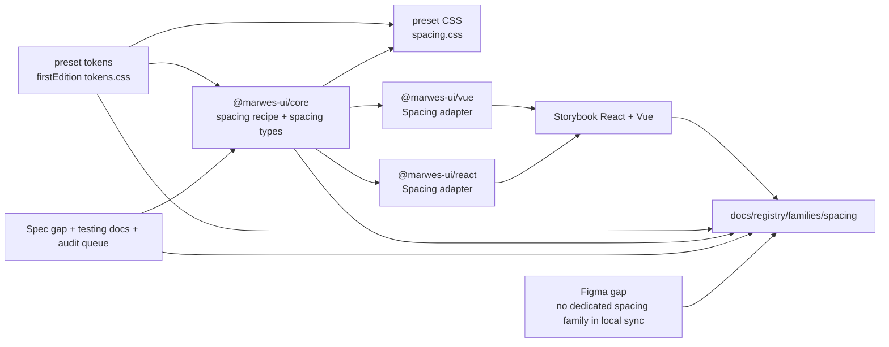
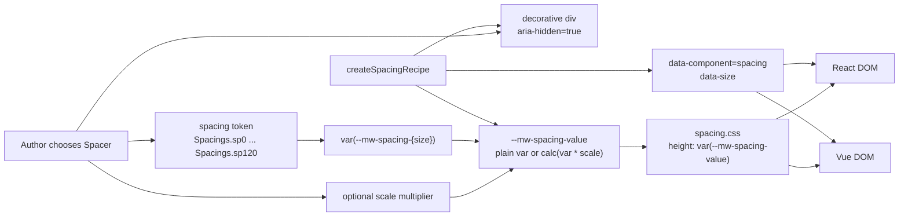

# Spacing Registry

> Family: `spacing`
>
> Local design refs only — this page uses the synced files under `.figma/` and makes no
> Figma API calls.

## Registry files

- [`registry.meta.json`](./registry.meta.json)
- [`registry.generated.json`](./registry.generated.json)
- [`../../../../artifacts/component-registry.json`](../../../../artifacts/component-registry.json)

## Registry snapshot

| Field | Value |
| --- | --- |
| Family status | Shipped |
| Audit status | First pass complete — dedicated family audit doc now exists |
| Semantic coverage | Family-local — the atom emits local `data-component` and `data-size` metadata from core, but Spacing is not part of the wave-1 central semantic registry |
| Generated structural truth | `registry.generated.json` + `artifacts/component-registry.json` |
| Primary Figma nodes | none — no dedicated spacing component, page, or token section currently exists in the local synced `.figma/` sources |
| Main AXE watch item | keeping Spacing decorative, using it only when a spacer is the honest layout tool, and not letting large gaps imply hidden semantic structure |

## Registry ownership

- `README.md` is the human teaching page.
- `registry.meta.json` is the authored structured summary for this family.
- `registry.generated.json` and `artifacts/component-registry.json` are generator-owned structural outputs.
- the family currently uses local spacing metadata in core and is not part of the central wave-1 semantic registry.
- `visuals/*.mmd` help people orient themselves quickly, but they are not the canonical implementation source.

## Summary

The Spacing family is Marwes' decorative vertical-gap family.
It consists of:
- one raw `Spacing` atom plus the layout-oriented `Spacer` alias
- one `Spacings` constant that exposes the 18 shipped token sizes through dot notation and legacy bracket keys
- one core `createSpacingRecipe` that maps `size` and `scale` into CSS variables plus local metadata
- one preset `spacing.css` file that turns the computed spacing variable into real block height
- thin React and Vue adapters that render an `aria-hidden` spacer div

This makes Spacing a strong twentieth registry family because it ties together:
- the last remaining foundational atom family in the current shipped package set
- a useful layout primitive that is intentionally non-semantic but still worth documenting carefully
- a family-local metadata contract that stays small and explicit
- an honest design-source gap: unlike most other families, Spacing currently has no dedicated local Figma family page or component reference, so the real shipped baseline lives more directly in code, preset tokens, and Storybook

## Family surface map

| Surface level | Main members | Why it matters |
| --- | --- | --- |
| Atom | `Spacing` / `Spacer` | low-level decorative spacer for explicit vertical gaps between elements |
| Token surface | `Spacings` | shared, type-safe access to the 18 shipped spacing size names |
| Core primitive | `createSpacingRecipe` | source of truth for `size`, `scale`, `aria-hidden`, and local `data-*` metadata |
| Canonical product path | raw `Spacing` atom | the recommended direct usage path because this family is intentionally tiny and layout-only |
| Architecture boundary | token size vs `scale` escape hatch | keeps the main API tied to shared token names while still allowing deliberate multiplication for edge cases |
| Escape hatch | `scale`, custom class, and parent-owned layout styles | supported when consumers intentionally need uncommon spacer sizing or contextual wrappers |

## Canonical visual understanding

Read this section in this order:
1. canonical Storybook story references for runtime visuals
2. the layer map for repo placement
3. the interaction map for token resolution, decorative semantics, and local metadata flow

## Primary visual sources

| Source | Path | Why it matters |
| --- | --- | --- |
| React Storybook | `apps/storybook-react/src/stories/spacing/Introduction.mdx` | canonical React teaching surface for the atom-only family and the full spacing token scale |
| React Storybook | `apps/storybook-react/src/stories/spacing/spacing.stories.tsx` | runtime baseline for the full 18-size scale, token usage through `Spacings`, and in-context examples |
| Vue Storybook | `apps/storybook-vue/src/stories/spacing/Introduction.mdx` | canonical Vue teaching surface for the same atom-only family |
| Vue Storybook | `apps/storybook-vue/src/stories/spacing/spacing.stories.ts` | runtime baseline for the same full scale and in-context examples in Vue |
| Local design status | `.figma/INDEX.md`, `.figma/marwes/README.md`, `.figma/marwes/manifest.json`, `.figma/marwes/components/_index.json` | inspected to confirm that the current local Figma sync has no dedicated spacing family page or component baseline |

> Minimum visual reading set for this family: Storybook Introduction and `spacing.stories` in either framework.

## Figma references

Primary synced refs inspected:
- `.figma/INDEX.md`
- `.figma/marwes/README.md`
- `.figma/marwes/manifest.json`
- `.figma/marwes/components/_index.json`
- `.figma/NODE_REFERENCE.md`
- `.figma/nodes.json`

Spacing-specific result from that inspection:
- there is **no dedicated spacing component JSON** in `.figma/marwes/components/`
- there is **no dedicated spacing page directory** under `.figma/marwes/pages/`
- there is **no spacing family row** in `.figma/NODE_REFERENCE.md`
- there is **no curated spacing token section** in `.figma/nodes.json`

> Current sync note: Spacing is unusual compared with most registry families because the local Figma
> sync does not currently expose a dedicated spacing family surface.
>
> For the shipped code, the practical source of truth is therefore:
> - `packages/presets/src/firstEdition/tokens.css` for the actual spacing token values
> - `packages/core/src/components/atoms/spacing/` for the runtime family contract
> - Storybook for the visual teaching surface
>
> In other words: the absence of local Figma spacing refs is itself an important family fact, and
> the registry should state that directly rather than implying a design baseline that does not exist.

## Figma variant summary

| Surface | Variants | States | Notable tokens |
| --- | --- | --- | --- |
| Local synced Figma family refs | none | none | no dedicated spacing family is present in the current local sync |
| Shipped runtime token scale | 18 public spacing sizes from `sp-0` to `sp-120` | default `sp-24` plus optional `scale` multiplier | the real shipped token values live in `packages/presets/src/firstEdition/tokens.css` |
| Storybook visual teaching surface | one decorative spacer atom shown across the full size scale and in context | `sp-0` → `sp-120`, token-constant usage, and in-context composition | Storybook is the clearest visual source because there is no Figma family page to mirror |

> Important family distinction: unlike Heading, Paragraph, Divider, or Icon, Spacing does not
> currently have a dedicated local Figma family baseline.
>
> In other words: Storybook and code are the canonical visual and structural references for this
> family today, while the Figma sync is important mainly because it confirms the current design gap.
>
> One more practical nuance: the shipped family exposes `scale` as a runtime multiplication escape
> hatch, but there is no parallel local design matrix for that behavior.

## Visual model

### Layer map



Source copy: [`visuals/layer-map.mmd`](./visuals/layer-map.mmd)

### File map

```mermaid
flowchart TD
  Registry["docs/registry/families/spacing"]
  Registry --> Meta["registry.meta.json"]
  Registry --> Generated["registry.generated.json"]
  Registry --> Visuals["visuals/*.mmd"]

  Core["packages/core/src/components/atoms/spacing/"]
  Core --> CoreFiles["spacing.recipe.ts spacing.types.ts"]

  Presets["packages/presets/src/firstEdition/"]
  Presets --> SpacingCss["spacing.css"]
  Presets --> TokensCss["tokens.css"]

  React["packages/react/src/components/spacing/"]
  React --> ReactFiles["spacing.tsx index.ts"]

  Vue["packages/vue/src/components/spacing/"]
  Vue --> VueFiles["spacing.ts index.ts"]

  StoriesCore["packages/core/src/storybook/storybook-fixtures.ts"]
  StoriesR["apps/storybook-react/src/stories/spacing/"]
  StoriesV["apps/storybook-vue/src/stories/spacing/"]
  AuditIndex["docs/audits/README.md"]
```



Source copy: [`visuals/file-map.mmd`](./visuals/file-map.mmd)

### Interaction and semantics map



Source copy: [`visuals/interaction-map.mmd`](./visuals/interaction-map.mmd)

## Philosophy

- **Keep Spacing decorative and explicit.** It should remain a layout tool, not a semantic structure tool.
- **Prefer token names over magic numbers.** `Spacings` exists so teams can use shared spacing vocabulary instead of scattering raw pixel margins through product code.
- **Treat `scale` as an escape hatch.** The primary design language is the named token scale, while multiplication should stay deliberate and relatively rare.
- **Keep layout truth visible.** If a parent stack, grid gap, or section wrapper tells the layout story more honestly, Spacing should not be added just to patch over weak structure.
- **Be honest about the missing design-sync family.** The current local Figma sync does not define a dedicated spacing family, so code and Storybook are the real family baseline today.

## AXE / accessibility posture

| Area | Status | Notes |
| --- | --- | --- |
| Risk tier | Low | spacing is decorative and `aria-hidden`, but misuse still matters when teams rely on gaps to imply hidden structure |
| Audit status | First pass complete | `docs/audits/spacing-family-accessibility.md` captures the completed first-pass audit and follow-up boundaries |
| Automated contract | Light | Storybook docs and taxonomy tests exist, but there is no dedicated core, adapter, or shared-contract test file today |
| Manual review boundary | Narrow | the main human judgment is whether Spacing is the honest layout tool and whether large gaps are compensating for weak structure |
| AXE follow-up | Active discipline | the dedicated family audit is complete; broader support-model work remains non-blocking |

### What automation already covers

- Storybook introduction coverage for the family's atom-only structure, `Spacings` constant, and token-scale documentation in both apps
- Storybook taxonomy coverage that keeps the family under `Spacing/Atom` in both apps
- repo-wide typecheck and build paths that exercise the exported `Spacing` atom and `Spacings` constant across React and Vue

### What still needs manual review or policy clarity

- whether Spacing is being used where parent-owned `gap`, stack layout, or section structure would be clearer and easier to maintain
- whether large spacing tokens are being used to imply hidden hierarchy or paper over missing semantic grouping
- whether the family should eventually gain direct runtime contract tests despite its very small decorative surface

### Why the semantics are intentionally called family-local

This family already emits useful local metadata, but it is not currently part of the wave-1 canonical semantic registry in `@marwes-ui/core`.

That distinction matters because:
- the `Spacing` atom emits `data-component="spacing"` and `data-size` directly from core today
- there is no central semantic-registry definition for Spacing yet
- the family should not be described as if it already has the same governance level as the covered semantic-registry families

### Current implementation hotspots

- `packages/core/src/components/atoms/spacing/spacing.recipe.ts` is the main source of truth for `size`, `scale`, and local metadata.
- `packages/core/src/components/atoms/spacing/spacing.types.ts` defines the 18-size `Spacings` vocabulary that consumers use directly.
- `packages/presets/src/firstEdition/tokens.css` and `spacing.css` are the practical visual source of truth because there is no dedicated local Figma family baseline.

## Semantics snapshot

| Field | Current spacing family contract |
| --- | --- |
| `data-component` | `spacing` |
| canonical attributes | not yet part of the wave-1 central semantic registry |
| purpose vocabulary | n/a |
| source of truth | `packages/core/src/components/atoms/spacing/spacing.recipe.ts` and `packages/core/src/components/atoms/spacing/spacing.types.ts` |

## Linked files

This family follows the same repo tree order used elsewhere in Marwes:

```text
spec/decision → core → preset CSS → React adapter → React stories/tests → Vue adapter → Vue stories/tests → contracts → registry
```

| Layer | Path | Why it matters |
| --- | --- | --- |
| Spec | `docs/reference/spec.md` | there is no dedicated spacing-family section yet, so code, Storybook, and token files carry most of the current contract weight |
| AI metadata | `docs/reference/ai-metadata.md` | useful because Spacing is absent here today, which reinforces that spacing metadata is still local rather than centrally governed |
| Testing docs | `docs/reference/testing.md` | shared expectations and manual-review framing, even though Spacing has no dedicated runtime test file yet |
| Audit queue | `docs/audits/README.md` | Spacing is first-pass complete in Wave 3 and now has a dedicated family audit doc |
| Core | `packages/core/src/components/atoms/spacing/spacing.types.ts` | public spacing atom contract and the exported `Spacings` vocabulary |
| Core | `packages/core/src/components/atoms/spacing/spacing.recipe.ts` | spacing RenderKit assembly, local metadata, and scale handling |
| Presets | `packages/presets/src/firstEdition/tokens.css` | actual shipped spacing token values from `sp-0` to `sp-120` |
| Presets | `packages/presets/src/firstEdition/spacing.css` | spacer height rendering from `--mw-spacing-value` |
| React | `packages/react/src/components/spacing/spacing.tsx` | raw spacing adapter in React |
| Vue | `packages/vue/src/components/spacing/spacing.ts` | raw spacing adapter in Vue |
| Storybook core | `packages/core/src/storybook/storybook-fixtures.ts` | `storybookSpacingArgTypes` for the full size and scale controls |
| Stories | `apps/storybook-react/src/stories/spacing/Introduction.mdx` | canonical React teaching surface |
| Stories | `apps/storybook-react/src/stories/spacing/spacing.stories.tsx` | full size scale and in-context baseline in React |
| Stories | `apps/storybook-vue/src/stories/spacing/Introduction.mdx` | canonical Vue teaching surface |
| Stories | `apps/storybook-vue/src/stories/spacing/spacing.stories.ts` | full size scale and in-context baseline in Vue |
| Story tests | `apps/storybook-react/src/stories/spacing/__tests__/spacing-introduction-docs.test.ts` | React docs-coverage boundary for the family |
| Story tests | `apps/storybook-react/src/stories/spacing/__tests__/spacing-taxonomy.test.ts` | React taxonomy boundary |
| Story tests | `apps/storybook-vue/src/stories/spacing/__tests__/spacing-introduction-docs.test.ts` | Vue docs-coverage boundary |
| Story tests | `apps/storybook-vue/src/stories/spacing/__tests__/spacing-taxonomy.test.ts` | Vue taxonomy boundary |
| Figma absence check | `.figma/marwes/components/_index.json` | inspected to confirm there is no dedicated spacing component JSON |
| Figma absence check | `.figma/marwes/manifest.json` | inspected to confirm there is no dedicated spacing page entry |
| Figma absence check | `.figma/NODE_REFERENCE.md` | inspected to confirm there is no curated spacing family row |

## Verification

Focused commands for this family:

```bash
pnpm --filter ./apps/storybook-react exec vitest run src/stories/spacing/__tests__/spacing-introduction-docs.test.ts src/stories/spacing/__tests__/spacing-taxonomy.test.ts
pnpm --filter ./apps/storybook-vue exec vitest run src/stories/spacing/__tests__/spacing-introduction-docs.test.ts src/stories/spacing/__tests__/spacing-taxonomy.test.ts
pnpm docs:links
```

Broader confidence:

```bash
pnpm check
pnpm storybook:consistency
```

## Registry notes

Current limitations of the PoC:
- the spacing registry is generator-backed, but the family source map is still maintained manually in `scripts/component-registry-sources.ts`
- the family uses Storybook references and Mermaid diagrams for visual orientation rather than committed preview assets
- the dedicated `docs/audits/spacing-family-accessibility.md` file now captures the finished first-pass audit, while support-model work remains a separate non-blocking track
- the family now has a dedicated shared contract file plus core and adapter runtime tests for the shipped spacing surface
- there is no dedicated local Figma family page or component JSON for Spacing in the current sync
- the practical shipped design baseline therefore lives in `tokens.css`, `spacing.css`, and Storybook rather than in a mirrored Figma family inventory

## Open questions

- Should Spacing gain a dedicated runtime contract or adapter test file, or is docs-led coverage sufficient for a decorative family this small?
- Should the local Figma sync eventually gain a dedicated spacing family or token page that maps directly to the shipped 18-size spacing scale, or is the current code-owned token source sufficient?
