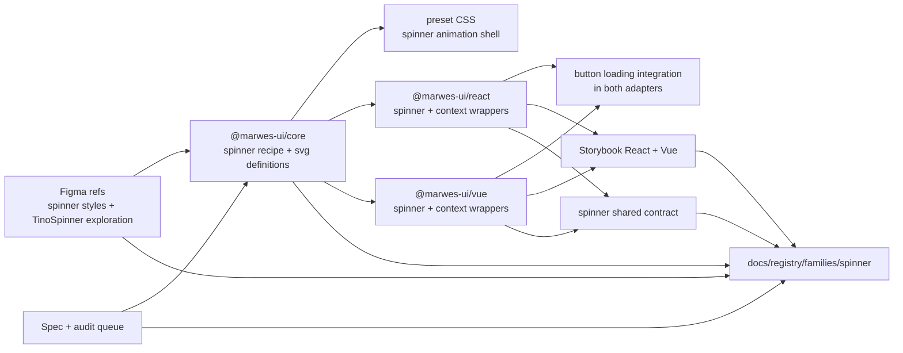
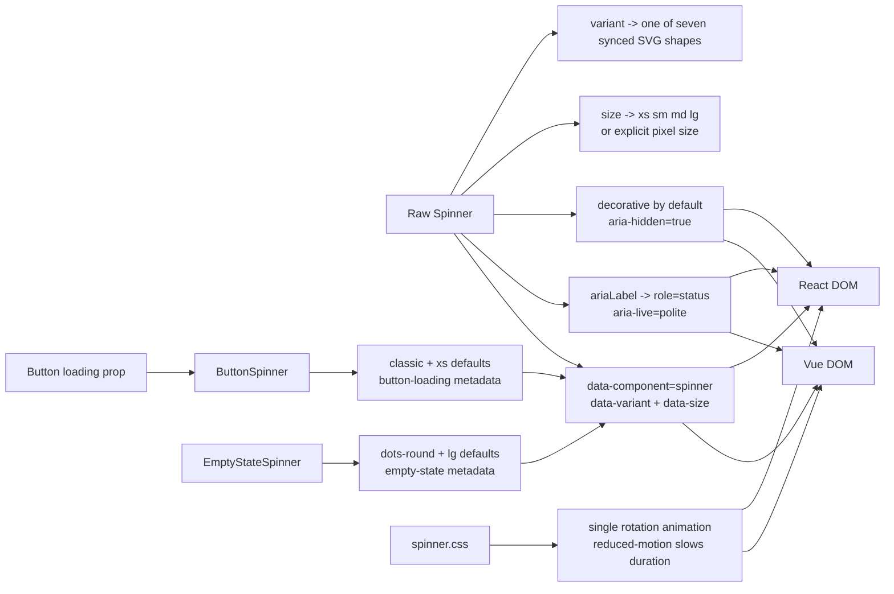

# Spinner Registry

> Family: `spinner`
>
> Local design refs only — this page uses the synced files under `.figma/` and makes no
> Figma API calls.

## Registry files

- [`registry.meta.json`](./registry.meta.json)
- [`registry.generated.json`](./registry.generated.json)
- [`../../../../artifacts/component-registry.json`](../../../../artifacts/component-registry.json)

## Registry snapshot

| Field | Value |
| --- | --- |
| Family status | Shipped |
| Audit status | Queued — later wave, no dedicated family audit doc yet |
| Semantic coverage | Family-local — the atom emits local spinner metadata in core and the adapter wrappers add local `data-purpose` and `data-context` values, but the family is not part of the wave-1 central semantic registry |
| Generated structural truth | `registry.generated.json` + `artifacts/component-registry.json` |
| Primary Figma nodes | spinner light frame `1737:10635`, spinner dark frame `1780:1543`, component container `1737:10631`, TinoSpinner section `1766:153`, dots-round cover frame `1825:30933` |
| Main AXE watch item | decorative-vs-status usage, button-loading announcement quality, and reduced-motion expectations for indeterminate loading surfaces |

## Registry ownership

- `README.md` is the human teaching page.
- `registry.meta.json` is the authored structured summary for this family.
- `registry.generated.json` and `artifacts/component-registry.json` are generator-owned structural outputs.
- the family currently uses local spinner metadata in core and local context metadata in React and Vue wrappers, not the central wave-1 semantic registry.
- `visuals/*.mmd` help people orient themselves quickly, but they are not the canonical implementation source.

## Summary

The Spinner family is Marwes' indeterminate loading-indicator family for inline and standalone async feedback.
It combines:
- a raw `Spinner` atom with seven synced visual styles and a shared size scale
- `ButtonSpinner` and `EmptyStateSpinner` as thin adapter-owned context wrappers
- button-loading integration that reuses `ButtonSpinner` in both adapters
- shared React/Vue contract coverage for decorative default behavior, standalone status mode, and wrapper defaults

This makes Spinner a strong twelfth registry family because it ties together:
- a spec-backed family with a clear atom-first contract and adapter-owned context wrappers
- synced Figma refs that show both the light/dark visual matrix and the exploratory TinoSpinner size work
- strong core, preset, adapter, Storybook, and contract coverage for a relatively small family
- a useful architecture split between one reusable atom and contextual loading surfaces such as button loading and empty-state loading
- an honest semantic posture where the atom emits stable local metadata today, but the family is still outside the canonical semantic registry

## Family surface map

| Surface level | Main members | Why it matters |
| --- | --- | --- |
| Atom | `Spinner` | low-level indeterminate loading primitive with synced variant, size, and accessibility behavior |
| Context wrappers | `ButtonSpinner`, `EmptyStateSpinner` | thin adapter-owned defaults for the two shipped loading contexts |
| Canonical product path | button `loading` plus `ButtonSpinner`, or `EmptyStateSpinner` for centered loading panels | recommended path when the product context already matches one of the shipped wrapper patterns |
| Architecture boundary | core atom vs adapter wrappers | keeps SVG geometry and a11y policy in core while leaving context-specific defaults in the adapters |
| Integration surface | button `loading` prop in React and Vue | proves the family is not just a standalone atom but part of a real product workflow |
| Escape hatch | raw `Spinner` | supported when consumers intentionally own surrounding loading text, color overrides, and decorative vs status behavior |

## Canonical visual understanding

Read this section in this order:
1. canonical Storybook story references for runtime visuals
2. the layer map for repo placement
3. the interaction map for decorative default behavior, standalone status mode, and context-wrapper flow

## Primary visual sources

| Source | Path | Why it matters |
| --- | --- | --- |
| React Storybook | `apps/storybook-react/src/stories/spinner/Introduction.mdx` | canonical React teaching surface for the atom, wrapper split, and accessibility guidance |
| React Storybook | `apps/storybook-react/src/stories/spinner/spinner.stories.tsx` | full atom matrix across the seven synced variants, size scale, and accessible status mode |
| React Storybook | `apps/storybook-react/src/stories/spinner/button-spinner.stories.tsx` | canonical inline button-loading treatment in React |
| React Storybook | `apps/storybook-react/src/stories/spinner/empty-state-spinner.stories.tsx` | canonical centered empty-state treatment in React |
| Vue Storybook | `apps/storybook-vue/src/stories/spinner/Introduction.mdx` | canonical Vue teaching surface for the same family split |
| Vue Storybook | `apps/storybook-vue/src/stories/spinner/spinner.stories.ts` | full atom matrix in Vue |
| Vue Storybook | `apps/storybook-vue/src/stories/spinner/button-spinner.stories.ts` | canonical inline button-loading treatment in Vue |
| Vue Storybook | `apps/storybook-vue/src/stories/spinner/empty-state-spinner.stories.ts` | canonical centered empty-state treatment in Vue |
| Figma showcase | `.figma/marwes/pages/-spinner/-spinner_1737-10635.json` | family baseline light matrix for the seven icon styles, size scale, and loading-context rows |
| Figma showcase | `.figma/marwes/pages/-spinner/-spinner-dark_1780-1543.json` | dark-mode spinner matrix baseline |
| Figma showcase | `.figma/marwes/pages/-spinner/component-container_1737-10631.json` | compact inventory of the seven base spinner icons |
| Figma showcase | `.figma/marwes/pages/-spinner/tinospinner_1766-153.json` | exploratory size and animation section that helps explain the larger spinner work behind the synced page |
| Figma showcase | `.figma/marwes/pages/cover/spinnerdots-round_1825-30933.json` | quick cover-level orientation reference for one shipped spinner style |

> Minimum visual reading set for this family: Storybook Introduction, `spinner`, `button-spinner`, `empty-state-spinner`, then the light and dark Figma spinner frames.

## Figma references

Primary synced refs:
- `.figma/INDEX.md`
- `.figma/marwes/components/spinnerring.json`
- `.figma/marwes/components/spinnerclassic.json`
- `.figma/marwes/components/spinnerdual.json`
- `.figma/marwes/components/spinnerdots-round.json`
- `.figma/marwes/components/spinnerdots-square.json`
- `.figma/marwes/components/spinnerlines.json`
- `.figma/marwes/components/spinnercross.json`
- `.figma/marwes/components/newspinner.json`
- `.figma/marwes/components/spinner-animation.json`
- `.figma/NODE_REFERENCE.md`
- `.figma/nodes.json`
- `.figma/marwes/pages/-spinner/README.md`

Primary showcase nodes from the synced spinner page:
- Spinner component container: `1737:10631`
- Spinner light frame: `1737:10635`
- Spinner dark frame: `1780:1543`
- Ring component: `1737:10523`
- Classic component: `1737:10526`
- Dual component: `1737:10538`
- Dots-round component: `1737:10529`
- Dots-square component: `1780:1345`
- Lines component: `1780:1343`
- Cross component: `1780:1342`
- NewSpinner component set: `1766:127`
- .Spinner-animation component set: `1767:153`
- TinoSpinner section: `1766:153`
- Cover dots-round frame: `1825:30933`

Related synced page refs:
- `.figma/marwes/pages/-spinner/component-container_1737-10631.json`
- `.figma/marwes/pages/-spinner/-spinner_1737-10635.json`
- `.figma/marwes/pages/-spinner/-spinner-dark_1780-1543.json`
- `.figma/marwes/pages/-spinner/tinospinner_1766-153.json`
- `.figma/marwes/pages/cover/spinnerdots-round_1825-30933.json`

## Figma variant summary

| Surface | Variants | States | Notable tokens |
| --- | --- | --- | --- |
| Spinner showcase light/dark frames | seven spinner styles plus usage rows | `ring`, `classic`, `dual`, `dots-round`, `dots-square`, `lines`, `cross` across `16`, `24`, `32`, `40`, button-loading, and empty-state rows | the synced page clearly shows track and indicator colors, but `.figma/NODE_REFERENCE.md` does not currently expose a dedicated spinner token inventory |
| Individual spinner component JSON files | one component per shipped style | structural 24px baseline for each style | these files map very directly to the shipped `variant` API and are the clearest design-to-code bridge for the raw atom |
| `NewSpinner` + `.Spinner-animation` + `TinoSpinner` section | size exploration plus four animation-step components | `16`, `24`, `32`, `56`, `100` and animation-frame exploration | useful for understanding the design exploration, but the shipped API narrows back to the four spinner scale tokens plus optional explicit pixel sizes |

> Important family distinction: the synced spinner page teaches the seven visual styles, size scale, and the button-loading and empty-state treatments, but the shipped Marwes family also includes concrete adapter behavior such as decorative default mode, standalone `role="status"` mode, and real button integration.
>
> In other words: Figma is the visual baseline for spinner geometry, color treatment, and the two taught loading contexts, while Storybook and the shared contracts are the better references for accessibility behavior and adapter-level integration.
>
> Also note: the synced page subtitle still references “Spinner states → Semantic → Brand → Primitives,” but the shipped family does not currently expose a broader semantic or brand-spinner API beyond the two local context wrappers.
>
> One more sync note: `.figma/NODE_REFERENCE.md` does not currently include a dedicated Spinner section, so the page and component JSON files are the better direct design references for this family right now.

## Visual model

### Layer map



Source copy: [`visuals/layer-map.mmd`](./visuals/layer-map.mmd)

### File map

```mermaid
flowchart TD
  Registry["docs/registry/families/spinner"]
  Registry --> Meta["registry.meta.json"]
  Registry --> Generated["registry.generated.json"]
  Registry --> Visuals["visuals/*.mmd"]

  Core["packages/core/src/components/atoms/spinner/"]
  Core --> CoreFiles["spinner-a11y.ts spinner-recipe.ts spinner-svg.ts spinner-types.ts"]
  CoreTests["packages/core/test/recipes/spinner.test.ts"]
  Core --> CoreTests

  Presets["packages/presets/src/firstEdition/"]
  Presets --> SpinnerCss["spinner.css"]
  PresetTests["packages/presets/test/spinner-css-contract.test.ts"]
  Presets --> PresetTests

  React["packages/react/src/components/spinner/"]
  React --> ReactFiles["spinner.tsx variants.tsx tests"]
  ReactButton["packages/react/src/components/button/button.tsx"]
  ReactButton --> React

  Vue["packages/vue/src/components/spinner/"]
  Vue --> VueFiles["spinner.ts variants.ts tests"]
  VueButton["packages/vue/src/components/button/button.ts"]
  VueButton --> Vue

  StoriesR["apps/storybook-react/src/stories/spinner/"]
  StoriesV["apps/storybook-vue/src/stories/spinner/"]
  Contracts["tests/contracts/spinner.contract.ts"]
```



Source copy: [`visuals/file-map.mmd`](./visuals/file-map.mmd)

### Interaction and semantics map



Source copy: [`visuals/interaction-map.mmd`](./visuals/interaction-map.mmd)

## Philosophy

- **Keep the atom small and indeterminate.** `Spinner` should stay focused on indeterminate loading feedback rather than growing into determinate progress or skeleton behavior.
- **Keep decorative as the default.** Most product spinners should stay hidden from assistive technology when nearby text or UI already explains loading.
- **Make standalone status mode explicit.** If a spinner must announce loading on its own, that should happen intentionally through `ariaLabel` rather than as an automatic side effect.
- **Keep context wrappers thin and adapter-owned.** `ButtonSpinner` and `EmptyStateSpinner` should add defaults and local metadata without becoming a second loading system.
- **Keep button loading aligned to the spinner family.** The button `loading` prop should reuse `ButtonSpinner` instead of inventing a parallel loading treatment.

## AXE / accessibility posture

| Area | Status | Notes |
| --- | --- | --- |
| Risk tier | Medium | spinner is non-interactive, but loading announcements, motion, and context quality still affect accessibility meaningfully |
| Audit status | First pass complete | `docs/audits/spinner-family-accessibility.md` |
| Automated contract | Strong | expanded shared contract now covers decorative default, status mode, inner SVG isolation, token size data-size attributes, and explicit decorative=true; plus core recipe tests, preset CSS contract tests with reduced-motion policy proof, local wrapper tests, and Storybook docs/taxonomy tests |
| Dev-time warning | Present | `spinner-a11y.ts` warns in development when `decorative={false}` is passed without `ariaLabel` |
| Manual review boundary | Medium | product loading copy, long-running async waits, and whether the slow-not-stop reduced-motion policy is enough for real product flows still need human review |
| AXE follow-up | Active discipline | the family first pass is complete; broader support-model and smoke-set decisions still apply |

### What automation already covers

- default decorative behavior, explicit status mode, inner SVG isolation, token size data-size, and explicit decorative=true through the expanded shared React/Vue spinner contract
- all seven synced spinner variants plus token and custom size handling in core recipe tests
- light and dark spinner indicator defaults, rotation animation shell, stationary Cross color-shift behavior, and slow-not-stop reduced-motion policy (1600ms) in preset CSS contract tests
- `ButtonSpinner` and `EmptyStateSpinner` default metadata, size, and variant behavior in both adapters
- Storybook introduction and taxonomy coverage in both apps with reduced-motion policy and decorative fallback guidance
- button loading integration through the real button component tests in both adapters

### What still needs manual review or policy clarity

- whether product teams consistently provide enough nearby loading context before relying on the decorative default
- whether standalone `ariaLabel` wording stays truthful and useful during longer async waits
- whether the slow-not-stop reduced-motion approach (800ms → 1600ms) is sufficient for users who need full motion off in real product flows

### Why the semantics are intentionally called family-local

This family already emits useful local metadata, but it is not currently part of the wave-1 canonical semantic registry in `@marwes-ui/core`.

That distinction matters because:
- the `Spinner` atom emits `data-component="spinner"` directly from core today
- `ButtonSpinner` and `EmptyStateSpinner` add local `data-purpose` and `data-context` metadata in the adapters
- but the family should not be described as if it already has the same governance level as the covered semantic-registry families

### Current implementation hotspots

- `packages/core/src/components/atoms/spinner/spinner-a11y.ts` is the main policy point for decorative-vs-status resolution and now emits a dev warning for `decorative={false}` without `ariaLabel`.
- `packages/core/src/components/atoms/spinner/spinner-recipe.ts` is the main policy point for variant, size, and local metadata emission.
- both adapters correctly isolate the inner SVG with `aria-hidden="true"` and `focusable="false"` so AT ignores the geometry.
- `packages/react/src/components/button/button.tsx` and `packages/vue/src/components/button/button.ts` are the most important family-integration surfaces because they route real button loading through `ButtonSpinner`.

## Semantics snapshot

| Field | Current spinner family contract |
| --- | --- |
| `data-component` | `spinner` on the atom; context wrappers add local `data-purpose` and `data-context` metadata |
| canonical attributes | not yet part of the wave-1 central semantic registry |
| purpose vocabulary | `button-loading`, `empty-state` |
| source of truth | `packages/core/src/components/atoms/spinner/spinner-recipe.ts`, `packages/react/src/components/spinner/variants.tsx`, and `packages/vue/src/components/spinner/variants.ts` |

## Linked files

This family follows the same repo tree order used elsewhere in Marwes:

```text
spec/decision → core → preset CSS → React adapter → React stories/tests → Vue adapter → Vue stories/tests → contracts → registry
```

| Layer | Path | Why it matters |
| --- | --- | --- |
| Spec | `docs/reference/spec.md` | explicit spinner atom and context-wrapper requirements plus button-loading integration scope |
| AI metadata | `docs/reference/ai-metadata.md` | useful because Spinner is absent here today, which reinforces that the family is still outside the wave-1 canonical semantic registry |
| Testing docs | `docs/reference/testing.md` | shared-contract expectations and manual-review framing |
| Audit | `docs/audits/spinner-family-accessibility.md` | dedicated execution record for the Spinner family |
| Audit queue | `docs/audits/README.md` | Spinner is first-pass complete in Wave 2 |
| Core | `packages/core/src/components/atoms/spinner/spinner-types.ts` | public spinner atom contract for variant, size, decorative mode, and accessible naming |
| Core | `packages/core/src/components/atoms/spinner/spinner-a11y.ts` | decorative-vs-status policy |
| Core | `packages/core/src/components/atoms/spinner/spinner-recipe.ts` | spinner RenderKit assembly, size normalization, and local atom metadata |
| Core | `packages/core/src/components/atoms/spinner/spinner-svg.ts` | source-owned SVG geometry for the seven shipped visual styles |
| Core test | `packages/core/test/recipes/spinner.test.ts` | recipe-level baseline for variants, size mapping, and status mode |
| Presets | `packages/presets/src/firstEdition/spinner.css` | light/dark defaults, standard rotation, Cross color-shift animation, and reduced-motion behavior |
| Preset test | `packages/presets/test/spinner-css-contract.test.ts` | CSS-level regression coverage for indicator colors, standard rotation, Cross color-shift behavior, and reduced motion |
| React | `packages/react/src/components/spinner/spinner.tsx` | raw spinner atom adapter |
| React | `packages/react/src/components/spinner/variants.tsx` | `ButtonSpinner` and `EmptyStateSpinner` context wrappers in React |
| React integration | `packages/react/src/components/button/button.tsx` | real button-loading integration via `ButtonSpinner` |
| Vue | `packages/vue/src/components/spinner/spinner.ts` | raw spinner atom adapter in Vue |
| Vue | `packages/vue/src/components/spinner/variants.ts` | `ButtonSpinner` and `EmptyStateSpinner` context wrappers in Vue |
| Vue integration | `packages/vue/src/components/button/button.ts` | real button-loading integration via `ButtonSpinner` in Vue |
| Stories | `apps/storybook-react/src/stories/spinner/Introduction.mdx` | canonical React teaching surface |
| Stories | `apps/storybook-react/src/stories/spinner/spinner.stories.tsx` | full raw atom matrix in React |
| Stories | `apps/storybook-vue/src/stories/spinner/Introduction.mdx` | canonical Vue teaching surface |
| Stories | `apps/storybook-vue/src/stories/spinner/spinner.stories.ts` | full raw atom matrix in Vue |
| Contracts | `tests/contracts/spinner.contract.ts` | shared decorative-default and standalone-status contract coverage |
| Figma | `.figma/marwes/pages/-spinner/README.md` | synced design page inventory |
| Figma | `.figma/marwes/components/spinnerclassic.json` | direct component-level bridge for one shipped style |
| Figma | `.figma/marwes/components/newspinner.json` | size exploration reference behind the current page |
| Figma | `.figma/marwes/pages/-spinner/tinospinner_1766-153.json` | exploratory animation and sizing section |

## Verification

Focused commands for this family:

```bash
pnpm --filter @marwes-ui/core exec vitest run test/recipes/spinner.test.ts
pnpm --filter @marwes-ui/presets exec vitest run test/spinner-css-contract.test.ts
# (reduced-motion policy and CSS contract now part of the preset test file)
pnpm test:typecheck:contracts
pnpm --filter @marwes-ui/react exec vitest run src/components/spinner/__tests__/spinner.test.tsx src/components/spinner/__tests__/variants.test.tsx src/components/spinner/__tests__/index-exports.test.tsx src/components/button/__tests__/button.test.tsx
pnpm --filter @marwes-ui/vue exec vitest run src/components/spinner/__tests__/spinner.test.ts src/components/spinner/__tests__/variants.test.ts src/components/spinner/__tests__/index-exports.test.ts src/components/button/__tests__/button.test.ts
pnpm --filter ./apps/storybook-react exec vitest run src/stories/spinner/__tests__/spinner-introduction-docs.test.ts src/stories/spinner/__tests__/spinner-taxonomy.test.ts
pnpm --filter ./apps/storybook-vue exec vitest run src/stories/spinner/__tests__/spinner-introduction-docs.test.ts src/stories/spinner/__tests__/spinner-taxonomy.test.ts
pnpm check:compass
```

Broader confidence:

```bash
pnpm check
pnpm test:packages
pnpm storybook:consistency
```

## Registry notes

Current limitations of the PoC:
- the spinner registry is generator-backed, but the family source map is still maintained manually in `scripts/component-registry-sources.ts`
- the family uses Storybook references and Mermaid diagrams for visual orientation rather than committed preview assets
- the dedicated `docs/audits/spinner-family-accessibility.md` file now records the first-pass decorative/status, reduced-motion, and dev-warning work
- `.figma/NODE_REFERENCE.md` does not currently include a dedicated Spinner section, so the synced page and component JSON files are the better direct design references for this family
- the synced spinner page includes exploratory `TinoSpinner`, `NewSpinner`, and `.Spinner-animation` material that the shipped API intentionally narrows back from
- the current local semantics are useful, but they still live outside the central wave-1 semantic registry

## Open questions

- Which Spinner-family stories should join the first automated accessibility smoke set?
- Should Spinner eventually gain a clearer documented policy for when product teams should pair it with surrounding loading text versus using `ariaLabel` directly?
- Should the exploratory TinoSpinner size and animation assets remain design-only references, or should any of that surface become a future shipped spinner API?
