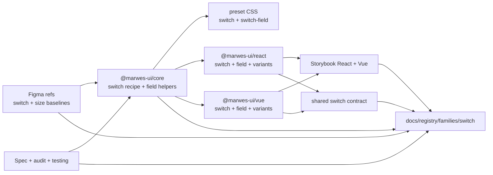
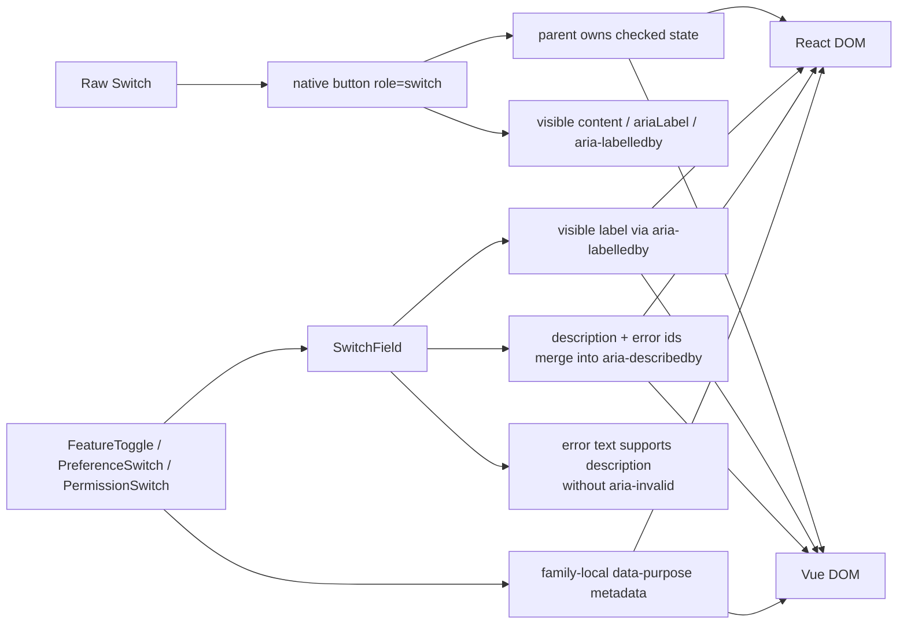

# Switch Registry

> Family: `switch`
>
> Local design refs only — this page uses the synced files under `.figma/` and makes no
> Figma API calls.

## Registry files

- [`registry.meta.json`](./registry.meta.json)
- [`registry.generated.json`](./registry.generated.json)
- [`../../../../artifacts/component-registry.json`](../../../../artifacts/component-registry.json)

## Registry snapshot

| Field | Value |
| --- | --- |
| Family status | Shipped |
| Audit status | First pass complete |
| Semantic coverage | Family-local — purpose-switch metadata lives in adapter wrappers, not the wave-1 central semantic registry |
| Generated structural truth | `registry.generated.json` + `artifacts/component-registry.json` |
| Primary Figma nodes | switch component set `1371:12723`, light frame `1364:11442`, dark frame `1369:4001`, component container `1371:12852` |
| Main AXE watch item | checked-state parity plus `SwitchField` label, description, and error wiring across adapters |

## Registry ownership

- `README.md` is the human teaching page.
- `registry.meta.json` is the authored structured summary for this family.
- `registry.generated.json` and `artifacts/component-registry.json` are generator-owned structural outputs.
- the family currently uses local purpose-switch semantics in React and Vue wrappers, not the central wave-1 semantic registry.
- `visuals/*.mmd` help people orient themselves quickly, but they are not the canonical implementation source.

## Summary

The Switch family is Marwes' toggle-control family for binary on/off decisions.
It combines:
- a raw `Switch` atom rendered as a button-backed `role="switch"`
- `SwitchField` as the canonical labeled field composition
- purpose wrappers for `FeatureToggle`, `PreferenceSwitch`, and `PermissionSwitch`
- shared React/Vue contract coverage for checked state, disabled behavior, and field wiring

This makes Switch a strong fifth registry family because it ties together:
- one of the clearest field-helper-backed accessibility contracts in the repo
- an explicit first-pass audit with a documented button-backed switch policy
- thin purpose wrappers that add useful meaning without becoming a second implementation
- Storybook guidance that clearly separates raw `Switch`, `SwitchField`, and purpose wrappers

## Family surface map

| Surface level | Main members | Why it matters |
| --- | --- | --- |
| Atom | `Switch` | low-level button-backed `role="switch"` primitive with checked, size, and disabled behavior |
| Molecule | `SwitchField` | canonical visible-label path with description and error wiring through shared field helpers |
| Purpose variants | `FeatureToggle`, `PreferenceSwitch`, `PermissionSwitch` | thin semantic wrappers that attach stable family-local `data-purpose` metadata |
| Canonical labeled path | `SwitchField` + purpose wrappers | recommended accessible path for most product usage |
| Architecture boundary | raw `Switch` vs `SwitchField` | separates the low-level toggle primitive from the fully wired field composition |
| Escape hatch | raw `Switch` in custom layouts | supported when consumers intentionally own naming, described-by wiring, and parent-managed checked state |

## Canonical visual understanding

Read this section in this order:
1. canonical Storybook story references for runtime visuals
2. the layer map for repo placement
3. the interaction map for naming, checked-state, and semantics flow

## Primary visual sources

| Source | Path | Why it matters |
| --- | --- | --- |
| React Storybook | `apps/storybook-react/src/stories/switch/Introduction.mdx` | canonical React teaching surface for the family layers |
| React Storybook | `apps/storybook-react/src/stories/switch/switch-field.stories.tsx` | canonical labeled-field path with controlled, disabled, and error examples |
| React Storybook | `apps/storybook-react/src/stories/switch/switch.stories.tsx` | raw atom states plus size comparison |
| React Storybook | `apps/storybook-react/src/stories/switch/feature-toggle.stories.tsx` | purpose-wrapper baseline with family-local semantics |
| Vue Storybook | `apps/storybook-vue/src/stories/switch/Introduction.mdx` | canonical Vue teaching surface for the same family split |
| Vue Storybook | `apps/storybook-vue/src/stories/switch/switch-field.stories.ts` | canonical labeled-field path in Vue |
| Vue Storybook | `apps/storybook-vue/src/stories/switch/switch.stories.ts` | raw Vue atom states and size comparison |
| Vue Storybook | `apps/storybook-vue/src/stories/switch/feature-toggle.stories.ts` | purpose-wrapper mirror in Vue |
| Figma showcase | `.figma/marwes/pages/-switch/-switch_1364-11442.json` | family baseline light frame with state rows |
| Figma showcase | `.figma/marwes/pages/-switch/-switch-dark_1369-4001.json` | dark-mode switch baseline |
| Figma showcase | `.figma/marwes/pages/-switch/component-container_1371-12852.json` | compact, wide, and rich size reference |

> Minimum visual reading set for this family: Storybook Introduction, `switch-field`, `feature-toggle`, then the light and dark Figma switch frames.

## Figma references

Primary synced refs:
- `.figma/INDEX.md`
- `.figma/marwes/components/switch.json`
- `.figma/NODE_REFERENCE.md`
- `.figma/nodes.json`
- `.figma/marwes/pages/-switch/README.md`

Primary showcase nodes from the synced switch page:
- Switch component set: `1371:12723`
- Switch light frame: `1364:11442`
- Switch dark frame: `1369:4001`
- Component container: `1371:12852`

Related synced page refs:
- `.figma/marwes/pages/-switch/-switch_1364-11442.json`
- `.figma/marwes/pages/-switch/-switch-dark_1369-4001.json`
- `.figma/marwes/pages/-switch/component-container_1371-12852.json`

## Figma variant summary

| Surface | Variants | States | Notable tokens |
| --- | --- | --- | --- |
| Switch showcase light/dark frames | on/off rows across three sizes | `default`, `hover`, `pressed`, `disabled`, `focus` | `switch/track-on`, `switch/thumb-on`, `switch/track-off`, `switch/thumb-off`, `switch/label` |
| Switch component set JSON | `On=True`, `On=False` | structural on/off baseline rather than the full state matrix | compact baseline track + thumb layout with visible label |
| Component container | size showcase | `compact`, `wide`, `rich` | 24×16, 30×16, and 30×20 track baselines |

> Important family distinction: the synced Figma page teaches the switch atom states and size baselines, but the shipped `SwitchField` contract also includes visible-label naming, merged description and error ids, and purpose-wrapper metadata.
>
> In other words: Figma is the visual baseline for the track, thumb, and size system, while Storybook and the shared contract are the better references for field wiring and toggle behavior.

## Visual model

### Layer map



Source copy: [`visuals/layer-map.mmd`](./visuals/layer-map.mmd)

### File map

```mermaid
flowchart TD
  Registry["docs/registry/families/switch"]
  Registry --> Meta["registry.meta.json"]
  Registry --> Generated["registry.generated.json"]
  Registry --> Visuals["visuals/*.mmd"]

  Core["packages/core/src/components/atoms/switch/"]
  Core --> CoreFiles["switch-a11y.ts switch-recipe.ts switch-types.ts"]
  Helpers["packages/core/src/shared/field-helpers.ts"]

  Presets["packages/presets/src/firstEdition/"]
  Presets --> AtomCss["switch.css"]
  Presets --> FieldCss["molecules/switch-field.css"]

  React["packages/react/src/components/switch/"]
  React --> ReactFiles["switch.tsx switch-field.tsx variants.tsx tests"]

  Vue["packages/vue/src/components/switch/"]
  Vue --> VueFiles["switch.ts switch-field.ts variants.ts tests"]

  StoriesR["apps/storybook-react/src/stories/switch/"]
  StoriesV["apps/storybook-vue/src/stories/switch/"]
  Contracts["tests/contracts/switch.contract.ts"]
```



Source copy: [`visuals/file-map.mmd`](./visuals/file-map.mmd)

### Interaction and semantics map



Source copy: [`visuals/interaction-map.mmd`](./visuals/interaction-map.mmd)

## Philosophy

- **Teach `SwitchField` first.** It is the canonical labeled path for product toggles because it guarantees visible-label, description, and error wiring.
- **Keep the raw atom deliberately small.** `Switch` should stay useful for custom layouts without pretending it owns field semantics on its own.
- **Keep the button-backed switch model explicit.** Marwes intentionally uses a button-backed `role="switch"` primitive rather than hiding that contract in adapter details.
- **Treat error text as described-by support, not invalid semantics.** The family currently links error content through `aria-describedby` without claiming `aria-invalid`.
- **Keep purpose wrappers thin and honest.** They add family-local `data-purpose` metadata without becoming a second switch implementation or a central semantic-registry entry.

## AXE / accessibility posture

| Area | Status | Notes |
| --- | --- | --- |
| Risk tier | Medium | switch is a custom widget with checked-state and field-wiring risk, but the behavior surface is smaller than tabs, dialog, or rich text |
| Audit status | First pass complete | `docs/audits/switch-family-accessibility.md` |
| Automated contract | Strong | shared switch contract plus local atom and wrapper tests cover the main family behavior |
| Manual review boundary | Medium | keyboard feel, focus visibility, and screen-reader announcement quality still deserve spot checks |
| AXE follow-up | Active discipline | the family now has explicit contract coverage, but future accessibility gates are still undecided |

### What automation already covers

- raw switch checked state and disabled behavior through a shared React/Vue contract
- visible-label naming for `SwitchField` through `aria-labelledby`
- merged description and error ids through `aria-describedby`
- purpose metadata for `FeatureToggle`, `PreferenceSwitch`, and `PermissionSwitch`
- size-class coverage for `compact`, `wide`, and `rich` switch baselines

### What still needs manual review or policy clarity

- real browser and assistive-technology confirmation that checked-state announcements feel right for the button-backed switch model
- the exact future accessibility-gate story set is still open after the first-pass audit
- direct raw `aria-labelledby` usage is documented, but package tests still focus more on visible child content and `ariaLabel`

### Why the semantics are intentionally called family-local

This family already uses useful purpose metadata such as `data-purpose="feature-toggle"`, but that metadata currently lives in adapter-level purpose wrappers rather than the central wave-1 semantic registry in `@marwes-ui/core`.

That distinction matters because:
- the metadata is real and tested today
- it helps Storybook teaching and product-code readability
- but it should not be described as if switch already has the same governance level as button, toast, or dialog semantics

### Current implementation hotspots

- `packages/core/src/components/atoms/switch/switch-a11y.ts` defines the small core switch semantics surface.
- `packages/core/src/shared/field-helpers.ts` is the key field-level source of truth for `SwitchField` ids and described-by wiring.
- `tests/contracts/switch.contract.ts` is the most important shared regression boundary for this family.

## Semantics snapshot

| Field | Current switch family contract |
| --- | --- |
| `data-component` | no single canonical family-level value yet |
| canonical attributes | not yet part of the wave-1 central semantic registry |
| purpose vocabulary | `feature-toggle`, `preference`, `permission` |
| source of truth | `packages/react/src/components/switch/variants.tsx` and `packages/vue/src/components/switch/variants.ts` |

## Linked files

This family follows the same repo tree order used elsewhere in Marwes:

```text
spec/decision → core → preset CSS → React adapter → React stories/tests → Vue adapter → Vue stories/tests → contracts → registry
```

| Layer | Path | Why it matters |
| --- | --- | --- |
| Spec | `docs/reference/spec.md` | explicit switch-family button-backed model, disabled behavior, and field-wiring requirements |
| AI metadata | `docs/reference/ai-metadata.md` | clarifies that switch is still outside the wave-1 canonical semantic registry |
| Testing docs | `docs/reference/testing.md` | shared-contract expectations and manual review boundaries |
| Audit | `docs/audits/switch-family-accessibility.md` | detailed AXE execution record for this family |
| Core | `packages/core/src/components/atoms/switch/switch-types.ts` | public switch atom contract including naming inputs and size API |
| Core | `packages/core/src/components/atoms/switch/switch-a11y.ts` | button-backed switch semantics and checked-state mapping |
| Core | `packages/core/src/components/atoms/switch/switch-recipe.ts` | switch RenderKit assembly and class hooks |
| Core | `packages/core/src/shared/field-helpers.ts` | `SwitchField` label, description, and error id generation |
| Presets | `packages/presets/src/firstEdition/switch.css` | switch atom visuals for checked, unchecked, disabled, focus, and size states |
| Presets | `packages/presets/src/firstEdition/molecules/switch-field.css` | field label, description, error, and disabled styling |
| React | `packages/react/src/components/switch/switch.tsx` | raw switch atom adapter |
| React | `packages/react/src/components/switch/switch-field.tsx` | canonical React field-wiring surface |
| React | `packages/react/src/components/switch/variants.tsx` | family-local purpose-switch metadata in React |
| Vue | `packages/vue/src/components/switch/switch.ts` | raw switch atom adapter in Vue |
| Vue | `packages/vue/src/components/switch/switch-field.ts` | canonical Vue field-wiring surface |
| Vue | `packages/vue/src/components/switch/variants.ts` | family-local purpose-switch metadata in Vue |
| Stories | `apps/storybook-react/src/stories/switch/Introduction.mdx` | canonical React teaching surface |
| Stories | `apps/storybook-vue/src/stories/switch/Introduction.mdx` | canonical Vue teaching surface |
| Contracts | `tests/contracts/switch.contract.ts` | shared checked-state, disabled, and field-wiring coverage |
| Figma | `.figma/marwes/pages/-switch/README.md` | synced design page inventory |
| Figma | `.figma/marwes/components/switch.json` | switch component-set structure |

## Verification

Focused commands for this family:

```bash
pnpm --filter @marwes-ui/core exec vitest run test/recipes/switch.test.ts
pnpm test:typecheck:contracts
pnpm --filter @marwes-ui/react exec vitest run src/components/switch/__tests__/switch.test.tsx src/components/switch/__tests__/variants.test.tsx
pnpm --filter @marwes-ui/vue exec vitest run src/components/switch/__tests__/switch.test.ts src/components/switch/__tests__/variants.test.ts
pnpm storybook:consistency
pnpm check:compass
```

Broader confidence:

```bash
pnpm check
pnpm test:packages
```

## Registry notes

Current limitations of the PoC:
- the switch registry is generator-backed, but the family source map is still maintained manually in `scripts/component-registry-sources.ts`
- the family uses Storybook references and Mermaid diagrams for visual orientation rather than committed preview assets
- purpose-switch semantics are family-local today and do not yet come from the central semantic registry
- the synced Figma refs teach the switch atom states and sizes well, but they do not show the full shipped `SwitchField` wiring contract

## Open questions

- Which Switch-family stories should later join automated accessibility gates?
- Should direct raw `aria-labelledby` usage be added to package-level tests, or remain documented without dedicated local assertions?
