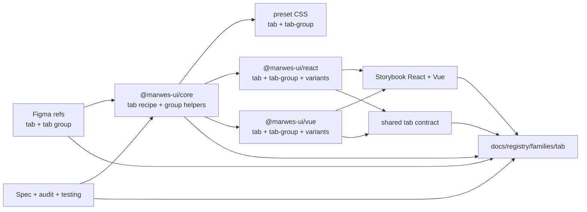
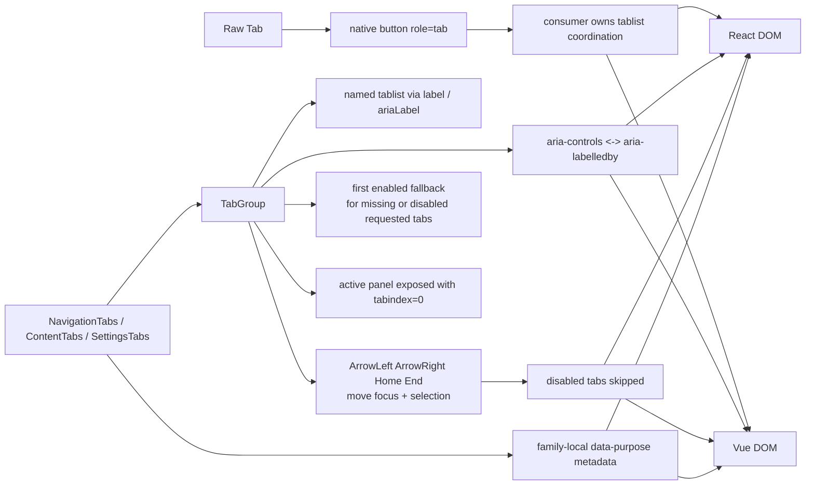

# Tab Registry

> Family: `tab`
>
> Local design refs only — this page uses the synced files under `.figma/` and makes no
> Figma API calls.

## Registry files

- [`registry.meta.json`](./registry.meta.json)
- [`registry.generated.json`](./registry.generated.json)
- [`../../../../artifacts/component-registry.json`](../../../../artifacts/component-registry.json)

## Registry snapshot

| Field | Value |
| --- | --- |
| Family status | Shipped |
| Audit status | First pass complete |
| Semantic coverage | Family-local — purpose-tab metadata lives in adapter wrappers, not the wave-1 central semantic registry |
| Generated structural truth | `registry.generated.json` + `artifacts/component-registry.json` |
| Primary Figma nodes | tab component `1364:7729`, tab group component `1737:9904`, light frame `1364:11703`, dark frame `1368:6067` |
| Main AXE watch item | automatic activation, disabled-tab skipping, and tab-to-panel wiring staying aligned across adapters |

## Registry ownership

- `README.md` is the human teaching page.
- `registry.meta.json` is the authored structured summary for this family.
- `registry.generated.json` and `artifacts/component-registry.json` are generator-owned structural outputs.
- the family currently uses local purpose-tab semantics in React and Vue wrappers, not the central wave-1 semantic registry.
- `visuals/*.mmd` help people orient themselves quickly, but they are not the canonical implementation source.

## Summary

The Tab family is Marwes' coordinated section-switching family.
It combines:
- a low-level `Tab` atom that only renders the button-backed tab surface
- `TabGroup` and `TabPanel` as the canonical coordinated widget path
- purpose wrappers for `NavigationTabs`, `ContentTabs`, and `SettingsTabs`
- shared React/Vue contract coverage for keyboard movement and panel wiring

This makes Tab a strong fourth registry family because it ties together:
- one of the clearest coordinated-widget accessibility contracts in the repo
- a finished first-pass audit with explicit decisions about automatic activation
- thin wrapper semantics that are useful today but intentionally not yet canonical
- Storybook guidance that clearly separates purpose wrappers, `TabGroup`, and raw `Tab`

## Family surface map

| Surface level | Main members | Why it matters |
| --- | --- | --- |
| Atom | `Tab` | low-level native button with `role="tab"`, selected state, disabled state, and optional icon-only naming |
| Molecule | `TabGroup`, `TabPanel` | canonical named `tablist`, roving focus, tab-to-panel wiring, and controlled/uncontrolled state |
| Purpose variants | `NavigationTabs`, `ContentTabs`, `SettingsTabs` | thin semantic wrappers that attach stable family-local `data-purpose` metadata |
| Canonical coordinated path | `TabGroup` + purpose wrappers | recommended accessible path for most product usage |
| Architecture boundary | raw `Tab` vs `TabGroup` | separates the atom surface from the fully coordinated widget behavior |
| Escape hatch | raw `Tab` in a bespoke tablist | supported when consumers intentionally manage focus, selected state, and panel ids themselves |

## Canonical visual understanding

Read this section in this order:
1. canonical Storybook story references for runtime visuals
2. the layer map for repo placement
3. the interaction map for keyboard, focus, and semantics flow

## Primary visual sources

| Source | Path | Why it matters |
| --- | --- | --- |
| React Storybook | `apps/storybook-react/src/stories/tab/Introduction.mdx` | canonical React teaching surface for the family layers |
| React Storybook | `apps/storybook-react/src/stories/tab/tab-group.stories.tsx` | canonical coordinated widget surface with controlled and disabled examples |
| React Storybook | `apps/storybook-react/src/stories/tab/tab.stories.tsx` | raw atom states, icon-only naming, and bespoke tablist baseline |
| React Storybook | `apps/storybook-react/src/stories/tab/navigation-tabs.stories.tsx` | purpose-wrapper baseline with family-local semantics |
| Vue Storybook | `apps/storybook-vue/src/stories/tab/Introduction.mdx` | canonical Vue teaching surface for the same family split |
| Vue Storybook | `apps/storybook-vue/src/stories/tab/tab-group.stories.ts` | canonical coordinated widget surface in Vue |
| Vue Storybook | `apps/storybook-vue/src/stories/tab/tab.stories.ts` | raw Vue atom states and icon-only naming path |
| Vue Storybook | `apps/storybook-vue/src/stories/tab/navigation-tabs.stories.ts` | purpose-wrapper mirror in Vue |
| Figma showcase | `.figma/marwes/pages/-tab/-tab_1364-11703.json` | family baseline light frame with state rows |
| Figma showcase | `.figma/marwes/pages/-tab/-tab-dark_1368-6067.json` | dark-mode tab baseline |
| Figma component | `.figma/marwes/pages/-tab/tab-group_1737-9904.json` | group composition baseline for the tab bar |

> Minimum visual reading set for this family: Storybook Introduction, `tab-group`, `navigation-tabs`, then the light and dark Figma tab frames.

## Figma references

Primary synced refs:
- `.figma/INDEX.md`
- `.figma/marwes/components/tab.json`
- `.figma/marwes/components/tab-group.json`
- `.figma/NODE_REFERENCE.md`
- `.figma/nodes.json`
- `.figma/marwes/pages/-tab/README.md`

Primary showcase nodes from the synced tab page:
- Tab component: `1364:7729`
- Tab group component: `1737:9904`
- Tab light frame: `1364:11703`
- Tab dark frame: `1368:6067`
- Tab bar frame: `1896:33125`

Related synced page refs:
- `.figma/marwes/pages/-tab/tab_1364-7729.json`
- `.figma/marwes/pages/-tab/tab-group_1737-9904.json`
- `.figma/marwes/pages/-tab/-tab_1364-11703.json`
- `.figma/marwes/pages/-tab/-tab-dark_1368-6067.json`
- `.figma/marwes/pages/-tab/component-container_1574-21105.json`
- `.figma/marwes/pages/-tab/tab-bar_1896-33125.json`

## Figma variant summary

| Surface | Variants | States | Notable tokens |
| --- | --- | --- | --- |
| Tab showcase light/dark frames | active + inactive tab bars | `default`, `hover`, `pressed`, `disabled`, `focus` | `tab/surface`, `tab/label`, `tab/indicator` |
| Tab component JSON | `Active` boolean on the atom | selected indicator visibility is structural rather than a large variant matrix | 2px indicator and compact horizontal padding |
| Tab group component JSON | horizontal group composition | active-first composition without panel content | repeated tab atom instances, bar-level layout only |

> Important family distinction: the synced Figma page teaches the tab bar surface and state styling, but the shipped `TabGroup` contract also includes tablist naming, automatic activation, disabled-tab skipping, and tabpanel wiring.
>
> In other words: Figma is the visual baseline for the tab bar and indicator, while Storybook and the shared contract are the better references for the coordinated widget behavior.

## Visual model

### Layer map



Source copy: [`visuals/layer-map.mmd`](./visuals/layer-map.mmd)

### File map

```mermaid
flowchart TD
  Registry["docs/registry/families/tab"]
  Registry --> Meta["registry.meta.json"]
  Registry --> Generated["registry.generated.json"]
  Registry --> Visuals["visuals/*.mmd"]

  Core["packages/core/src/components/atoms/tab/"]
  Core --> CoreFiles["tab-a11y.ts tab-recipe.ts tab-group-a11y.ts tab-group-types.ts tab-types.ts"]

  Presets["packages/presets/src/firstEdition/"]
  Presets --> AtomCss["tab.css"]
  Presets --> GroupCss["molecules/tab-group.css"]

  React["packages/react/src/components/tab/"]
  React --> ReactFiles["tab.tsx tab-group.tsx variants.tsx tests"]

  Vue["packages/vue/src/components/tab/"]
  Vue --> VueFiles["tab.ts tab-group.ts variants.ts tests"]

  StoriesR["apps/storybook-react/src/stories/tab/"]
  StoriesV["apps/storybook-vue/src/stories/tab/"]
  Contracts["tests/contracts/tab.contract.ts"]
```



Source copy: [`visuals/file-map.mmd`](./visuals/file-map.mmd)

### Interaction and semantics map



Source copy: [`visuals/interaction-map.mmd`](./visuals/interaction-map.mmd)

## Philosophy

- **Teach `TabGroup` first.** It is the canonical coordinated widget surface for named tablists, keyboard movement, and panel wiring.
- **Keep raw `Tab` deliberately small.** The atom should stay useful for bespoke tab bars without pretending it manages the whole widget contract on its own.
- **Treat automatic activation as intentional.** Arrow keys and Home/End move both focus and selection immediately among enabled tabs.
- **Skip disabled tabs consistently.** Disabled tabs are rendered as disabled controls and are excluded from roving-focus movement and fallback resolution.
- **Keep purpose wrappers thin and honest.** They add family-local `data-purpose` metadata without becoming a second tabs implementation or pretending to be central semantic-registry entries.

## AXE / accessibility posture

| Area | Status | Notes |
| --- | --- | --- |
| Risk tier | Medium | tabs are a coordinated widget with keyboard and panel-wiring risk, but the behavior surface is narrower than modal or rich-text families |
| Audit status | First pass complete | `docs/audits/tab-family-accessibility.md` |
| Automated contract | Strong | shared tab contract plus local atom and wrapper tests cover the main family behavior |
| Manual review boundary | Medium | real keyboard feel, focus visibility, and AT announcement quality still deserve spot checks |
| AXE follow-up | Active discipline | the family is in the roadmap's medium-risk widget cluster, even after shared-contract hardening |

### What automation already covers

- named `tablist` behavior through visible `label` text or `ariaLabel` fallback
- exact `aria-controls` and `aria-labelledby` pairing between each tab and panel
- automatic activation for `ArrowLeft`, `ArrowRight`, `Home`, and `End`
- disabled-tab skipping and first-enabled fallback when requested tabs are missing or disabled
- family-local `data-purpose` metadata for `NavigationTabs`, `ContentTabs`, and `SettingsTabs`

### What still needs manual review or policy clarity

- real browser and assistive-technology confirmation that the tab bar and focused panel feel correct in common workflows
- the no-enabled-tabs edge case is still a documented gap from the first-pass audit rather than a hardened shared contract guarantee
- future work such as vertical orientation, overflow handling, or lazy panel mounting remains explicitly out of scope for the current family contract

### Why the semantics are intentionally called family-local

This family already uses useful purpose metadata such as `data-purpose="navigation-tabs"`, but that metadata currently lives in adapter-level purpose wrappers rather than the central wave-1 semantic registry in `@marwes-ui/core`.

That distinction matters because:
- the metadata is real and tested today
- it helps Storybook teaching and product-code readability
- but it should not be described as if tabs already have the same governance level as button, toast, or dialog semantics

### Current implementation hotspots

- `packages/core/src/components/atoms/tab/tab-group-a11y.ts` is the core source of truth for ids, fallback resolution, and movement logic.
- `packages/react/src/components/tab/tab-group.tsx` and `packages/vue/src/components/tab/tab-group.ts` are the main parity surfaces for the coordinated widget behavior.
- `tests/contracts/tab.contract.ts` is the most important shared regression boundary for this family.

## Semantics snapshot

| Field | Current tab family contract |
| --- | --- |
| `data-component` | no single canonical family-level value yet |
| canonical attributes | not yet part of the wave-1 central semantic registry |
| purpose vocabulary | `navigation-tabs`, `content-tabs`, `settings-tabs` |
| source of truth | `packages/react/src/components/tab/variants.tsx` and `packages/vue/src/components/tab/variants.ts` |

## Linked files

This family follows the same repo tree order used elsewhere in Marwes:

```text
spec/decision → core → preset CSS → React adapter → React stories/tests → Vue adapter → Vue stories/tests → contracts → registry
```

| Layer | Path | Why it matters |
| --- | --- | --- |
| Spec | `docs/reference/spec.md` | explicit tab-family activation, fallback, naming, and panel-wiring requirements |
| AI metadata | `docs/reference/ai-metadata.md` | clarifies that tabs are still outside the wave-1 canonical semantic registry |
| Testing docs | `docs/reference/testing.md` | shared-contract expectations and manual review boundaries |
| Audit | `docs/audits/tab-family-accessibility.md` | detailed AXE execution record for this family |
| Core | `packages/core/src/components/atoms/tab/tab-a11y.ts` | atom-level tab semantics and disabled behavior |
| Core | `packages/core/src/components/atoms/tab/tab-group-a11y.ts` | id generation, automatic activation, wraparound, and fallback logic |
| Core | `packages/core/src/components/atoms/tab/tab-types.ts` | public tab atom contract including `ariaLabel` and `ariaControls` |
| Core | `packages/core/src/components/atoms/tab/tab-group-types.ts` | shared item and id contracts for coordinated tabs |
| Presets | `packages/presets/src/firstEdition/tab.css` | tab atom visuals for selected, hover, pressed, disabled, and focus states |
| Presets | `packages/presets/src/firstEdition/molecules/tab-group.css` | tab bar border and panel spacing |
| React | `packages/react/src/components/tab/tab.tsx` | raw tab atom adapter |
| React | `packages/react/src/components/tab/tab-group.tsx` | canonical React coordinated tabs surface |
| React | `packages/react/src/components/tab/variants.tsx` | family-local purpose-tab metadata in React |
| Vue | `packages/vue/src/components/tab/tab.ts` | raw tab atom adapter in Vue |
| Vue | `packages/vue/src/components/tab/tab-group.ts` | canonical Vue coordinated tabs surface |
| Vue | `packages/vue/src/components/tab/variants.ts` | family-local purpose-tab metadata in Vue |
| Stories | `apps/storybook-react/src/stories/tab/Introduction.mdx` | canonical React teaching surface |
| Stories | `apps/storybook-vue/src/stories/tab/Introduction.mdx` | canonical Vue teaching surface |
| Contracts | `tests/contracts/tab.contract.ts` | shared tablist naming, movement, fallback, and panel-wiring coverage |
| Figma | `.figma/marwes/pages/-tab/README.md` | synced design page inventory |
| Figma | `.figma/marwes/components/tab.json` | raw tab atom structure |
| Figma | `.figma/marwes/components/tab-group.json` | tab-bar composition baseline |

## Verification

Focused commands for this family:

```bash
pnpm --filter @marwes-ui/core exec vitest run test/recipes/tab.test.ts
pnpm test:typecheck:contracts
pnpm --filter @marwes-ui/react exec vitest run src/components/tab/__tests__/tab.test.tsx src/components/tab/__tests__/tab-group.test.tsx src/components/tab/__tests__/variants.test.tsx
pnpm --filter @marwes-ui/vue exec vitest run src/components/tab/__tests__/tab.test.ts src/components/tab/__tests__/tab-group.test.ts src/components/tab/__tests__/variants.test.ts
pnpm storybook:consistency
pnpm docs:links
```

Broader confidence:

```bash
pnpm check
pnpm test:packages
```

## Registry notes

Current limitations of the PoC:
- the tab registry is generator-backed, but the family source map is still maintained manually in `scripts/component-registry-sources.ts`
- the family uses Storybook references and Mermaid diagrams for visual orientation rather than committed preview assets
- purpose-tab semantics are family-local today and do not yet come from the central semantic registry
- the synced Figma refs teach the tab bar and indicator well, but they do not show the full shipped panel and keyboard contract

## Open questions

- Should purpose-tab metadata eventually move into the central semantic registry if tabs become a covered semantic family?
- Should the no-enabled-tabs edge case be explicitly specified and covered by the shared contract, or remain outside the supported family contract?
