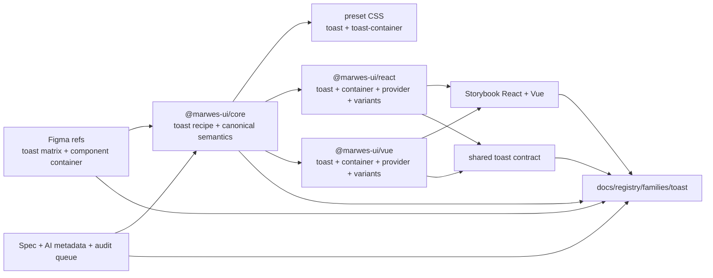
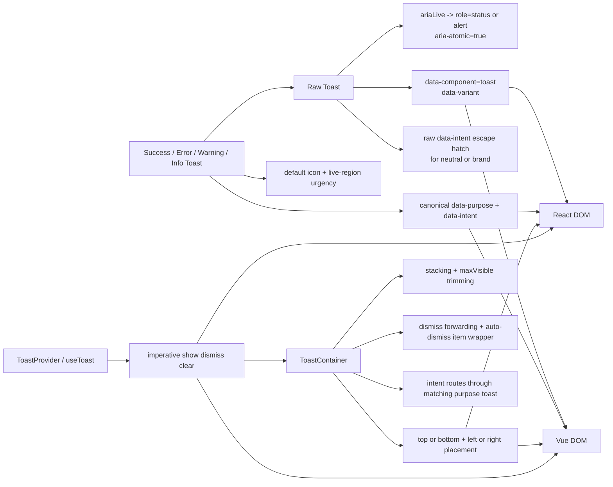

# Toast Registry

> Family: `toast`
>
> Local design refs only — this page uses the synced files under `.figma/` and makes no
> Figma API calls.

## Registry files

- [`registry.meta.json`](./registry.meta.json)
- [`registry.generated.json`](./registry.generated.json)
- [`../../../../artifacts/component-registry.json`](../../../../artifacts/component-registry.json)

## Registry snapshot

| Field | Value |
| --- | --- |
| Family status | Shipped |
| Audit status | First pass complete |
| Semantic coverage | Canonical — part of the wave-1 central semantic registry |
| Generated structural truth | `registry.generated.json` + `artifacts/component-registry.json` |
| Primary Figma nodes | toast component set `1365:11937`, light frame `1365:12526`, dark frame `2276:56938`, component container `1574:20451` |
| Main AXE watch item | live-region urgency, timeout policy, and keeping neutral/brand primitives distinct from canonical purpose toasts |

## Registry ownership

- `README.md` is the human teaching page.
- `registry.meta.json` is the authored structured summary for this family.
- `registry.generated.json` and `artifacts/component-registry.json` are generator-owned structural outputs.
- this family already uses canonical central semantic metadata in `@marwes-ui/core`, not only family-local wrapper metadata.
- `visuals/*.mmd` help people orient themselves quickly, but they are not the canonical implementation source.

## Summary

The Toast family is Marwes' transient feedback family for non-blocking status messaging.
It combines:
- a raw `Toast` atom for the transient feedback surface
- `ToastContainer` as the canonical stacked viewport layer
- `ToastProvider` and `useToast` for imperative queue management in the adapters
- purpose wrappers for `SuccessToast`, `ErrorToast`, `WarningToast`, and `InfoToast`
- canonical family and purpose semantics in core

This makes Toast a strong tenth registry family because it ties together:
- one of the clearest canonical semantic families in the central registry
- synced Figma refs that show the full light/dark toast matrix across semantic and primitive cases
- adapter-owned delivery logic for stacking, placement, and auto-dismiss
- shared React/Vue contract coverage for raw toast semantics, purpose semantics, and delivery timing
- Storybook guidance that clearly separates purpose toasts, raw primitives, and provider/container delivery

## Family surface map

| Surface level | Main members | Why it matters |
| --- | --- | --- |
| Atom | `Toast` | low-level live-region surface with `variant`, `ariaLive`, and raw intent primitive support |
| Molecule | `ToastContainer` | canonical stacked viewport with placement, max-visible trimming, dismiss forwarding, and pause-on-interaction auto-dismiss behavior |
| Delivery layer | `ToastProvider`, `useToast` | adapter-owned imperative queue API for product workflows |
| Purpose variants | `SuccessToast`, `ErrorToast`, `WarningToast`, `InfoToast` | thin semantic wrappers that attach canonical `data-purpose` and `data-intent` metadata |
| Canonical product path | purpose wrappers plus `ToastContainer` or `ToastProvider` | recommended semantic-first and delivery-aware surface for product code |
| Escape hatch | raw `Toast` with explicit `data-intent` and custom delivery | supported when consumers intentionally need neutral/brand primitives or non-standard queue ownership |

## Canonical visual understanding

Read this section in this order:
1. canonical Storybook story references for runtime visuals
2. the layer map for repo placement
3. the interaction map for live-region semantics, purpose intent, and delivery flow

## Primary visual sources

| Source | Path | Why it matters |
| --- | --- | --- |
| React Storybook | `apps/storybook-react/src/stories/toast/Introduction.mdx` | canonical React teaching surface for atom, container, provider, and purpose layers |
| React Storybook | `apps/storybook-react/src/stories/toast/toast-matrix.stories.tsx` | closest runtime mirror of the Figma light/dark semantic and primitive matrix |
| React Storybook | `apps/storybook-react/src/stories/toast/toast-container.stories.tsx` | canonical stacked delivery and imperative provider baseline |
| React Storybook | `apps/storybook-react/src/stories/toast/error-toast.stories.tsx` | highest-urgency canonical purpose path |
| Vue Storybook | `apps/storybook-vue/src/stories/toast/Introduction.mdx` | canonical Vue teaching surface for the same family split |
| Vue Storybook | `apps/storybook-vue/src/stories/toast/toast-matrix.stories.ts` | runtime mirror of the semantic and primitive matrix in Vue |
| Vue Storybook | `apps/storybook-vue/src/stories/toast/toast-container.stories.ts` | canonical stacked delivery baseline in Vue |
| Vue Storybook | `apps/storybook-vue/src/stories/toast/error-toast.stories.ts` | highest-urgency canonical purpose path in Vue |
| Figma showcase | `.figma/marwes/pages/-toast/-toast-light_1365-12526.json` | family baseline light matrix across emphasis and semantic/primitive intent |
| Figma showcase | `.figma/marwes/pages/-toast/-toast-dark_2276-56938.json` | dark-mode toast matrix baseline |
| Figma showcase | `.figma/marwes/pages/-toast/component-container_1574-20451.json` | compact component inventory baseline |

> Minimum visual reading set for this family: Storybook Introduction, `toast-matrix`, `toast-container`, `error-toast`, then the light and dark Figma toast frames.

## Figma references

Primary synced refs:
- `.figma/INDEX.md`
- `.figma/marwes/components/toast.json`
- `.figma/NODE_REFERENCE.md`
- `.figma/nodes.json`
- `.figma/marwes/pages/-toast/README.md`

Primary showcase nodes from the synced toast page:
- Toast component set: `1365:11937`
- Toast light frame: `1365:12526`
- Toast dark frame: `2276:56938`
- Component container: `1574:20451`

Related synced page refs:
- `.figma/marwes/pages/-toast/-toast-light_1365-12526.json`
- `.figma/marwes/pages/-toast/-toast-dark_2276-56938.json`
- `.figma/marwes/pages/-toast/component-container_1574-20451.json`

## Figma variant summary

| Surface | Variants | States | Notable tokens |
| --- | --- | --- | --- |
| Toast showcase light/dark frames | emphasis rows across semantic and primitive intents | `subtle`, `outline`, `rich` × `info`, `success`, `warning`, `error`, `neutral`, `brand` | `toast/subtle/*`, `toast/outline/*`, `toast/rich/*` |
| Toast component JSON | 18 structural combinations | `information`, `success`, `warning`, `error`, `neutral`, `brand` across emphasis variants | the synced component set includes canonical semantic toasts plus raw `neutral` and `brand` primitives |
| Component container | compact inventory baseline | family inventory rather than interaction states | good quick reference for the single-toast surface, but it does not teach stacking or provider flow |

> Important family distinction: the synced Figma page teaches the single-toast visual matrix, including neutral and brand primitives, but the shipped Marwes family also includes `ToastContainer`, `ToastProvider`, `useToast`, and canonical purpose wrappers with live-region defaults.
>
> In other words: Figma is the visual baseline for emphasis and intent styling, while Storybook and the shared contract are the better references for delivery behavior and semantic defaults.
>
> Also note: neutral and brand are real raw-toast primitives in the shipped family, but they are not part of the canonical purpose-toast vocabulary in the central semantic registry.

## Visual model

### Layer map



Source copy: [`visuals/layer-map.mmd`](./visuals/layer-map.mmd)

### File map

```mermaid
flowchart TD
  Registry["docs/registry/families/toast"]
  Registry --> Meta["registry.meta.json"]
  Registry --> Generated["registry.generated.json"]
  Registry --> Visuals["visuals/*.mmd"]

  Semantics["packages/core/src/semantics/"]
  Semantics --> FamilySemantics["family-semantics.ts"]
  Semantics --> PurposeSemantics["purpose-semantics.ts"]

  Core["packages/core/src/components/atoms/toast/"]
  Core --> CoreFiles["toast-a11y.ts toast-recipe.ts toast-types.ts toast-container-types.ts"]

  Presets["packages/presets/src/firstEdition/"]
  Presets --> ToastCss["toast.css"]
  Presets --> ContainerCss["molecules/toast-container.css"]

  React["packages/react/src/components/toast/"]
  React --> ReactFiles["toast.tsx toast-container.tsx toast-provider.tsx variants.tsx tests"]
  React --> ReactTypes["toast-manager-types.ts"]

  Vue["packages/vue/src/components/toast/"]
  Vue --> VueFiles["toast.ts toast-container.ts toast-provider.ts variants.ts tests"]
  Vue --> VueTypes["toast-manager-types.ts"]

  StoriesR["apps/storybook-react/src/stories/toast/"]
  StoriesV["apps/storybook-vue/src/stories/toast/"]
  Contracts["tests/contracts/toast.contract.ts"]
```



Source copy: [`visuals/file-map.mmd`](./visuals/file-map.mmd)

### Interaction and semantics map



Source copy: [`visuals/interaction-map.mmd`](./visuals/interaction-map.mmd)

## Philosophy

- **Teach purpose toasts first when the message intent is known.** `SuccessToast`, `ErrorToast`, `WarningToast`, and `InfoToast` make product intent clearer than manually wiring raw toast metadata each time.
- **Keep the raw atom deliberately small.** `Toast` should stay focused on live-region semantics and surface styling rather than owning queue management on its own.
- **Keep delivery logic in the adapters.** `ToastContainer`, `ToastProvider`, and `useToast` are runtime orchestration layers that React and Vue own directly.
- **Keep canonical semantics in core.** The base `data-component="toast"` contract and purpose vocabulary belong in the central semantic registry.
- **Keep primitive intents explicit but secondary.** Neutral and brand primitives are useful raw-toast cases, but they should not be described as canonical purpose toasts.
- **Keep inline actions legible and focusable.** The toast-local action treatment is underlined, lightweight text; use a real button or link with `mw-toast__action-button` when the action is interactive.

## AXE / accessibility posture

| Area | Status | Notes |
| --- | --- | --- |
| Risk tier | Medium | toast is less risky than modal widgets, but live-region urgency, timing, and dismissal behavior still affect accessibility quality |
| Audit status | First pass complete | `docs/audits/toast-family-accessibility.md` |
| Automated contract | Strong | the shared toast contract now covers raw semantics, purpose semantics, max-visible trimming, dismiss forwarding, provider timing, and pause-on-interaction behavior across React and Vue |
| Manual review boundary | Medium | announcement timing, timeout choice, and product-level action wording still need human judgment |
| AXE follow-up | Active discipline | the family first pass is complete; broader accessibility support-model and smoke-set decisions still apply |

### What automation already covers

- raw `Toast` default `status`/`polite`/`aria-atomic` semantics plus assertive `alert` mapping through the shared React/Vue contract
- canonical purpose-toast semantics for success, error, warning, and info
- stacked toast max-visible trimming, primitive intent forwarding, and dismiss forwarding through shared contract coverage and local adapter tests
- provider-driven imperative delivery, default 4000ms timing, `duration: null` persistence, and pause-on-hover/focus behavior in both adapters
- Storybook introduction and taxonomy coverage in both apps with explicit timing and action-boundary guidance

### What still needs manual review or policy clarity

- real browser and assistive-technology confirmation that `aria-live` timing, interruption feel, and repeated toast delivery behave predictably
- whether the default 4000ms duration is sufficient for real message length, localization length, and action complexity
- whether product teams choose honest toast actions instead of turning toast into a mini-dialog or notification center

### Why the semantics are intentionally called canonical

This family is part of the wave-1 central semantic registry in `@marwes-ui/core`.

That matters because:
- `data-component="toast"` is source-owned in core rather than inferred only from adapter wrappers
- purpose vocabulary such as `success-toast`, `error-toast`, `warning-toast`, and `info-toast` is centralized in the semantic registry
- React and Vue purpose wrappers are expected to emit the same semantic contract rather than inventing their own family-local meanings

### Current implementation hotspots

- `packages/core/src/components/atoms/toast/toast-a11y.ts` is the main policy point for live-region role selection.
- `packages/react/src/components/toast/toast-container.tsx` and `packages/vue/src/components/toast/toast-container.ts` are the key stacking, routing, auto-dismiss, and pause-on-interaction surfaces.
- `packages/react/src/components/toast/toast-provider.tsx` and `packages/vue/src/components/toast/toast-provider.ts` are the main imperative delivery boundaries and the source of the default 4000ms timing baseline.

## Semantics snapshot

| Field | Current toast family contract |
| --- | --- |
| `data-component` | `toast` |
| canonical attributes | `data-component`, `data-variant`, `data-intent` |
| purpose vocabulary | `success-toast`, `error-toast`, `warning-toast`, `info-toast` |
| source of truth | `packages/core/src/semantics/family-semantics.ts` and `packages/core/src/semantics/purpose-semantics.ts` |

## Linked files

This family follows the same repo tree order used elsewhere in Marwes:

```text
spec/decision → core → preset CSS → React adapter → React stories/tests → Vue adapter → Vue stories/tests → contracts → registry
```

| Layer | Path | Why it matters |
| --- | --- | --- |
| Spec | `docs/reference/spec.md` | explicit toast atom, purpose-wrapper, and delivery-layer requirements |
| AI metadata | `docs/reference/ai-metadata.md` | canonical toast family and purpose vocabulary |
| Testing docs | `docs/reference/testing.md` | shared-contract expectations and manual-review framing |
| Audit | `docs/audits/toast-family-accessibility.md` | dedicated execution record for the Toast family |
| Audit queue | `docs/audits/README.md` | Toast is first-pass complete in Wave 2 |
| Core semantics | `packages/core/src/semantics/family-semantics.ts` | canonical family-level toast attributes |
| Core semantics | `packages/core/src/semantics/purpose-semantics.ts` | success, error, warning, and info purpose metadata |
| Core | `packages/core/src/components/atoms/toast/toast-types.ts` | public raw toast contract for variant and live-region options |
| Core | `packages/core/src/components/atoms/toast/toast-a11y.ts` | live-region role and `aria-live` mapping |
| Core | `packages/core/src/components/atoms/toast/toast-recipe.ts` | toast RenderKit assembly and canonical atom metadata |
| Core | `packages/core/src/components/atoms/toast/toast-container-types.ts` | shared placement and container option vocabulary |
| Presets | `packages/presets/src/firstEdition/toast.css` | raw toast visual treatment across emphasis and intent |
| Presets | `packages/presets/src/firstEdition/molecules/toast-container.css` | stacked viewport positioning and enter animation |
| React | `packages/react/src/components/toast/toast.tsx` | raw toast atom adapter |
| React | `packages/react/src/components/toast/toast-container.tsx` | stacked viewport, intent routing, and auto-dismiss behavior |
| React | `packages/react/src/components/toast/toast-provider.tsx` | imperative queue management via context |
| React | `packages/react/src/components/toast/toast-manager-types.ts` | runtime toast queue shapes in React |
| React | `packages/react/src/components/toast/variants.tsx` | canonical purpose-toast wrappers in React |
| Vue | `packages/vue/src/components/toast/toast.ts` | raw toast atom adapter in Vue |
| Vue | `packages/vue/src/components/toast/toast-container.ts` | stacked viewport, intent routing, and auto-dismiss behavior in Vue |
| Vue | `packages/vue/src/components/toast/toast-provider.ts` | imperative queue management via provide/inject |
| Vue | `packages/vue/src/components/toast/toast-manager-types.ts` | runtime toast queue shapes in Vue |
| Vue | `packages/vue/src/components/toast/variants.ts` | canonical purpose-toast wrappers in Vue |
| Stories | `apps/storybook-react/src/stories/toast/Introduction.mdx` | canonical React teaching surface |
| Stories | `apps/storybook-react/src/stories/toast/toast-matrix.stories.tsx` | runtime visual matrix aligned with Figma |
| Stories | `apps/storybook-vue/src/stories/toast/Introduction.mdx` | canonical Vue teaching surface |
| Stories | `apps/storybook-vue/src/stories/toast/toast-matrix.stories.ts` | runtime visual matrix aligned with Figma in Vue |
| Contracts | `tests/contracts/toast.contract.ts` | shared raw-toast, purpose-toast, and delivery-behavior coverage |
| Figma | `.figma/marwes/pages/-toast/README.md` | synced design page inventory |
| Figma | `.figma/marwes/components/toast.json` | toast component-set structure |
| Figma | `.figma/NODE_REFERENCE.md` | canonical toast node ids and token group summary |

## Verification

Focused commands for this family:

```bash
pnpm --filter @marwes-ui/core exec vitest run test/recipes/toast.test.ts
pnpm test:typecheck:contracts
pnpm --filter @marwes-ui/react exec vitest run src/components/toast/__tests__/toast-container.test.tsx src/components/toast/__tests__/variants.test.tsx
pnpm --filter @marwes-ui/vue exec vitest run src/components/toast/__tests__/toast-container.test.ts src/components/toast/__tests__/variants.test.ts
pnpm --filter ./apps/storybook-react exec vitest run src/stories/toast/__tests__/toast-introduction-docs.test.ts src/stories/toast/__tests__/toast-taxonomy.test.ts
pnpm --filter ./apps/storybook-vue exec vitest run src/stories/toast/__tests__/toast-introduction-docs.test.ts src/stories/toast/__tests__/toast-taxonomy.test.ts
pnpm check:compass
```

Broader confidence:

```bash
pnpm check
pnpm test:packages
pnpm storybook:consistency
```

## Registry notes

Current limitations of the PoC:
- the toast registry is generator-backed, but the family source map is still maintained manually in `scripts/component-registry-sources.ts`
- the family uses Storybook references and Mermaid diagrams for visual orientation rather than committed preview assets
- the dedicated `docs/audits/toast-family-accessibility.md` file now records the first-pass timing and contract hardening work, but the canonical repo-level accessibility support model still does not exist yet
- the synced Figma page teaches the single-toast surface very well, but it does not represent provider-driven stacking or auto-dismiss behavior directly
- the current semantic registry intentionally covers canonical purpose toasts, while raw neutral and brand primitives remain atom-level escape hatches rather than purpose wrappers

## Open questions

- Which Toast-family stories should join the first automated accessibility smoke set?
- Should the provider default stay at 4000ms long term, or move toward a longer or intent-aware timeout policy once the canonical accessibility support model exists?
- Should neutral and brand raw-toast primitives remain escape hatches only, or eventually gain a more explicit documented governance boundary?
