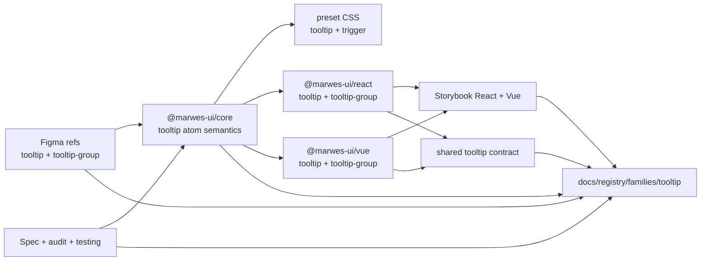
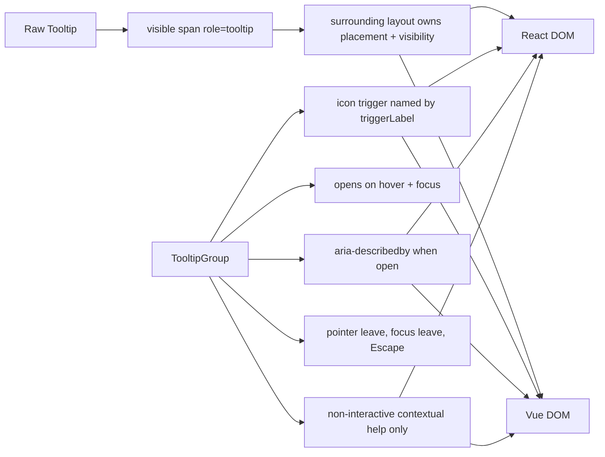

# Tooltip Registry

> Family: `tooltip`
>
> Local design refs only — this page uses the synced files under `.figma/` and makes no
> Figma API calls.

## Registry files

- [`registry.meta.json`](./registry.meta.json)
- [`registry.generated.json`](./registry.generated.json)
- [`../../../../artifacts/component-registry.json`](../../../../artifacts/component-registry.json)

## Registry snapshot

| Field | Value |
| --- | --- |
| Family status | Shipped |
| Audit status | First pass complete |
| Semantic coverage | Family-local — the atom and group emit local metadata, but the family is not part of the wave-1 central semantic registry |
| Generated structural truth | `registry.generated.json` + `artifacts/component-registry.json` |
| Primary Figma nodes | tooltip component `1364:7739`, tooltip-group component `1574:21100`, light group frame `1574:21179`, dark group frame `1574:21235` |
| Main AXE watch item | icon-trigger naming, `aria-describedby` wiring, and keeping tooltip content non-interactive |

## Registry ownership

- `README.md` is the human teaching page.
- `registry.meta.json` is the authored structured summary for this family.
- `registry.generated.json` and `artifacts/component-registry.json` are generator-owned structural outputs.
- the family currently uses local tooltip metadata in core and adapter surfaces, not the central wave-1 semantic registry.
- `visuals/*.mmd` help people orient themselves quickly, but they are not the canonical implementation source.

## Summary

The Tooltip family is Marwes' contextual-help family for short, non-interactive
assistive text.
It combines:
- a raw `Tooltip` atom that renders the visible tooltip bubble
- `TooltipGroup` as the canonical icon-trigger contextual-help composition
- shared React/Vue contract coverage for naming, reveal, dismissal, and `aria-describedby` wiring
- a deliberately narrow scope boundary that keeps tooltip content non-interactive

This makes Tooltip a strong seventh registry family because it ties together:
- a small core semantic surface with `role="tooltip"`
- adapter-owned runtime behavior that is now protected by a shared contract
- Storybook guidance that explicitly distinguishes tooltip from richer overlays
- design provenance that is clear for both the standalone bubble and the help-icon group

## Family surface map

| Surface level | Main members | Why it matters |
| --- | --- | --- |
| Atom | `Tooltip` | low-level visible bubble with `role="tooltip"` and stable tooltip atom metadata |
| Molecule | `TooltipGroup` | canonical icon-trigger composition with hover/focus reveal and dismissal behavior |
| Purpose variants | None in the current public family | the family intentionally stays narrow rather than layering semantic wrappers on top |
| Canonical contextual-help path | `TooltipGroup` | recommended accessible path for most product usage |
| Architecture boundary | raw `Tooltip` vs `TooltipGroup` | separates the visible bubble primitive from the fully wired icon-trigger behavior |
| Escape hatch | raw `Tooltip` in placement-owned layouts | supported when surrounding layout already owns visibility and positioning intentionally |

## Canonical visual understanding

Read this section in this order:
1. canonical Storybook story references for runtime visuals
2. the layer map for repo placement
3. the interaction map for naming, reveal, dismissal, and scope boundaries

## Primary visual sources

| Source | Path | Why it matters |
| --- | --- | --- |
| React Storybook | `apps/storybook-react/src/stories/tooltip/Introduction.mdx` | canonical React teaching surface for the atom vs group split |
| React Storybook | `apps/storybook-react/src/stories/tooltip/tooltip-group.stories.tsx` | canonical contextual-help path with help and info trigger examples |
| React Storybook | `apps/storybook-react/src/stories/tooltip/tooltip.stories.tsx` | standalone tooltip bubble baseline |
| Vue Storybook | `apps/storybook-vue/src/stories/tooltip/Introduction.mdx` | canonical Vue teaching surface for the same scope boundary |
| Vue Storybook | `apps/storybook-vue/src/stories/tooltip/tooltip-group.stories.ts` | canonical contextual-help path in Vue |
| Vue Storybook | `apps/storybook-vue/src/stories/tooltip/tooltip.stories.ts` | standalone Vue tooltip bubble baseline |
| Figma showcase | `.figma/marwes/pages/-tooltip/-tooltip-group_1574-21179.json` | family baseline light frame for the icon-trigger composition |
| Figma showcase | `.figma/marwes/pages/-tooltip/-tooltip-group-dark_1574-21235.json` | dark-mode icon-trigger baseline |
| Figma component | `.figma/marwes/pages/-tooltip/tooltip_1364-7739.json` | raw tooltip bubble baseline |
| Figma component | `.figma/marwes/pages/-tooltip/tooltip-group_1574-21100.json` | component-level tooltip-group composition baseline |

> Minimum visual reading set for this family: Storybook Introduction, `tooltip-group`, then the light and dark Figma tooltip-group frames.

## Figma references

Primary synced refs:
- `.figma/INDEX.md`
- `.figma/marwes/components/tooltip.json`
- `.figma/marwes/components/tooltip-group.json`
- `.figma/nodes.json`
- `.figma/marwes/pages/-tooltip/README.md`

Primary showcase nodes from the synced tooltip page:
- Tooltip component: `1364:7739`
- Tooltip-group component: `1574:21100`
- Tooltip-group light frame: `1574:21179`
- Tooltip-group dark frame: `1574:21235`
- Component container: `1574:21156`

Related synced page refs:
- `.figma/marwes/pages/-tooltip/tooltip_1364-7739.json`
- `.figma/marwes/pages/-tooltip/tooltip-group_1574-21100.json`
- `.figma/marwes/pages/-tooltip/component-container_1574-21156.json`
- `.figma/marwes/pages/-tooltip/-tooltip-group_1574-21179.json`
- `.figma/marwes/pages/-tooltip/-tooltip-group-dark_1574-21235.json`

## Figma variant summary

| Surface | Variants | States | Notable tokens |
| --- | --- | --- | --- |
| Tooltip component JSON | standalone bubble | visible bubble only | current synced refs show inverse bubble surface and inverted text, but no dedicated tooltip token list is documented in `.figma/NODE_REFERENCE.md` |
| Tooltip-group component JSON | bubble + icon trigger composition | structural open composition rather than interaction rows | help-icon trigger with tooltip bubble above |
| Tooltip-group light/dark frames | help/info trigger examples | light and dark contextual-help showcase | inverse bubble surface, inverted text, and muted trigger icon treatment |

> Important family distinction: the synced Figma page teaches the visible bubble and icon-trigger composition, but the shipped `TooltipGroup` contract also includes `triggerLabel`, hover/focus reveal, `Escape` dismissal, and the non-interactive content boundary.
>
> In other words: Figma is the visual baseline for the bubble and icon trigger, while Storybook and the shared contract are the better references for the actual accessibility and misuse boundary.

## Visual model

### Layer map



Source copy: [`visuals/layer-map.mmd`](./visuals/layer-map.mmd)

### File map

```mermaid
flowchart TD
  Registry["docs/registry/families/tooltip"]
  Registry --> Meta["registry.meta.json"]
  Registry --> Generated["registry.generated.json"]
  Registry --> Visuals["visuals/*.mmd"]

  Core["packages/core/src/components/atoms/tooltip/"]
  Core --> CoreFiles["tooltip-a11y.ts tooltip-recipe.ts tooltip-types.ts"]

  Presets["packages/presets/src/firstEdition/"]
  Presets --> TooltipCss["tooltip.css"]

  React["packages/react/src/components/tooltip/"]
  React --> ReactFiles["tooltip.tsx tooltip-group.tsx tests"]

  Vue["packages/vue/src/components/tooltip/"]
  Vue --> VueFiles["tooltip.ts tooltip-group.ts tests"]

  StoriesR["apps/storybook-react/src/stories/tooltip/"]
  StoriesV["apps/storybook-vue/src/stories/tooltip/"]
  Contracts["tests/contracts/tooltip.contract.ts"]
```



Source copy: [`visuals/file-map.mmd`](./visuals/file-map.mmd)

### Interaction and semantics map



Source copy: [`visuals/interaction-map.mmd`](./visuals/interaction-map.mmd)

## Philosophy

- **Teach `TooltipGroup` first.** It is the canonical contextual-help path because it owns the icon trigger, naming, reveal, and dismissal behavior.
- **Keep the raw atom deliberately small.** `Tooltip` should stay useful as a visible bubble primitive without pretending it owns trigger behavior or placement.
- **Keep tooltip scope narrow.** Tooltip content should stay non-interactive and informational rather than drifting into popover territory.
- **Treat dismissal behavior as contract, not implementation detail.** Hover/focus reveal and pointer-leave, blur, and `Escape` dismissal are central to usable tooltip behavior.
- **Stay honest about semantic maturity.** The family emits useful local metadata today, but it is not yet part of the wave-1 central semantic registry.

## AXE / accessibility posture

| Area | Status | Notes |
| --- | --- | --- |
| Risk tier | Medium | tooltip is smaller than modal or editor families, but misuse and dismissal behavior can easily drift without explicit guardrails |
| Audit status | First pass complete | `docs/audits/tooltip-family-accessibility.md` |
| Automated contract | Strong | shared tooltip contract plus local atom and export tests cover the main family behavior |
| Manual review boundary | Medium | keyboard feel, announcement timing, and non-interactive content discipline still deserve spot checks |
| AXE follow-up | Active discipline | future misuse warnings and accessibility-gate story coverage are still open questions |

### What automation already covers

- tooltip atom id retention, `role="tooltip"`, and `data-component="tooltip"`
- icon-trigger naming from `triggerLabel`, including the default label fallback
- hover and focus reveal behavior for `TooltipGroup`
- pointer-leave, focus-leave, and `Escape` dismissal behavior
- `aria-describedby` wiring between the trigger and the tooltip bubble while open
- controlled open-state behavior staying source-of-truth while close intent is still emitted

### What still needs manual review or policy clarity

- real browser and assistive-technology confirmation that the tooltip is announced at the right time and feels predictable in keyboard flows
- whether future dev-time warnings for clearly interactive tooltip content are worth adding
- which tooltip stories should eventually participate in stricter automated accessibility gates

### Why the semantics are intentionally called family-local

This family already emits stable local metadata, but it is not currently part of the wave-1 canonical semantic registry in `@marwes-ui/core`.

That distinction matters because:
- the `Tooltip` atom emits `data-component="tooltip"` directly from core today
- `TooltipGroup` adds local `data-component="tooltip-group"` metadata in the adapters
- but the family should not be described as if it already has the same governance level as the covered semantic-registry families

### Current implementation hotspots

- `packages/core/src/components/atoms/tooltip/tooltip-recipe.ts` is the core semantic source for the tooltip atom.
- `packages/react/src/components/tooltip/tooltip-group.tsx` and `packages/vue/src/components/tooltip/tooltip-group.ts` are the main parity surfaces for reveal and dismissal behavior.
- `tests/contracts/tooltip.contract.ts` is the most important shared regression boundary for this family.

## Semantics snapshot

| Field | Current tooltip family contract |
| --- | --- |
| `data-component` | `tooltip` on the atom, `tooltip-group` on the molecule |
| canonical attributes | family-local `data-component` metadata only |
| purpose vocabulary | none in the current public family |
| source of truth | `packages/core/src/components/atoms/tooltip/tooltip-recipe.ts`, `packages/react/src/components/tooltip/tooltip-group.tsx`, `packages/vue/src/components/tooltip/tooltip-group.ts` |

## Linked files

This family follows the same repo tree order used elsewhere in Marwes:

```text
spec/decision → core → preset CSS → React adapter → React stories/tests → Vue adapter → Vue stories/tests → contracts → registry
```

| Layer | Path | Why it matters |
| --- | --- | --- |
| Spec | `docs/reference/spec.md` | explicit tooltip-family naming, dismissal, and non-interactive scope requirements |
| AI metadata | `docs/reference/ai-metadata.md` | clarifies that tooltip is still outside the wave-1 canonical semantic registry |
| Testing docs | `docs/reference/testing.md` | shared-contract expectations and manual review boundaries |
| Audit | `docs/audits/tooltip-family-accessibility.md` | detailed AXE execution record for this family |
| Core | `packages/core/src/components/atoms/tooltip/tooltip-types.ts` | public tooltip atom contract |
| Core | `packages/core/src/components/atoms/tooltip/tooltip-a11y.ts` | low-level tooltip role and id mapping |
| Core | `packages/core/src/components/atoms/tooltip/tooltip-recipe.ts` | tooltip RenderKit assembly and atom metadata |
| Presets | `packages/presets/src/firstEdition/tooltip.css` | tooltip bubble, trigger focus, motion, and dark-theme styles |
| React | `packages/react/src/components/tooltip/tooltip.tsx` | raw tooltip atom adapter |
| React | `packages/react/src/components/tooltip/tooltip-group.tsx` | canonical React contextual-help composition |
| Vue | `packages/vue/src/components/tooltip/tooltip.ts` | raw tooltip atom adapter in Vue |
| Vue | `packages/vue/src/components/tooltip/tooltip-group.ts` | canonical Vue contextual-help composition |
| Stories | `apps/storybook-react/src/stories/tooltip/Introduction.mdx` | canonical React teaching surface |
| Stories | `apps/storybook-vue/src/stories/tooltip/Introduction.mdx` | canonical Vue teaching surface |
| Contracts | `tests/contracts/tooltip.contract.ts` | shared trigger naming, reveal, dismissal, and described-by coverage |
| Figma | `.figma/marwes/pages/-tooltip/README.md` | synced design page inventory |
| Figma | `.figma/marwes/components/tooltip.json` | standalone tooltip bubble structure |
| Figma | `.figma/marwes/components/tooltip-group.json` | icon-trigger tooltip composition baseline |

## Verification

Focused commands for this family:

```bash
pnpm --filter @marwes-ui/core exec vitest run test/recipes/tooltip.test.ts
pnpm test:typecheck:contracts
pnpm --filter @marwes-ui/react exec vitest run src/components/tooltip/__tests__/tooltip.test.tsx src/components/tooltip/__tests__/tooltip-group.test.tsx src/components/tooltip/__tests__/index-exports.test.tsx
pnpm --filter @marwes-ui/vue exec vitest run src/components/tooltip/__tests__/tooltip.test.ts src/components/tooltip/__tests__/tooltip-group.test.ts src/components/tooltip/__tests__/index-exports.test.ts
pnpm --filter ./apps/storybook-react exec vitest run src/stories/tooltip/__tests__/tooltip-introduction-docs.test.ts src/stories/tooltip/__tests__/tooltip-taxonomy.test.ts
pnpm --filter ./apps/storybook-vue exec vitest run src/stories/tooltip/__tests__/tooltip-introduction-docs.test.ts src/stories/tooltip/__tests__/tooltip-taxonomy.test.ts
pnpm docs:links
```

Broader confidence:

```bash
pnpm check
pnpm test:packages
pnpm storybook:consistency
```

## Registry notes

Current limitations of the PoC:
- the tooltip registry is generator-backed, but the family source map is still maintained manually in `scripts/component-registry-sources.ts`
- the family uses Storybook references and Mermaid diagrams for visual orientation rather than committed preview assets
- the family has no purpose-wrapper layer today, so the registry focuses on the atom vs molecule boundary instead
- the synced tooltip refs do not currently have a dedicated token inventory in `.figma/NODE_REFERENCE.md`, so visual provenance is stronger than token provenance for this family

## Open questions

- Which Tooltip-family stories should later join automated accessibility gates?
- Should clearly interactive tooltip content eventually trigger dev-time warnings, or remain a docs-and-review boundary?
