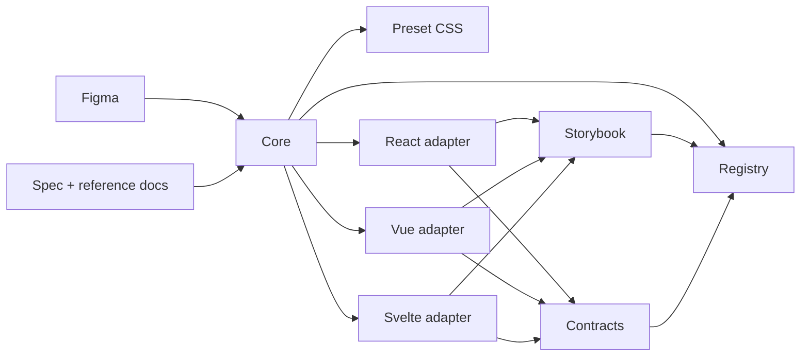

# <Display Name> Registry

> Family: `<family>`
>
> Local design refs only — this page should use the synced files under `.figma/` and make no Figma API calls.

## Registry files

- `registry.meta.json`
- `registry.generated.json`
- `artifacts/component-registry.json`

## Registry snapshot

| Field | Value |
| --- | --- |
| Family status | `<planned|in-progress|shipped|deprecated>` |
| Audit status | `<queued|in-progress|first-pass-complete|complete>` |
| Generated structural truth | `registry.generated.json` + `artifacts/component-registry.json` |
| Primary Figma nodes | `<light node>`, `<dark node>`, `<purpose/state node if relevant>` |
| Main AXE watch item | `<main unresolved accessibility or policy topic>` |

## Registry ownership

- `README.md` is the human teaching page.
- `registry.meta.json` is the authored structured summary for this family.
- `registry.generated.json` and `artifacts/component-registry.json` are generator-owned structural outputs.
- `visuals/*.mmd` help people orient themselves quickly, but they are not the canonical implementation source.

## Summary

Short description of what the family is for.

Explain why this family is a useful registry entry:
- design references
- semantic ownership
- adapter parity
- contracts
- AXE relevance

## Canonical visual understanding

Read this section in this order:
1. canonical Storybook story references for runtime visuals
2. the layer map for repo placement
3. the interaction map for semantics and accessibility flow

## Primary visual sources

Document the canonical runtime visual entry points first.

Example:

| Source | Path | Why it matters |
| --- | --- | --- |
| React Storybook | `apps/storybook-react/src/stories/<family>/...` | canonical React runtime visual source |
| Vue Storybook | `apps/storybook-vue/src/stories/<family>/...` | canonical Vue runtime visual source |
| Svelte Storybook | `apps/storybook-svelte/src/stories/<family>/...` | canonical Svelte runtime visual source |
| Figma showcase | `.figma/marwes/pages/...` | curated design baseline |

## Figma references

Primary synced refs:
- `.figma/INDEX.md`
- `.figma/marwes/components/<family>.json`
- `.figma/NODE_REFERENCE.md`
- `.figma/nodes.json`

Primary showcase nodes from `.figma/NODE_REFERENCE.md`:
- base light frame
- base dark frame
- purpose or state frame if relevant

Related synced page refs:
- list the page/frame JSON files that matter most

## Figma variant summary

| Surface | Variants | States | Notable tokens |
| --- | --- | --- | --- |
| Base showcase | `<variants>` | `<states>` | `<tokens>` |
| Synced component JSON | `<variants>` | `<states>` | `<structural notes>` |
| Purpose/state showcase | `<variants>` | `<states>` | `<tokens>` |

> Call out any useful mismatch between curated showcase docs and the synced component JSON, such as extra shipped variants or states.

## Visual model

### Layer map



Source copy: `visuals/layer-map.mmd`

### File map

Use a Mermaid diagram that shows the main directories and file groups.

Source copy: `visuals/file-map.mmd`

### Interaction and semantics map

Show the most important interaction and accessibility flow.

Source copy: `visuals/interaction-map.mmd`

## Philosophy

- why this family exists in Marwes
- what is canonical vs escape hatch
- how Storybook should teach it
- where semantics live
- what AXE or accessibility discipline still matters for this family

## AXE / accessibility posture

Use this section for family-specific contract/evidence details. Keep compact cross-family blocker/manual-review status in `docs/audits/status.md`, and update that file whenever a family status changes.

Use a status table, for example:

| Area | Status | Notes |
| --- | --- | --- |
| Risk tier | `<low|medium|high>` | `<why>` |
| Audit status | `<status>` | compact current status tracked in `docs/audits/status.md`; evidence tracked in the family audit doc |
| Automated contract | `<present|partial|missing>` | `<tests or contracts>` |
| Manual review boundary | `<present|narrow|high>` | `<what still needs human review>` |
| AXE follow-up | `<open|resolved>` | `<roadmap anchor>` |

### What automation already covers

List the concrete things tests and docs already prove.

### What still needs manual review or policy clarity

List the concrete unresolved behavior or governance questions.

### Current implementation hotspots

Call out the one to three files or decisions most likely to matter during maintenance.

## Semantics snapshot

| Field | Current family contract |
| --- | --- |
| `data-component` | `<component-name>` |
| canonical attributes | `<attr list>` |
| purpose vocabulary | `<purpose list or n/a>` |
| source of truth | `packages/core/src/semantics/*` or `n/a` |

## Linked files

This family should follow the same repo tree order:

```text
spec/decision → core → preset CSS → React adapter → React stories/tests → Vue adapter → Vue stories/tests → Svelte adapter → Svelte stories/tests → contracts → registry
```

Use a table with path + purpose.

Make sure to include, when relevant:
- semantic registry files
- core family files
- preset CSS
- React adapter and wrappers
- Vue adapter and wrappers
- Svelte adapter and wrappers
- Storybook intros and story files
- shared contracts
- AXE docs and audit docs
- Figma refs

## Adapter parity expectations

Document only family-specific parity expectations here. Do not duplicate generic React/Vue/Svelte parity rules unless this family has special behavior.

| Surface | Expectation | Validation |
| --- | --- | --- |
| React adapter | `<family-specific prop/event/semantic expectation or n/a>` | `pnpm validate:family <family>` |
| Vue adapter | `<matching expectation or documented framework-specific difference>` | `pnpm validate:family <family>` |
| Svelte adapter | `<matching expectation or documented framework-specific difference>` | `pnpm validate:family <family>` |
| Storybook | `<paired story/doc expectation>` | `pnpm storybook:consistency -- --family <family>` |

If drift repeats, promote the repeated expectation into a focused test or generator check before adding more prose.

## Verification

List the focused family commands first, then broader confidence commands.

## Registry notes

Document the current PoC or maturity limitations of the family registry entry.

## Open questions

Only keep live questions here.
